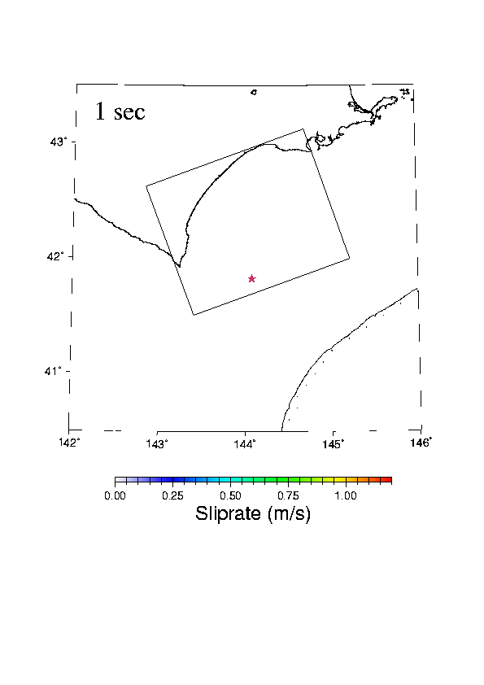

# gnssrefl v2.5.4 

 

 

Playing with having a demo here - for now it is an earthquake rupture.

- [online](https://gnssrefl.readthedocs.io/en/latest/)

- [pdf](https://gnssrefl.readthedocs.io/_/downloads/en/latest/pdf/)

See documentation for [gnssir_input](https://gnssrefl.readthedocs.io/en/latest/api/gnssrefl.gnssir_input.html) for new refraction models.

How do you find out which version are you running? Type <code>pip list | grep gnssrefl</code>

If you want to sign up for the GNSS-IR email list, please contact Kristine Larson.

[Youtube videos for beginners](https://www.youtube.com/channel/UCC1NW5oS7liG7C8NBK148Bg).

If you want to access CDDIS, including orbits, you should make [an account](https://urs.earthdata.nasa.gov/users/new).

If you want to access to any Earthscope data, [an account is required](https://data-idm.unavco.org/user/profile/login).

 

GNSS-IR was developed with funding from NSF (ATM 0740515, EAR 0948957, AGS 0935725, EAR 1144221, AGS 1449554) and 
NASA (NNX12AK21G and NNX13AF43G). <code>gnssrefl</code> was initially developed 
as a fun post-retirement project, followed by support from NASA (80NSSC20K1731).

Kristine M. Larson

