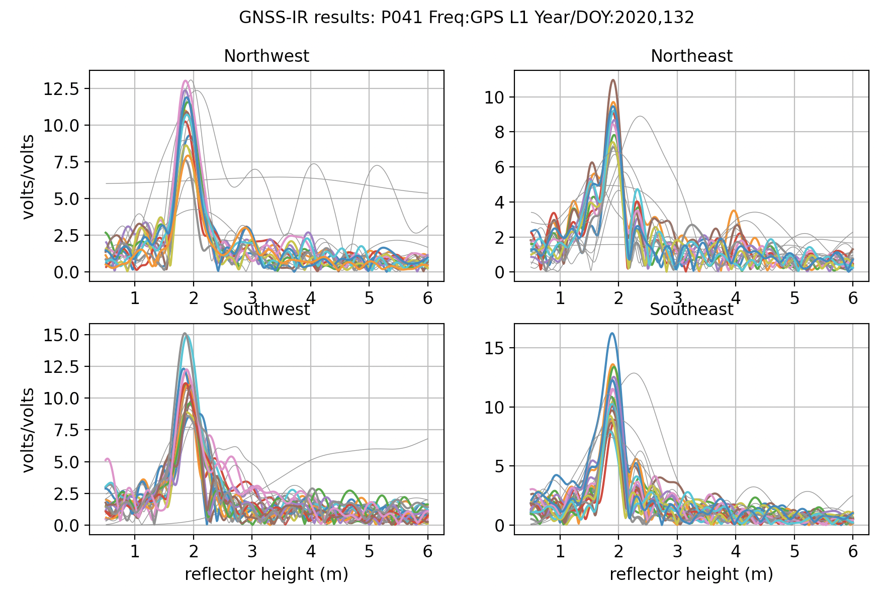

### gnssrefl

**Current github version: 1.1.3**

[How to ask for help](#helpmeplease)

[Quick link to use cases.](https://github.com/kristinemlarson/gnssrefl/blob/master/tests/first_drivethru.md)

[Quick link to the command line homeworks used in the October 21 GNSS-IR course](https://github.com/kristinemlarson/gnssrefl/tree/master/tests/homeworks). They are numbered homework0, homework1, etc.

[Quick link to the Jupyter Notebooks](https://www.unavco.org/gitlab/gnss_reflectometry/gnssrefl_jupyter)

[Quick link to Docker build](https://hub.docker.com/r/unavdocker/gnssrefl)

### Table of Contents

1. [News](#news)
2. [Philosophy](#philosophy)
3. [Code Description](#code)
    1. [Installation](#environment)
    2. [Understanding the Code](#understanding)
    3. [RINEX File Formats](#fileformats)
    4. [rinex2snr: translating RINEX files into SNR files](#module1)
    5. [quickLook: assessing a site using SNR files](#module2)
    6. [gnssir: estimating reflector heights from SNR data](#module3)
    7. [nmea2snr: translating NMEA files into SNR files](#module4)
    8. [daily_avg: daily average reflector heights](#module5)
    9. [subdaily: LSP quality control and RHdot for reflector height estimates](#module6)
    10. [invsnr: SNR inversion for subdaily reflector height estimates](https://github.com/kristinemlarson/gnssrefl/blob/master/README_invsnr.md)
4. [Bugs/Future Work](#bugs)
5. [Utilities](#helper)
6. [Publications](#publications)
7. [How can you help write code for this project?](#weneedhelp)
8. [How to ask for help about running the code](#helpmeplease)
9. [Acknowledgements](#acknowledgements)

### 1. News 

Please note: <code>rinex2snr</code> and <code>download_rinex</code> have been substantially changed. Please
let me know if I broke anything.

Command line inputs which previously required True also now work with T and true.

You can now gzip your snr files (in addition to xz compression).

I recently bought a new apple laptop - with the new chip. You need both gfzrnx and crxrnx
for gnssrefl to work. If you are using an existing docker, you should be fine. But if you want
to do this from a python install, you will need to:

- compile the crxrnx source code and store in $EXE as <code>CRX2RNX</code>.
- download and install the executable provided by GFZ (you need to sign up as a non-profit user). It needs to be
stored in $EXE as <code>gfzrnx</code>.

**New utility for subdaily analysis:** [invsnr](https://github.com/kristinemlarson/gnssrefl/blob/master/README_invsnr.md) This is currently only available for the command line version on github.

A new UNR database has been created/updated - it can be used to provide precise lat/long/ht a priori coordinates 
in <code>make_json_input</code> if you have a station that is recognized by UNR.

If you are being blocked by CDDIS (currently used for downloading almost
all multi-GNSS orbit files), you can try the <code>-orb gnss2</code> option 
in either the <code>download_orbit</code> 
or <code>rinex2snr</code>. It retrieves multi-GNSS files for GFZ from IGN instead of CDDIS.

Access to ultrarapid multi-GNSS (and thus real-time) orbits is now available 
via the [GFZ](https://www.gfz-potsdam.de/en/section/space-geodetic-techniques/topics/gnss-services/). 
Please use the -ultra flag in [<code>rinex2snr</code>](#module1).

If you have orbit files you would like to use and they follow the naming conventions used 
by <code>gnssrefl</code>, you can use them. You need to store them in 
the proper place ($ORBITS/yyyy/nav for nav messages and $ORBITS/yyyy/sp3 for sp3 files).

Access to GSI RINEX data has been provided Naoya Kadota. [An account from GSI is required.](https://www.gsi.go.jp/ENGLISH/geonet_english.html)
In my experience GSI is very responsive to account requests.  

A bug was fixed in the old python translator option for S6/S7 data. Thank you to Andrea Gatti for this information.

Thanks to Makan Karegar the NMEA file format is now supported. See [<code>nmea2snr</code>](#module4).

As they are announced, I am trying to update dependencies for various archives, 
as the GNSS world moves from Z compression to gzip and anonymous ftp to https. 
I recently fixed ngs, bkg, unavco, and nz archives. Bug fixes have been moved to the Bug section.

I encourage you to read [Roesler and Larson, 2018](https://link.springer.com/article/10.1007/s10291-018-0744-8). 
Although this article was originally written to accompany Matlab scripts, 
the principles are the same. It explains to you what a reflection
zone means and what a Nyquist frequency is for GNSS reflections. 
My reflection zone webapp will [help you pick appropriate elevation and azimuth angles.](https://gnss-reflections.org/rzones)
If you click the box, the same web app will also compute the Nyquist for L1,L2, and L5.

If you are interested in measuring sea level, this 
webapp tells you [how high your site is above sea level.](https://gnss-reflections.org/geoid)  

### 2. Philosophical Statement 
In geodesy, you don't really need to know much about what you are doing to 
calculate a reasonably precise position from GPS data. That's just the way it is.
(Note: that is also thanks to the hard work of the geodesists that wrote the 
computer codes). For GPS/GNSS reflections, you need to know a little bit more - like what are you
trying to do? Are you trying to measure water levels? Then you need to know where the water
is! (with respect to your antenna, i.e. which azimuths are good and which are bad). 
Another application of this code is to measure snow accumulation. If you 
have a bunch of obstructions near your antenna, 
you are responsible for knowing not to use that region. If your antenna is 10 meters 
above the reflection area, and the software default only computes answers up to 6 meters,
the code will not tell you anything useful. It is up to you to know what is best for the site and 
modify the inputs accordingly. 
I encourage you to get to know your site. If it belongs to you, look at 
photographs. If you can't find photographs, use Google Earth.  You can also try using
my [google maps web app interface](https://gnss-reflections.org/geoid?station=smm3).

### 3. Code Description

**gnssrefl** is a new version of my GNSS interferometric reflectometry (GNSS-IR) code. 

The main difference between this version and previous versions is that I am
attempting to use proper python packaging rules! However, this is a big learning curve for me,
and I know that I still have a lot to learn. I have separated out the main
parts of the code and the command line inputs so that you can use the libraries
yourself or do it all from the command line. This should also - hopefully - make
it easier for the production of Jupyter notebooks. The latter are to be developed
by UNAVCO with NASA GNSS Science Team funding.

*If you would like to try out reflectometry without installing the code*

I recommend you use [this web app](https://gnss-reflections.org). It 
can show you representative results with minimal constraints. It should provide 
results in less than 10 seconds.

*If you prefer Matlab*

I had a [working matlab version on github](https://github.com/kristinemlarson/gnssIR_matlab_v3), 
but I will not be updating it. You will very likely have to make changes to accommodate the recent
change in security protocols at CDDIS.

*Goals*

The goal of this python repository is to help you compute (and evaluate) GNSS-based
reflectometry parameters using geodetic data. This method is often
called GNSS-IR, or GNSS Interferometric Reflectometry. There are three main modules:

* **rinex2snr** translates RINEX files into SNR files needed for analysis.

* **gnssir** computes reflector heights (RH) from SNR files.

* **quickLook** gives you a quick (visual) assessment of a file without dealing
with the details associated with **gnssir**. It is not meant to be used for routine analysis.
It also helps you pick an appropriate azimtuh mask and quality control settings.

There are also various utilities you might find to be useful (see the last section).
To see the names of these utilities: <code>pip list</code>

If you are unsure about why various restrictions are being applied, it is really useful 
to read [Roesler and Larson (2018)](https://link.springer.com/article/10.1007/s10291-018-0744-8) 
or similar. I am committed in principle to set up some online
courses to teach people about GNSS reflections, but funding for these courses is 
not in hand at the moment. 

### i. Installation

You can  access this package via Jupyter notebooks, Docker containers, or traditional
github/pypi package installation. 

1. [Notebooks](https://www.unavco.org/gitlab/gnss_reflectometry/gnssrefl_jupyter)

2. via a Docker container. Pick your system([Mac](https://docs.docker.com/docker-for-mac/install/), [Windows](https://docs.docker.com/docker-for-windows/install/), [Ubuntu](https://docs.docker.com/install/linux/docker-ce/ubuntu/)) and download from the Docker website. Change to the directory where you want to run your code/store your files. Use <code>docker pull unavdocker/gnssrefl</code> to install code. Details on the [run command](https://hub.docker.com/r/unavdocker/gnssrefl) are provided.

3. github or pypi 

For installation with github/pypi, the setup requires a few system dependencies: gcc and gfortran.
**If you are using linux** then simply run apt-get install -y gcc and apt-get install -y
gfortran in your terminal (or yum install -y gcc-gfortran ).
**If you are using a MacOS** then you will need to install xcode. First, in your 
terminal, check first to see if you already have it:

<code>xcode-select -p</code> 

If it is installed, it should return a path. If it is not installed then run

<code>xcode-select --install</code> 

This should install gcc. You can check if you have gcc by typing 

<code>gcc --version</code>

You can check to see if you have gfortran by typing 

<code>gfortran --version</code> 

If you do not have gfortran, then you can use homebrew to install (<code>brew install gfortran</code>).

*Environment Variables*
   
You should define three environment variables:

* EXE = where various executables will live. These are mostly related to manipulating RINEX files.

* ORBITS = where the GPS/GNSS orbits will be stored. They will be listed under directories by 
year and sp3 or nav depending on the orbit format.

* REFL_CODE = where the reflection code inputs (SNR files and instructions) and outputs (RH)
will be stored (see below). Both snr files and results will be saved here in year subdirectories.

If you are running in a bash environment, you should save these environment variables in
the .bashrc file that is run whenever you log on.

If you don't define these environment variables, the code *should* assume 
your local working directory (where you installed the code) is where 
you want everything to be (to be honest, I have not tested this in a while).
The orbits, SNR files, and periodogram results are stored in 
directories in year, followed by type, i.e. snr, results, sp3, nav, and then by station name.

*Direct Python Install*

If you are using the version from gitHub:

* <code>git clone https://github.com/kristinemlarson/gnssrefl </code>
* cd into that directory, set up a virtual environment, a la <code>python3 -m venv env </code>
* activate your virtual environment
* <code>pip install wheel</code> (we are working to remove this step)
* <code>pip install .</code>
* from what I understand, you should be able to use pip3 instead of pip
* you DO need a few more executables, so please read below or type 
<code>installexe linux64 </code> or <code>installexe macos </code> 

PyPi version:  

* make a directory, cd into that directory, set up a virtual environment 
* activate the virtual environment
* <code>pip install wheel</code> (we are working to remove this step)
* <code>pip install gnssrefl</code>
* from what I understand, you should be able to use pip3 instead of pip
* you DO need a few more executables, so please read below or type 
<code>installexe linux64 </code> or <code>installexe macos </code> 

*Non-Python Code*

**These executables must be stored in the EXE directory.** There are three 
main executables used by <code>gnssrefl</code>: teqc, gfzrnx and CRX2RNX.
I have written a utility - <code>installexe</code> - that will download these executables for 
a macOS or linux (64 bit) installation and put them in the 
correct place. **This install does not currently work for the new Apple chip.** Type -h for more information.

*Further information on these non-python codes:*

* Required translator for compressed (Hatanaka) RINEX files. CRX2RNX, http://terras.gsi.go.jp/ja/crx2rnx.html. 

* Optional datatool, **teqc**, is highly recommended.  There is a list of static executables at the
bottom of [this page](http://www.unavco.org/software/data-processing/teqc/teqc.html). Unfortunately 
this code is no longer supported by UNAVCO.

* Optional datatool, **gfzrnx** is required if you plan to use the RINEX 3 option. Executables available from the GFZ,
http://dx.doi.org/10.5880/GFZ.1.1.2016.002. 

We no longer encourage people to install these Fortran RINEX translators. The Fortran is now 
included in the python build. We provide these links for general interest:

* Optional Fortran RINEX Translator for GPS. **The executable must be called gpsSNR.e.** For the 
code: https://github.com/kristinemlarson/gpsonlySNR

* Optional Fortran RINEX translator for multi-GNSS. **The executable must be called gnssSNR.e** For the 
code: https://github.com/kristinemlarson/gnssSNR

### ii. Understanding What the Code is Doing  

To summarize, direct (blue) and reflected (red) GNSS signals interfere and create
an interference pattern that can be observed in GNSS Signal to Noise Ratio (SNR) data as a satellite rises or sets. 
The frequency of this interference pattern is directly related to the height of the GNSS antenna phase
center above the reflecting surface, or reflector height RH (purple). *The primary goal of this software 
is to measure RH.* This parameter is directly related to changes in snow height and water levels below
a GNSS antenna. This is why GNSS-IR can be used as a snow sensor and tide gauge. GNSS-IR can also be 
used to measure soil moisture, but the code to estimate soil moisture is not as strongly related to RH as
snow and water. We will be posting the code you need to measure soil moisture later in the year.

This code is meant to be used with Signal to Noise Ratio (SNR) data. This is a SNR sample for a site in the 
the northern hemisphere (Colorado) and a single GPS satellite. The SNR data are plotted with respect to time - however,
we have also highlighted in red the data where elevation angles are less than 25 degrees. These are the data used in 
GNSS Interferomertric Reflectometry GNSS-IR. You can also see that there is an overall smooth polynomial signature
in the SNR data. This represents the dual effects of the satellite power transmission level and the antenna 
gain pattern. We aren't interested in that so we will be removing it with a low order polynomial (and 
we will convert to linear units on y-axis). 

After that polynomial is removed, we will concentrate on the *rising* 
and *setting* satellite arcs. That is the red parts on the left and right.  
Here you can see those next two steps. On the top is the "straightened" SNR data. Instead of time,
it is plotted with respect to sine of the elevation angle. It was shown a long time ago by Penina 
Axelrad that the frequency extracted from these data is representative of the reflector height.
Here a periodogram was used to extract this frequency, and that is shown below, with the x-axis 
units changed to reflector height. In a nutshell, that is what this code does. It figures out the 
rising and setting satellite arcs in all the azimuth regions you have said are acceptable. It does a 
simple analysis (removes the polynomial, changes units) and uses a periodogram to look at the 
frequency content of the data. You only want to report RH when you think the peak on the periodogram is 
significant. There are many ways to do this - we only use two quality control metrics:

* is the peak larger than a user-defined value  (amplitude of the dominant peak in your periodogram)

* is the peak divided by a "noise" metric larger than a user-defined value. The code calls this the peak2noise.

The Colorado SNR example is for a fairly planar field where the RH for the rising and setting arc 
should be very close to the same name. What does the SNR data look like for a more extreme case? 
Shown below is the SNR data for [Peterson Bay](https://gnss-reflections.org/static/images/PBAY.jpg), where the rising arc (at low tide) has a very different
frequency than during the setting arc (high tide). This gives you an idea of how the code can be 
used to measure tides. 

A couple common sense issues: one is that since you define the noise region, if you make it really large, that 
will artificially make the peak2noise ratio larger. I have generally used a region of 6-8 meters for this 
calculation. So in the figure above the region was for 0-6 meters. The amplitude can be tricky because 
some receivers report low SNR values, which then leads to lower amplitudes. The default amplitude values are 
for the most commonly used signals in GNSS-IR (L1, L2C, L5, Glonass, Galileo, Beidou). The L2P data
used by geodesists are generally not useable for reasons to be discussed later.

Even though we analyze the data as a function of sine of elevation angle, each satellite arc
is associated with a specific time period. The code keeps track of that and reports it in the final answers.
It also keeps track of the average azimuth for each rising and setting satellite arc that passes quality 
control tests.

What do these satellite reflection zones look like? Below are 
photographs and [reflection zone maps](https://gnss-reflections.org/rzones) for two standard GNSS-IR sites, 
one in the northern hemisphere and one in the southern hemisphere.

<table align=center>
<TR>
<TH>Mitchell, Queensland, Australia</TH>
<TH>Portales, New Mexico, USA</TH>
</TR>
<TR>
<TD></TD>

<TD></TD>
</TR>
<TR>
<TD></TD>
<TD></TD>
</TR>
</table>

Each one of the yellow/blue/red/green/cyan clusters represents the reflection zone
for a single rising or setting GPS satellite arc. The colors represent different elevation angles - 
so yellow is lowest (5 degrees), blue (10 degrees) and so on. The missing satellite signals in the north
(for Portales New Mexico) and south (for Mitchell, Australia) are the result of the GPS satellite 
inclination angle and the station latitudes. The length of the ellipses depends on the height of the 
antenna above the surface - so a height of 2 meters gives an ellipse that is smaller than one 
that is 10 meters. In this case we used 2 meters for both sites - and these are pretty 
simple GNSS-IR sites. The surfaces below the GPS antennas are fairly smooth soil and that 
will generate coherent reflections. In general, you can use all azimuths at these sites.  

Now let's look at a more complex case, station <code>ross</code> on Lake Superior. Here the goal 
is to measure water level. The map image (panel A) makes it clear
that unlike Mitchell and Portales, we cannot use all azimuths to measure the lake. To understand our reflection 
zones, we need to know the approximate lake level. That is a bit tricky to know, but the 
photograph (panel B) suggests it is more than the 2 meters we used at Portales - 
but not too tall. We will try 4 meters and then check later to make sure that was a good assumption.  

<table align=center>
<TR>
<TD>A.   
Map view of station ROSS </TD>
<TD>B.   
Photograph of station ROSS</TD>
</TD>
</TR>
<Tr>
<TD>C.  
Reflection zones for GPS satellites at elevation  angles of 5-25 degrees 
for a reflector height of  4 meters.</TD> 
<TD>D.  
Reflection zones for GPS satellites at elevation  angles of 5-15 degrees 
for a reflector height of  4 meters.  </TD>
</Tr>
</table>

Again using the reflection zone web app, we can plot up the appropriate reflection zones for various options.
Since <code>ross</code> has been around a long time, [http://gnss-reflections.org](https://gnss-reflections.org) has its coordinates in a 
database. You can just plug in <code>ross</code> for the station name and leave 
latitude/longitude/height blank. You *do* need to plug in a RH of 4 since mean 
sea level would not be an appropriate reflector height value for this 
case. Start out with an azimuth range of 90 to 180 degrees.
Using 5-25 degree elevation angles (panel C) looks like it won't quite work - and going all the way to 180 degrees
in azimuth also looks it will be problematic. Panel D shows a smaller elevation angle range (5-15) and cuts 
off azimuths at 160. These choices appear to be better than those from Panel C.  
It is also worth noting that the GPS antenna has been attached to a pier - 
and *boats dock at piers*. You might very well see outliers at this site when a boat is docked at the pier.

Once you have the code set up, it is important that you check the quality of data. This will also 
allow you to check on your assumptions, such as the appropriate azimuth and elevation angle 
mask and reflector height range. This is one of the reasons <code>quickLook</code> was developed. 

### iii. RINEX File Formats 

RINEX files must be version 2.11 or 3. 

For RINEX 2.11, filenames should be lowercase and following the community standard: 

4 character station name + day of year (3 characters) + '0.' + two character year  + 'o'

Example: at010050.12o is station at01 on day 5 and year 2012.

In many cases Hatanaka compressed formats are used by data archives. These 
have a 'd' instead an 'o' at the end of the filename. If you want 
to use those files, you must install the 
CRX2RNX executable described in the previous section.  I think my code 
allows you to gzip the RINEX files if you are providing them.

### iv. rinex2snr - Extracting SNR data from RINEX files 

The international standard for sharing GNSS data is called 
the [RINEX format](https://www.ngs.noaa.gov/CORS/RINEX211.txt).
A RINEX file has extraneous information in it (which we will throw out) - and it 
does not provide some of the information needed for reflectometry (e.g. elevation and azimuth angles). 
The first task you have in GNSS-IR is to translate from RINEX into what I will call 
the SNR format. The latter will include azimuth and elevation angles. For the 
latter you will need an **orbit** file. <code>rinex2snr</code> will go get an orbit file for you. It will save
those orbit files in case you want to use them at some later date. You can override the default orbit 
choice by selections given below.

There is no reason to save ALL the RINEX data as the reflections are only useful at the lower elevation
angles. The default is to save all data with elevation lower than 30 degrees (this is called SNR format 66).
Another SNR choice is 99, which saves elevation angle data between 5 and 30.  

You can run <code>rinex2snr</code> at the command line. The required inputs are:

- station name
- year
- day of year

A sample call for a station called <code>p041</code>, restricted to 
GPS satellites, on day of year 132 and year 2020 would be:

<code>rinex2snr p041 2020 132</code>

If the RINEX file for <code>p041</code> is in your local directory, it will translate it.  If not, 
it will check three archives (unavco, sopac, and sonel) to find it. This uses the hybrid translator.  

**Examples for different translators:**

Using hybrid (the default): 

<code>rinex2snr gls1 2011 271</code>

For a fortran translator, the command would be:

<code>rinex2snr p041 2020 132 -translator fortran</code>

For python (very slow!):

<code>rinex2snr p041 2020 132 -translator python</CODE>

**Allowed GNSS Rinex 2.11 Data Archives:**

- unavco
- sonel (global sea level observing system)
- sopac (Scripps Orbit and Permanent Array Center)
- cddis
- ngs (National Geodetic Survey)
- nrcan (Natural Resources Canada)
- bkg (German Agency for Cartography and Geodesy)
- nz (GNS, New Zealand)
- ga (Geoscience Australia)
- bev (Austria Federal Office of Metrology and Surveying)
- jp (Geospatial Information Authority of Japan)

**Example setting the archive:**

<code>rinex2snr tgho 2020 132 -archive nz</code>

**Example using the Japanese GNSS archive:**

The Geospatial Institute of Japan uses 6 numbers to specify 
station names. You will be prompted for a username and password.
This will be saved on your computer for future use. Since gnssrefl
only uses four character statiion names, the last four values will be used as the station name.

<code> rinex2snr 940050 2021 31 -archive jp </code>

**Run the code for all the data for any year**

<code>rinex2snr tgho 2019 1  -archive nz -doy_end 365</code>
 
**Examples using RINEX 3:**

If your station name has 9 characters (lower case please), 
the code assumes you are looking for a RINEX 3 file. However, my code will store the SNR data using the normal
4 character name. *You must install the gfzrnx executable that translates 
RINEX 3 to 2 to use RINEX 3 files in my code.* 
<code>rinex2snr</code> currently supports RINEX3 for 30 second data at :

- unavco
- cddis
- bev
- bkg
- epn
- ga

The caveat is that UNAVCO is set to 15 sec because that is mostly what is there.
If you don't know where your data are, you can try <code>-archive all</code>, 
which should try all archives in sequence. I believe the default archive is cddis.

<code>rinex2snr onsa00swe 2020 298</code>

<code>rinex2snr at0100usa 2020 55</code>

<code>rinex2snr pots00deu 2020 298 -archive bkg</code>

<code>rinex2snr mchl00aus 2022 55 -archive ga</code>

RINEX 3 has a file ID parameter that is a nuisance. If you know yours, you can set it 
with <code>-stream R</code> or <code>-stream S</code>. Because I think it is an 
annoying thing, I look for both files without you having to set it. 

The snr options are mostly based on the need to remove the "direct" signal. This is 
not related to a specific site mask and that is why the most frequently used 
options (99 and 66) have a maximum elevation angle of 30 degrees. The
azimuth-specific mask is decided later when you run **gnssir**.  The SNR choices are:

- 66 is elevation angles less than 30 degrees (**this is the default**)
- 99 is elevation angles of 5-30 degrees  
- 88 is elevation angles of 5-90 degrees
- 50 is elevation angles less than 10 degrees (good for very tall sites, high-rate applications)

**More options:**

*orbit file options for general users:*

- gps : will use GPS broadcast orbits (**this is the default**)
- gps+glo : uses rapid GFZ orbits
- gnss : uses GFZ orbits, which is multi-GNSS (available in 3-4 days?)
- rapid : uses GFZ multi-GNSS rapid orbits, available in ~1 day
- ultra : since mid-2021, we can use multi-GNSS near realtime orbits from GFZ

*orbit file options for experts:*

- nav : GPS broadcast, perfectly adequate for reflectometry. 
- igs : IGS precise, GPS only
- igr : IGS rapid, GPS only
- jax : JAXA, GPS + Glonass, reliably within a few days, missing block III GPS satellites
- gbm : GFZ Potsdam, multi-GNSS, not rapid (GPS, Galileo,Glonass, Beidou)
- grg: French group, GPS, Galileo and Glonass, not rapid
- esa : ESA, multi-GNSS
- gfr : GFZ rapid, GPS, Galileo and Glonass, since May 17 2021 
- wum : Wuhan, multi-GNSS (precise+prediction, GPS,Galileo,Glonass,Beidou)
- ultra : GFZ ultra rapid (GPS, Galileo, Glonass), since May 17, 2021 

We are likely to add access to multi-GNSS broadcast orbits, but for now you can use the 
ultra orbit option. Although it is provided every three hours, we currently only download the 
file from midnite (hour 0).

**What if you are providing the RINEX files and you don't want the code to search for the files online?** 
<code>-nolook True</code>

Just put the RINEX files in the same directory where you are running the code, using my naming rules (lower case for RINEX 2.11).

**What if you have high-rate (e.g. 1 sec) RINEX files, but you want 5 sec data?** <code>-dec 5</code>

**What if you want to use high-rate data?**  <code>-rate high</code>

If you invoke this flag, you need to specify the archive.  Your choices are Rinex2 data from UNAVCO,
CDDIS, or NRCAN OR Rinex3 data at CDDIS.
<a href=https://www.ga.gov.au/>Geoscience Australia</a> has high-rate GNSS data - but they 
are currently deleting modern GPS signals. This is a deal breaker for me. Until that is changed, I cannot 
recommend you use high-rate GNSS data from Geoscience Australia for reflectometry. Access to high-rate data from 
their archive is not provided in this software.

For high-rate data, you should **never** use the python translation option.

**Output SNR file format**

To columns are defined as:

1. Satellite number (remember 100 is added for Glonass, etc)
2. Elevation angle, degrees
3. Azimuth angle, degrees
4. Seconds of the day, GPS time
5. elevation angle rate of change, degrees/sec.
6.  S6 SNR on L6
7.  S1 SNR on L1
8.  S2 SNR on L2
9.  S5 SNR on L5
10. S7 SNR on L7
11. S8 SNR on L8

The unit for all SNR data is dB-Hz.

**Our names for the GNSS frequencies**

- 1,2,20, and 5 are GPS L1, L2, L2C, and L5 (L2 and L2C are the same frequency - but we use different numbers in this code so that 
one can *only* use L2C if wished)
- 101,102 are Glonass L1 and L2
- 201, 205, 206, 207, 208: Galileo frequencies, which are 
set as 1575.420, 1176.450, 1278.70, 1207.140, 1191.795 MHz
- 302, 306, 307 : Beidou frequencies, defined as 1561.098, 1207.14, 1268.52 MHz

**What if you want to analyze your own data?**

Put your RINEX 2.11 files in the directory where you are going to run the code.
They must have SNR data in them (S1, S2, etc) and have the receiver coordinates in the header.
The files should be named as follows:

- lowercase
- station name (4 characters) followed by day of year (3 characters) then 0.yyo where yy is the two character year.
- Example: algo0500.21o where station name is algo on day of year 50 from the year 2021

<code>rinex2snr algo 2021 50 -nolook True</code>

If you have RINEX 3 files, you should name them as follows:

- upper case (except for the extension)

- station name (9 characters where the last 3 characters are the country), underscore, capital R, 
underscore, four character year, three character day of year, four zeroes, underscore, 01D_30S_M0. followed by rnx 
30S means it is 30 second sampling. 01D means it is one day. Some of the other parts of the 
very long station file name are no doubt useful, but they are not recognized by this code.

- Example: ONSA00SWE_R_20213050000_01D_30S_MO.rnx

<code>rinex2snr onsa00swe 2021 305 -nolook True </code>

If you have something other than 30 second sampling, it can be set with -srate.

The RINEX inputs are always deleted, so do not put your only copy of the files in the working directory.
Please note: we are using the publicly available <code>gfzrnx</code> code to convert RINEX 3 files into RINEX 2.11 files. 
If you do not have <code>gfzrnx</code> installed, you will not be able to use RINEX 3 files.

I believe it is also allowed to put your 
RINEX files into $REFL_CODE/YYYY/rinex/ssss where YYYY is the year 
and ssss is the four character station name. The advantage of doing 
this is that your RINEX files will not be deleted.

### v. quickLook 

Before using <code>gnssir</code>code, I recommend you use <code>quickLook</code>. This allows you
to quickly test various options (elevation angles, frequencies, azimuths, and quality control 
parameters). The required inputs are station name, year, and doy of year. **You must have previously translated a RINEX file using rinex2snr to use quickLook.**

<CODE>quickLook</code> has stored defaults for analyzing the spectral characteristics of the SNR data. 
**In general these defaults are meant to facilitate users where the antenna is less than 5 meters tall.**
If your site is taller than that, you will need to override the defaults.
Similarly, the default elevation angles are 5-25 degrees. If that mask includes a reflection region
you don't want to use, you need to override them.  For more information, use <code>quickLook -h</CODE>

As discussed earlier, there are two QC measures used in <Code>gnssrefl</code>. One is the peak
value of the peak in the periodogram. Secondly it uses a very simple peak to noise ratio (pk2noise) 
calculation. In this case the average periodogram amplitude value is calculated for a RH 
region that you define. For <code>quickLook</code> it uses the same RH region for the the "noise" region.

**Example from Boulder:**

We start with one of our <code>rinex2snr</code> examples, <code>p041</code>

<code>quickLook p041 2020 132 </CODE>

That command will produce this periodogram summary:

By default, these are L1 data only. Note that the x-axis does not go beyond 6 meters. This is because
you have used the defaults. Furthermore, note that results on the x-axis begin at 0.5 meters.
Since you are not able to resolve very small reflector heights with this method, this region 
is not allowed. These periodograms give you a sense of whether there is a planar reflector below your antenna. The fact that the peaks in the periodograms bunch up around 2 meters means that at 
this site the antenna phase center is ~ 2 meters above the ground. The colors change as you try different satellites.  If the data are plotted in gray that means you have a failed reflection. The quadrants are Northwest, Northeast and so on. 

<CODE>quickLook</code> also provides a summary of various quality control metrics:

The top plot shows the sucessful RH retrievals in blue and unsuccessful RH retrievals in gray. 
In the center panel are the peak to noise ratios. The last plot is the amplitude of the spectral peak. The dashed
lines show you what QC metrics quickLook was using. You can control/change these on the command line.

If you want to look at L2C data you just change the frequency on the command line. L2C is designated by 
frequency 20: 

<CODE>quickLook p041 2020 132 -fr 20</CODE>

**L2C results are always superior to L1 results.** If you have any influence over a GNSS site, please 
ask the station operators to track modern GPS signals such as L2C and L5.

**Check back for our site on Lake Superior:**

Make a SNR file <code>rinex2snr ross 2020 170</code> and <code>quickLook ross 2020 170 -e1 5 -e2 15</code>

The good RH estimates (in blue in the top panel) are telling us that we were right when we assessed 
reflection zones using 4 meters. We can also see that the best retrievals are in the southeast quadrant (azimuths 90-180 degrees).
This is further emphasized in the next panel, that shows the actual periodograms.

[**Example for a site on an ice sheet**](https://github.com/kristinemlarson/gnssrefl/blob/master/tests/use_cases/use_gls1.md)

[**Example for a tall site**](https://github.com/kristinemlarson/gnssrefl/blob/master/tests/use_cases/use_smm3.md)

In addition to the **peak2noise** and required amplitude (**ampl**) QC metrics, there is a 
couple more QC metrics that are hardwired. One is the length of time 
allowed for an arc - this can be a problem when you have an arc that crosses midnite;
since the gnssrefl code works on elevation angle, it will combine part of 
the arc from the beginning of the day and the rest 
from the end of the day. This is not sensible - and it will reject this arc 
nominally for being far too long. Really it is rejecting it because it is non-physical.  

The code tries to find all eligible arcs between elevation angles **e1 (emin)** and **e2 (emax)**.
Why? In my experience you don't want to use an arc that only goes from 5-10 degrees if you 
are trying to use all arcs between 5 and 25 degrees. The same is true for small
arcs at higher elevation angles (20-25). However, you don't want to be 
too strict, so there is a QC setting called **ediff**.
The default is 2 degrees. For a given emin and emax for your arcs, <code>quickLook</code> 
will allow you to use arcs that are at least within this amount in degrees, i.e. 
(emin +ediff) and (emax - ediff). The net result of this QC setting 
default is to make it less likely you will try to use a very short arc. 
Although this cannot be changed for <code>quickLook</code>, you 
can change it in <code>gnssir</code> in your json file. If you want <code>gnssir</code> to use
everything, just make **ediff** very large. 

Warning: <code>quickLook</code> calculates the minimum observed elevation 
angle in your file and prints that to the screen so you know 
what it is. It also uses that as your emin
value (e1) if the default is smaller. It does this so you don't see all arcs as rejected.
Let's say your file had a receiver-imposed elevation cutoff 
of 10 degrrees. The default minimum elevation angle in <code>quickLook</code> is 5 degrees. 
With the default **ediff** value of 2, not a single arc would reach the minimum 
required value of 7 (5 + 2); everything 
would be rejected. <code>quickLook</code> instead sees that
you have a receiver-imposed minimum of 10 and would substitute that for the default emin. 
<code>gnssir</code> does not do this because at that point you 
are supposed to have chosen a strategy, which is stored in the json file.

<code>quickLook -screenstats True</code> provides more information to the screen 
about why arcs have been rejected.

### vi. gnssir 

<code>gnssir</code> is the main driver for the GNSS-IR code. 

You need a set 
of instructions which are made using <code>make_json_input</code>. The required inputs are: 

* station name 
* latitude (degrees)  
* longitude (degrees) 
* ellipsoidal height (meters). 

The station location *does not* have to be cm-level for the reflections code. Within a few hundred meters is 
sufficient. For example: 

<CODE>make_json_input p101 41.692 -111.236 2016.1</CODE>

If you happen to have the Cartesian coordinates (in meters), you can 
set <code>-xyz True</code> and input those instead of lat, long, and height.

If you are using a site that is in the UNR database, as of 2021/10/26 you can set 
a flag to use it instead of typing in lat, long, ht values:

<CODE>make_json_input p101 0 0 0 -query_unr True </CODE>

<code>gnssir</code> will use defaults for other parameters if you do not provide them. Those defaults 
tell the code an azimuth and elevation angle mask (i.e. which directions you want 
to allow reflections from), and which frequencies you want to use, and various quality control (QC) metrics. 
Right now the default frequencies are GPS only, e.g. L1, L2C and L5. 
The json file of instructions will be put in $REFL_CODE/input/p101.json. You should look at 
it to get an idea of the kinds of inputs the code uses.
The default azimuths can be changed, but this needs to be done by hand. Some parameters can be set
via the command line, as in:

<CODE>make_json_input p101 41.692 -111.236 2016.1 -e1 5 -e2 10</CODE>

This changes elevation angles to 5-10 degrees. The default is to only use GPS 
frequencies, specifically L1, L2C, and L5. If you want all GNSS frequencies:

<CODE>make_json_input p101 41.692 -111.236 2016.1 -e1 5 -e2 10 -allfreq True</CODE>

To only use GPS L1:

<CODE>make_json_input p101 41.692 -111.236 2016.1 -e1 5 -e2 10 -l1 True </CODE>

To only use GPS L2C and require a spectral amplitude of 10:

<CODE>make_json_input p101 41.692 -111.236 2016.1 -e1 5 -e2 10 -l2c True -ampl 10</CODE>

To use GPS L2C, require a spectral amplitude of 10, and spectral peak to noise ratio of 3:

<CODE>make_json_input p101 41.692 -111.236 2016.1 -e1 5 -e2 10 -l2c True -ampl 10 -peak2noise 3</CODE>

Azimuth regions should not be larger than ~100 degrees. If for example you want to use the region from 0 to 
270 degrees, you should not set a region from 0 - 270, but instead a region from 0-90, 90-180, and the last
from 180-270. This is necessary to make sure you don't mix rising and setting satellite arcs from different 
times of day. I believe the code currently refuses to let you use a region larger than 100 degrees. The default
is to allow four regions, each of 90 degrees.  

Other things that are helpful to know for the make_json_input inputs:

* Some json settings can be set at the command line.  run <code>make_json_input -h</code> to see these.  
Otherwise, you will need to edit the json file.  Note that there are a few inconstencies between the command line names 
and the json file (for example, h1 and h2 on the command line become
minH and maxH in the json file). I apologize for this.

- e1 and e2 are the min and max elevation angle, in degrees
- minH and maxH are the min and max allowed reflector height, in meters
- ediff, in degrees: restricts arcs to be within this range of input elevation angles e1 and e2
- desiredP, desired reflector height precision, in meters
- PkNoise is the periodogram peak divided by the periodogram noise ratio.  
- reqAmp is the required periodogram amplitude value, in volts/volts
- polyV is the polynomial order used for removing the direct signal
- freqs are selected frequencies for analysis
- delTmax is the maximum length of allowed satellite arc, in minutes
- azval are the azimuth regions for study, in pairs (i.e. 0 90 270 360 means you want to evaluate 0 to 90 and 270 to 360).
- wantCompression, boolean, compress SNR files using xz
- screenstats, boolean, whether minimal periodogram results come to screen
- refraction, boolean, whether simple refraction model is applied.
- plt_screen: boolean, whether SNR data and periodogram are plotted to the screen 
- NReg [min and max required] : define the RH region (in meters) where the "noise value" for the periodogram 
is computed. This is used to compute the peak to noise ratio used in QC.
- (*this option has been removed*) seekRinex: boolean, whether code looks for RINEX at an archive

Simple examples for my favorite GPS site [p041](https://spotlight.unavco.org/station-pages/p042/eo/scientistPhoto.jpg)

<CODE>make_json_input p041 39.949 -105.194 1728.856</CODE> (use defaults and write out a json instruction file)

<CODE>rinex2snr p041 2020 150</CODE> (pick up and translate RINEX file for day of year 150 and year 2020 from unavco )

<CODE>gnssir p041 2020 150</CODE> (calculate the reflector heights) 

<CODE>gnssir p041 2020 150 -fr 5 -plt True</CODE> (override defaults, only look at L5 SNR data, and periodogram plots come to the screen)

Where would the code store the files for this example?

- json instructions are stored in $REFL_CODE/input/p041.json
- SNR files are stored in $REFL_CODE/2020/snr/p041
- Reflector Height (RH) results are stored in $REFL_CODE/2020/results/p041

This is a snippet of what the result file would look like

- *Amp* is the amplitude of the most significant peak in the periodogram (i.e. the amplitude for the RH you estimated).  
- *DelT* is how long a given rising or setting satellite arc was, in minutes. 
- *emin0* and *emax0* are the min and max observed elevation angles in the arc.
- *rise/set* tells you whether the satellite arc was rising (1) or setting (-1)
- *Azim* is the average azimuth angle of the satellite arc
- *sat* and *freq* are as defined in this document
- MJD is modified julian date
- PkNoise is the peak to noise ratio of the periodogram values
- last column is currently set to tell you whether the refraction correction has been applied 
- EdotF is used in the RHdot correction needed for dynamic sea level sites. The units are hours/rad.
When multiplied by RHdot (meters/hour), you will get a correction in units of meters. For further
information, see <code>subdaily</code>.

If you want a multi-GNSS solution, you need to:

- make sure your json file is set appropriately
- use a RINEX file with multi-GNSS data in it (i.e. use multi-GNSS orbits and in some cases rerun rinex2snr).

In 2020 p041 had a multi-GNSS receiver operating, so we can look at some of the non-GPS signals.
In this case, we will look at Galileo L1.  

<CODE>make_json_input p041 39.949 -105.194 1728.856 -allfreq True</CODE>

<CODE>rinex2snr p041 2020 151 -orb gnss -overwrite True</CODE>

<CODE>gnssir p041 2020 151 -fr 201 -plt True</CODE> 

Note that a failed satellite arc is shown as gray in the periodogram plots. And once you know what you are doing (have picked
the azimuth and elevation angle mask), you won't be looking at plots anymore.

### vii. nmea2snr 

NMEA formats can be translated to SNR using <code>nmea2snr</code>.
Inputs are similar to <code>rinex2snr</code>: 4char station name, year, and day of year
NMEA files are assumed to be stored as:

$REFL_CODE + /nmea/ABCD/2021/ABCD0030.21.A

for station ABCD in year 2021 and day of year 3. NMEA files may be gzipped.

### viii. daily_avg

<code>daily_avg</code> is a utility for people interested 
in measuring snow accumulation via daily values. It can also 
be used for lake levels. *It is not to be used for tides!*
The goal is to make a valid daily average - for this reason, we have two required inputs 
for quality control. 

- The first is called a *median filter* value. This input helps remove
large outliers. For each day, a median RH is found. Then all values larger than the 
*median filter* value from the median RH are thrown out. 

- The second required input to <code>daily_avg</code> sets a limit for how 
many satellite arcs are considered sufficient to create a trustworth daily average. 
If you had 5 arcs, for example, you probably would not want to compare that 
with another day where 100 arcs were available. The number of tracks required 
varies a lot depending on the azimuth mask and the number of frequencies available.
If you are not sure what values to use at your GNSS site, run it once with very minimal constraints.
The code provides some feedback plots that will let you pick better values.

Here is an example from one of our use cases where there are a few large outliers.  
I have set the median filter value to 2 meters and the required number of tracks to 12:

<code> daily_avg mchn 2 12 </code>

You can easily see the outliers. 

Next I have rerun the code with a better median filter constraint of 0.25 meters:

<code> daily_avg mchn 0.25 12 </code>

A daily average plot is also made and a text file of the outputs is created.

### ix. subdaily

This module is meant for RH measurements that have a subdaily component. It is not strictly 
for water levels, but that is generally where it should be used. There are 
two main goals for this code:

- consolidate daily result files and find/remove outliers
- apply the [RHdot correction](https://www.kristinelarson.net/wp-content/uploads/2015/10/LarsonIEEE_2013.pdf)

If you want to do your own QC, you can simply cat the files in your results area. As an example, after you have 
run <code>gnssir</code> for a station called sc02 in the year 2021:

<code>cat $REFL_CODE/2021/sc02/*.txt >sc02.txt</code>

If you would prefer to use our code, it is pretty straightforward. It has two sections.  The first 
minimally requires the station name and year:

<code>subdaily sc02 2021 </code>

It picks up all result files from 2021, sorts and concatenates them. If you only want to 
look at a subset of days, you can set -doy1 and/or -doy2. The output file location
is sent to the screen. <code>subdaily</code> then tries to remove large outliers 
by using a standard deviation test. This can be controlled at the command line. Example figures:

Results are presented with azimuth and amplitude colors to help you modify QC choices or azimuth mask:

Whle this code is meant to be used AFTER you have chosen an analysis strategy, you can 
apply new azimuth and amplitude constraints on the commandline, <code>-azim1, azim2, ampl</code>.

The second section of <code>subdaily</code> is related to the RHdot correction. You must explicitly ask for it. 
There are lots of ways to apply the RHdot correction - I am only providing a simple one at this point.  
The RHdot correction requires you know 
- the average of the tangent of the elevation angle during an arc, 
- edot, elevation angle rate of change with respect to time) 
- RHdot (RH rate of change with respect to time)  

The first two are trivial to compute and are included in the results file in column 13 as the edotF. 
This edot factor has units of rad/(rad/hour), or hours. So if you know RHdot in units of meters/hour, 
you can get the correction by simple multiplication. 

Computing RHdot is the trickiest part of calculating the RHdot correction.
And multiple papers have been written about it. If you have a 
well-observed site (lots of arcs and minimal gaps), you can use the RH 
data themselves to estimate a smooth model for RH (via cubic splines) and 
then just back out RHdot. This is what is done in <code>subdaily</code> (if and only if you invoke -rhdot True). 
It will also make a second effort to remove outliers.  
Note: if you have a site with a large RHdot correction, you should be cautious of removing too many
outliers in the first section of this code as this is really signal, not noise. You can set the outlier criterion 
with <code>-spline_outlier N</code>, where N is in meters. It also makes an attempt to remove frequency biases. 

There are other ways to compute the RHdot correction:

- computing tidal coefficients, and then iterating using the forward predictions of the tidal fit(Larson et al. 2013b)
- estimating RHdot effect simultaneously with tidal coefficient (Larson et al. 2017). 
- low-order tidal fit (Lofgren et al 2014)
- direct inversion of the SNR data (Strandberg et al 2016 , Purnell et al. 2021)
- estimate a rate and an acceleration term (Tabibi et al 2020)

I am working to make some of these other methods available in this package.

Here are some results from the SC02 site again - but now from the second section of the code. 
In the bottom panel you can see that applying the RHdot correction at this site improves the 
RMS fit from 0.15 to 0.11 meters.

After the RHdot correction has been applied, the code then estimates a new spline fit and 
removes frequency-specific biases. Stats for this fit with respect to the spline fit 
are printed to the screen. Three-sigma outliers with respect to the new fit are removed.
In this example the RMS improves from 0.11 to 0.09 m. 

Here is an example of a site (TNPP) where the RHdot correction is 
even more important (I apologize for color choice here. The 
current code uses more color-blindness-friendly colors):

After removing the RHdot effect and frequency biases, the RMS improves from 0.244 to 0.1 meters.

Comment: if you have an existing file with results, you can just run the second part of the code. 
If the input file is called test.txt, you would call it as:

<code>subdaily sc02 2021 -splinefile test.txt -rhdot True</code>

### 4. Bugs/Features 

Bug Diary

** October 26, 2021 Fixed bug in the rinex2snr code for the python translator. It was mixing up
S6 and S7 - or something like that. Subdaily now exits when there are data gaps.  

**fixed query_unr input files and -rate high archive choices.**

**September 15, 2021** There was a screen output about missing fortran translators that 
was a bug. The hybrid translator is the default and you should not be getting warnings 
about missing fortran translators.

**August 28, 2021** Fixed NGS archive accessibility. Also, switched UNAVCO, BKG, NZ Geonet to https.

**June 14,2021** Fixed bug in nolook option.  Fixed rinex2snr conversion for RINEX 3/nav orbits.

**June 1, 2021** Added esa orbits 

**April 17, 2021** New plot added to quickLook. This should provide feedback to the user on which QC 
metrics to use and which azimuths are valid. New plot also added to daily_avg.

**March 30, 2021** Hopefully bug fixed related to the refraction file (gpt_1wA.pickle). If it is missing from your build,
it is now downloaded for you. Apologies. 

**March 29, 2021** The L2C and L5 options now use (appropriate) time-dependent lists of satellites. 

**March 17, 2021** I have removed CDDIS from the default RINEX 2.11 archive search list. It is still useable if you use 
-archive cddis.

**March 14, 2021** Minor changes - filenames using the hybrid option are allowed to be 132 characters long.
This might address issue with people that want to have very very very long path names.
I also added the decimation feature so it works for both GPS and GNSS.

**February 24, 2021** We now have three translation options for RINEX files: fortran, hybrid, and python. The last of these
is ok for 30 sec data but really too slow otherwise. Hybrid binds the python to my (fast) fortran code.
This has now been implemented for both GPS and multi-GNSS.

CDDIS is an important GNSS data archive. Because of the way that CDDIS has 
implemented security restrictions, we have had to change our download access. 
For this reason we strongly urge that you install **wget** on your machine and that 
it live in your path. You will only have very limited analysis abilities without it.

I have added more defaults so you don't have to make so many decisions. The defaults are that  
you are using GPS receiver (not GNSS) and have a fairly standard geodetic 
site (i.e. not super tall, < 5 meters). If you have previously used this package, please
note these changes to **rinex2snr**, **quickLook**, and **gnssir**.
Optional commandline inputs are still allowed.

I have been using <code>teqc</code> to reduce the number of observables and to decimate. I have removed the former 
because it unfortunately- by default - removes Beidou observations in Rinex 2.11 files. If you request decimation 
and fortran is set to True, unfortunately this will still occur. I am working on removing my 
code's dependence on <code>teqc</code>.

No phase center offsets have been applied to reflector heights. While these values are relatively small for RH < 5 m,
we do plan to remove them in subsequent versions of the code. 

At least one agency (JAXA) writes out 9999 values for unhealthy satellites. I should remove these satellites 
at the <code>rinex2snr</code> level, but currently (I believe) the code simply removes the satellites because the elevation
angles are all very negative (-51). JAXA also has an incomplete number of GPS satellites in its sp3 files (removing 
the newer ones). It is unfortunate, but I cannot do anything about this.

### 5. Utilities 

<code>download_rinex</code> can be useful if you want to 
download RINEX v2.11 or 3 files (using the version flag) without using 
the reflection-specific codes. Sample calls:

- <CODE>download_rinex p041 2020 6 1</CODE> downloads the data from June 1, 2020

- <CODE>download_rinex p041 2020 150 0</CODE> downloads the data from day of year 150 in 2020

- <CODE>download_rinex p041 2020 150 0 -archive sopac</CODE> downloads the data from sopac archive on day of year 150 in 2020

- <CODE>download_rinex onsa00swe 2020 150 0 -archive cddis</CODE> downloads the RINEX 3 data 
from the cddis archive on day of year 150 in 2020

<code>download_orbits</code> downloads orbit files and stores them in $ORBITS. See -h for more information.

<code>ymd</code> translates year,month,day to day of year

<code>ydoy</code> translates year,day of year to month and day

<code>llh2xyz</code> translates latitude (deg), longitude (deg), and ellipsoidal ht (m) to X, Y, Z (m)

<code>xyz2llh</code> translates Cartesian coordinates (meters) to latitude (deg), longitude (deg), ellipsoidal height (m)

<code>gpsweek</code> translates year, month, day into GPS week, day of week (0-6) 
   
<code>download_unr</code> downloads ENV time series for GPS sites from the Nevada Reno website (IGS14), so ITRF 2014.

<code>download_tides</code> downloads up to a month of NOAA tide gauge data given station number (7 characters),
and begin/end dates, e.g. 20150601 would be June 1, 2015. The NOAA API works perfectly well for this,
but this utility writes out a file with only columns of numbers instead of csv. 

<code>query_unr</code> returns latitude, longitude, and ellipsoidal height and Cartesian position 
for stations that were in the Nevada Reno database as of Octoner 2021. Coordinates are now more precise 
than they were originally (UNR used to provide four decimal points in lat/long). 

<code>check_rinex</code> returns simple information from the file header, such as receiver
and antenna type, receiver coordinates, and whether SNR data are in the file. RINEX 2.11 only

### 6. Publications 

There are A LOT of publications about GPS and GNSS interferometric reflectometry.
If you want something with a how-to flavor, try this paper, 
which is [open option](https://link.springer.com/article/10.1007/s10291-018-0744-8). Also 
look to the publications page on my [personal website](https://kristinelarson.net/publications).

### 7. Would you like to help with writing code for this project?

We need help to maintain and improve this code. How can you help?

<ol>

* Archives are *constantly* changing their file transfer protocols. If you 
find one in <code>gnssrefl</code> that doesn't work anymore,
please fix it and let us know. Please test that it 
works for both older and newer data.

* If you would like to add an archive, please do so. Use the existing code in gps.py as a starting point. 

* We need better models for GNSS-IR far more than we need more journal articles finding that the 
method works. And we need these models to be in python. 

* I would like to add a significant wave height calculation to this code. If you have such code that 
works on fitting the spectrum computed with detrended SNR data, please consider contributing it.

* If you have a better refraction correction than we are using, please provide it to us as a function in python.

* Write up a new [use case](https://github.com/kristinemlarson/gnssrefl/blob/master/tests/first_drivethru.md).

* Investigate surface related biases for polar tide gauge calculations (ice vs water).

* I have ported NOCtide.m and will add it here when I get a chance.

</ol>

### 8. How to get help with your gnssrefl questions

If you are new to the software, you should consider watching the 
[videos about GNSS-IR](https://www.youtube.com/playlist?list=PL9KIPkLxL-c_d-NlNsaoGgScWqSxxUB5n)

Before you ask for help - a few things to ask yourself:

Are you running the current software?

- gnssrefl command line  - git pull 

- gnssrefl docker command line  - docker pull unavdocker/gnssrefl

- gnssrefl jupyter notebook  - git pull

- gnssrefl jupyter notebook docker- docker pull unavdocker/gnssrefl_jupyter   

You are encouraged to submit your concerns as an issue to 
the [github repository](https://github.com/kristinemlarson/gnssrefl). If you are unfamiliar 
with github, you can also email Kelly (enloe@unavco.org ) about Jupyter 
NoteBooks or Tim (dittmann@unavco.org) for commandline/docker issues.

Please

- include the exact command or section of code you were running that prompted your question.

- Include details such as the error message or behavior you are getting. 
Please copy and paste (this is preferred over a screenshot) the error string. 
If the string is long - please post the error string in a thread response to your question.

- Please include the operating system of your computer.

Would you like to join our <code>gnssrefl</code> users email list? 
Send an email to gnss-ir-request@postal.unavco.org and put the word 
subscribe (or unsubscribe to leave) in your email subject.

### 9. Acknowledgements 

- [Radon Rosborough](https://github.com/raxod502) helped with 
python/packaging questions and improved our docker distribution. 
- [Naoya Kadota](https://github.com/naoyakadota) added the GSI data archive. 
- Joakim Strandberg provided python RINEX translators. 
- Johannes Boehm provided source code for the refraction correction. 
- Kelly Enloe made Jupyter notebooks and Tim Dittmann made docker builds. 
- Makan Karegar added NMEA capability.
- Dave Purnell added the <code>invsnr</code> capability.  

Kristine M. Larson

[https://kristinelarson.net](https://kristinelarson.net)

This documentation was updated on April 25, 2022.

Local notes:
f2py -c -m gnssrefl.gpssnr gnssrefl/gpssnr.f
