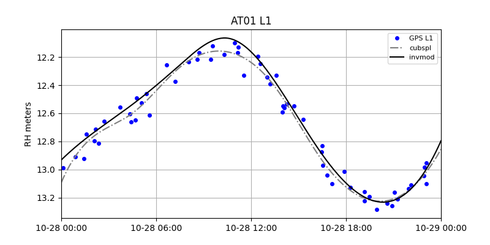
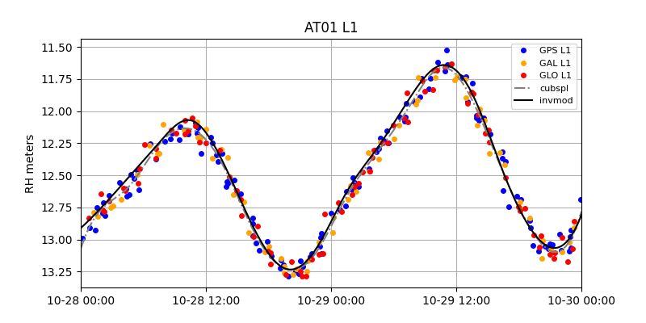
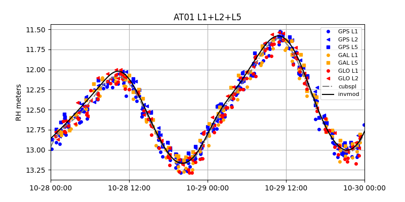

### invsnr

This is a utility for analyzing time-varying smooth surfaces with GNSS interferometric reflectometry.
The method was first introduced by [Joakim Strandberg](https://github.com/Ydmir) and his colleagues. This implementation of the method was written by 
[David Purnell](https://purnelldj.github.io/). It reads the inputs from the <code>gnssrefl</code> package (SNR files). 
It also does the L1, L2, and L5 frequencies and the GPS, Galileo, and Glonass constellations.

The <code>gnssrefl</code> **REFL_CODE** environment variable must be set. This variable is used for storage of 
the SNR files and the inputs to the analysis strategy.

### Running the code

I. Make SNR files as you would normally for the <code>gnssrefl</code> using <code>rinex2snr</code>. They will be stored in
$REFL_CODE/yyyy/snr/ssss where yyyy is the year and ssss is the station name.

II. Set up analysis instructions. These instructions are stored in $REFL_CODE/inputs.

The required inputs are the station name (four characters lowercase), the reflector height limits (in meters)
the elevation angle limits (in degrees). 

*Example:*

<code>invsnr_input p041 0.5 6 5 25 </code>

In this case the station coordinates for p041 will be retrieved from the UNR database. If you have a 
site that is not in the database, please use -lat, -lon, -height inputs.

You can add an azimuth restriction using -a1 and -a2:

<code>invsnr_input p041 0.5 6 5 25 -a1 180 -a2 270</code>

III. Run invsnr

*Required inputs*

- station name (4 characters, lowercase)
- year
- day of year 
- frequency (e.g. L1, L2, L5, L1+L2, L1+L2+L5)

*Optional inputs*

- pktnlim peak2noise ratio for QC
- constel (G,E, or R, which repesent GPS, Galileo, and Glonass)
- screenstats (True or False)
- tempres decimation value for the SNR file (seconds)
- polydeg polynomial degree for direct signal removal (default is 2)
- snrfit Do a invsnr fit? Default is True
- doplot Send a summary plot to the screen? Default is True
- doy_end day of year for multiday analysis
- lspfigs and -snrfigs make LSP and SNR plots, default False. 
- knot_space value used for smoothing, in hours 

*Output of the invsnr Code*

The code makes a first cut of reflector height estimation using a 
Lomb Scargle Periodogram. It also does
a cubic spline fit and then the spline fit estimation. 
*No phase center or refraction corrections are currently applied.*
(I am still working in this, especially storing the outputs.) 

*Example for station AT01*

- Make SNR files <code>rinex2snr at01 2021 301 -doy_end 303 -orb gnss -archive unavco</code>

- Save analysis strategy <code>invsnr_input at01 9 14 5 13 -a1 20 -a2 220</code>

- Just one day of GPS on L1: <code>invsnr at01 2021 301 L1 -constel G</code> 

- Two days with L1 and all constellations: <code>invsnr at01 2021 301 L1 -doy_end 302</code> 

- Two days with L1+L2+L5 and all constellations: <code>invsnr at01 2021 301 L1+L2+L5 -doy_end 302</code> 

### Future Changes

We need to add Beidou.

We need to add a refraction correction.

Need to add a txt/json/csv output.

Allow SNR input files other than 66.

### Further reading

J. Strandberg,, T. Hobiger, and R. Haas (2016), Improving GNSS-R sea level determination through inverse modeling of SNR data, Radio Science, 51, 1286–1296
[pdf](https://publications.lib.chalmers.se/records/fulltext/241876/local_241876.pdf)

D. Purnell, N. Gomez,  et al. (2021) Precise water level measurements using low-cost GNSS antenna arrays, Earth Surf. Dynam., 9, 673–685 [pdf](https://esurf.copernicus.org/articles/9/673/2021/)
