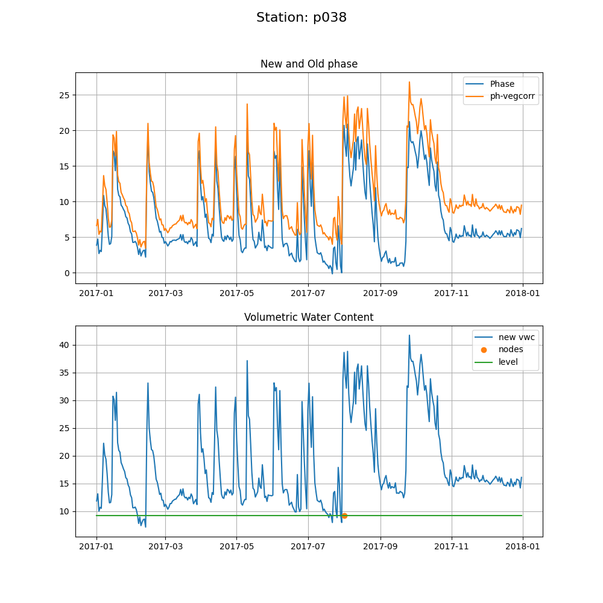

### Soil Moisture

Our soil moisture code is based on many years of experiments, models, and publications
by Eric Small, Clara Chew, John Braun, Kristine Larson, Valery Zavorotny, and Felipe Nievinski.
We cannot possibly describe all that work here - but attempt to give some context to why 
decisions are made as they are.  Please look for the publications [here](https://www.kristinelarson.net/publications/).

Will your site be a good soil moisture site?  This is almost entirely based on how flat your site is.
Flat is good. You can use a DEM, if you have it, or a photograph.  

### 1. Analyze the reflection characteristics of your site

Our soil moisture algorithm depends on initial reflector height values derived from 
the [traditional reflector height method](gnssir.md). We need to use the average of the snow-free RH values
for a given year. When this method was demonstrated for a large network in the wesetern US (PBO H2O), we 
were also estimating snow depth. This allowed us to easily identify and remove snow-contaminated values from
our soil moisture estimates. **We are no longer running the PBO H2O network** and thus this code will first
be tested on sites where it does not snow or does not snow very often.

- [Generate the SNR files](rinex2snr.md)

- [Take a quick look at the data](quickLook.md)

- [Estimate reflector heights](gnssir.md)

### 2. Estimate Phase 

For reasons described by Clara Chew in her first paper, we use phase insead of RH to derive soil moisture.
We need to know which satellites to use. Use <code>vwc_input</code> to pick the satellite tracks. 
The default will be to use L2C signals which is what was used by PBO H2O. 
The code will ask that you pick the year that you think has the most L2C satellites (usually the latest year).

This creates a file that will go in $REFL_CODE/input/ssss_phaseRH.txt where ssss is your station name.

# Documentation should go in the file.

[This is what the file should look like.](p038_phaseRH.txt)
   

Estimate the phase for the years 2017 through 2020

<code>phase ssss 2017 1 -doy_end 365 -year_end 2020 </code>

  

  

<code>vwc 2017 -year_end 2020</code>

### 3. Estimate VWC

  

