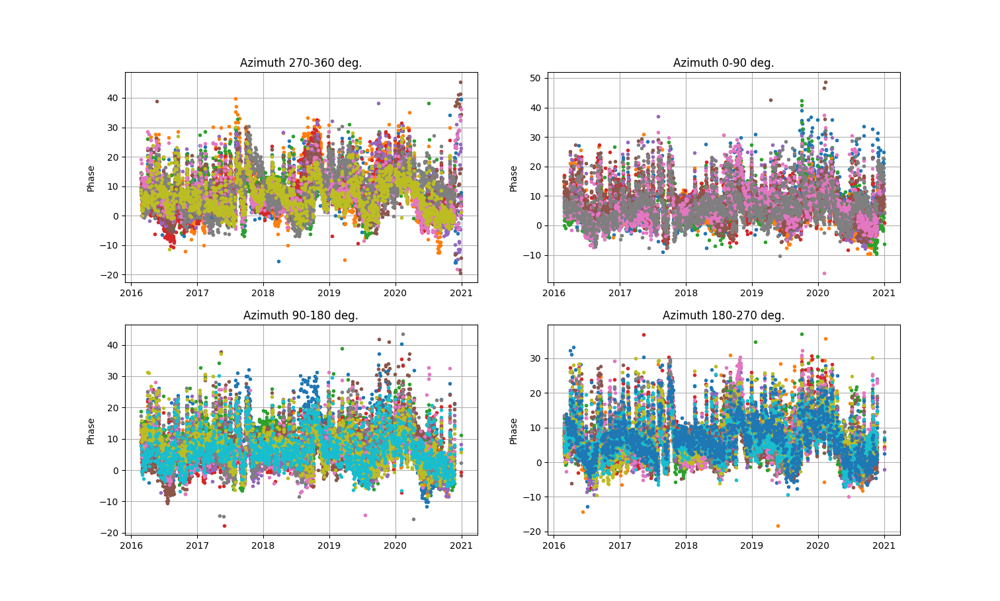

### Soil Moisture

This soil moisture code is based on many years of experiments and model development  
by Eric Small, Clara Chew, John Braun, Kristine Larson, Kristine Larson, and Felipe Nievinski.
We cannot possibly describe all that work here - but we do attempt to give you some context to why 
we have taken various steps.  Please look to the 
publications [for additional details](https://www.kristinelarson.net/publications/).

Some cautionary notes:

- This algorithm only uses GPS satellites. This is because we take advantage of the repeating GPS 
ground track. There is no reason you can't use other GNSS satellites to measure soil mositure - 
but this code won't do it for you.  

- Will your site be a good soil moisture site?  This is almost entirely based on how flat your site is.
Flat is good. You can use a DEM, if you have it, or a photograph.  

- This algorithm is currently only running for the L2C signal. It is **your responsbility** to make sure that 
your files have L2C data in them. While this is trivial with the RINEX 3 format, it can be very challenging to 
find L2C data in some older datasets and at some archives (e.g. UNAVCO). 

- For many PBO sites (but by no means all), you can find L2C data in the 
high-rate streams at UNAVCO.  You don't need the high-rate data for estimating soil
mositure, so I recommend you decimate to 15 seconds when you translate the RINEX file into the SNR format.

- We are planning to add teh L1 frequency to this code. *However* we were never able to successfully
use the Trimble L1 data for soil moisture. It was simply too noisy. 

- In contrast to some Trimble data, where the L2C data are not provided, the Septentrio datastreams often
do include the L2C data. 

- The PBO H2O algorithm was successfully validated for choke ring antennas. We will do our best 
to test more antennas as time allows. 

### 1. Analyze the reflection characteristics of your site

Our soil moisture algorithm depends on initial reflector height values derived from 
the [traditional reflector height method](gnssir.md). We need to use the average of the snow-free RH values
for a given year. When this method was demonstrated for a large network in the western US, 
[PBO H2O](https://www.kristinelarson.net/wp-content/uploads/2015/12/Larson-2016-WIRES_Water.pdf), we 
were also estimating snow depth on a daily basis. This allowed us to easily identify and remove snow-contaminated values from
our soil moisture estimates. **I am no longer running the PBO H2O network.** The goal of this module is to provide a 
way for you to measure soil moisture, but you must take responsibility for evaluating whether your site 
has snow effects. For the time being we are testing the code where it does not snow or it does not snow very often. 
Regardless, you need to take these initial steps:

- [Generate the SNR files](rinex2snr.md)

- [Take a quick look at the data](quickLook.md)

- [Estimate reflector heights](gnssir.md)

### 2. Estimate Phase 

For reasons described by Clara Chew in 
her [first paper](https://www.kristinelarson.net/wp-content/uploads/2015/10/Chew_etal_Proof.pdf), 
we use phase instead of RH or amplitude to derive soil moisture. We need to 
know which satellites to use. You should use <code>vwc_input</code> to pick the best satellite tracks. 
The default will be to use rising and setting L2C satellites.  This is the signal we used for PBO H2O and we 
have [extensively validated its results](https://www.kristinelarson.net/wp-content/uploads/2015/12/SmallLarson_etal2016.pdf). 
The code also requires that you pick the year that you think has the most 
L2C satellites (by definition this will be the latest year).

This creates a file that will go in <code>$REFL_CODE/input/ssss_phaseRH.txt</code> where ssss is your station name.
If you want to remove certain azimuths, just delete or comment out those azimuths (use a %).

Estimate the phase for the years 2016 through 2020 for station p038:

<code>phase p038 2016 1 -doy_end 365 -year_end 2020 </code>

This will produce color plots for the four geographic regions (northwest, northeast, etc):

  

  

If you have previously run the code it will attempt to warn you about bad satellite tracks.
The main output of this code is a daily average of the phase data. 

Can you measure phase (and thus soil moisture) more often than once per day? Of course you can. We routinely
measured it twice/day with a limited constellation. Now that L2C has 24 satellites, it would be straightforward 
to estimate it four times/day. By also using the L1 signal, one could perhaps push that temporal resolution even further.

### 3. Estimate VWC

As described by Clara Chew in her follow up publications, vegetation can have a significant impact on the phase results 
and must be modeled.  We follow a multi-stage process - we change units from phase (degrees) to VWC, 
we model and remove the vegetation effect, and then we "level" the data using soil texture profiles for your site.
Currently we set the minimum soil moisture value to 5%.

  

Which yields:

Kristine M. Larson
August 23, 2022
