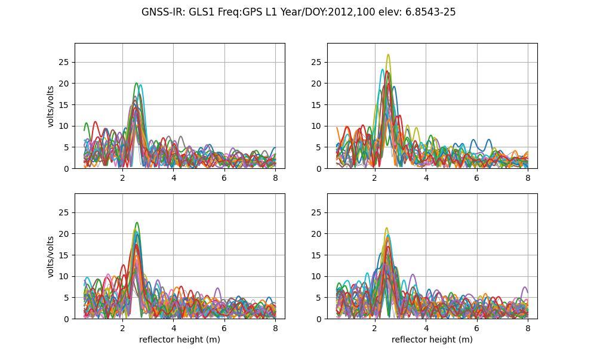
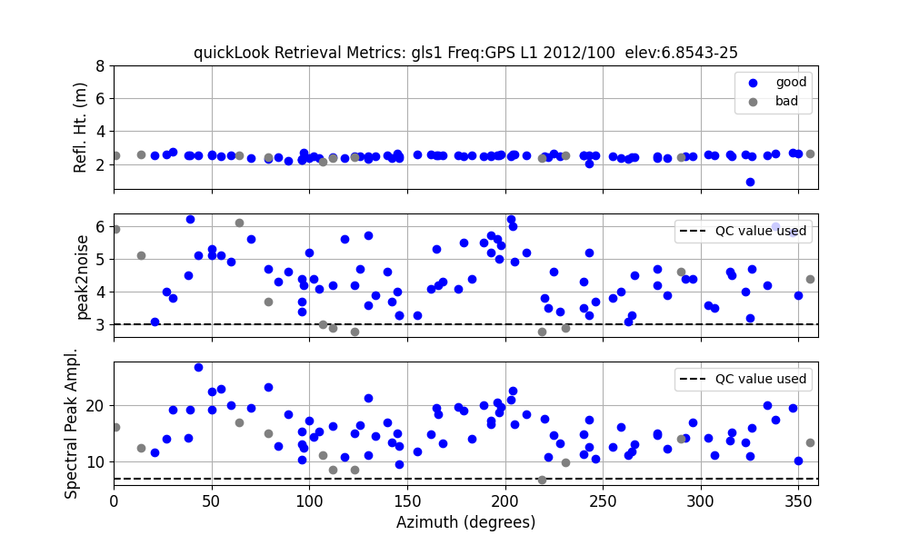
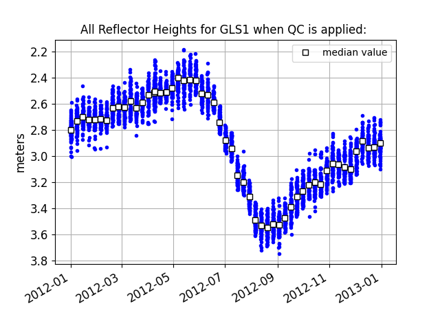
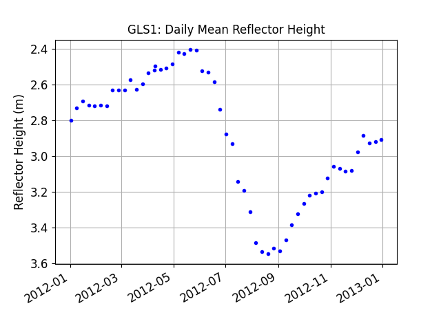
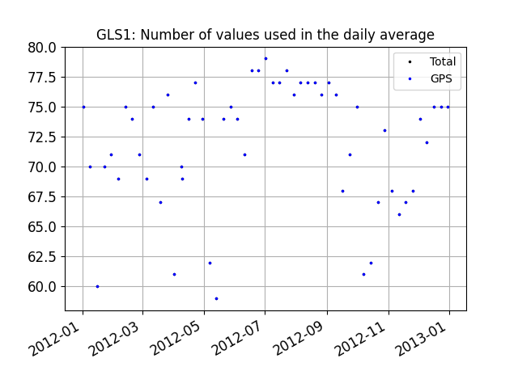

## Homework 2 Solution

(Solutions and figures were generated using gnssrefl [v1.5.3](https://pypi.org/project/gnssrefl/1.5.3/))

*Make SNR file for gls1, 2012, doy 100*  quickLook*

<code>rinex2snr gls1 2012 100 -archive unavco </code>

*Run quickLook*

<code>quickLook gls1 2012 100</code>

This makes two plots.  

*Looking at the QC metrics plots created by <code>quickLook</code>, do you have some ideas on how to change the azimuth mask angles?*

*Now make SNR files for gls1 for the all of 2012.*

<code>rinex2snr gls1 2012 1 -archive unavco -doy_end 366 -weekly True</code>

*We will next analyze a year of L1 GPS reflection data from gls1. We will use the default minimum and maximum 
reflector height values (0.5 and 8 meters). But for the reasons previously stated, you will want to 
set a minimum elevation angle of 7 degrees. We also specify that we only want to use the L1 data.  We will 
get the coordinates from UNR and specify the azimuth mask*

<code>gnssir_input gls1 -l1 True -e1 7 -peak2noise 3 -ampl 8 -azlist2 40 330</code>
    
*Now that you have SNR files and json inputs, you can go ahead and 
estimate reflector heights for the year 2012 using <code>gnssir</code>.
Note that it is normal to see 'Could not read the first SNR file:' because we 
only created SNR files once a week.*

<code>gnssir gls1 2012 1 -doy_end 366</code>

*Now you can use the <code>daily_avg</code> tool to compute a daily average reflector height for gls1. 
Try setting the median filter to 0.25 meters and individual tracks to 30.*

<code>daily_avg gls1 0.25 30</code>

This code produces three plots and a daily average (txt or csv) file. 

This is all the individual RH:

This is the daily average after outliers have been removed:

This lets you know how many arcs went into each day's average:

*Note that RH is plotted on the y-axis with RH decreasing rather than increasing. Why do you think we did that?*

Most people are interested in snow accumulation, so reversing the y-axis accommodates that.

[Here is the text file of the RH result for 2012.](gls1_dailyRH.txt)

