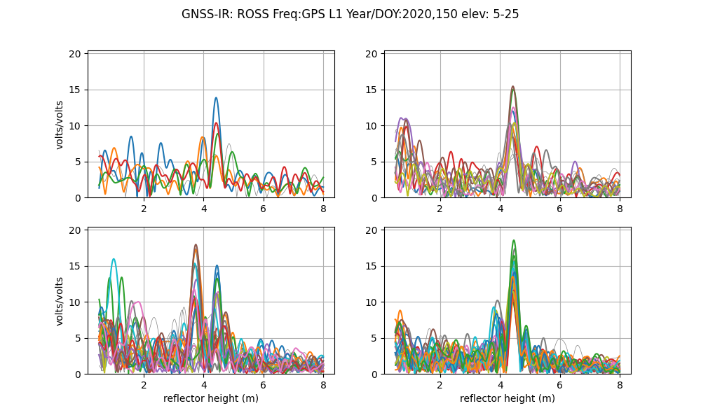
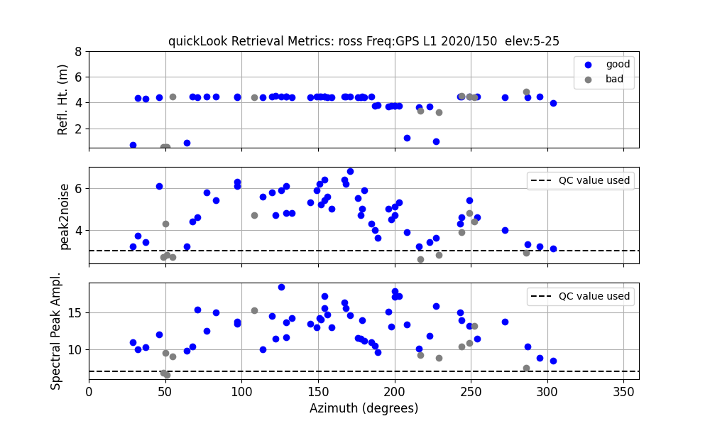
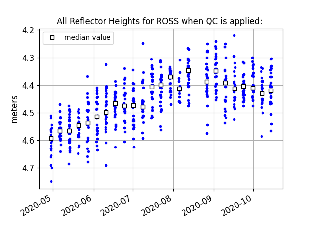
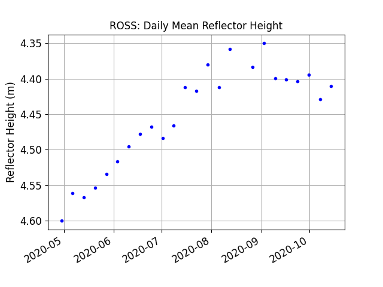

### Homework 3 Solution

(Solutions and figures were generated using gnssrefl [v1.5.3](https://pypi.org/project/gnssrefl/1.5.3/))

*Make SNR data. The only required inputs are the 
station name (ross), the year (2020) and day of year (150)*

<code>rinex2snr ross 2020 150</code> 

*Once you have successfully created a SNR file, run <code>quickLook</code>.*

<code>quickLook ross 2020 150</code> 

*From these plots, how does the correct *RH* value compare with the one you assumed earlier when you 
were trying out the webapp?  How about the azimuths?  Go back to the reflection zone webapp and 
make sure you are happy with your azimuth and elevation angle selections.*

*Next we need to save our <code>gnssir</code> analysis strategy*

I shifted the min and max RH to better accommodate the main signal from ~4.5 meters. I also limited 
elevation angles to 5-15 and used the peak2noise from the quickLook (which is 3).  I use azimuths 
from the southeast region and get coordinates from UNR.

<code>gnssir_input ross -l1 True -h1 2 -h2 8 -e1 5 -e2 15 -peak2noise 3 -azlist2 90 180</code>

*Now analyze data for the year 2020. First you need to make the snr files:*

<code>rinex2snr ross 2020 120 -doy_end 290 -weekly True</code> 

Then use the SNR data to estimate RH:

<code>gnssir ross 2020 120 -doy_end 290 </code> 

Then create a daily average RH:

<code>daily_avg ross 0.25 15</code>

The daily_avg code produces multiple plots. Individual RH estimates:

The daily average for RH:

You can compare these retrievals with the [NRCAN](https://www.nrcan.gc.ca/home) 
tide gauge data for Rossport.
To see another Canadian lake level example, see the [use case for mchn.](https://gnssrefl.readthedocs.io/en/latest/use_cases/use_mchn.html)
