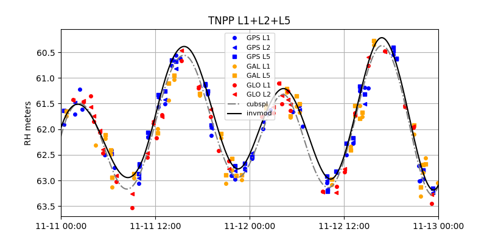

# invsnr

This is a utility for analyzing time-varying smooth surfaces with GNSS interferometric reflectometry.
The method was first introduced by [Joakim Strandberg](https://github.com/Ydmir) and 
his colleagues. This implementation of the method was written by 
[David Purnell](https://purnelldj.github.io/). It reads the inputs from the <code>gnssrefl</code> package (SNR files). 
It analyzes L1, L2, and L5 signals and the GPS, Galileo, Glonass, and Beidou constellations.

You might notice that the Lomb Scargle Periodogram (LSP) results displayed from this software are different 
than the <code>gnssir</code>. In some locations you might see relatively large outliers. *This is to be expected.* 
This code uses the LSP results as a starting solution - the quality control applied 
is entirely different than what was used in <code>gnssir</code>. Since the point of this code is to estimate smoothly
varying sea level, I don't think we need to make the LSP portion of it a clone of <code>gnssir</code>. 

Note: 

- txt and csv output is now supported. 

- You can specify the temporal sampling of the output.

- a simple refraction correction (elevation angle bending) has been included

## Running the code

The  **REFL_CODE** environment variable must be set. This variable is used for storage of 
the SNR files and the inputs to the analysis strategy.

I. Make SNR files as you would normally for the <code>gnssrefl</code> using <code>rinex2snr</code>. They will be stored in
$REFL_CODE/yyyy/snr/ssss where yyyy is the year and ssss is the station name.

II. Set up analysis instructions. These instructions are stored in $REFL_CODE/input.

The only required input is the station name (four characters lowercase). The defaults can be viewed by 
typing <code>invsnr_input -h</code> or using the documentation.

*Example:*

<code>invsnr_input p041 </code>

In this case the station coordinates for p041 will be retrieved from the UNR database. If you have a 
site that is not in the database, please use -lat, -lon, -height inputs.

For almost all tide gauge sites you will need to add an azimuth restriction using -azim1 and -azim2. Here we will
continue using p041 as the example

<code>invsnr_input p041 -azim1 180 -azim2 270</code>

Please note the default elevation angle ranges. They can be changed on the command line.

Because this software identifies rising and setting arcs in a different way than <code>gnssir</code>, you 
can set a single range of azimuth ranges. But as it was written by the original author, there is no way to have 
two distinct sets of azimuth regions. I do not think this will be hard to change - so feel free to give it a look 
and submit a pull request.

III. Run invsnr

*Required inputs*

- station name (4 characters, lowercase)
- year
- day of year 
- frequency (e.g. L1, L2, L5, L6, L1+L2, L1+L2+L5). ALL means L1+L2+L5+L6+L7

The code will attempt to use GPS, Galileo, and Glonass unless you tell it otherwise

[Optional inputs](https://gnssrefl.readthedocs.io/en/latest/api/gnssrefl.invsnr_cl.html)

*Output of the invsnr Code*

The code makes a first cut of LSP reflector height estimation. It also does
a cubic spline fit and then the spline fit estimation. 
I am currently printing out the smoothed results to a plain txt file every five minutes.
You can modify that temporal setting or change to a csv format at the command line.

Warning: No phase center corrections are currently applied to the reflector heights.
Nor are changes from material properties addressed (water, snow, ice). 

*Example for station AT01*

- Make SNR files <code>rinex2snr at01 2021 301 -doy_end 303 -orb gnss -archive unavco</code>

- Save analysis strategy <code>invsnr_input at01 -h1 9 -h2 14 -e1 5 -e2 13 -azim1 20 -azim2 220</code>

- Just one day of GPS on L1: <code>invsnr at01 2021 301 L1 -constel G</code> 

- Two days with L1 and all constellations: <code>invsnr at01 2021 301 L1 -doy_end 302</code> 

- Two days with L1+L2+L5 and all constellations: <code>invsnr at01 2021 301 L1+L2+L5 -doy_end 302</code> 

*Example for station TNPP*

- Make SNR files using <code>rinex2snr</code>, using high-rate data, UNAVCO archive, and GNSS orbits options 

- Save analysis strategy <code>invsnr_input tnpp -h1 58 -h2 67  -e1 5 -e2 12 -azim1 180 -azim2 270</code>

- Two days with L1+L2+L5, all constellations, decimate to speed up the code (1-sec data will be very slow)

<code>invsnr tnpp 2021 315 L1+L2+L5 -doy_end 316 -tempres 2</code>

*Example for station SC02*

- Used default 15 second RINEX files from UNAVCO and -orb gnss option

- ranges: 3.5-8 meter RH, 5-13 elevation angle, 40-240 azimuth 

- Multi-day, multi constellation, L1+L2 <code>invsnr sc02 2021 30 L1+L2 -doy_end 33 </code>

## Future Changes

Currently assumes you are using full 24 hour SNR files.  This obviously is not very sensible 
if you have a large gap at the beginning or end of your analysis.  

## Further reading

J. Strandberg, T. Hobiger, and R. Haas (2016), Improving GNSS-R sea level determination through 
inverse modeling of SNR data, Radio Science, 51, 1286–1296
[pdf](https://publications.lib.chalmers.se/records/fulltext/241876/local_241876.pdf)

D. Purnell, N. Gomez,  et al. (2021) Precise water level measurements using low-cost GNSS antenna arrays, Earth Surf. Dynam., 9, 673–685 [pdf](https://esurf.copernicus.org/articles/9/673/2021/)
