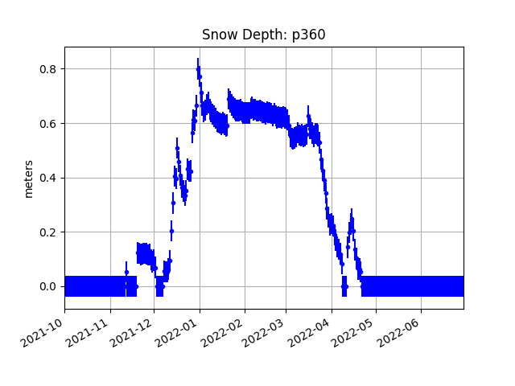

# snowdepth

The snow depth module follows the basic work scheme of PBO H2O snow depths. The assumptions are:

- you set the "no snow" or "bare soil" values using data from the fall (in the northern hemisphere)
- negative snow depth is not allowed!
- snow depth < 0.05 is set to zero as these small values are close to the resolution of the method.
- we do not estimate snow depth after June 30. This is purely a practical constraint as most 
of the GNSS sites where we tested the method did not have snow cover then. 

The current required inputs are :

- station name
- water year (sorry - this is North America centric water year).

You have two choices. The default model calculates an azimuth specific bare soil reflector height every 
20 degrees in azimuth and removes that as the bare soil value for that azimuth range.  The "simple" algorithm simply treats
them all the same (this was the first version released).  So if you were measuring RH from 90 to 270 degrees, 
the simple version would average all the bare soil values together.  This would be perfectly fine if a site 
is fairly horizontal. It would be perfectly fine to add more inputs (like setting 
azimuth ranges to smaller or larger azimuth increments). I will leave that
to the community to make as a PR.

Before you run the snowdepth module, you need to consolidate your RH results. You have two choices:

- you can run the <code>daily_avg</code> module. 

or 

- you can set the -medfilter and -ReqTracks optional inputs to snowdepth.

Either makes sure that gross outliers have been removed. 
Read the [daily_avg](https://gnssrefl.readthedocs.io/en/latest/api/gnssrefl.daily_avg_cl.html) 
documentation for more information.

Depending on which algorithm choice
you make (simple vs. azimuthal), the code will use either the full list of arc specific LSP files or the daily average.

[More on optional snowdepth inputs](https://gnssrefl.readthedocs.io/en/latest/api/gnssrefl.snowdepth_cl.html)

The error bars are **over-estimates** and based on the standard deviation of the 
reflector heights used in the average. These include terrain errors as well as snow depth errors.

There is a SWE module that is currently written in matlab. If you are willing to port it to
python, we would be happy to add it to this respository. Please contact me directly.

PBO H2O snow depth products were based on L2C data. This utility allows multi-GNSS retrievals.
For further reading, [search for the word snow on this page](https://www.kristinelarson.net/publications/).

You might be interested to compare your GNSS-IR results with 
SNODAS or [SNOTEL](https://data.nal.usda.gov/dataset/snowpack-telemetry-network-snotel).
**However**, there are no SNOTEL data that will agree with GNSS-IR because they do not 
have the same footprint. Furthermore, the two sensors are rarely close enough to 
each other or in the same treecover. SNODAS is a **model** - and for that reason alone 
you should never expect it to agree with GNSS-IR.

There are certainly other ways you can convert reflector heights to snow depth. And 
some of the L1 reflector height retrievals from some receivers are extremely problematic.  
([We wrote an entire paper on this issue](https://www.kristinelarson.net/wp-content/uploads/2015/12/Larson_Small2016.pdf)).
When you see large gaps at PBO sites in winter this is most likely because the site was 
not designed to operate when snow covers the solar panels. In 
other cases the GPS receiver failed and was 
not repaired until the following spring. GPS/GNSS instruments can 
of course operate throughout the winter - but it does 
require that that be a design goal. 
