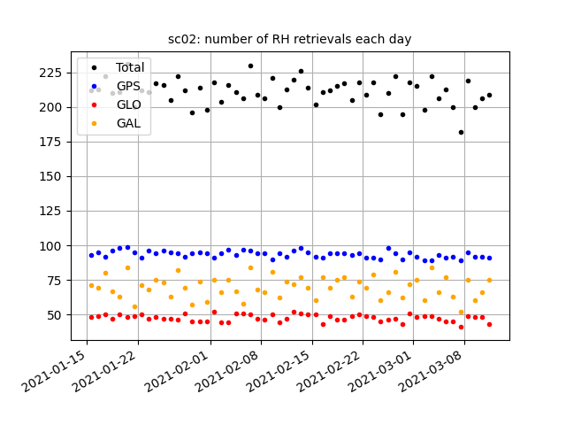
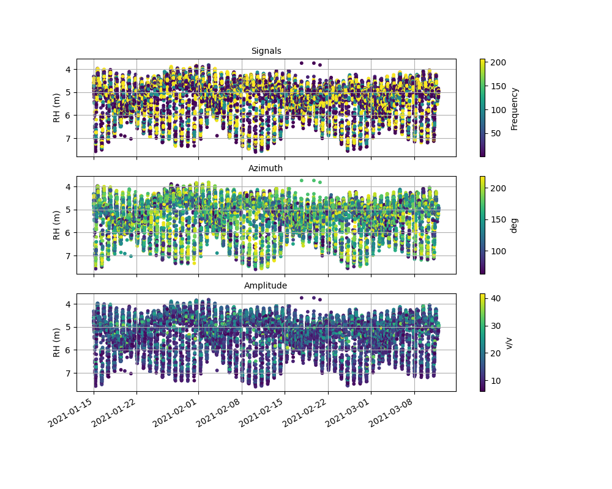
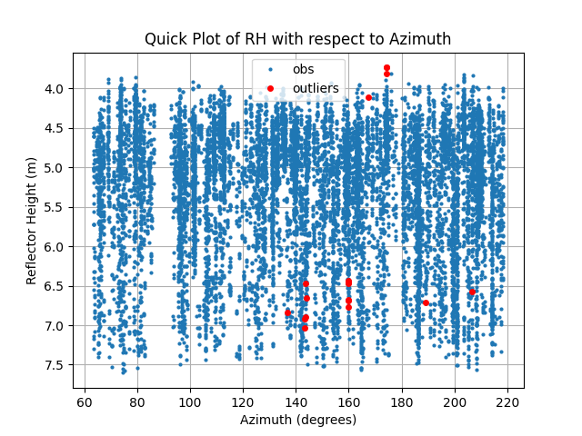
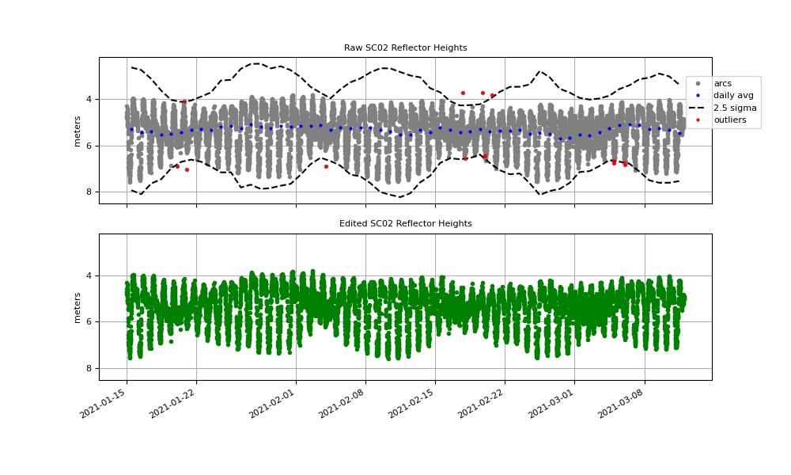
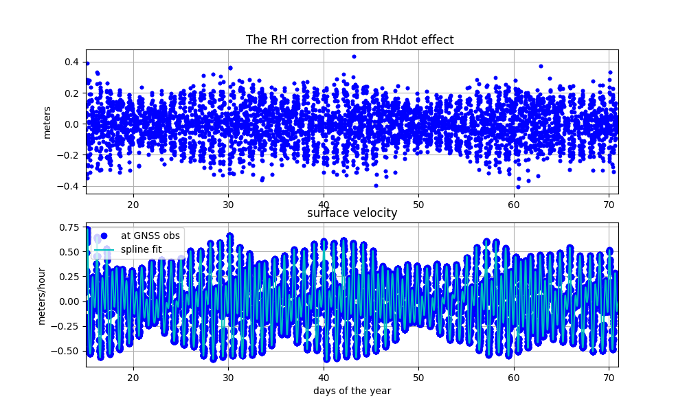
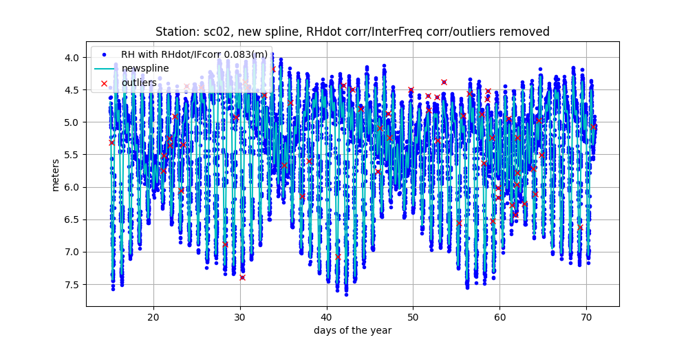

# subdaily

The subdaily code has two sections:

## Section I

The goal of this section is to summarize the RH data previously computed using gnssir, i.e. 
were constellations where used, how do the 
RH data look compared to various quality control parameters).  It also removes gross 
outliers by looking a very crude daily standard deviation (i.e. with 2.5 sigma, which you 
can control on the commandline).

Results are presented with azimuth and amplitude colors to help you modify QC choices or azimuth mask:

You can also apply new limits to RH, azimuths, and QC parameters.

## Section II

Second section tries to do a better job with outliers based on a spline fit. If the spline fit
is not very good (which you control with -knots), then it will throw out too many points (or too few).
Right now it uses three sigma. You can override this using -spline_outlier1 in meters.

It then uses the spline fit to calculate and apply the RHdot correction. This is not the only way
to make this correction, but it is the only way in the gnssrefl code. If you are in a high tidal 
region, you should definitely see an improvement in the residuals. 

After RH dot is applied, it makes a new spline and then calculates how well the different frequencies
agree with this. It computes and applies a frequency dependent offset with respect to GPS L1.  
This final version also removes three sigma outliers - though again, you can use -spline_outlier2 to set
that to a better value for your data set.

I have been concerned about overwriting the original RH value (in column 3). So these new values are 
always added as new columns.

If you have your own concatenated file of results you can set -txtfile_section1 to that filename.
Similarly, if you want to skip section 1 and go right to section 2, you can set -txtfile_section to your filename.

The code will compute (and remove) an InterFrequency (IF) bias. If you don't want it to 
apply this IF, set <code>if_corr</code> to False.

The code now writes out the spline fit at set intervals. The default is 30 minutes - but you 
can set it to another interval using <code>delta_out</code>.

This module is meant for RH measurements that have a subdaily component. It is not strictly 
restricted for water levels, but that is generally where it should be used. There are 
two main goals for this code:

- consolidate daily result files and find/remove outliers
- apply the [RHdot correction](https://www.kristinelarson.net/wp-content/uploads/2015/10/LarsonIEEE_2013.pdf)

If you want to do your own QC, you can simply cat the files in your results area. As an example, after you have 
run <code>gnssir</code> for a station called sc02 in the year 2021:

<code>cat $REFL_CODE/2021/results/sc02/*.txt >sc02.txt</code>

Required Inputs:

* station               
* year                  

[Optional arguments](https://gnssrefl.readthedocs.io/en/latest/api/gnssrefl.subdaily_cl.html)

Some examples:

<code>subdaily sc02 2021 </code>

It picks up all result files from 2021, sorts and concatenates them. If you only want to 
look at a subset of days, you can set -doy1 and/or -doy2. The output file location
is sent to the screen. <code>subdaily</code> then tries to remove large outliers 
by using a standard deviation test. This can be controlled at the command line. Example figures:

Whle this code is meant to be used AFTER you have chosen an analysis strategy, you can 
apply new azimuth and amplitude constraints on the commandline, i.e. <code>-azim1, -azim2, -ampl</code>.

The second section of <code>subdaily</code> is related to the RHdot 
correction. There are lots of ways to apply the RHdot correction - I am only providing a simple one at this point.  
The RHdot correction requires you know :

- the average of the tangent of the elevation angle during an arc 
- edot, the elevation angle rate of change with respect to time 
- RHdot, the RH rate of change with respect to time  

The first two are (fairly) trivial to compute and are included in 
the results file in column 13 as the edotF. 
This edot factor has units of rad/(rad/hour), or hours. So if you 
know RHdot in units of meters/hour, you can get the correction by simple multiplication. 

Computing RHdot is the trickiest part of calculating the RHdot correction.
And multiple papers have been written about it. If you have a 
well-observed site (lots of arcs and minimal gaps), you can use the RH 
data themselves to estimate a smooth model for RH (via cubic splines) and 
then just back out RHdot. This is what is done in <code>subdaily</code> 
It will also make a second effort to remove outliers.  

Note: if you have a site with a large RHdot correction, you should be cautious of removing too many
outliers in the first section of this code as this is really signal, not noise. You can set the outlier criterion 
with <code>-spline_outlier1 N</code>, where N is in meters. 

There are other ways to compute the RHdot correction:

- computing tidal coefficients, and then iterating using the forward predictions of the tidal fit (as in Larson et al. 2013b)
- estimating RHdot effect simultaneously with tidal coefficient (as done in Larson et al. 2017). 
- low-order tidal fit (Lofgren et al 2014)
- direct inversion of the SNR data (Strandberg et al 2016 , Purnell et al. 2021)
- estimate a rate and an acceleration term (Tabibi et al 2020)

Because the spline is not very good at the beginning and end of the data, I was initially 
removing about 6 hours of data from each end. I now use a pretty standard way to keep all the data.
Here are some results from the SC02 site again - but now from the second section of the code. 
In the bottom panel you can see that applying the RHdot correction at this site improves the 
RMS fit from 0.15 to 0.11 meters.

**THE NEW RH VALUES ARE NOT WRITTEN TO COLUMN 3!**  Please look at the file for more information.

After the RHdot correction has been applied, the code then estimates a new spline fit and 
attempts to remove frequency-specific biases **relative to GPS L1.** If GPS L1 is not being
tracked, then it just uses the average of all frequencies. Stats 
for this fit with respect to the spline fit are printed to the screen (and thus GPS L1 bias 
should be zero). Three-sigma outliers with respect to the new fit are removed.
In this example the RMS improves from 0.11 to 0.09 m. 

**Again, the new RH values are not written to column 3. Please look at the file.**

Here is an example of a site (TNPP) where the RHdot correction is 
even more important (I apologize for color choice here. The 
current code uses more color-blindness-friendly colors):

After removing the RHdot effect and frequency biases, the RMS improves from 0.244 to 0.1 meters.

Comment: if you have an existing file with results, you can just run the second part of the code. 
If the input file is called test.txt, you would call it as:

<code>subdaily sc02 2021 -splinefile test.txt -rhdot True</code>

