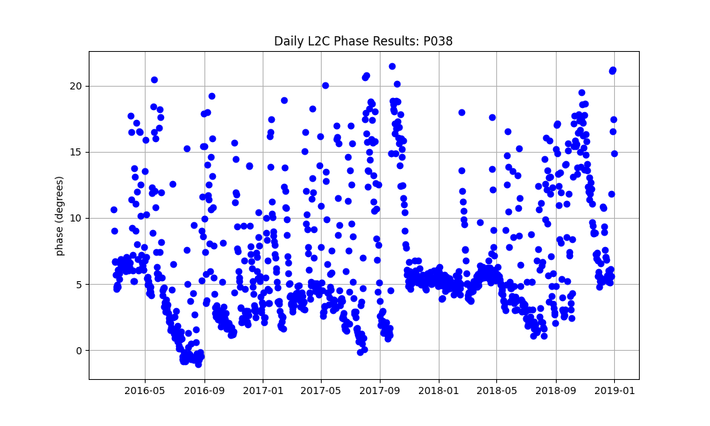
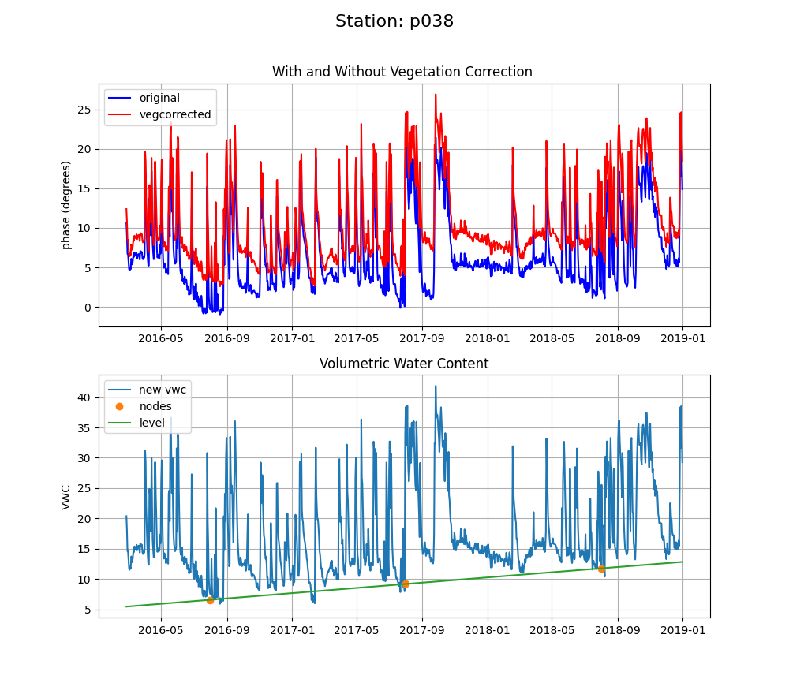

# Soil Moisture

[Latest options for the code.](https://gnssrefl.readthedocs.io/en/latest/api/gnssrefl.vwc_cl.html)

This soil moisture code is based on many years of experiments and model development by Eric Small, Clara Chew, John Braun, 
Valery Zavorotny, Kristine Larson, and Felipe Nievinski. For more information on this, please look to the 
soil moisture publications at my website [for additional details](https://www.kristinelarson.net/publications/).

We applied this soil moisture algorithm to more than 150 sites from the Plate Boundary Observatory (PBO); the 
overall effort was called the PBO H2O network. PBO H2O operated from 2012-2017 
and included data from 2007-2017 ([for more information](README_pboh2o.md).)

- This algorithm only uses GPS satellites. This is because we take advantage of the repeating GPS 
ground track. There is no reason you can't use other GNSS satellites to measure soil moisture - 
but this code won't do it for you.  

- Will your site be a good soil moisture site?  This is almost entirely based on how flat your site is.
Flat is good. You can use a DEM, if you have it, or a photograph.  

- **Be very careful** about analyzing data across receiver change boundaries. We are working to make a 
database that will alow you to track this kind of thing, but it is not currently done. 

- This algorithm is currently only recommended and validated for the L2C signal. 
It is **your responsibility** to make sure that 
your RINEX files have L2C data in them. While this is trivial with the RINEX 3 format, it can be very challenging to 
find L2C data in some older datasets and at some archives (e.g. UNAVCO). If we know where to find 
L2C data, we will do our best to let you know in the use cases. <code>check_rinex_file</code> will try to tell
you whether your RINEX 2.11 file has L2C data in it.

- For many PBO sites (but by no means all), you can find L2C data in the 
high-rate RINEX 2.11 streams at UNAVCO. However, you don't need the high-rate data for estimating soil
moisture, so I recommend you decimate to 15 seconds when you translate the RINEX file into the SNR format.

- I have generally found that people using Septentrio receivers archive the L2C data in their RINEX 2.11 files.

- We have had good success using L1 SNR data for water level, vegetation, and snow measurements. 
However, we found them to be unreliable for soil moisture products and never used them. We have tested 
our soil moisture algorithms with the L1 data from newer receivers and still find the data 
to be lacking. **We do not recommend you use this soil moisture code with L1 data.**

- Our algorithm was validated for choke ring antennas. We were not funded to include other antennas 
in the <code>gnssrefl</code> software package - but will try to do so if others can provide the necessary corrections.

- This software estimates soil moisture once per day. Can you measure soil moisture more often than once per day? Yes. 
We routinely measured it twice/day at PBO H2O when there were less than 10 satellites. Now that there are 24 L2C transmitting satellites, it would be straightforward to estimate VWC four times/day. 

- The code currently only supports sites that are ~1-3 meters above the soil. We will allow variable heights in a future version.

## 1. Analyze the reflection characteristics of your site

Our soil moisture algorithm depends on *a priori* reflector height values derived from 
the [traditional reflector height (RH) method](gnssir.md). We need to use the average of the snow-free RH values
for a given year. When this method was demonstrated for PBO H2O, we were also estimating snow depth on a 
daily basis. This allowed us to easily identify and 
remove snow-contaminated values from our soil moisture estimates. 

The goal of this soil moisture module of <code>gnssrefl</code> is to help individual scientists to measure 
soil moisture. For the time being we are testing the code where it does not snow or it does not snow very often. 
As listed at the end of this page, we do have plans to help users flag snow contaminated days.
With our without snow issues, you need to take these initial steps to get started:

- [Generate the SNR files](rinex2snr.md) 

- [Take a quick look at the data](quickLook.md)

- [Estimate reflector heights](gnssir.md)

## 2. Estimate Phase 

Our algorithm uses L2C data. For the sample case used here, station p038, you should 
use the "special" archive option when translating RINEX files. Similarly, when analyzing 
the data for RH (using <code>gnssir</code>), you should use the L2C frequency. 

For reasons described by Clara Chew in 
her [first paper](https://www.kristinelarson.net/wp-content/uploads/2015/10/Chew_etal_Proof.pdf), 
we use phase instead of RH or amplitude to derive soil moisture. We need to know which satellites to use. And we need 
a starting solution for RH, i.e. *a priori* RH.

Use <code>vwc_input</code> to pick the best satellite tracks. The default will be to all use rising and setting L2C satellites arcs. 

The code also requires that you pick the year that you think has the most L2C satellites (by definition this will be the latest year).

This creates a file that will go in <code>$REFL_CODE/input/ssss_phaseRH.txt</code> where ssss is your station name.
If you want to remove certain azimuths, just delete or comment out those azimuths (use a %).

You then need to estimate the phase for the years in question. I will just use 2016 through 2018 for station p038:

<code>phase p038 2016 1 -doy_end 366 -year_end 2018 </code>

Once you have computed the phase values, you cannot change the *a priori* RH values. If you do change them, you 
need to rerun <code>phase</code>. If you forget about this, you will see offsets in 
your phase - and ultimately - your VWC time series. On the plus side, the phase code 
is fast - much faster than the time it took you to create SNR files.

## 3. Estimate VWC

<code>vwc p038 2016 -year_end 2018</code>

The main inputs are the station name and years you want to use. Other useful (optional) inputs:

- min_req_pts_track sets the minimum number of observations you require for a given satellite track. This is currently set to 50.

- minvalperday is the number of phase measurements you are going to require to "trust" your daily average phase (and thus VWC) value.
The default is 10. Currently this is easy to achieve, but earlier datasets might require you reduce that value.

- polyorder lets you override the code's decision on the leveling polynomial order.  Zero is a bias, one is a line, etc.

There are three main parts to this code. The first stage is to give you "raw" phase results 
for the four geographic regions (northwest, northeast, etc)

  

  

If you have previously run the code it will attempt to warn you about bad satellite tracks.
You can iterate to see if removing the satellite track improved things. You are also shown a daily average of the phase data. 

  

  

The second stage is to model and remove the vegetation effects:

As described by Clara Chew in her follow up publications, vegetation will have a [significant impact on the phase results ](https://www.kristinelarson.net/wp-content/uploads/2015/10/Chew_TGRS_rev.pdf) and that effect must be removed to achieve accurate soil moisture estimates. 
We follow a [multi-stage process](https://www.kristinelarson.net/wp-content/uploads/2015/10/ChewSmallLarson2015_withoutFront.pdf):

- change units from phase (degrees) to VWC  

- model and remove the vegetation effect using the spectral amplitudes 

- "level" the data using soil texture profiles for your site.

- do not allow nonsense soil moisture values (e.g. negative soil moisture is not allowed in our world)

We currently level the VWC data to 5% but you can change this on the command line. This will vary by site as that value should depend on 
the soil texture at the site.

  

Final stage - putting it all together. The data are also written to a text file and the location of that file is written to the screen:

Things we are planning to add:

- override dates so that you can remove particular time periods for a site (snow)

- more automated QC and help with identifying and removing snow contaminated data

- soil texture values will be explicitly saved 

- the json used by <code>gnssir</code> will be integrated with the soil moisture code

We have recently (April 23, 2023) automated a way to update the list of satellite tracks to use. 
See the *warning_value* and *auto_removal* inputs.

We currently have four use cases posted:

 - a shorter version of [p038](../use_cases/use_p038.md) 
 - [mchl](../use_cases/use_mchl.md) 
 - [scia](../use_cases/use_scia.md)
 - [mfle](../use_cases/use_mfle.md)

Kristine M. Larson

Updated April 23, 2023
