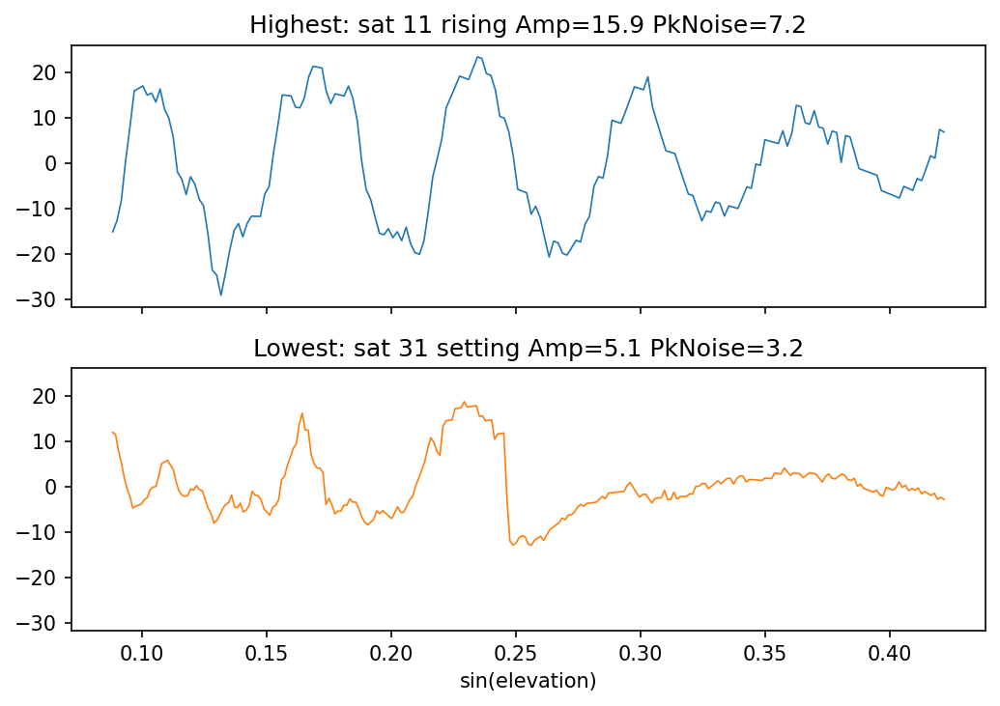
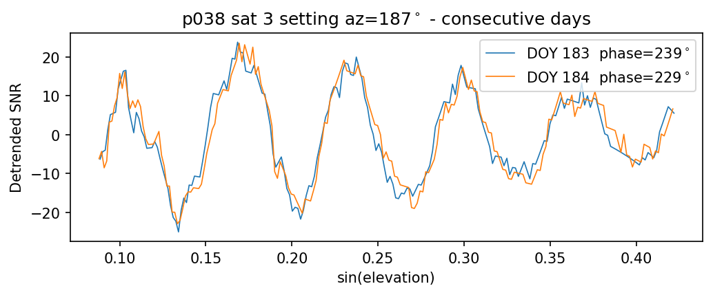

# Extracting Satellite Arcs

This page describes the `extract_arcs` module and highlights some useful features. It was produced for version `3.19.2` and may be out of date.

Please visit [the function definition page](https://gnssrefl.readthedocs.io/en/latest/api/gnssrefl.extract_arcs.html) to view the most recent API reference.

```{contents}
:local:
:depth: 2
```

## Overview

The `extract_arcs` module provides a clean API for accessing SNR/geometry data and associated metadata of individual satellite arcs within an SNR file.

Two convenience functions cover the most common workflows:

| Function | Use when you have... |
|----------|---------------------|
| `extract_arcs_from_station()` | a station name, year and day-of-year |
| `extract_arcs_from_file()` | a direct path to an SNR file |

## Quick Start

```python
import numpy as np
from gnssrefl.extract_arcs import extract_arcs_from_station

# Extract arcs across all available frequencies
arcs = extract_arcs_from_station('mchl', 2025, 11)

print(f'{len(arcs)} arcs found')
for meta, data in arcs[:3]:
    print(f"  sat {meta['sat']:3d}  freq {meta['freq']:3d}  "
          f"{meta['arc_type']:7s}  az={meta['az_min_ele']:5.1f}  "
          f"delT={meta['delT']:.1f} min  pts={meta['num_pts']}")
# 457 arcs found
#   sat 202  freq 206  rising   az=290.4  delT=128.0 min  pts=257
#   sat 203  freq 206  rising   az=219.8  delT=67.0 min  pts=135
#   sat 203  freq 206  setting  az=330.0  delT=84.0 min  pts=169
```

You can also request specific frequencies, or pass a path directly:

```python
arcs = extract_arcs_from_station('mchl', 2025, 11, freq=1)        # L1 only
arcs = extract_arcs_from_station('mchl', 2025, 11, freq=[1, 2, 5]) # L1+L2+L5

from gnssrefl.extract_arcs import extract_arcs_from_file
arcs = extract_arcs_from_file('/path/to/ssss0110.25.snr66')        # all frequencies
```

### Input Reference

Some commonly used parameters. All keyword arguments below can be passed to
`extract_arcs_from_station()`, `extract_arcs_from_file()`, or `extract_arcs()`.

| Parameter | Default | Description |
|-----------|---------|-------------|
| `freq` | None (all) | GNSS frequency code: int, list of int, or None for auto-detect |
| `e1` / `e2` | 5.0 / 25.0 | Elevation angle mask (deg) |
| `ellist` | None | Multiple elevation ranges (overrides e1/e2) |
| `azlist` | [0, 360] | Azimuth regions as pairs |
| `sat_list` | None (all) | Restrict to specific satellite PRNs |
| `min_pts` | 20 | Minimum points per arc |
| `ediff` | 2.0 | Elevation span tolerance for QC (deg) |
| `polyV` | 4 | Polynomial order for DC removal |
| `pele` | [e1, e2] | Elevation range for polynomial DC removal (deg) |
| `buffer_hours` | 0 | Hours of adjacent-day data to load for midnight arcs |
| `filter_to_day` | True | Only keep arcs with midpoint in 0-24 h |
| `attach_results` | False | Match arcs to gnssir/phase output files |
| `screenstats` | False | Print debug information |

### Output Reference

`extract_arcs` returns a list of `(metadata, data)` tuples, one per arc.

#### Metadata keys

| Key | Type | Description |
|-----|------|-------------|
| `sat` | int | Satellite PRN number |
| `freq` | int | Frequency code (1, 2, 5, 20, 101, 102, 201, 205, ...) |
| `arc_num` | int | Arc index within this satellite (1, 2, ...) |
| `arc_type` | str | `'rising'` or `'setting'` |
| `ele_start` | float | Minimum observed elevation angle (deg) |
| `ele_end` | float | Maximum observed elevation angle (deg) |
| `az_min_ele` | float | Azimuth at minimum elevation angle (deg) |
| `az_avg` | float | Mean azimuth over the arc (deg) |
| `time_start` | float | Start time (seconds of day) |
| `time_end` | float | End time (seconds of day) |
| `arc_timestamp` | float | Mean time of arc (hours UTC) |
| `num_pts` | int | Number of data points |
| `delT` | float | Arc duration (minutes) |
| `edot_factor` | float | tan(e)/edot for RHdot correction (hours/rad) |
| `cf` | float | Scale factor = wavelength / 2 (meters) |
| `gnssir_processing_results` | dict or None | gnssir result for this arc (requires `attach_results=True`) |
| `phase_processing_results` | dict or None | phase result for this arc (requires `attach_results=True`) |
| `vwc_track_results` | dict or None | VWC track data for this arc (requires `attach_results=True` and track files from `vwc -vegetation_model 2 -save_tracks T`) |

#### Data keys

| Key | Type | Description |
|-----|------|-------------|
| `ele` | np.ndarray | Elevation angles (deg) |
| `azi` | np.ndarray | Azimuth angles (deg) |
| `snr` | np.ndarray | Detrended SNR (linear units, DC removed) |
| `seconds` | np.ndarray | Seconds of day |
| `edot` | np.ndarray | Elevation rate of change |

## Plotting Arc Data

Using the `arcs` from the Quick Start, select L2C arcs for plotting:

```python
import matplotlib.pyplot as plt

arcs = [(m, d) for m, d in arcs if m['freq'] == 20]
print(f'{len(arcs)} L2C arcs')
# 70 L2C arcs
```

### Plot 1: Detrended SNR vs sin(elevation)

This is the fundamental GNSS-IR observable. The interference pattern between the
direct and reflected signals oscillates at a frequency proportional to the
reflector height.

```python
# sat 14 has one of the strongest interference patterns on this day
meta, data = [(m, d) for m, d in arcs if m['sat'] == 14][0]
x = np.sin(np.radians(data['ele']))

fig, ax = plt.subplots()
ax.plot(x, data['snr'])
ax.set_xlabel('sin(elevation)')
ax.set_ylabel('Detrended SNR')
ax.set_title(f"Sat {meta['sat']}  freq {meta['freq']}  "
             f"{meta['arc_type']}  az={meta['az_min_ele']:.0f}")
fig.tight_layout()
plt.show()
```


### Plot 2: Polar skyplot

Shows spatial coverage and which azimuths are observed at each time of day.

```python
fig, ax = plt.subplots(subplot_kw={'projection': 'polar'}, figsize=(6, 6))
ax.set_theta_zero_location('N')
ax.set_theta_direction(-1)
norm = plt.Normalize(0, 24)

for meta, data in arcs:
    az_rad = np.radians(data['azi'])
    r = 90 - data['ele']          # radial axis = zenith angle
    color = plt.cm.hsv(norm(meta['arc_timestamp']))
    ax.plot(az_rad, r, '.', color=color, markersize=1, alpha=0.6)

ax.set_ylim(0, 90)
ax.set_yticks([0, 30, 60, 90])
ax.set_yticklabels(['90', '60', '30', '0'])
ax.set_title('Arc skyplot (color = time of day)')

sm = plt.cm.ScalarMappable(cmap='hsv', norm=norm)
sm.set_array([])
fig.colorbar(sm, ax=ax, label='Hours UTC')
plt.show()
```


### Plot 3: Arc timeline

Shows when each satellite is observed and whether the arc is rising or setting.
This motivates the midnight-crossing discussion below.

```python
fig, ax = plt.subplots(figsize=(9, 5))
for meta, data in arcs:
    t0 = meta['time_start'] / 3600
    t1 = meta['time_end'] / 3600
    color = 'tab:blue' if meta['arc_type'] == 'rising' else 'tab:red'
    ax.plot([t0, t1], [meta['sat'], meta['sat']],
            color=color, linewidth=2, solid_capstyle='round')

ax.set_xlabel('Hours UTC')
ax.set_ylabel('Satellite PRN')
ax.set_xlim(0, 24)
ax.set_title('Arc timeline (blue=rising, red=setting)')
fig.tight_layout()
fig.show()
```


## Linking Arcs to Processing Results

Pass `attach_results=True` to match each arc back to its `gnssir` and `phase` output. Each arc's metadata gains two new keys: `gnssir_processing_results` and `phase_processing_results`. Arcs that were rejected by QC get `None`.

**`gnssir_processing_results` keys:**

| Key | Type | Description |
|-----|------|-------------|
| `RH` | float | Reflector height (m) |
| `Amp` | float | LSP amplitude (volts/volts) |
| `PkNoise` | float | Peak-to-noise ratio |
| `MJD` | float | Modified Julian Date |
| `UTCtime` | float | UTC time (hours) |
| `Azim` | float | Azimuth (deg) |
| `eminO` | float | Observed minimum elevation (deg) |
| `emaxO` | float | Observed maximum elevation (deg) |
| `NumbOf` | int | Number of observations used |
| `DelT` | float | Arc duration (minutes) |
| `EdotF` | float | Elevation rate factor |
| `refr` | int | Refraction model applied (1=yes, 0=no) |
| `rise` | int | 1 = rising, -1 = setting |

**`phase_processing_results` keys:**

| Key | Type | Description |
|-----|------|-------------|
| `Phase` | float | Estimated phase (deg) |
| `Nv` | int | Number of observations used |
| `Azimuth` | float | Azimuth (deg) |
| `Ampl` | float | LSP amplitude (volts/volts) |
| `emin` | float | Minimum elevation (deg) |
| `emax` | float | Maximum elevation (deg) |
| `DelT` | float | Arc duration (minutes) |
| `aprioriRH` | float | A priori reflector height (m) |
| `estRH` | float | Estimated reflector height (m) |
| `pk2noise` | float | Peak-to-noise ratio |
| `LSPAmp` | float | LSP amplitude at estimated RH |

### Plot 4: Highest vs lowest amplitude arc

With the processing results attached, you can sort arcs by any QC metric and immediately plot the underlying SNR data to see why an arc scored high or low.

```python
arcs = extract_arcs_from_station('p038', 2025, 99, attach_results=True)

matched = [(m, d) for m, d in arcs if m['gnssir_processing_results'] is not None]
print(f'{len(arcs)} arcs extracted, {len(matched)} passed QC')
# 237 arcs extracted, 50 passed GNSSIR QC

matched.sort(key=lambda x: x[0]['gnssir_processing_results']['Amp'])
hi_meta, hi_data = matched[-1]
lo_meta, lo_data = matched[0]

fig, (ax1, ax2) = plt.subplots(2, 1, figsize=(7, 5), sharex=True, sharey=True)
ax1.plot(np.sin(np.radians(hi_data['ele'])), hi_data['snr'], lw=0.8)
ax1.set_title(f"Highest: sat {hi_meta['sat']} {hi_meta['arc_type']} Amp={hi_meta['gnssir_processing_results']['Amp']:.1f} PkNoise={hi_meta['gnssir_processing_results']['PkNoise']:.1f}")
ax2.plot(np.sin(np.radians(lo_data['ele'])), lo_data['snr'], lw=0.8, color='tab:orange')
ax2.set_title(f"Lowest: sat {lo_meta['sat']} {lo_meta['arc_type']} Amp={lo_meta['gnssir_processing_results']['Amp']:.1f} PkNoise={lo_meta['gnssir_processing_results']['PkNoise']:.1f}")
ax2.set_xlabel('sin(elevation)')
fig.tight_layout()
plt.show()
```



The lowest amplitude arc (Amp=5.1, PkNoise=3.2) is borderline. The interference pattern is barely visible at higher elevations. Tightening the `ampl` or `pk2noise` thresholds in the JSON would reject arcs like this.

### Plot 5: Comparing arcs across days

Extracting the same satellite track on consecutive days lets you visualize day-to-day changes in the interference pattern. Here we pull sat 3 (setting, az~187) on p038 DOY 183 and 184, 2023:

```python
p038_doy183 = extract_arcs_from_station('p038', 2023, 183, freq=20, sat_list=[3], attach_results=True)
p038_doy184 = extract_arcs_from_station('p038', 2023, 184, freq=20, sat_list=[3], attach_results=True)

fig, ax = plt.subplots(figsize=(7, 3))
for arcs, doy in [(p038_doy183, 183), (p038_doy184, 184)]:
    # sat 3 arc nearest az=187
    meta, data = min(arcs, key=lambda a: abs(a[0]['az_min_ele'] - 187))
    p = meta['phase_processing_results']
    ax.plot(np.sin(np.radians(data['ele'])), data['snr'], label=f"DOY {doy}  phase={p['Phase']:.0f}" + r"$^\circ$")
ax.set_xlabel('sin(elevation)')
ax.set_ylabel('Detrended SNR')
ax.set_title(f"p038 sat 3 {meta['arc_type']} az={meta['az_min_ele']:.0f}" + r"$^\circ$" + " - consecutive days")
ax.legend()
fig.tight_layout()
plt.show()
```



The interference patterns are nearly identical but shifted. The 10 degree phase change between these two days may correspond to a change in near-surface soil moisture.

## Midnight-Crossing Arcs

SNR files cover one UTC day. Arcs in progress at midnight get split across two
files and are usually too short to pass QC. Pass `buffer_hours=2` to
automatically load adjacent-day data with shifted time tags (previous day gets
negative seconds, next day exceeds 86400). Adjacent-day files are located by
name from the standard `$REFL_CODE/{yyyy}/snr/{station}/` directory; a warning
is printed if either neighbour is missing.

```python
# Buffer by two hours before/after the specified day
arcs = extract_arcs_from_station('mchl', 2025, 10, freq=20, buffer_hours=2)

# Find a midnight-crossing arc and plot it
for meta, data in arcs:
    secs = data['seconds']
    if np.any(secs > 86400):  # has next-day buffer data
        main = secs <= 86400
        buf = ~main
        x = np.sin(np.radians(data['ele']))
        plt.plot(x[main], data['snr'][main], 'o-', ms=2, lw=0.8, label='Day N')
        plt.plot(x[buf], data['snr'][buf], 'o-', ms=2, lw=0.8, label='Day N+1 buffer')
        plt.legend(); plt.xlabel('sin(elevation)'); plt.ylabel('Detrended SNR')
        break
```


When processing consecutive days with `buffer_hours`, `filter_to_day=True`
(the default) prevents double-counting by only returning arcs whose midpoint
falls within 0-24 hours UTC.

## Working with Raw Arrays

If you already have SNR data as a numpy array (e.g. from custom loading or
testing), you can call `extract_arcs()` directly:

```python
arcs = extract_arcs(snr_array)                       # all frequencies
arcs = extract_arcs(snr_array, freq=1, e1=5, e2=25)  # L1 only
```

The array must have columns: `[sat, ele, azi, seconds, edot, snr_col1, ...]`.
This is the same format returned by `read_snr()` and `np.loadtxt()` on an SNR
file.
