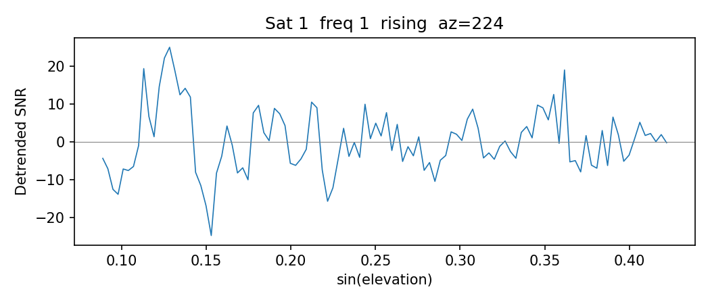
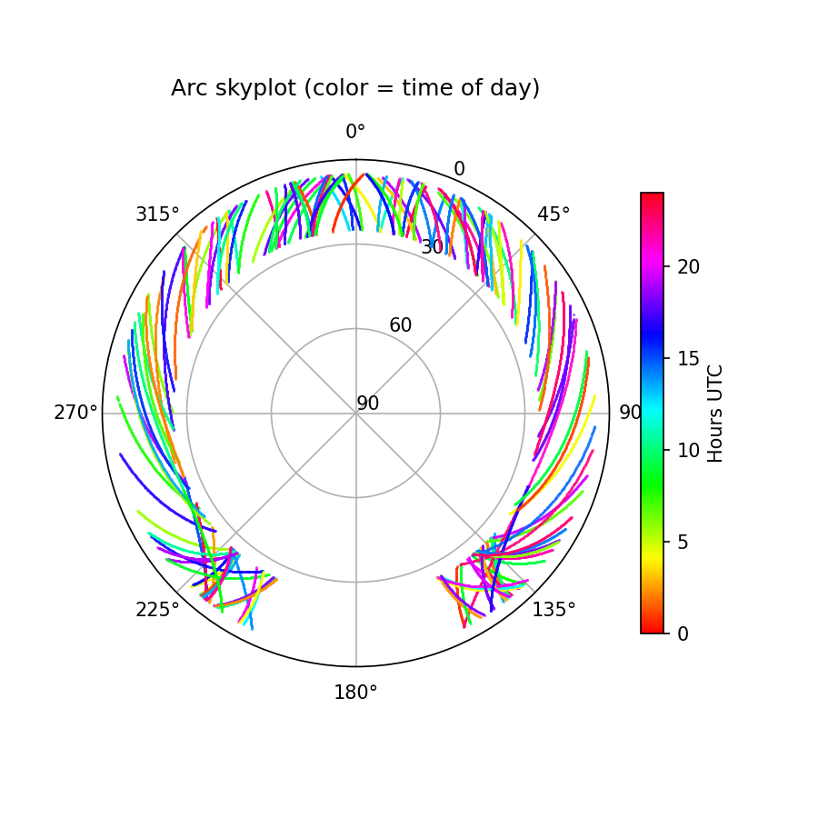
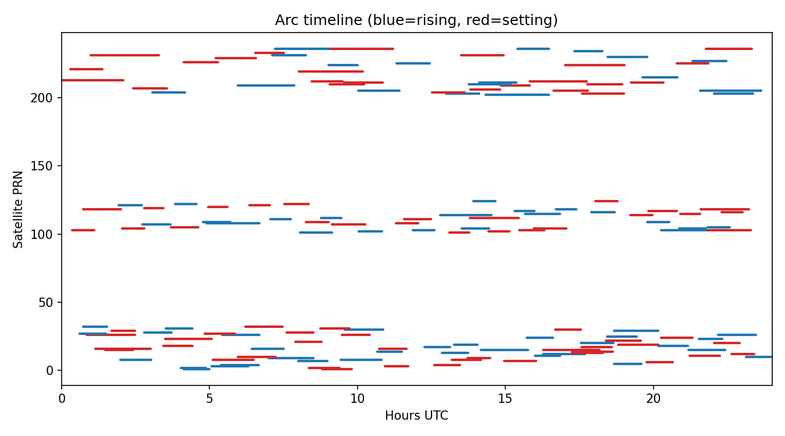
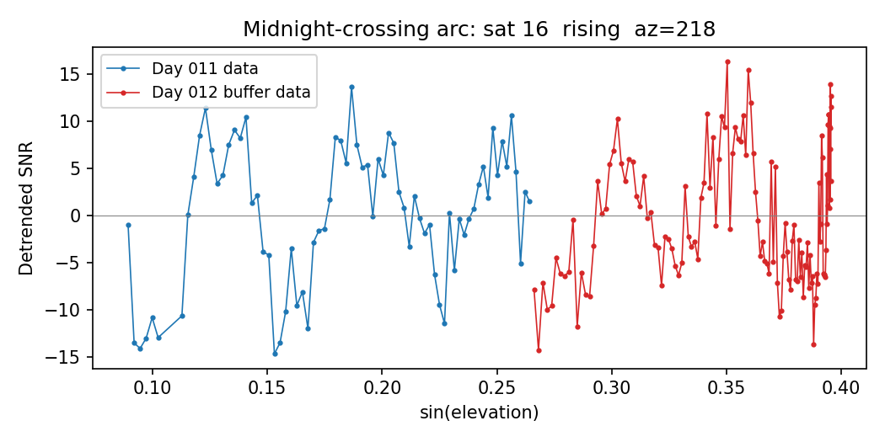

# Extracting Satellite Arcs (Python API)

## Overview

The `extract_arcs` module provides programmatic access to the individual
satellite arcs that underlie `gnssir` and `quickphase`. It returns each arc's
detrended SNR data and metadata as Python objects so you can inspect, filter, or
plot arcs in your own scripts.

Two convenience functions cover the most common workflows:

| Function | Use when you have... |
|----------|---------------------|
| `extract_arcs_from_station()` | a station name, year and day-of-year |
| `extract_arcs_from_file()` | a direct path to an SNR file |

Both handle file loading (and optional buffering of adjacent days) internally, so a
single call is all you need.

```{note}
The module also supports some modular processing flags (`split_arcs=False`,
`detrend=False`) used internally by the `phase` processing code. This page covers
the **gnssir defaults only**: `split_arcs=True`, `detrend=True`.
```

## Quick Start

```python
import numpy as np
from gnssrefl.extract_arcs import extract_arcs_from_station

# Extract arcs across all available frequencies
arcs = extract_arcs_from_station('mchl', 2025, 11)

print(f'{len(arcs)} arcs found')
for meta, data in arcs[:3]:
    print(f"  sat {meta['sat']:3d}  freq {meta['freq']:3d}  "
          f"{meta['arc_type']:7s}  az={meta['az_init']:5.1f}  "
          f"delT={meta['delT']:.1f} min  pts={meta['num_pts']}")
# 457 arcs found
#   sat 202  freq 206  rising   az=290.4  delT=128.0 min  pts=257
#   sat 203  freq 206  rising   az=219.8  delT=67.0 min  pts=135
#   sat 203  freq 206  setting  az=330.0  delT=84.0 min  pts=169
```

You can also request specific frequencies, or pass a path directly:

```python
arcs = extract_arcs_from_station('mchl', 2025, 11, freq=1)        # L1 only
arcs = extract_arcs_from_station('mchl', 2025, 11, freq=[1, 2, 5]) # L1+L2+L5

from gnssrefl.extract_arcs import extract_arcs_from_file
arcs = extract_arcs_from_file('/path/to/ssss0110.25.snr66')        # all frequencies
```

## Understanding the Output

`extract_arcs` returns a list of `(metadata, data)` tuples, one per arc.

### Metadata keys

| Key | Type | Description |
|-----|------|-------------|
| `sat` | int | Satellite PRN number |
| `freq` | int | Frequency code (1, 2, 5, 20, 101, 102, 201, 205, ...) |
| `arc_num` | int | Arc index within this satellite (1, 2, ...) |
| `arc_type` | str | `'rising'` or `'setting'` |
| `ele_start` | float | Minimum observed elevation angle (deg) |
| `ele_end` | float | Maximum observed elevation angle (deg) |
| `az_init` | float | Azimuth at lowest elevation (deg) |
| `az_avg` | float | Mean azimuth over the arc (deg) |
| `time_start` | float | Start time (seconds of day) |
| `time_end` | float | End time (seconds of day) |
| `arc_timestamp` | float | Mean time of arc (hours UTC) |
| `num_pts` | int | Number of data points |
| `delT` | float | Arc duration (minutes) |
| `edot_factor` | float | tan(e)/edot for RHdot correction (hours/rad) |
| `cf` | float | Scale factor = wavelength / 2 (meters) |

### Data keys

| Key | Type | Description |
|-----|------|-------------|
| `ele` | np.ndarray | Elevation angles (deg) |
| `azi` | np.ndarray | Azimuth angles (deg) |
| `snr` | np.ndarray | Detrended SNR (linear units, DC removed) |
| `seconds` | np.ndarray | Seconds of day |
| `edot` | np.ndarray | Elevation rate of change |

## Plotting Arc Data

Using the `arcs` from the Quick Start, select L1 arcs for plotting:

```python
import matplotlib.pyplot as plt

arcs = [(m, d) for m, d in arcs if m['freq'] == 1]
print(f'{len(arcs)} L1 arcs')
# 153 L1 arcs
```

### Plot 1: Detrended SNR vs sin(elevation)

This is the fundamental GNSS-IR observable. The interference pattern between the
direct and reflected signals oscillates at a frequency proportional to the
reflector height.

```python
meta, data = arcs[0]  # pick one arc
x = np.sin(np.radians(data['ele']))

fig, ax = plt.subplots(figsize=(7, 3))
ax.plot(x, data['snr'], linewidth=0.8)
ax.set_xlabel('sin(elevation)')
ax.set_ylabel('Detrended SNR')
ax.set_title(f"Sat {meta['sat']}  freq {meta['freq']}  "
             f"{meta['arc_type']}  az={meta['az_init']:.0f}")
ax.axhline(0, color='gray', linewidth=0.5)
fig.tight_layout()
fig.savefig('extract_arcs_snr.png', dpi=150)
```



### Plot 2: Polar skyplot colored by time of day

Shows spatial coverage and which azimuths are observed at each time of day.

```python
fig, ax = plt.subplots(subplot_kw={'projection': 'polar'}, figsize=(6, 6))
ax.set_theta_zero_location('N')
ax.set_theta_direction(-1)
norm = plt.Normalize(0, 24)

for meta, data in arcs:
    az_rad = np.radians(data['azi'])
    r = 90 - data['ele']          # radial axis = zenith angle
    color = plt.cm.hsv(norm(meta['arc_timestamp']))
    ax.plot(az_rad, r, '.', color=color, markersize=1, alpha=0.6)

ax.set_ylim(0, 90)
ax.set_yticks([0, 30, 60, 90])
ax.set_yticklabels(['90', '60', '30', '0'])
ax.set_title('Arc skyplot (color = time of day)', pad=15)

sm = plt.cm.ScalarMappable(cmap='hsv', norm=norm)
sm.set_array([])
fig.colorbar(sm, ax=ax, label='Hours UTC', shrink=0.7)
fig.savefig('extract_arcs_skyplot.png', dpi=150)
```



### Plot 3: Arc timeline

Shows when each satellite is observed and whether the arc is rising or setting.
This motivates the midnight-crossing discussion below.

```python
fig, ax = plt.subplots(figsize=(9, 5))
for meta, data in arcs:
    t0 = meta['time_start'] / 3600
    t1 = meta['time_end'] / 3600
    color = 'tab:blue' if meta['arc_type'] == 'rising' else 'tab:red'
    ax.plot([t0, t1], [meta['sat'], meta['sat']],
            color=color, linewidth=2, solid_capstyle='round')

ax.set_xlabel('Hours UTC')
ax.set_ylabel('Satellite PRN')
ax.set_xlim(0, 24)
ax.set_title('Arc timeline (blue=rising, red=setting)')
fig.tight_layout()
fig.savefig('extract_arcs_timeline.png', dpi=150)
```




## Midnight-Crossing Arcs

SNR files cover one UTC day. Arcs in progress at midnight get split across two
files and are usually too short to pass QC. Pass `buffer_hours=2` to
automatically load adjacent-day data with shifted time tags (previous day gets
negative seconds, next day exceeds 86400). Adjacent-day files are located by
name from the standard `$REFL_CODE/{yyyy}/snr/{station}/` directory; a warning
is printed if either neighbour is missing.

```python
from gnssrefl.extract_arcs import extract_arcs_from_file

# With buffer: midnight arcs recovered
arcs = extract_arcs_from_file(obsfile, freq=1, buffer_hours=2)

# Find a midnight-crossing arc and plot it
for meta, data in arcs:
    secs = data['seconds']
    if np.any(secs > 86400):  # has next-day buffer data
        main = secs <= 86400
        buf = ~main
        x = np.sin(np.radians(data['ele']))
        plt.plot(x[main], data['snr'][main], 'o-', ms=2, lw=0.8, label='Day N')
        plt.plot(x[buf], data['snr'][buf], 'o-', ms=2, lw=0.8, label='Day N+1 buffer')
        plt.legend(); plt.xlabel('sin(elevation)'); plt.ylabel('Detrended SNR')
        break
```



When processing consecutive days with `buffer_hours`, `filter_to_day=True`
(the default) prevents double-counting by only returning arcs whose midpoint
falls within 0-24 hours UTC.

## Parameters Reference

The most commonly used parameters. All keyword arguments below can be passed to
`extract_arcs_from_station()`, `extract_arcs_from_file()`, or `extract_arcs()`.

| Parameter | Default | Description |
|-----------|---------|-------------|
| `freq` | None (all) | GNSS frequency code: int, list of int, or None for auto-detect |
| `e1` / `e2` | 5.0 / 25.0 | Elevation angle mask (deg) |
| `ellist` | None | Multiple elevation ranges (overrides e1/e2) |
| `azlist` | [0, 360] | Azimuth regions as pairs |
| `sat_list` | None (all) | Restrict to specific satellite PRNs |
| `min_pts` | 20 | Minimum points per arc |
| `ediff` | 2.0 | Elevation span tolerance for QC (deg) |
| `polyV` | 4 | Polynomial order for DC removal |
| `filter_to_day` | True | Only keep arcs with midpoint in 0-24 h |
| `screenstats` | False | Print debug information |

## Advanced: Working with Raw Arrays

If you already have SNR data as a numpy array (e.g. from custom loading or
testing), you can call `extract_arcs()` directly:

```python
from gnssrefl.extract_arcs import extract_arcs

arcs = extract_arcs(snr_array)                        # all frequencies
arcs = extract_arcs(snr_array, freq=1, e1=5, e2=25)  # L1 only
```

The array must have columns: `[sat, ele, azi, seconds, edot, snr_col1, ...]`.
This is the same format returned by `read_snr()` and `np.loadtxt()` on an SNR
file.
