# Files, Formats, Frequencies

## Environment Variables

You need three environment variables to run 
this code: REFL_CODE, ORBITS, and EXE. If you are using 
the jupyter notebooks or the docker, they are defined for you. 

If you are working with pypi or github clone install, you must define them EVERY TIME YOU USE THE CODE.
This is most easily done by setting them in your setup script, which on my machine is called .bashrc.

If you are working with the docker, these should all be set up for you. But knowing that they 
exist can be helpful in looking for files, etc.

## How do I collect my own GNSS data?

We do not have instructions in this software package for how you can operate your own receiver 
for GNSS-IR. Currently we need you to save your observation data as Rinex 2.11, Rinex 3, or 
NMEA formats (see below). At a minimum you **must** save the SNR data; we strongly urge 
you to track/save **modern GPS signals**, whicha are L2C and L5. If you have multi-GNSS capabilities,
we strongly encourage you to use them. And never use an elevation mask on your receiver. They are 
completely unncessary for positioning (which allows masking to be done at the software level) and 
are extremely harmful to GNSS-IR.

## Where should I store station coordinates? 

The software comes with a long list (almost 20,000) of station coordinates 
taken from the University of Nevada Reno. If you are analyzing data from any of 
those stations, you should not have to enter
any coordinates (Note: you can use **query_unr** to see if your station 
is included in the UNR database). 

If you are analyzing your own data, eventually you will need to tell the software 
where your stations are. This location does not have to be super precise, within a few meters
is perfectly acceptable, as it is primarily used for the refraction correction. The better your
site coordinates, the better your reflection zone maps would be, however. Previously you 
input this information (latitude, longitude, and ellipsoidal height) when you set your analysis strategy in **gnssir_input**. 

As of version 3.6.4, there is now another 
option. If you create a plain txt file with the name llh_local.txt and store it 
in the $REFL_CODE/input directory, the code will
use this as your *a priori* station coordinates. The format of this 
file for **each line** should have four entries with spaces between them.  These entries
are the four character station name, the latitude, the longitude, and ellipsoidal height.
The units of the last four are degrees, degrees, and meters. Example for a station called **xxxx**:

<PRE>
xxxx 39.949492 -105.194266 1728.856
</PRE>

You can add comment lines to the file with a percent sign.
This file is read in the <code>query_coordinate_file</code> function found in gps.py. The local coordinate 
file is read by <code>nmea2snr</code>. This means you no longer have to enter station coordinates on 
the command line when using that code. 

## How do I analyze my own GNSS data?

To analyze your own GNSS data you must comply with the software expectations for how the 
files should be named. The naming conventions for GNSS observation files are given in the next section.
You are always better off to use lowercase for Rinex 2.11. For RINEX 3 we follow the convention of the 
GNSS archives, where the first part is upper case and the stem is lower.


If you are working with the docker, I have made some notes in the [docker install section](docker_cl_instructions.md) 
that might be helpful to you about where to store your files.

If you are working with git clone or pypi install, you should be able to have the RINEX files 
in the directory you are currently working in. Or you should put them in the rinex directory as defined 
below in the *Where Files are Stored* section, i.e. $REFL_CODE/YYYY/rinex/abcd where abcd is the station name. 

Examples are given in the [rinex2snr code](https://gnssrefl.readthedocs.io/en/latest/api/gnssrefl.rinex2snr_cl.html).
Documentation can always be improved, so if you would like to add more examples or find the 
current documentation confusing, please submit a pull request.
If you don't know how to read the documentation, I suggest you try typing <code>rinex2snr -h</code>. You will
notice that there is an option called <code>nolook</code>. **You have to set this to True.** 

Example  <code>rinex2snr p041 2025 191 -nolook T</code> will look on your coputer for a RINEX 2.11 file
called p0411910.25o. It might look for the Hatanaka compressed file too - I can't remember.

You are telling the code
not to look for the data at an archive. Perhaps that is not the best name for an option, but that is what it is.
If you don't say -nolook T, it will think you want a file in a global GNSS archive and well, it won't find it if you have
the only copy of your data.

If you are using the gnssrefl notebooks, unfortunately no notebook was 
developed by [Earthscope](https://earthscope.org) for this option. I am unable to provide you with any
assistance. If you would like to share such a notebook as a PR, that would be great.

If you have questions about converting NMEA files, the best I can offer is that you read
the next section on that specific format. The command is <code>nmea2snr</code>.

Many file conversion programs produce orbit files as well as observation files. These orbit files
are unnecessary in this software package. The code is set up to find the appropriate orbit files for you.


## GPS/GNSS Observation Data Formats

Please keep in mind that there are multiple issues here:

- Are your observation files stored in what gnssrefl considers to be a compliant format?

- Are your observation files properly named?  

- Are your observation files stored where the code expects to find them?

- Do your observation files include the data we need for GNSS-IR (the SNR observables)

- Did you compress you file in some way - and does gnssrefl recognize this kind of compression?
(Hatanaka, gzip, Z, etc etc)

Unfortunately all of these issues come into play, and it can be confusing 
to figure out where the problem is. We have tried as best we can to make screen
output that will help you with your problem.

Input observation formats: the code only 
recognizes [RINEX 2.11](https://www.ngs.noaa.gov/CORS/RINEX211.txt), 
[RINEX 3](https://files.igs.org/pub/data/format/rinex303.pdf) 
and [NMEA](https://www.gpsworld.com/what-exactly-is-gps-nmea-data/) input files.

### RINEX 2.11

*We strongly prefer that you use lower case filenames.* I cannot promise you 
that the code will find files that are stored in uppercase. Lowercase filenames are the standard at global archives.
They must have SNR data in them (S1, S2, etc) and have the receiver coordinates in the header.
The files should follow these naming rules:

- all lowercase
- station name (4 characters) followed by day of year (3 characters) then 0.yyo where yy is the two character year.
- Example: algo0500.21o where station name is algo on day of year 50 from the year 2021

It is also standard to use the Hatanaka files. Instead of ending in an o the Hatanaka files end in a d.

Example filename : onsa0500.22d

We also generally allow two kinds of compression, unix compression and gzip:

Unix compression example filename : onsa0500.22d.Z

gzip example filename : onsa0500.22o.gz

We do not make any effort to find files with the zip ending. If your files have this ending,
you must unzip them before running gnssrefl.


### RINEX 3

While we support RINEX 3 files, we do not read the RINEX 3 
file itself - we rely on the <code>gfzrnx</code> 
utility developed by Thomas Nischan at GFZ to translate from RINEX 3+ to RINEX 2.11
If you have RINEX 3 files, they should be all upper case (except for the extension rnx or crx).

Example filename: ONSA00SWE_R_20213050000_01D_30S_MO.rnx

* station name (9 characters where the last 3 characters are the country), underscore
* capital R or capital S , with underscore on either side
* four character year
* three character day of year
* four zeroes, underscore,
* 01D, underscore
* ssS, underscore, M0.
* followed by rnx (crx if it is Hatanaka format). Note: these are lowercase

01D means it is one day. Some of the other parts of the very long station file name are no
doubt useful, but they are not recognized by this code. By convention, these files may be
gzipped but not unix compressed. If you want a 
generic translation program, you can try <code>rinex3_rinex2</code>.
It has the requirement that you input the input and output RINEX file names.

For a few archives, we allow 1 sample per second files. Following the protocol of the 
IGS, these files are unfortunately 15 minutes long, which means **you have to download
96 of them.** UNAVCO/Earthscope is much more sensible about providing 1 sample per second files,
and returns a single file, at least for the RINEX 2.11 format.  

If you want the code to be able to find those highrate files, you must tell the code you 
want to use the -rate high files and provide -samplerate 1. Why two inputs?  Because the 
-rate high option tells the code to look in a particular folder. The samplerate is related
to the name of the file itself.  

Recently the IGS and its sister archives have started making a single tar file of 
the 96 daily files after six months.
gnssrefl now allows access to these older data from CDDIS and BKG.

Please see the rinex2snr documentation page for more examples.

### NMEA

NMEA formats can be translated to SNR using <code>nmea2snr</code>.
Inputs are similar to that used by rinex2snr: the 4char station name, the year, and day of year.
NMEA files are assumed to be stored as:

$REFL_CODE + /nmea/ABCD/2021/ABCD0030.21.A

for station ABCD in year 2021 and day of year 3.

NMEA files may be gzipped.

This is different than the file structure we used for RINEX files and is entirely due to the wishes of the 
people that contributed this code. If you would like the code to also allow a traditional
folder location ($REFL_CODE/2021/nmea/abcd or $REFL_CODE/2021/nmea/ABCD), I am fine with that. I ask 
that you please submit a pull request.

Additional information about nmea2snr [is in the code.](https://gnssrefl.readthedocs.io/en/latest/api/gnssrefl.nmea2snr_cl.html)

## ORBITS

We have tried our best to make the orbit files relatively invisible to users.
But for the sake of completeness, we are either using broadcast navigation files in the RINEX 2.11 format
or precise orbits in the sp3 format. If you have nav files for your station, we recommend you delete them.
They are not useful in this code.

The main things you need to know:

- if your files only have GPS data in them, there is no need to use multi-GNSS SP3 files. Flag -nav T

- if your files are multi-GNSS, the best option is gnss, which are final orbits. This is complicated for 
older data. Those files are reliably available from 2023. And they cover the four main constellations.  
My current default is rapid GNSS - but that does not always have Beidou in it. 

- we also have ultra-orbit options, which are appropriate for real-time users. I cannot keep track of 
what ultra products are working. You can try ultra, wum, and wum2. The first is from GFZ 
and the latter two are from Wuhan. The second file comes from Wuhan directly while the first (I believe)
comes from the one stored at CDDIS.

## EXECUTABLES

There are two key executables: CRX2RNX and gfzrnx. For notebook and docker users, these 
are installed for you.  pypi/github users must install them. The utility <code>installexe</code>
should take care of this. They are stored in the directory defined by the EXE environment variable.
We used to support the use of teqc but as Earthscope no longer provides technical support for it, 
we have mostly eliminated it.

## Where Files are Stored

File structure for station abcd in the year YYYY (last two characters YY), doy DDD:

- REFL_CODE/input/abcd.json - instructions for gnssir analysis, refraction files

- REFL_CODE/YYYY/snr/abcd/abcdDDD0.YY.snr66  - SNR files 

- REFL_CODE/YYYY/rinex/abcd/  - RINEX files of various flavors can be stored here

- REFL_CODE/YYYY/results/abcd/DDD.txt  Lomb Scargle analysis goes here

- REFL_CODE/YYYY/phase/abcd/DDD.txt  phase analysis 

- REFL_CODE/Files/ - various output files and plots will be placed here. For water levels, 
everything is stored with an additional folder with the station name

- ORBITS/YYYY/nav/autoDDD0.YYn - GPS broadcast orbit file

- ORBITS/YYYY/sp3/ - sp3 files of orbits - these use names from the archives.

The RINEX files downloaded from archives are not stored by this code. Or at least not deliberately. 
If they are being translated, they are deleted. 

If translating your own files, you should take care to not keep your only copy in your default directory.
If they are stored in $REFL_CODE/YYYY/rinex/abcd you will be fine.

You do not need precise orbits to do GNSS-IR. We only use them as a convenience.
Generally we use multi-GNSS sp3 files. See the <code>rinex2snr</code> documentation for more details on 
the orbits you can use. 

Some of the utilities and environmental products code store files in REFL_CODE/Files
The locations of these files are always provided in the screen output.

The inputs to <code>gnssir</code> are generally stored in the REFL_CODE/input folder.
This primarily means the Lomb Scargle data analysis inputs, i.e. 
the "json" files, e.g. p041.json for station p041.
It also includes the refraction file (p041_refr.txt) that is 
created automatically. This calculation 
requires a set of parameters stored in a "pickle" format, gpt_1wA.pickle. 
This file should be automatically stored for you.

## The SNR data format

**Reminder:** UTC does not exist in our world. Everything should be GPS time, which is
UTC without leap seconds. 

The snr options are mostly based on the need to remove the "direct" signal. This is
not related to a specific site mask and that is why the most frequently used
options (99 and 66) have a maximum elevation angle of 30 degrees. The
azimuth-specific mask is decided later when you run **gnssir**.  The SNR choices are:

- 66 is elevation angles less than 30 degrees (**this is the default**)
- 99 is elevation angles of 5-30 degrees
- 88 is all data
- 50 is elevation angles less than 10 degrees (good for very tall sites, high-rate applications)

66,99, etc are not good names for files. And for this I apologize. It is too late to change them now.

The columns in the SNR data are defined as:

- Satellite number (remember 100 is added for Glonass, 200 for Galileo etc)
- Elevation angle, degrees
- Azimuth angle, degrees
- **Seconds of the day, GPS time**
- elevation angle rate of change, degrees/sec.
-  S6 SNR on L6
-  S1 SNR on L1
-  S2 SNR on L2
-  S5 SNR on L5
-  S7 SNR on L7
-  S8 SNR on L8

The unit for all SNR data is dB-Hz.

## GNSS frequencies

- 1,2,20, and 5 are GPS L1, L2, L2C, and L5 

- 101,102 are Glonass L1 and L2

- 201, 205, 206, 207, 208: Galileo frequencies, which are
set as 1575.420, 1176.450, 1278.70, 1207.140, 1191.795 MHz

- 302, 306, 307 : Beidou frequencies, defined as 1561.098, 1207.14, 1268.52 MHz


## Additional files 

- EGM96geoidDATA.mat is stored in REFL_CODE/Files
- station_pos2024.db is stored in REFL_CODE/Files. This is an updated compilation of station coordinates from Nevada Reno.
- gpt_1wA.pickle is stored in REFL_CODE/input. This file is used in the refraction correction.
- GPSorbits_21sep17.txt, GALILEOorbits_21sep17.txt, etc are stored in REFL_CODE/Files. These are used for refl_zones and max_resolve_RH
- leapsecond file, ONLY for nmea2snr, REFL_CODE/Files/leapseconds.txt

## Some comments about signals

### GPS L2C

Why do I like L2C? What's not to like? It is a modern **civilian** code without high chipping rate.
That civilian part matters because it means the receiver knows the code and thus
retrievals are far better than a receiver having to do extra processing to 
extract the signal. Here is an example of a receiver that is tracking **both** L2P and L2C.
Originally installed for the Plate Boundary Observatory, it is a Trimble. The archive 
(unavco) chose to provide only L2P in the 15 second default RINEX file.
However, it does have the L2C data in the 1 second files. So that is how I am able to make 
this comparison.  P038 is a very very very flat site.

Here are the L2P retrievals:

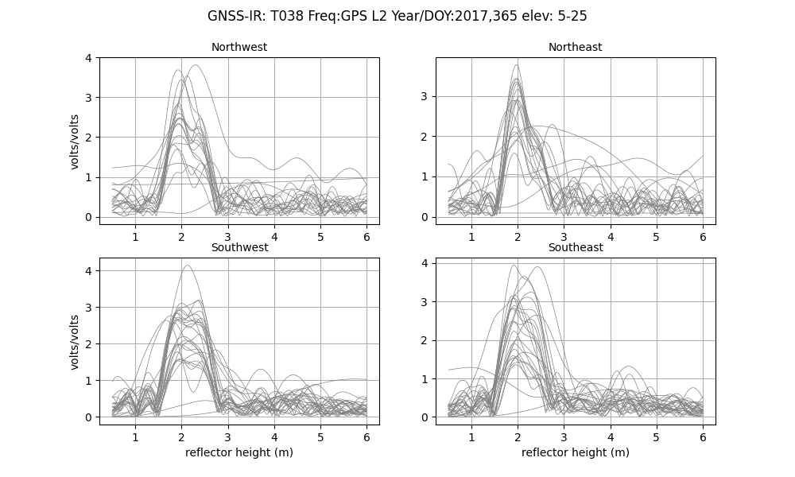

Now look at the L2C retrievals.

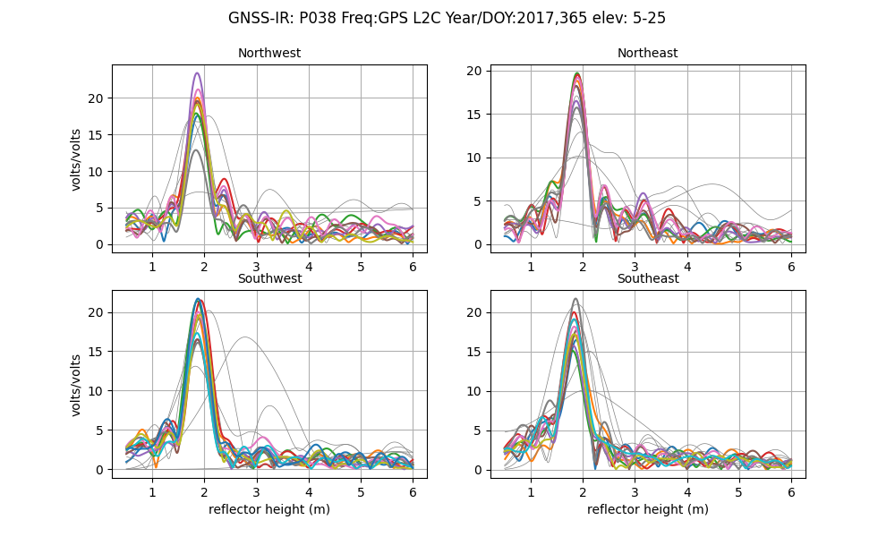

If you were trying to find a periodic signal, which one would you want to use?

To further confuse things, when the receiver was updated to a Septentrio, unavco began
providing L2C data in the default 15 second files. This is a good thing - but it is confusing
to people that won't know why the signal quality improved overnight.

L2C is easy to extract from RINEX 3 files - and that is what is done by <code>rinex2snr</code>. However,
I do not make the same restriction for RINEX 2.11 files.  In principle I could, but for now, I translate
all L2 signals in a RINEX 2.11 file. When you subsequently chose L2C (frequency 20) in <code>gnssir</code>, you will
be given results for all GPS satellites that could be L2C. The list of L2C transmitting satellites is found
in the gps.py library.

### GPS L5

Another great signal.  I love it. It does have a high chipping rate, which is 
relevant (i.e. bad) for reflectometry from very tall sites.

### Aliasing

While it will show up in GPS results too - there seems to be a particularly
bad problem with Glonass L1.  I used an example from Thule. The RH is significant -
~20 meters. So you absolutely have to have at least 15 sec at the site or you violate
the Nyquist. Personally I prefer to use 5 sec - which means I have to download
1 sec and decimate. This is extremely annoying because of how long it takes to 
ftp those files to my local machine. Let's look at L1 solutions using a 5 second file - 
but where I invoke the -dec option for gnssir. That way I can see the impact of the sampling.
I also using the -plt T option. 

This is 5 second GPS L1.

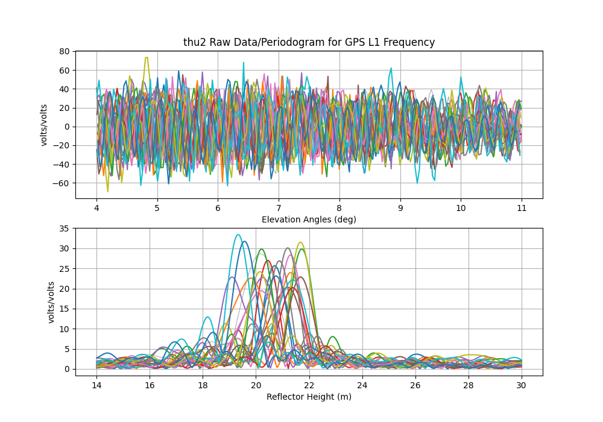

This is 15 second GPS L1. You see some funny stuff at 30 meters, and yes, the periodograms
are noisier. But nothing insane.

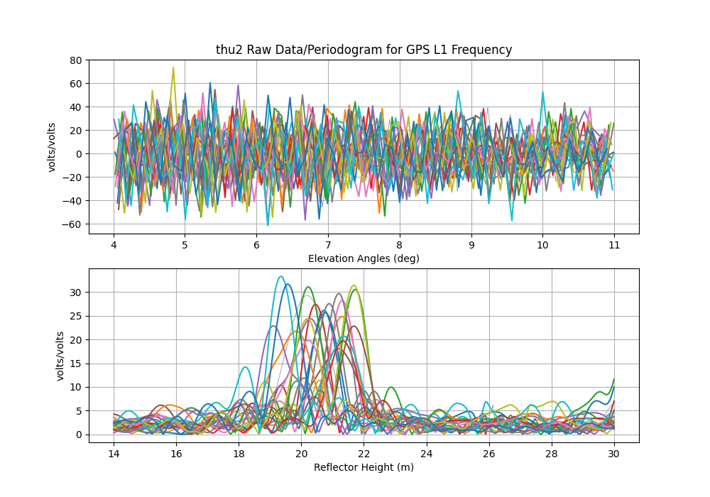

Now do 5 second Glonass L1

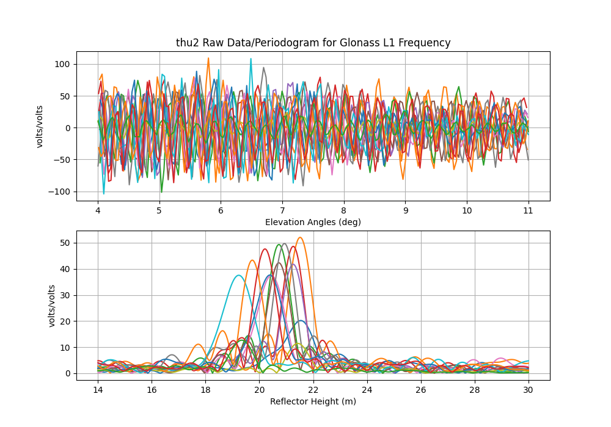


Contrast with the Glonass L1 results using 15 sec decimation!
So yeah, aliasing is a problem.

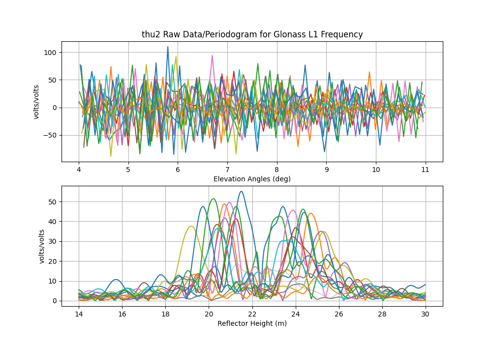


### E5

Now about RINEX L8 ... also known as E5. This is one of 
the new Galileo signals. Despite the fact that it is near
the frequencies of the other L5 signals, it is **not** the 
same. You can see that 
it in the multipath envelope work of Simsky et al. shown below.

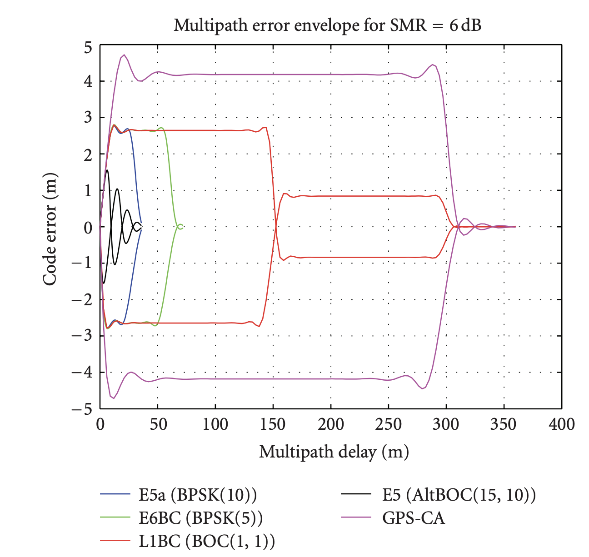

Most of you will not be familiar with multipath envelopes - 
but for our purposes, we want those envelopes to be big - cause
more multipath, better GNSS-IR. First thing, multipath delay 
shown on the x-axis is NOT the reflector height (RH).  it is 
2*RH*sin(elevation angle). So even a pretty tall RH will not 
be obstructed by the new Galileo codes except for E5.


This is E5a

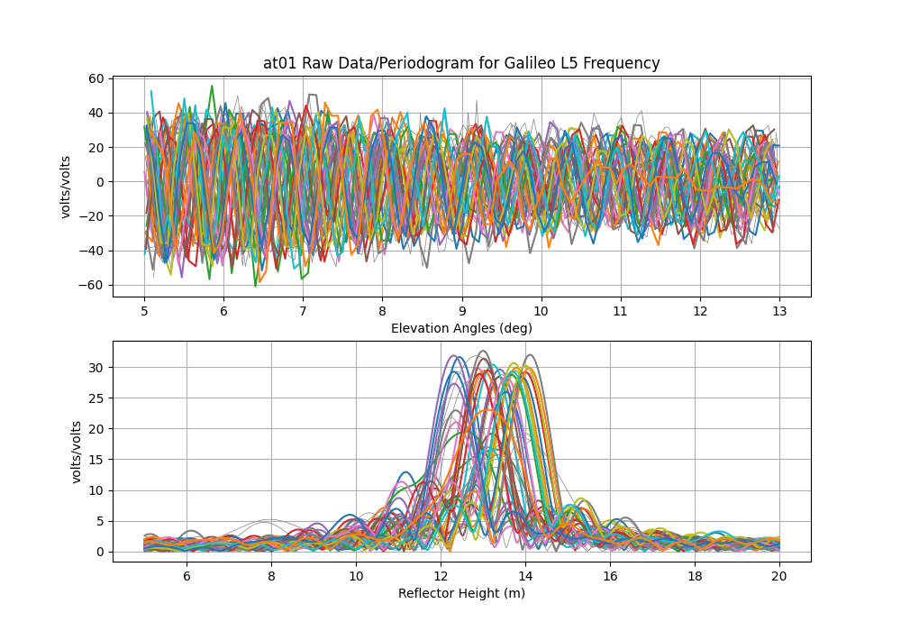

This is E5. Note that instead of nice clean peaks, it is 
spread out. You can also see that the E5 retrievals degrades as elevation angle increases,
which is exactly what you would expect with the multipath delay 
increasing with elevation angle. I would just recommend only using
this signal for RH < 5 meters. And even then, if you are tracking
L8, you probably also have L5, L6, and L7, so there is not a ton gained 
by also using L8.

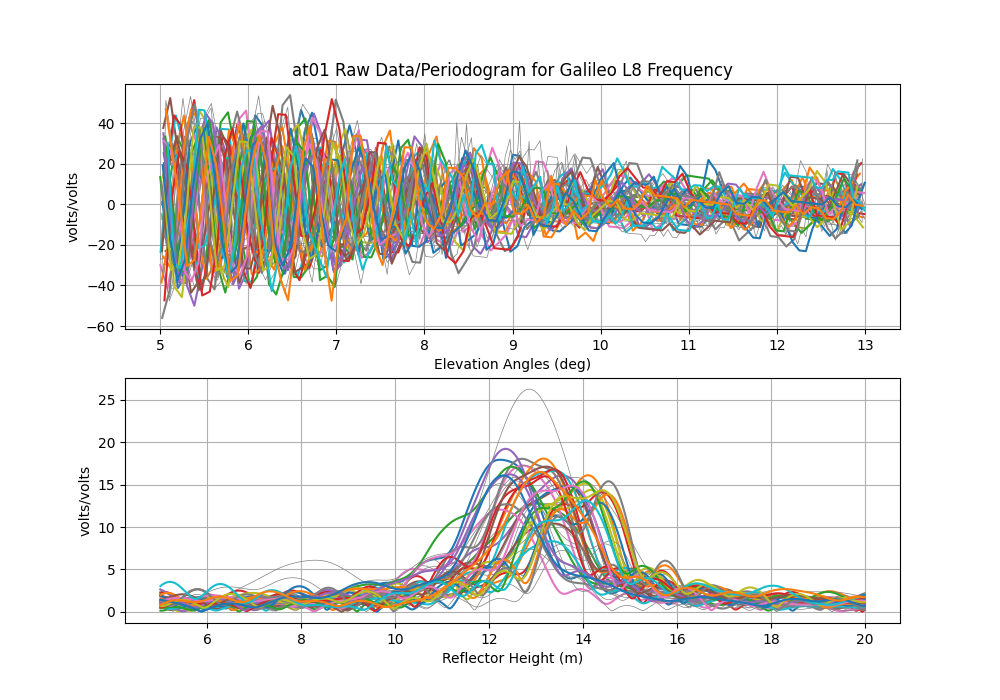


###  L1C

The Trimble Alloy receiver at Mitchell (MCHL) in Australia records both legacy L1 and modern L1C signals, which are available in the daily RINEX 3 files. RINEX 3 names the legacy signal "L1C" and the modern signal "L1X" (the SNR observables are thus "S1C" and "S1X"). RINEX 2 does not support both signals simultaneously, so two separate files must be created. For example, using gfzrnx:

```
gfzrnx -finp FILE.rnx -fout OUTPUT_L1C.rnx -ot S1C -vo 2
gfzrnx -finp FILE.rnx -fout OUTPUT_L1X.rnx -ot S1X -vo 2
```

These files can be renamed and processed using rinex2snr/gnssir. First, the legacy results for MCHL 2023/day 1:

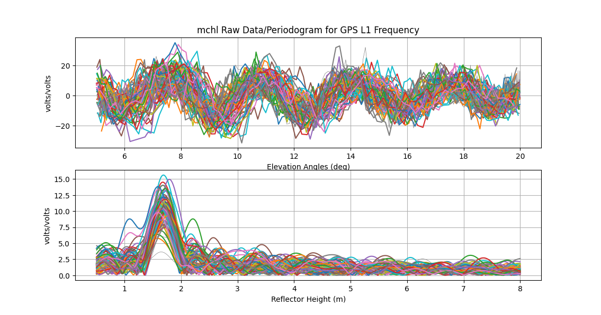

And the modern signal results, showing marginally higher peaks in the LSP: 

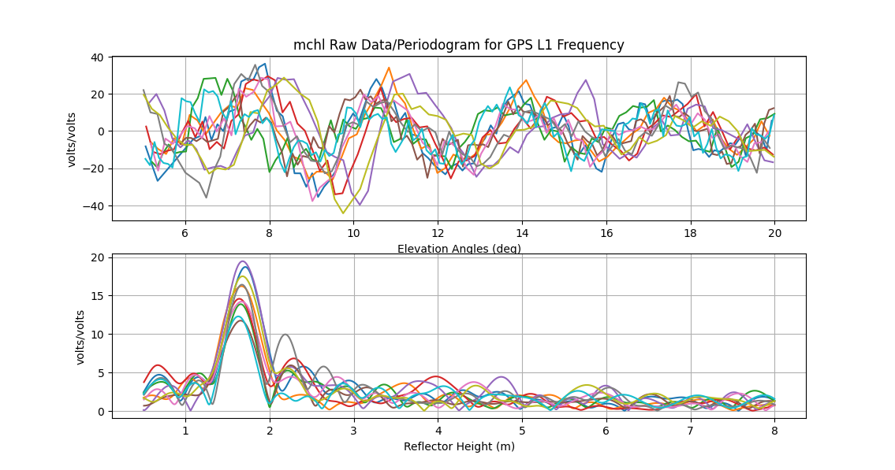

There is less data for L1X as the modern signal is only broadcast by Block III satellites, of which there are currently only 10 (in Feb 2025).  

<HR>

The multipath envelope figure is taken from:

Title: Experimental Results for the Multipath Performance of Galileo 
Signals Transmitted by GIOVE-A Satellite

Authors: Andrew Simsky,David Mertens,Jean-Marie Sleewaegen,
Martin Hollreiser, and Massimo Crisci

International Journal of Navigation and Observation 
Volume 2008, DOI 10.1155/2008/416380

