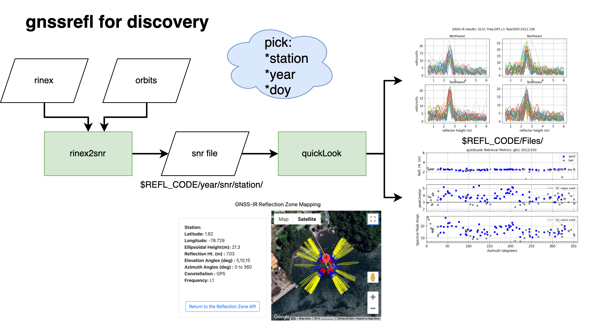

# Workflow
*Descriptions of Key Functions and Utilities*
### gnssrefl Processing
#### [rinex2snr()](../pages/rinex2snr.md) 
translating GNSS Data (RINEX, NMEA)
#### [quickLook() ](../pages/quickLook.md) 
assessing a GNSS site using SNR files
#### [gnssir() ](../pages/gnssir.md) 
estimating reflector heights from SNR data

### gnssrefl Products
#### [daily_avg() ](../pages/README_dailyavg.md) 
daily average reflector heights
#### [subdaily() ](../pages/README_subdaily.md) 
LSP quality control and RHdot for reflector height estimates
#### [invsnr() ](../pages/README_invsnr.md) 
SNR inversion for subdaily reflector height estimates

### gnssrefl [Utilities](../pages/utilities.md) 
Additional useful functions

