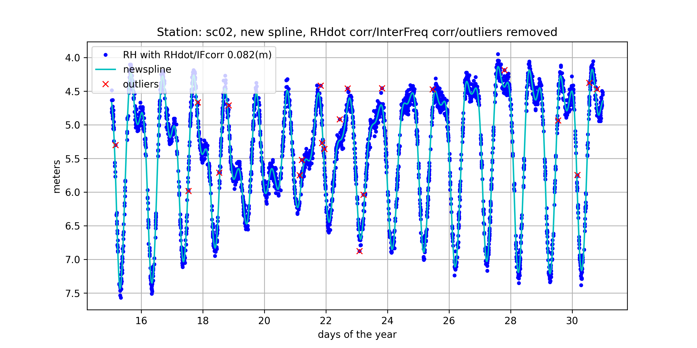

#####################################################
2023 Short Course on GNSS-IR
#####################################################

`Documentation <https://gnssrefl.readthedocs.io/en/latest/index.html>`_ |
`KL Videos <https://www.youtube.com/@funwithgps/videos>`_ |
`Course Materials <https://gnssrefl.readthedocs.io/en/latest/pages/sc_media.html>`_ |
`Installation <https://gnssrefl.readthedocs.io/en/latest/pages/README_install.html>`_ |
`Earthscope <https://www.earthscope.org/event/2023-gnss-ir-short-course/>`_ |

Agenda
======
**May 2.** Basic principles of GNSS-IR, How to run the gnssrefl software

**May 3.** Hydrologic Applications: snow accumulation and soil moisture

**May 4.** Water applications: lakes, rivers, tides

**May 5:** Optimizing site installations, GNSS-IR API, improving the software, low-cost sensors

The course meets each day from 09:00-11:00 MDT/17:00-19:00 CET. There will be a short break at the midpoint.

Before the Class Begins
=======================
`Getting Started <https://gnssrefl.readthedocs.io/en/latest/pages/sc_precourse.html>`_

Questions
=========
For software installation questions, please use our Slack channel. 
`To join please use this link <https://join.slack.com/t/23-gnss-irshortcourse/shared_invite/zt-1tbf5eh5i-HSoFhlSaSV8RwIV8TrZ0TA>`_

Videos
======
`Some older videos <https://www.youtube.com/@funwithgps/videos>`_ about GNSS-IR are already available. 

`Welcome video posted April 19 <https://www.youtube.com/watch?v=yijolYWXSQc>`_

`Links to the lectures materials and the videos <https://gnssrefl.readthedocs.io/en/latest/pages/sc_media.html>`_ 

Sponsors
========
`Collaborative Research Center 1502 DETECT, Bonn University <https://sfb1502.de>`_

EarthScope

Course Instructors
==================
Kristine Larson, Bonn University, Germany

Simon Williams, Nat. Ocean Ctr.- United Kingdom

Felipe Nievinski, Uni. Federal do Rio Grande do Sul - Brazil

David Purnell,Laval University - Canada

Thomas Nylen, Danish Technical University, Denmark

Kelly Enloe, EarthScope - USA

Tim Dittmann, EarthScope - USA

