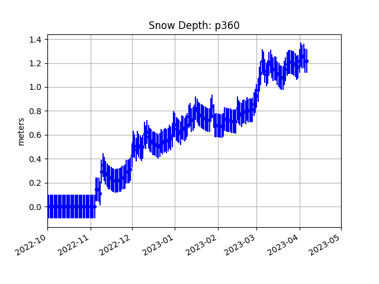

#####################################################
2023 GNSS Interferometric Reflectometry Short Course
#####################################################
May 2-5, 2023 Virtual Short Course.

`Earthscope Registration/Course page <https://www.earthscope.org/event/2023-gnss-ir-short-course/>`_ |
`Software documentation <https://gnssrefl.readthedocs.io/en/latest/index.html>`_ |
`Software installation <https://gnssrefl.readthedocs.io/en/latest/pages/README_install.html>`_

.. toctree::
   :maxdepth: 1

   sc_precourse.md

  
Agenda:
=======
**May 2.** Basic principles of GNSS-IR, How to run the gnssrefl software

**May 3.** Hydrologic Applications: snow accumulation and soil moisture

**May 4.** Water applications: lakes, rivers, tides

**May 5:** Site installations: optimizing deployment of geodetic and low-cost sensors.  Contributing to gnssrefl.

Pre-course Work:
================
:doc:`sc_precourse.md`

Questions:
==========
For installation questions, please join the slack channel [here](#todo insert slack link).

For methodology-related questions, please email instructors or better still post a [GitHub issue](https://github.com/kristinemlarson/gnssrefl/issues).

