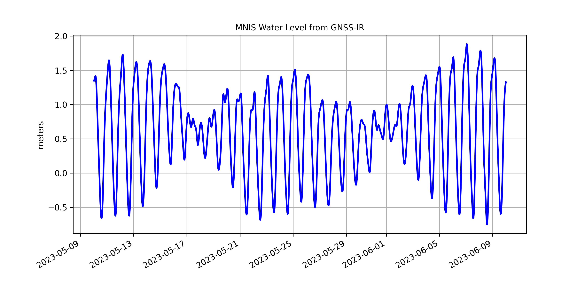

#########################################################
2024 Short Course on GNSS-IR for Water Level Measurements
#########################################################

Registration is Closed
======================

Agenda
======
**March 6** Basic principles of GNSS-IR, How to run the gnssrefl software

**March 7** Using gnssrefl for Water Level Measurements: Lakes, Rivers, Tides

The course meets each day from 12:00-14:00 Central European Time. 

There will be a short break at the midpoint.

Before the Class Begins
=======================
`Install gnssrefl <https://gnssrefl.readthedocs.io/en/latest/pages/README_install.html>`_

`Beginner with GNSS-IR and python <https://gnssrefl.readthedocs.io/en/latest/use_cases/use_mchn.html>`_ try this

`If you are familiar with GNSS-IR and python installs <https://morefunwithgps.com/public_html/gps_toolbox/SupplementFeb26.pdf>`_ try this

`Some comments from the last short course <https://gnssrefl.readthedocs.io/en/latest/pages/sc_precourse2024.html>`_

Lecture Material
================

`Links to videos and lecture files <https://gnssrefl.readthedocs.io/en/latest/pages/sc_media2024.html>`_ 

Sponsor
=======
`Collaborative Research Center 1502 DETECT, Bonn University <https://sfb1502.de>`_

Course Instructors
==================
Kristine M. Larson, Bonn University, Germany

Simon Williams, National Oceanography Centre, United Kingdom

Felipe Nievinski, Uni. Federal do Rio Grande do Sul, Brazil

Summary Paper
=============
`More information on measuring water levels using gnssefl <https://ihr.iho.int/wp-content/uploads/2023/11/IHR-29-2-A30.pdf>`_

Interested in Sponsoring a GNSS-IR Short Course?
================================================
It takes support from our GNSS-IR community members to offer short courses.  
If you are interested to have a short course on the gnssrefl 
software and a specific application, it is important that you find  
people that are willing to help teach it. Please feel free to contact
Kristine Larson if you are interested in pursuing this.

GNSS-IR e-mail list
===================
If you would like to receive e-mail about GNSS-IR and gnssrefl software updates please
contact Kristine Larson.

