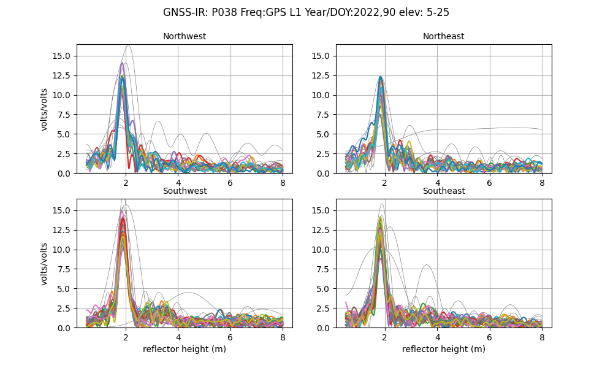
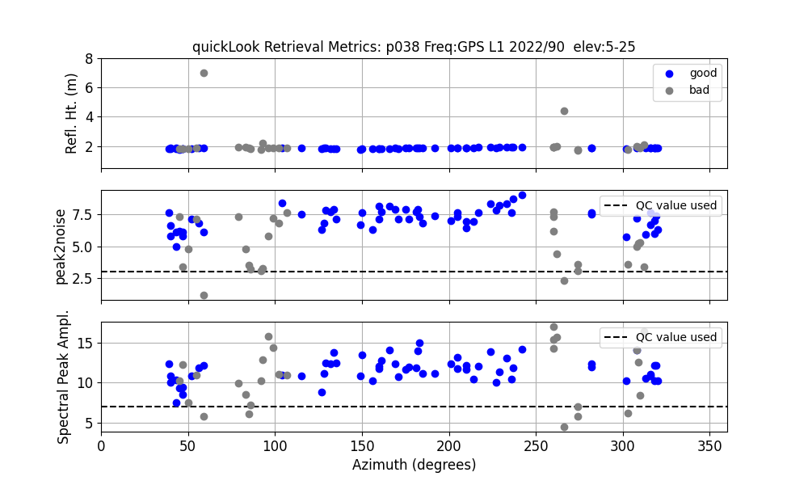

# Pre-course Activities

**October 9, 2024: Please note that our software is being continuously updated. Thus some of these
instructions and activites may be out of date (such as required python version).
[Support for Jupyter notebooks](https://github.com/kristinemlarson/gnssrefl/blob/master/README.md) 
has been officially deprecated as of October 2024.

While it is possible to simply listen to the lecturers in the short 
course, we think that this is a far better learning experience if 
you are able to follow along with the examples. And for this we recommend the following:

## Getting Started 

- [Sign up for an Earthscope account](https://data-idm.unavco.org/user/profile/login)

- Join the slack channel. Use the link from the course invite.

- Install the software. We have 
[installation instructions](https://gnssrefl.readthedocs.io/en/latest/pages/README_install.html) 
for three different ways to access our code. 

  - The github or pypi install requires you are running linux and 
have python >= 3.9 on your system and feel comfortable
installing python packages.  

  - Dockers. Windows users should use this path, but it is also a good way 
for mac and linux users that don't want to install python and/or 
manage dependencies or environment variables.

  - Jupyter notebooks. This is another great way for people that are unfamiliar 
with python to access the code. The examples are given as tutorials, including 
a pre-course activity notebook accomplishing the steps outlined below.
Once you have installed the Notebooks, please run [2023-GNSS-IR-Short-Course.ipynb notebook](https://www.unavco.org/gitlab/gnss_reflectometry/gnssrefl_jupyter/-/tree/master/notebooks)

- Check your environment variables (disregard this step if using dockers or notebooks)

Direct installers (github/pypi) need to set environment variables. In a terminal window, you should
check that they are active by typing these commands:

<pre>
    printenv REFL_CODE

    printenv EXE

    printenv ORBITS
</PRE>

If nothing comes back, you haven't set them. **They have to be set every time you run the code.**
That is why we recommend you put them in your .bashrc file. [More on environment variables and file formats](https://gnssrefl.readthedocs.io/en/latest/pages/README_install.html#environment-variables)

## Run the Code 

**Translate a Single GNSS File**

For github, pypi, and docker users, type in a terminal window:

<code>rinex2snr p038 2022 90 -orb rapid</code>

On my machine this returns:

<pre>
SUCCESS: SNR file was created 
/Users/kristine/Documents/Research/2023/snr/p038/p0380900.23.snr66
</pre>

This file was created using:

- a rapid GNSS orbit at GFZ
- GNSS data from EarthScope

If we knew we only wanted to look at GPS signals, we could have typed:

<code>rinex2snr p038 2022 90</code>

If you have any trouble with this command or do not have an Earthscope account, please try:

<code>rinex2snr p038 2022 90 -orb rapid -archive sopac</code>

**Next Step: Look at the reflection data for a single GNSS station**

<code>quickLook</code> is a module for assesing the reflections data from GNSS-IR site. We 
will start by using the simplest request, which evaluates L1 GPS data 
using a standard azimuth/elevation angle mask (i.e. all azimuths and elevation angles from 
5-25 degrees:

<code>quickLook p038 2022 90</code>

This creates two png files. If you are using a direct github/pypi install, they will come to the screen.

If you are using a docker, the png files will **not** come to the screen but 
will be stored. 

For example, on my machine the docker said the file was saved here:

<pre>
/etc/gnssrefl/refl_code/Files/p038/quickLook_lsp.png
</pre>

But as I was running the docker from /Users/kristine/docker_friday, I should view 
it from 

<pre>
/Users/kristine/docker_friday/refl_code/Files/p038/quickLook_lsp.png
</pre>

If you are able to download and translate a GNSS file and 
run <code>quickLook</code>, you are doing great.
While we mostly used the defaults, we want to emphasize that there are options 
to both of these codes.

- [rinex2snr](https://gnssrefl.readthedocs.io/en/latest/api/gnssrefl.rinex2snr_cl.html)

- [quickLook](https://gnssrefl.readthedocs.io/en/latest/api/gnssrefl.quickLook_cl.html)

If you have the docker running or you have your virtual environment up, you can type <code>-h</code>
for some help, i.e.

<code>rinex2nsr -h</code>

## Understanding what the GNSS-IR Output is telling you.

You should read [the overview documentation](https://gnssrefl.readthedocs.io/en/latest/pages/understand.html)

And then the [quickLook documentation](https://gnssrefl.readthedocs.io/en/latest/pages/quickLook.html).

What do we mean when we say "reflector height"? You need to know that before the next section.
What happens when you change the inputs to quickLook? (h1, h2, e1, e2). Try using different 
frequencies. Since we used the rapid multi-GNSS orbit from GFZ, we have access to GPS, Glonass,
and Galileo signals. [You can check here to remind yourself how the frequencies are named in this software](https://gnssrefl.readthedocs.io/en/latest/pages/file_structure.html)

## What is a Reflection Zone 

[Watch this video](https://www.youtube.com/watch?v=sygZMeCHHDg&t=23s)

**First example: ross**

Use the [refl_zones web site](https://gnss-reflections.org/rzones) to try and pick 
reflection zones for station [ross](https://gnss-reflections.org/geoid?station=ross) 
that was used in the introduction section. The web 
app tells you the mean sea level for this site. But 
that is not the reflector height you want to use for the reflection zone.  What value should
you use?  Try a few different values.

Now translate a GNSS file to see if you made a good choice.

<code>rinex2snr ross 2020 211 -archive sopac </code>

Then run quickLook:

<code>quickLook ross 2020 211</code>

What is the RH associated with the lake? Do the good azimuths in the periodogram summary
agree with the google map image? (note: google earth is now using an image from winter, so it 
is quite challenging to see what is going on - so you might look 
back at the [earlier discussion](https://gnssrefl.readthedocs.io/en/latest/pages/understand.html)).

Change the frequency on the command line to L2 (-fr 2). Note how the periodogram plots 
have two peaks instead of one. This is a problem!

Now try to look at the Glonass data. You need multi-GNSS orbits

<code>rinex2snr ross 2020 211 -archive sopac -overwrite T -orb gnss</code>

Rerun quickLook:

<code>quickLook ross 2020 211 -fr 101</code>

What comes back?

**Second example: sc02**

Try to pick reflection zones for station [sc02](http://gnss-reflections.org/rzones?station=sc02). 
Is it reasonable to use the mean sea level RH option in https://gnss-reflections.org/rzones for this station?
Which azimuths and elevation angles look best to you?

If you use the <code>refl_zones</code> module in gnssrefl, you can make a KML file that can 
be read directly into Google Earth. This way will let you pick the satellite image.

## Additional Assignments

We have some students who are taking this virtual course for university credit. And others 
might be interested to get an early start with the software. If you are in either of these 
categories, please work on one or more use cases:

The main module for estimating reflector height is 
called [gnssir](https://gnssrefl.readthedocs.io/en/latest/pages/gnssir.html).
Try out one of [our examples](https://gnssrefl.readthedocs.io/en/latest/pages/first_drivethru.html). 

If you are primarily interested in water levels, you should start with a lake.  We are covering
TGHO in class, so choose other sites. 

If you are primarily interested in snow accumulation, you should start with an ice sheet.  
We are covering LTHW (and possibly GLS1) in class, so choose other sites. For seasonal snow, I will mostly be 
showing results for P101.

For students primarily interested in soil moisture, I recommend that you do a snow depth case. 
This will help you understand better how the soil moisture code works. I will be doing examples 
for P038 and MCHL for soil moisture in class.
