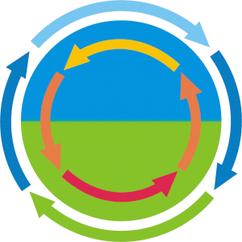

# 2023 Short Course on GNSS Interferometric Reflectometry

## Basic principles and an introduction to the gnssrefl software 
**Dates:** May 2-5, 2023 

**Times:** 9:00-11:00 Mountain Time, 17:00-19:00 Central European Time

**Venue:** virtual

**The goals for this short course are to:**

- introduce participants to the basic principles of the GNSS-IR method
- provide support for users installing and running the gnssrefl code.
- demonstrate and discuss gnssrefl use in practical sessions on snow accumulation, soil moisture and water levels.
- provide guidance on GNSS-IR site location selection, use of low-cost sensors and contributing to open-source scientific software. 

## Calendar 

### Dates TBD: Installation Help Sessions

### May 2: Introduction/Theory/Software
- Overview KL
- Basic Theory (FN) 
- How to Run the Code (KL) 
- Using the API (KL)

### May 3: Hydrologic Applications
- Snow and ice sheets (KL) 
- Soil Moisture (KL) [Chew video](https://www.youtube.com/watch?v=ntnqD5O8LLo)            

### May 4: Water Applications
- overview (SW) 
- invsnr method (DP) 
- Lakes 
- Rivers (MK)  
- Tides (SW)                                                                           

### May 5: Going Forward
* Open source/science and how to contribute (TD)
* Improvements needed for the software (KL,FN)
* Best practices for new installations (TN)  
* Low-cost sensors: (MK, DP, SW, FN)

## Expectations
* Make sure the gnssrefl code has been installed and is working properly prior to the class.
* Depending on your background, watch the suggested online videos.
* Bring your questions to the live sessions.

## Computer Requisite and Operating Systems:
We provide dockers, pypi builds, and the python source code on github. PC users will only be 
able to run the software via dockers. Linux and OSX users can use any of these choices.
Jupyter Notebook users will need to install the docker.

In the weeks before the live class is offered, 
EarthScope staff will help participants set up and install Jupyter notebooks, python, and/or docker images.  

* source repo: https://github.com/kristinemlarson/gnssrefl
* pypi: https://pypi.org/project/gnssrefl/
* jupyter notebook repo: https://www.unavco.org/gitlab/gnss_reflectometry/gnssrefl_jupyter
* GNSS-IR web app, https://gnss-reflections.org
* readthedocs : https://gnssrefl.readthedocs.io/en/latest/

## Instructors, affiliation, and domain expertise:  
* Kristine Larson (University of Bonn, Germany) GNSS-IR, gnssrefl software
* Felipe Nievinski (Uni. Federal do Rio Grande do Sul - Brazil) Theory, water levels, sensors
* Makan Karegar (Uni. Bonn- Germany) cheap GNSS-IR sensors, water levels 
* Simon Williams (Nat. Ocean Ctr.- UK) water levels, tides, cheap GNSS-IR sensors
* David Purnell (Laval University - Canada) water levels, cheap GNSS-IR sensors
* Thomas Nylen (Danish Technical University, Denmark) - installing GNSS sites for GNSS-IR
* Kelly Enloe (EarthScope - USA) – Jupyter notebooks, python, gnssrefl software
* Tim Dittmann (EarthScope - USA) – python, gnssrefl software

## Sponsors
* [Earthscope](https://earthscope.org)

* [Collaborative Research Center 1502 DETECT, University of Bonn](https://sfb1502.de/)

 

