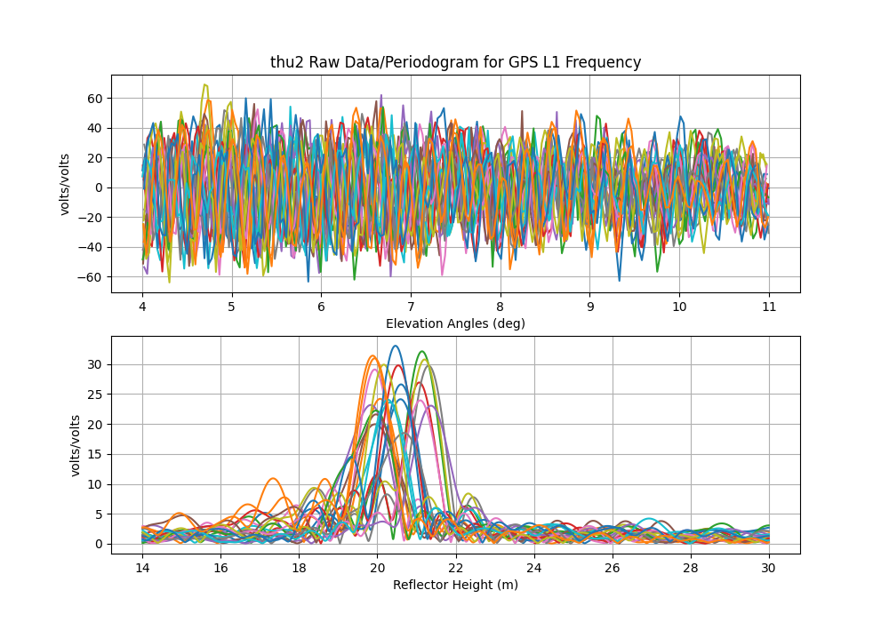
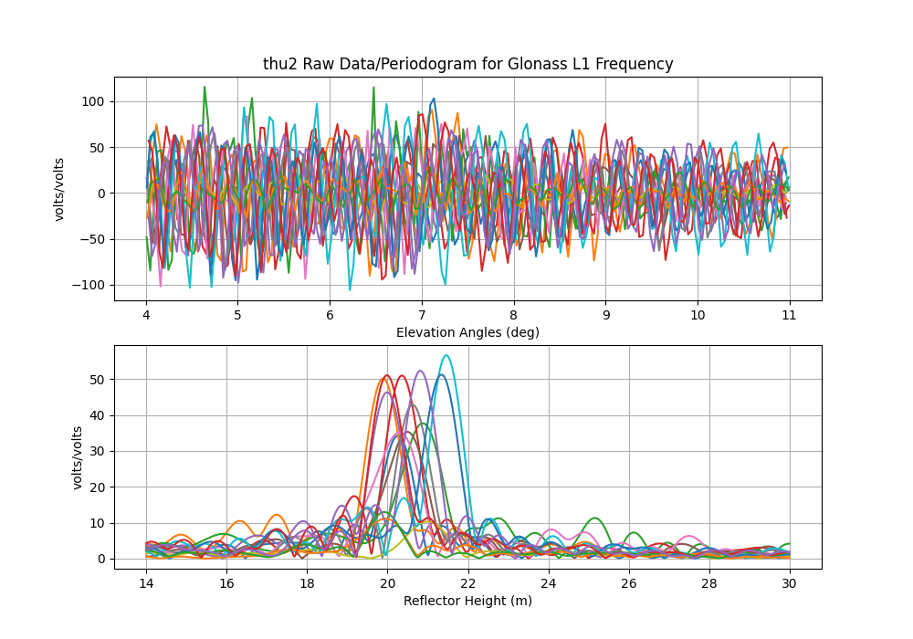

## Some comments about signals

## Aliasing

While it will show up in GPS results too - there seems to be a particularly
bad problem with Glonass L1.  I used an example from Thule. The RH is significant -
~20 meters. So you absolutely have to have at least 15 sec at the site or you violate
the Nyquist. Personally I prefer to use 5 sec - which means I have to download
1 sec and decimate. This is extremely annoying because of how long it takes to 
ftp those files to my local machine. Let's look at L1 solutions using a 5 second file - 
but where I invoke the -dec option for gnssir. That way I can see the impact of the sampling.
I also using the -plt T option. 

This is 5 second GPS L1.

This is 15 second GPS L1. You see some funny stuff at 30 meters, and yes, the periodograms
are noisier. But nothing insane.

Now do 5 second Glonass L1

Contrast with the Glonass L1 results using 15 sec decimation!
So yeah, this is a problem.

