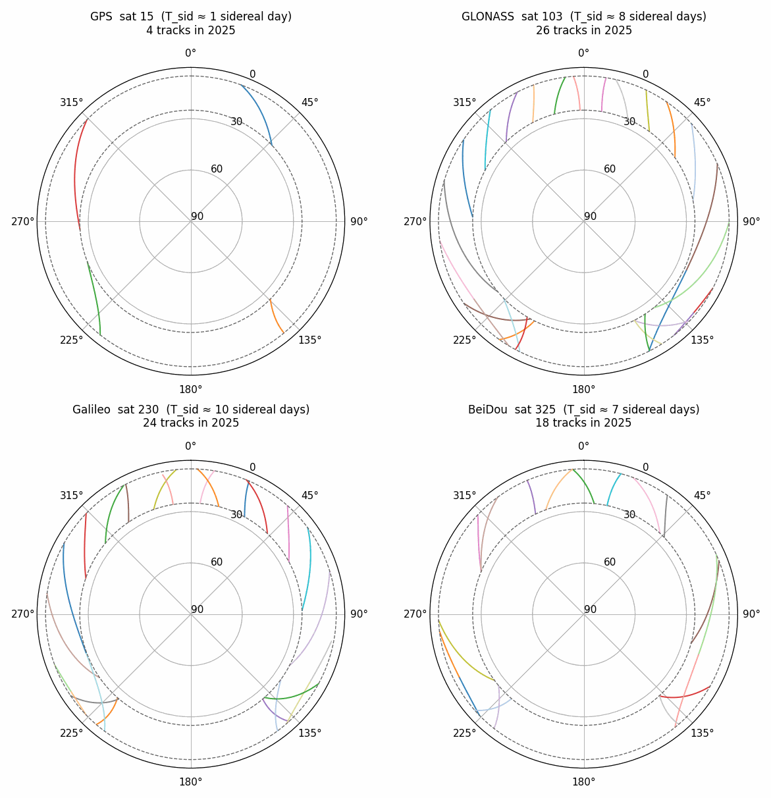
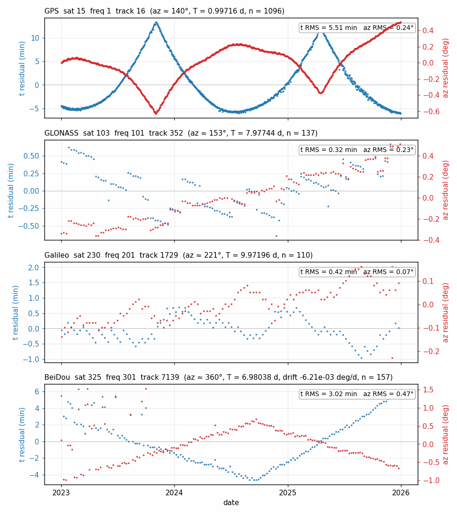
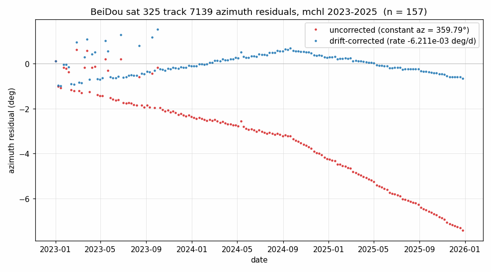

# Tracks

This page describes the `tracks` module and the `tracks.json` artifact it produces. It was written for version `4.1.3` and may be out of date. Please visit [the function definition page](https://gnssrefl.readthedocs.io/en/latest/api/gnssrefl.tracks.html) to view the most recent API reference.

```{contents}
:local:
:depth: 1
```

## Overview

A **track** is one of the repeating sky paths a satellite traces through the elevation mask. A single satellite produces many distinct tracks. An **arc** (see the [extract_arcs page](extract_arcs.md)) is one observation of one track; arcs from different days which share a track can be tagged with a common `track_id`. The figure below shows tracks produced by a single satellite from each constellation at MCHL, Australia. 



Each colored segment is one track that will produce observations ('arcs') at the repeat rate. 

`tracks.json` is a derived catalog of tracks at a station. It is the ground-truth reference used by downstream tools (phase, vwc) to associate arcs to a track.

Two entry points cover the most common workflows for generating a `tracks.json`:

| Function                                     | Use when you have...                                                                     |
|----------------------------------------------|------------------------------------------------------------------------------------------|
| `generate_tracks/vwc_input <station> <year>` | CLI access, a station name and a multi-year window; writes `tracks.json/vwc_tracks.json` |
| `build_tracks(station, year, ...)`           | programmatic access to the same builder; returns `(tracks_json, arcs_df)`                |

### Background

Legacy gnssrefl (pre v4.1.4) identified tracks by azimuth clustering. This works for GPS because GPS has a 1-sidereal-day ground-track repeat, with 2 orbits per day. Therefore, a station can observe at most 4 distinct tracks per satellite (rising/setting tracks for each of the 2 orbits) which are generally well seperated in azimuth-space. Non-GPS constellations have much longer repeat periods, and thus produce many more tracks: 

| Constellation | $T_{\text{sid}}$ | Solar days | Orbits per repeat |
|---------------|------------------|------------|-------------------|
| GPS           | 1                | 0.99727    | 2                 |
| GLONASS       | 8                | 7.97816    | 17                |
| Galileo       | 10               | 9.97270    | 17                |
| BeiDou MEO    | 7                | 6.98089    | 13                |

Because tracks of non-GPS constellations can overlap in azimuth, we adopt a time matching approach track associations.

### The matching rule

An arc at observation time $t_{\text{obs}}$ belongs to a given track when it satisfies both a periodic time condition and an azimuth condition against that tracks fitted parameters:

$$
\left| \, (t_{\text{obs}} - t_{\text{anchor}}) - n \, T_{\text{repeat}} \, \right| < \tau_t
\quad\text{where}\quad n = \operatorname{round}\!\left(\frac{t_{\text{obs}} - t_{\text{anchor}}}{T_{\text{repeat}}}\right)
$$

$$
\left| \, \text{az}_{\text{obs}} - (\text{az}_{\text{avg\_minel}} + \text{az\_drift\_rate} \cdot (t_{\text{obs}} - t_{\text{anchor}})) \, \right| < \tau_{\text{az}}
$$

Key properties:

- $T_{\text{repeat}}$ is the **track-specific fitted repeat period**, not the nominal constellation value. `fit_segment` produces a linear fit to recover a per-track period that accounts for individual satellite drift. This matters for satellites in anomalous orbits (for example Galileo E14 and E18) where the constellation repeat is wrong by several minutes per cycle.
- `az_drift_rate` is zero for GPS, GLONASS, and Galileo. For BeiDou MEO it captures the J2-driven westward drift of the ground track. See the final section of this page.
- `tau_t` defaults to 30 minutes (`TIME_TOL_MIN`) and `tau_az` defaults to 5 degrees (`AZ_TOL`).
- A satellite broadcasting many frequencies will have a unique 'track' for each frequency.

### Track Identity

Two layers of identity are used throughout the pipeline:

- `track_id` is a geometric identifier
- `track_epoch` is an additional identifier (0..N-1) that can be used to split a track into regions of time that may have logically distinct a priori RH values

A track starts life with a single epoch (`epoch_id == 0`). Later user-specified operations may split it into multiple epochs representing periods of different hardware, orbital, or environmental states. Tracks can be `active` or `inactive`, and only arcs in `active` epochs are used in downstream processing. Within an active epoch, smaller `ignored_ranges` can be added to remove specific outlier arcs.

## Building a Track Catalog

Build the catalog directly from the command line:

```bash
generate_tracks mchl 2023 -year_end 2025
```

or auto generate from `vwc_input`, which also generates `vwc_tracks.json`:

```bash
vwc_input mchl 2023 -year_end 2025
```

Typical output:

```
tracks source: auto-detected 'results'
loading arcs for mchl 2023-2025 from results/+failQC/ (fast path)
done: 1099 days processed, 0 missing, 273,482 arcs in 12.3s
tolerances: az +/-5.0 deg, time +/-30 min, max_gap 15 cycles
processing frequencies: [1, 5, 20, 101, 102, 201, 205, 206, 207, 208, 301, 302, 305, 306]
building tracks_json over 259,181 kept arcs (9,494 unique track_ids)
wrote /.../Files/mchl/tracks.json
  file size:   4.79 MB
  tracks:      9494
```

Programmatic access returns the same JSON plus the per-arc DataFrame used to build it:

```python
from gnssrefl.tracks import build_tracks

tracks_json, arcs_df = build_tracks('mchl', 2023, year_end=2025)
print(f"{tracks_json['metadata']['n_tracks']} tracks over {tracks_json['metadata']['duration_d']} days")
# 9494 tracks over 1095 days
```

## Parameter References
### Input Reference

Parameters accepted by `build_tracks` (and the corresponding `generate_tracks` CLI flags):

| Parameter | Default | Description |
|-----------|---------|-------------|
| `year` / `year_end` | required / `year` | Inclusive year window |
| `extension` | `''` | Strategy extension subdirectory |
| `snr_type` | 66 | SNR file type for the SNR-walk path |
| `source` | `'auto'` | Arc source: `'auto'`, `'results'` (fast), or `'snr'` (slow, authoritative) |

The two arc sources differ in speed and coverage:

- `'results'` reads `results/` plus `failQC/` for each day. Orders of magnitude faster, but only covers frequencies `gnssir` was configured to run. Requires a prior `gnssir` run with `save_failqc=True` (which is the default as of v4.1.3).
- `'snr'` reads SNR files directly via `extract_arcs`. Slow, but covers every frequency present in the SNR file.
- `'auto'` prefers `'results'` if any year in range has a populated `results/` directory; otherwise falls back to `'snr'`.

Matching tolerances are module-level constants in `tracks.py`, shared between the builder and the runtime lookup:

| Constant | Default | Scope |
|----------|---------|-------|
| `AZ_TOL` | 5.0 deg | build + runtime |
| `TIME_TOL_MIN` | 30 min | build + runtime |
| `MAX_GAP_CYCLES` | 15 | build only (max missed cycles to bridge a single match) |

### Output Reference

`tracks.json` has two top-level keys:

| Key | Type | Description |
|-----|------|-------------|
| `metadata` | dict | Station identity, data time range, totals, build history |
| `tracks` | dict | Map from `track_id` string to per-track record |

Each per-track record holds the satellite identity plus a list of epochs:

| Key | Type | Description |
|-----|------|-------------|
| `constellation` | str | `'GPS'`, `'GLONASS'`, `'Galileo'`, or `'BeiDou'` |
| `sat` | int | Satellite PRN |
| `freq` | int | Frequency code (1, 20, 5, 101, 201, 301, ...) |
| `rise` | int | 1 for rising track, -1 for setting |
| `epochs` | list of dict | One entry per epoch of this track (see below) |

Each epoch describes would ideally be a region of time with a comparable measurement environment:

| Key | Type | Description |
|-----|------|-------------|
| `epoch_id` | int | Index within this track's epoch list (0..N-1) |
| `epoch_type` | str | `'active'` or `'inactive'` |
| `start_time` / `end_time` | str | ISO 8601 Z UTC time of first/last observed arc |
| `anchor_time` | str | ISO 8601 Z UTC; used as $t_{\text{anchor}}$ |
| `repeat_interval_d` | float | Fitted $T_{\text{repeat}}$ in days |
| `az_avg_minel` | float | Mean azimuth at minimum elevation (deg) |
| `az_drift_rate` | float | deg/day; absent or zero for non-BeiDou |
| `ignored_ranges` | list of [mjd_start, mjd_end] | QC masks on this epoch |
| `n_arcs` | int | Number of arcs within the epoch window (excluding ignored ranges) |
| `n_qc_arcs` | int | Only in `vwc_tracks.json`: arcs that also passed phase QC |
| `apriori_RH` / `RH_std` | float | Only in `vwc_tracks.json`: a priori reflector height and its std |
| `duration_d` | float | `end_time` - `start_time` in days |

`tracks.json` vs `vwc_tracks.json`: both share this schema; `vwc_tracks.json` is the filtered subset used by the VWC pipeline, containing only tracks at the requested frequencies and adding `apriori_RH`, `RH_std`, and `n_qc_arcs` per epoch.

## Example Code
### Labelling arcs at runtime

Once `tracks.json` is built, pass it to `extract_arcs_from_station` via the `track_file` kwarg and the returned arcs come back already tagged:

```python
from gnssrefl.extract_arcs import extract_arcs_from_station
import os

tracks_path = f"{os.environ['REFL_CODE']}/Files/mchl/tracks.json"

arcs = extract_arcs_from_station('mchl', 2024, 180, track_file=tracks_path)

for meta, data in arcs[:3]:
    print(f"sat {meta['sat']:3d} freq {meta['freq']:3d}  "
          f"track_id={meta['track_id']:4d}  epoch={meta['track_epoch']}  "
          f"az={meta['az_min_ele']:5.1f}  track_azim={meta['track_azim']}")
# sat  15 freq   1  track_id=  16  epoch=0  az=140.3  track_azim=140.1
# sat  15 freq   1  track_id=  17  epoch=0  az= 33.2  track_azim=33.0
# sat 103 freq 101  track_id= 352  epoch=0  az=153.7  track_azim=153.3
```

Tagging adds four keys to each arc's metadata dict:

| Key | Type | Description |
|-----|------|-------------|
| `track_id` | int | Matched track id, or -1 on no match |
| `track_epoch` | int | Matched epoch id, or -1 on no match |
| `track_azim` | float or None | `az_avg_minel` of the matched epoch |
| `apriori_RH` | float or None | Matched epoch's a priori RH; only populated from `vwc_tracks.json` |

Point `track_file` at `vwc_tracks.json` instead to pick up `apriori_RH`. Internally the kwarg calls `tracks.attach_track_id`, which loads the JSON once, builds a `(sat, freq)` lookup via `build_lookup_index`, and matches each arc with `lookup_arc`. A module-level cache (`tracks.TRACK_INDEX_CACHE`) keyed by absolute path reuses prebuilt indexes across calls transparently, so repeated calls don't reload the JSON. Cache entries are never invalidated; restart the process if the tracks file is changed on disk.

### Loading all arcs in a tracks_json

Two entry points cover multi-day workflows that load all arcs from a `tracks_json`.

**`extract_arcs_from_tracks(tracks_json)`** is the robust version, and can bootstrap a `tracks_json` when `gnssir` results do not exist. Returns a flat list of `(metadata, data)` tuples in the same format as `extract_arcs_from_station`, tagged against the in-memory `tracks_json` (including any QC edits). Use when you need the full per-arc SNR payload (`ele`, `snr`, `seconds`).

```python
from gnssrefl.extract_arcs import extract_arcs_from_tracks
from gnssrefl.tracks import load_tracks_json

tracks_json = load_tracks_json(tracks_path)
arcs = extract_arcs_from_tracks(tracks_json)  # [(meta, data), ...]
```

**`load_gnssir_results_from_tracks(tracks_json)`**: fast summary read from `results/` + `failQC/` files. Returns a tagged DataFrame with columns `mjd, azim, constellation, RH, match_T, track_id, track_epoch`. Much faster because no SNR is read; requires a prior `gnssir` run so the sibling `failQC/` files exist, and raises `FileNotFoundError` if any are missing.

```python

df = load_gnssir_results_from_tracks(tracks_json)
```

## Track Level Quality Control

The companion module `tracks_qc` provides the operations used to edit a tracks-shaped JSON. All edits mutate the in-memory dict and only become self-consistent once `save_tracks` recalculates statistics.

### QC primitives

Low-level single-operation edits on a track or epoch.

- **`split_epoch`**: subdivide one active epoch into two at a chosen MJD. Both halves inherit the original fit parameters; fresh values come from the `save_tracks` refit. Existing `ignored_ranges` are partitioned across the split.
- **`merge_epochs`**: combine two adjacent active epochs. The window becomes the union, `ignored_ranges` are concatenated, and `repeat_interval_d` must match.
- **`ignore_range` / `unignore_range`**: add or subtract a time window on an epoch's `ignored_ranges`. Arcs inside any ignored range are excluded from the refit and the `n_arcs` / `n_qc_arcs` counts on save.
- **`deactivate_epoch`**: flag an epoch inactive. The refit and stats passes skip it and downstream tools ignore it, but the window and history are preserved.
- **`delete_track`**: remove a whole track from the JSON.
- **`save_tracks`**: append a history entry, refit every active epoch via `fit_segment`, refresh every derived field (for `vwc_tracks.json` also `apriori_RH`, `RH_std`, `n_qc_arcs`), and write atomically.

### QC Functions

Composite policies built on the primitives. `vwc_cl` and `vwc_input` surface these as CLI flags; the flag is the main entry point.

- **`-auto_removal T` on `vwc`**: drop tracks and epochs at the current frequency that did not pass the run's QC, where "passed" means the track's phase RMS was under `-warning_value` (default 5.5 deg). Bad epochs are flagged via `deactivate_epoch`; tracks whose active epochs are all bad go via `delete_track`. Tracks on other frequencies are untouched.

## Extra Notes
### Legacy GPS-only path

Stations processed before the multi-GNSS refactor may still have per-frequency `apriori_rh_{fr}.txt` files from the legacy azimuth-matching workflow. The vwc pipeline (`vwc_input`/`phase`/`vwc`) retains this path behind the `-legacy T` flag (with a 2027-01-01 deprecation notice), and `attach_legacy_apriori` labels arcs under that scheme. Under the legacy path `track_epoch` is always 0 on match (legacy tracks have only one epoch each).

New stations should use the default multi-GNSS path. If `tracks.json` is missing but a legacy `apriori_rh` file exists, `vwc_input` prints a hint pointing at `-legacy T`.

### Accuracy of the fitted model

With one satellite per constellation, the figure below plots the timing residual (blue, left y-axis) and azimuth residual (red, right y-axis) of every real arc evaluated against its track's fitted model, across the 3-year window at `mchl`:



### BeiDou orbital drift

BeiDou MEO is the only constellation whose ground tracks do not maintain a static azimuth over multi-year windows. J2 perturbation drives a westward drift of the ground track, so a constant-azimuth track model would accumulate several degrees of error per year. `fit_segment` detects constellation `BeiDou` and adds a linear `az_drift_rate` term to the azimuth model; the other three constellations carry `az_drift_rate = 0`.

The figure below shows BeiDou sat 325 track 7139 at `mchl`, 2023 to 2025. Red is the azimuth residual under a constant-azimuth model; blue is the residual after the fitted `az_drift_rate` term is applied.


