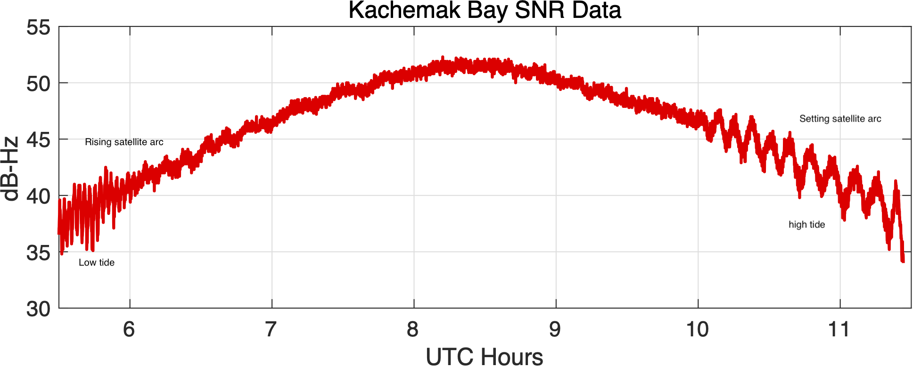

# Understanding

## Overview

**gnssrefl** is an open source/python version of my GNSS interferometric reflectometry (GNSS-IR) code. 

*If you would like to try out reflectometry without installing the code*

I recommend you use [this web app](https://gnss-reflections.org). It 
can show you representative results with minimal constraints. It should provide 
results in less than 10 seconds.

*If you prefer Matlab*

I had a [working matlab version on github](https://github.com/kristinemlarson/gnssIR_matlab_v3), 
but I will not be updating it. You will very likely have to make changes to accommodate the recent
change in security protocols at CDDIS.

###  *Goals*

The goal of the gnssrefl python repository is to help you compute (and evaluate) GNSS-based
reflectometry parameters using geodetic data. This method is often
called GNSS-IR, or GNSS Interferometric Reflectometry. There are three main modules:

* [**rinex2snr**](rinex2snr.md) translates RINEX files into SNR files needed for analysis.

* [**gnssir**](gnssir.md) computes reflector heights (RH) from SNR files.

* [**quickLook**](quickLook.md) gives you a quick (visual) assessment of a file without dealing
with the details associated with **gnssir**. It is not meant to be used for routine analysis.
It also helps you pick an appropriate azimtuh mask and quality control settings.

There are also various [utilities](utilities.md) you might find to be useful.
If you are unsure about why various restrictions are being applied, it is really useful 
to read [Roesler and Larson (2018)](https://link.springer.com/article/10.1007/s10291-018-0744-8) 
or similar. You can also watch some background videos 
on GNSS-IR at [youtube](https://www.youtube.com/channel/UCC1NW5oS7liG7C8NBK148Bg).

### *Philosophy*

In geodesy, you don't really need to know much about what you are doing to 
calculate a reasonably precise position from GPS data. That's just the way it is.
(Note: that is also thanks to the hard work of the geodesists that wrote the 
computer codes). For GPS/GNSS reflections, you need to know a little bit more - like what are you
trying to do? Are you trying to measure water levels? Then you need to know where the water
is! (with respect to your antenna, i.e. which azimuths are good and which are bad). 
Another application of this code is to measure snow accumulation. If you 
have a bunch of obstructions near your antenna, 
you are responsible for knowing not to use that region. If your antenna is 10 meters 
above the reflection area, and the software default only computes answers up to 6 meters,
the code will not tell you anything useful. It is up to you to know what is best for the site and 
modify the inputs accordingly. 
I encourage you to get to know your site. If it belongs to you, look at 
photographs. If you can't find photographs, use Google Earth.  You can also try using
my [google maps web app interface](https://gnss-reflections.org/geoid?station=smm3).

## Method

### Signals and Sources

To summarize, direct (blue) and reflected (red) GNSS signals interfere and create
an interference pattern that can be observed in GNSS Signal to Noise Ratio (SNR) data as a satellite rises or sets. 
The frequency of this interference pattern is directly related to the height of the GNSS antenna phase
center above the reflecting surface, or reflector height RH (purple). *The primary goal of this software 
is to measure RH.* This parameter is directly related to changes in snow height and water levels below
a GNSS antenna. This is why GNSS-IR can be used as a snow sensor and tide gauge. GNSS-IR can also be 
used to measure soil moisture, but the code to estimate soil moisture is not as strongly related to RH as
snow and water. We will be posting the code you need to measure soil moisture later in the year.

This code is meant to be used with Signal to Noise Ratio (SNR) data. This is a SNR sample for a site in the 
the northern hemisphere (Colorado) and a single GPS satellite. The SNR data are plotted with respect to time - however,
we have also highlighted in red the data where elevation angles are less than 25 degrees. These are the data used in 
GNSS Interferometric Reflectometry GNSS-IR. You can also see that there is an overall smooth polynomial signature
in the SNR data. This represents the dual effects of the satellite power transmission level and the antenna 
gain pattern. We aren't interested in that so we will be removing it with a low order polynomial (and 
we will convert to linear units on y-axis). 

After that polynomial is removed, we will concentrate on the *rising* 
and *setting* satellite arcs. That is the red parts on the left and right.  

Below you can see those next two steps. On the top is the "straightened" SNR data. Instead of time,
it is plotted with respect to sine of the elevation angle. It was shown a long time ago by Penina 
Axelrad that the frequency extracted from these data is representative of the reflector height.
Here a periodogram was used to extract this frequency, and that is shown below, with the x-axis 
units changed to reflector height. In a nutshell, that is what this code does. It figures out the 
rising and setting satellite arcs in all the azimuth regions you have said are acceptable. It does a 
simple analysis (removes the polynomial, changes units) and uses a periodogram to look at the 
frequency content of the data. You only want to report RH when you think the peak on the periodogram is 
significant. There are many ways to do this - we only use two quality control metrics:

* is the peak larger than a user-defined value  (amplitude of the dominant peak in your periodogram)

* is the peak divided by a "noise" metric larger than a user-defined value. The code calls this the peak2noise.

The Colorado SNR example is for a fairly planar field where the RH for the rising and setting arc 
should be very close to the same name. What does the SNR data look like for a more extreme case? 
Shown below is the SNR data for [Peterson Bay](https://gnss-reflections.org/static/images/PBAY.jpg), where the rising arc (at low tide) has a very different
frequency than during the setting arc (high tide). This gives you an idea of how the code can be 
used to measure tides. 

### Considerations

A couple common sense issues: one is that since you define the noise region, if you make it really large, that 
will artificially make the peak2noise ratio larger. I have generally used a region of 6-8 meters for this 
calculation. So in the figure above the region was for 0-6 meters. The amplitude can be tricky because 
some receivers report low SNR values, which then leads to lower amplitudes. The default amplitude values are 
for the most commonly used signals in GNSS-IR (L1, L2C, L5, Glonass, Galileo, Beidou). The L2P data
used by geodesists are generally not useable for reasons to be discussed later.

Even though we analyze the data as a function of sine of elevation angle, each satellite arc
is associated with a specific time period. The code keeps track of that and reports it in the final answers.
It also keeps track of the average azimuth for each rising and setting satellite arc that passes quality 
control tests.

What do these satellite reflection zones look like? Below are 
photographs and [reflection zone maps](https://gnss-reflections.org/rzones) for two standard GNSS-IR sites, 
one in the northern hemisphere and one in the southern hemisphere.

<table align=center>
<TR>
<TH>Mitchell, Queensland, Australia</TH>
<TH>Portales, New Mexico, USA</TH>
</TR>
<TR>
<TD></TD>

<TD></TD>
</TR>
<TR>
<TD></TD>
<TD></TD>
</TR>
</table>

Each one of the yellow/blue/red/green/cyan clusters represents the reflection zone
for a single rising or setting GPS satellite arc. The colors represent different elevation angles - 
so yellow is lowest (5 degrees), blue (10 degrees) and so on. The missing satellite signals in the north
(for Portales New Mexico) and south (for Mitchell, Australia) are the result of the GPS satellite 
inclination angle and the station latitudes. The length of the ellipses depends on the height of the 
antenna above the surface - so a height of 2 meters gives an ellipse that is smaller than one 
that is 10 meters. In this case we used 2 meters for both sites - and these are pretty 
simple GNSS-IR sites. The surfaces below the GPS antennas are fairly smooth soil and that 
will generate coherent reflections. In general, you can use all azimuths at these sites.  

Now let's look at a more complex case, station <code>ross</code> on Lake Superior. Here the goal 
is to measure water level. The map image (panel A) makes it clear
that unlike Mitchell and Portales, we cannot use all azimuths to measure the lake. To understand our reflection 
zones, we need to know the approximate lake level. That is a bit tricky to know, but the 
photograph (panel B) suggests it is more than the 2 meters we used at Portales - 
but not too tall. We will try 4 meters and then check later to make sure that was a good assumption.  

<table align=center>
<TR>
<TD>A.   
Map view of station ROSS </TD>
<TD>B.   
Photograph of station ROSS</TD>
</TD>
</TR>
<Tr>
<TD>C.  
Reflection zones for GPS satellites at elevation  angles of 5-25 degrees 
for a reflector height of  4 meters.</TD> 
<TD>D.  
Reflection zones for GPS satellites at elevation  angles of 5-15 degrees 
for a reflector height of  4 meters.  </TD>
</Tr>
</table>

Again using the reflection zone web app, we can plot up the appropriate reflection zones for various options.
Since <code>ross</code> has been around a long time, [http://gnss-reflections.org](https://gnss-reflections.org) has its coordinates in a 
database. You can just plug in <code>ross</code> for the station name and leave 
latitude/longitude/height blank. You *do* need to plug in a RH of 4 since mean 
sea level would not be an appropriate reflector height value for this 
case. Start out with an azimuth range of 90 to 180 degrees.
Using 5-25 degree elevation angles (panel C) looks like it won't quite work - and going all the way to 180 degrees
in azimuth also looks it will be problematic. Panel D shows a smaller elevation angle range (5-15) and cuts 
off azimuths at 160. These choices appear to be better than those from Panel C.  
It is also worth noting that the GPS antenna has been attached to a pier - 
and *boats dock at piers*. You might very well see outliers at this site when a boat is docked at the pier.

Once you have the code set up, it is important that you check the quality of data. This will also 
allow you to check on your assumptions, such as the appropriate azimuth and elevation angle 
mask and reflector height range. This is one of the reasons <code>quickLook</code> was developed. 

