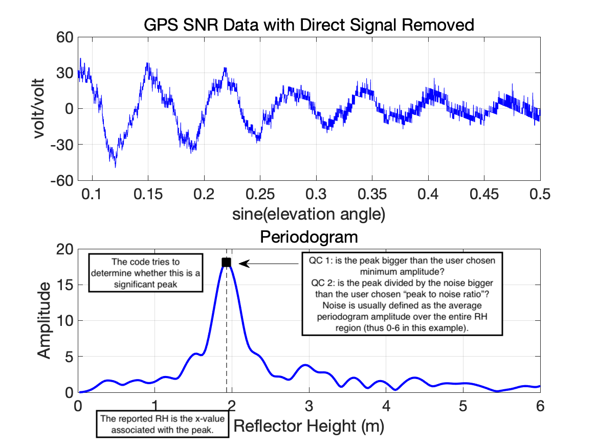
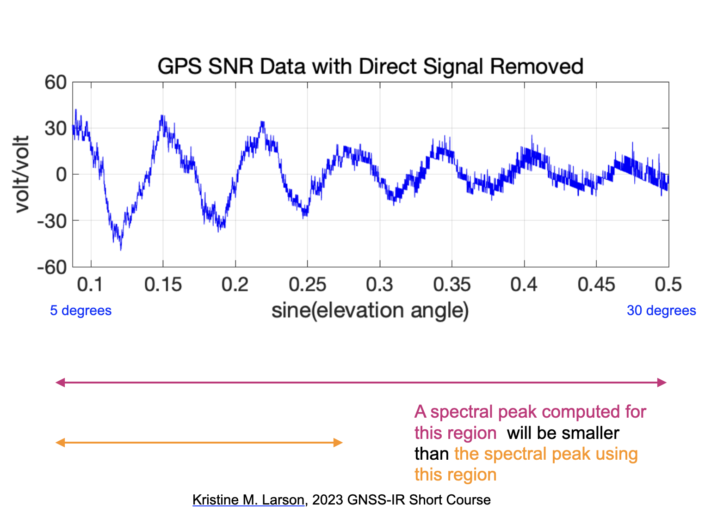
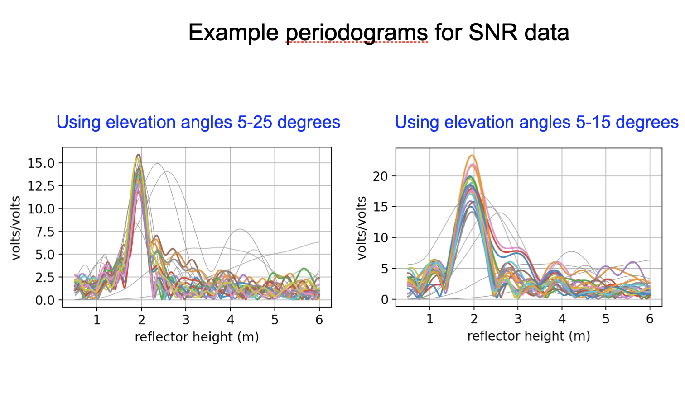
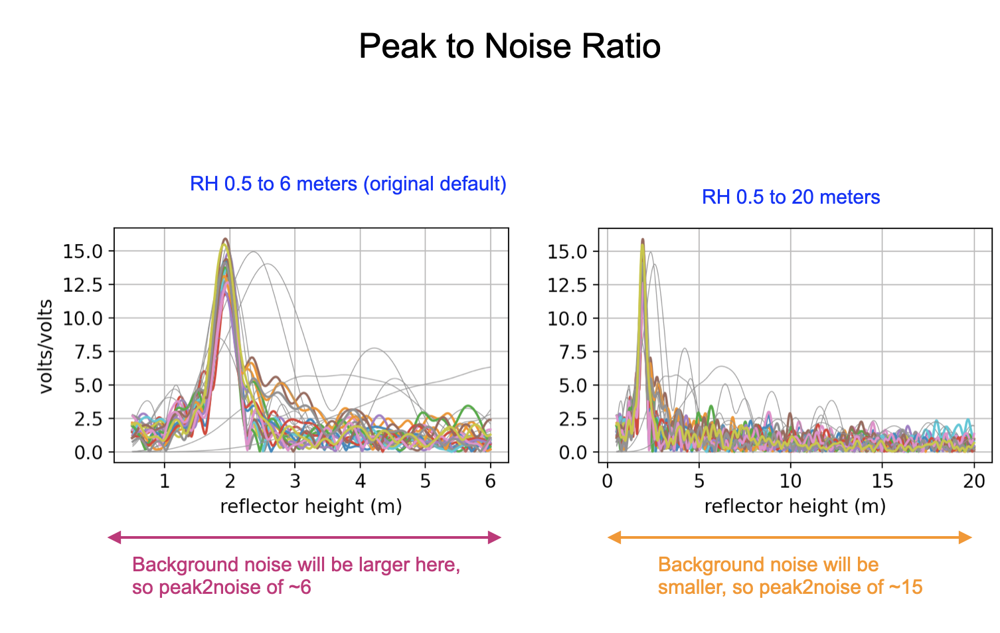
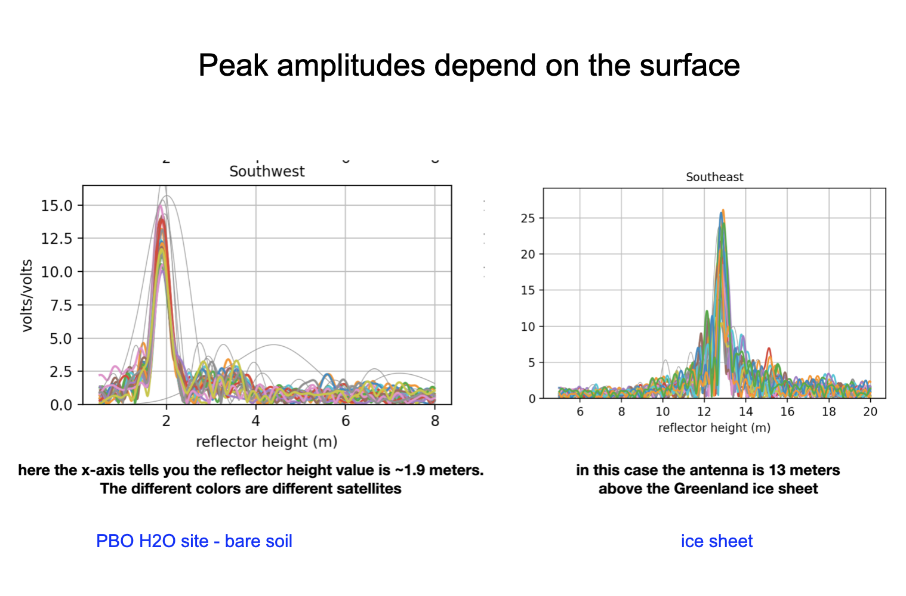
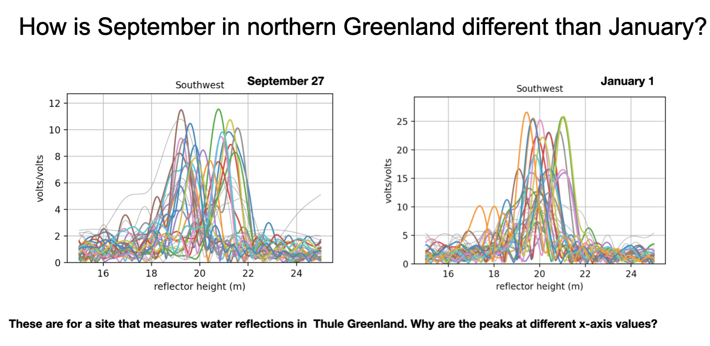
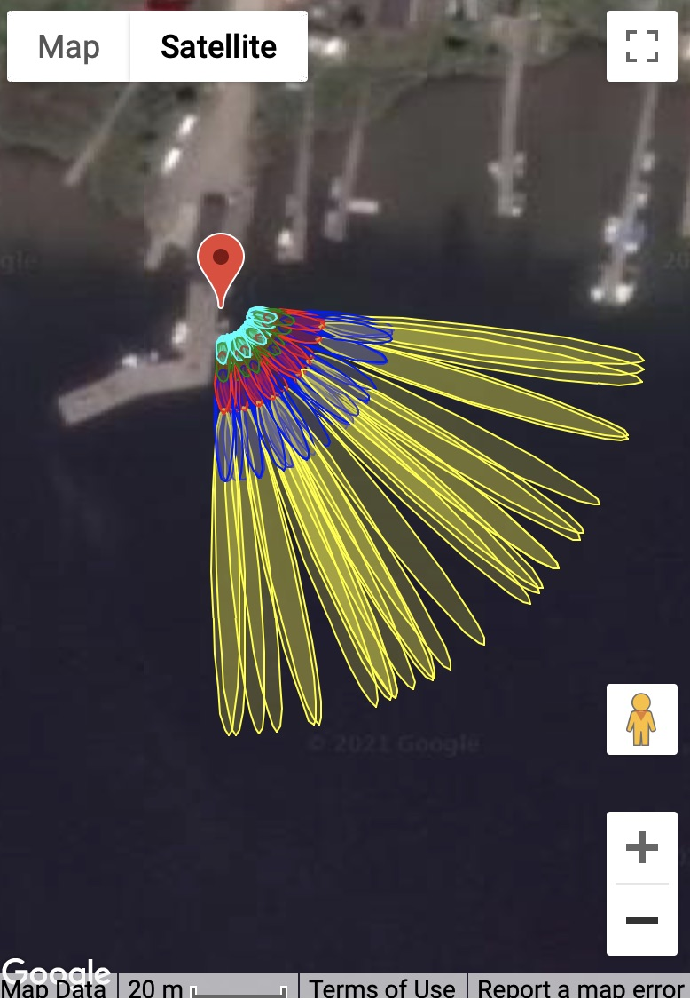
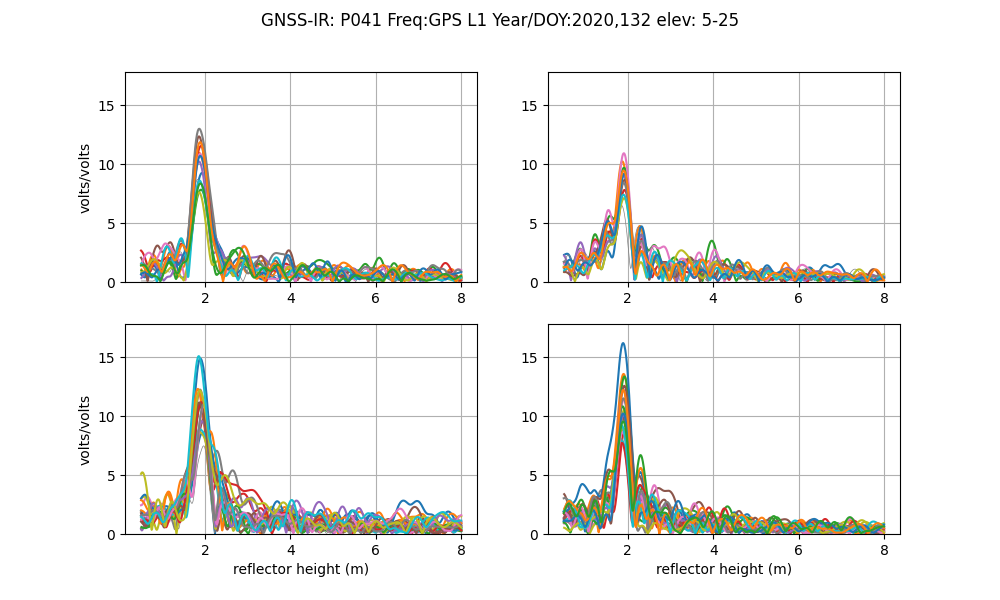
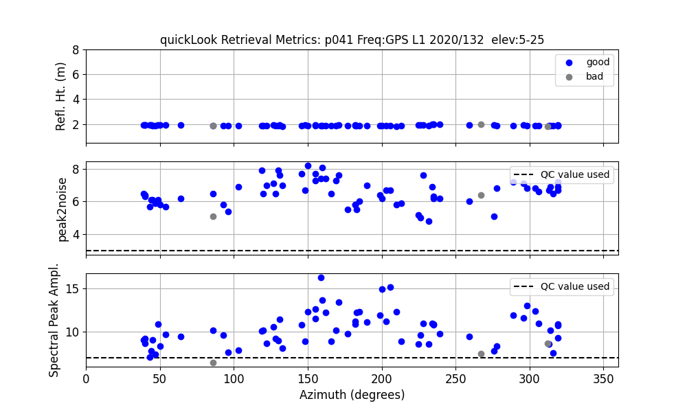
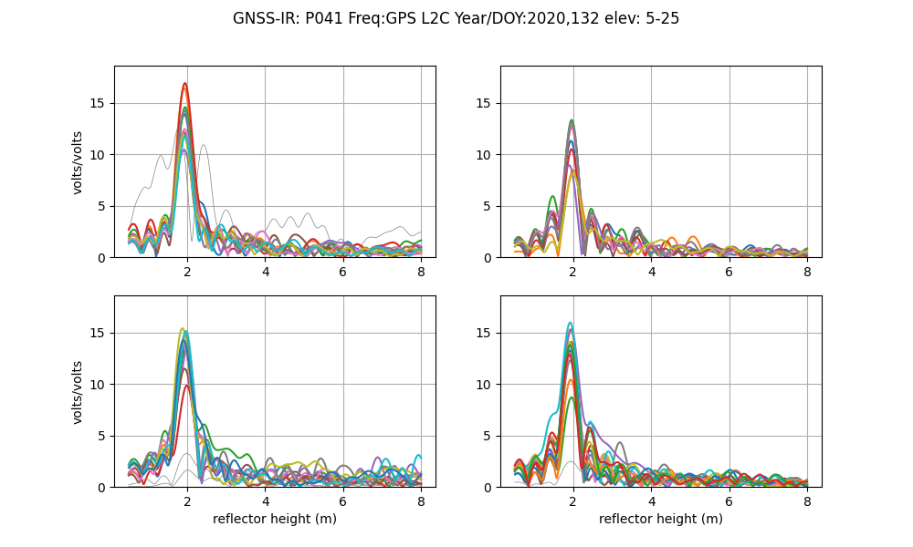

# Understanding

**gnssrefl** is an open source/python version of my GNSS interferometric reflectometry (GNSS-IR) code. 

## Goals

The goal of the gnssrefl python repository is to help you compute (and evaluate) GNSS-based
reflectometry parameters using standard GNSS data. This method is often
called GNSS-IR, or GNSS Interferometric Reflectometry. There are three main sections:

* Translation: Use either **rinex2snr** or **nmea2snr** to translate native 
GNSS formats to what gnssrefl needs. The output is called a *SNR* file.

* **quickLook** gives you a quick (visual) assessment of a SNR file without dealing
with the details associated with **gnssir**. It is not meant to be used for routine analysis.
It also helps you pick an appropriate azimuth mask and quality control settings.

* **gnssir** computes reflector heights (RH) from SNR files.

There are also various [utilities](quick_recall.md) you might find to be useful.
If you are unsure about why various restrictions are being applied, it is really useful 
to read [Roesler and Larson (2018)](https://link.springer.com/article/10.1007/s10291-018-0744-8) 
or similar. You can also watch some background videos 
on GNSS-IR at [youtube](https://www.youtube.com/channel/UCC1NW5oS7liG7C8NBK148Bg).

## Philosophy

In geodesy, you don't really need to know much about what you are doing to 
calculate a reasonably precise position from GPS data. That's just the way it is.
(Note: that is also thanks to the hard work of the geodesists that wrote the 
computer codes). For GPS/GNSS reflections, you need to know a little bit more - like what are you
trying to do? Are you trying to measure water levels? Then you need to know where the water
is! (with respect to your antenna, i.e. which azimuths are good and which are bad). 
Another application of this code is to measure snow accumulation. If you 
have a bunch of obstructions near your antenna, 
you are responsible for knowing not to use that region. If your antenna is 10 meters 
above the reflection area, and the software default only computes answers up to 6 meters,
the code will not tell you anything useful. It is up to you to know what is best for the site and 
modify the inputs accordingly. 
I encourage you to get to know your site. If it belongs to you, look at 
photographs. If you can't find photographs, use Google Earth.  You can also try using
my [google maps web app interface](https://gnss-reflections.org/geoid?station=smm3).

## Reflected Signal Geometry

To summarize, direct (blue) and reflected (red) GNSS signals interfere and create
an interference pattern that can be observed in GNSS Signal to Noise Ratio (SNR) data as a satellite rises or sets. 
The frequency of this interference pattern is directly related to the height of the GNSS antenna phase
center above the reflecting surface, or reflector height RH (purple). *The primary goal of this software 
is to measure RH.* This parameter is directly related to changes in snow height and water levels below
a GNSS antenna. This is why GNSS-IR can be used as a snow sensor and tide gauge. GNSS-IR can also be 
used to measure soil moisture, but the code to estimate soil moisture is not as strongly related to RH as
snow and water. 

This code is meant to be used with Signal to Noise Ratio (SNR) data. This is a SNR sample for a site in the 
the northern hemisphere (Colorado) and a single GPS satellite. The SNR data 
are plotted with respect to time - however,
we have also highlighted in red the data where elevation angles are less than 25 degrees. These are the data used in 
GNSS Interferometric Reflectometry GNSS-IR. You can also see that there is an overall smooth polynomial signature
in the SNR data. This represents the dual effects of the satellite power transmission level and the antenna 
gain pattern. We aren't interested in that so we will be removing it with a low order polynomial (and 
we will convert to linear units on y-axis). 
After the direct signal polynomial is removed, we will concentrate on the *rising* 
and *setting* satellite arcs. These are shown in red.

For a more dynamic example, look at these SNR data from [Kachemak Bay](../_static/pbay-snr.png)

Once the direct signal is removed (and units changed), you will have a dataset as shown below.
The x-axis is now in sine(elevation angle) instead of time, as this is the easiest way to 
analyze the spectral characteristics of the data. Below the SNR data is the periodogram associated 
with it. This periodogram is what allows us to estimate the reflector height of the antenna.

In a nutshell, that is what this code does - it tries to find the rising and setting arcs 
for all GNSS satellites in a datafile, computes periodograms to find the dominant frequencies 
which can be related to reflector heights, and ultimately defines environmental characteristics from them.

There are three big issues :

1. You need to make sure that dominant frequency is meaningful (**Quality Control**).  

2. You need to make sure that the reflected signals are actually coming 
from where you want them (**Reflection Zones**)

3. Your receiver must be collecting data at sufficient rate so that your GNSS-IR results 
are not violating the Nyquist frequency (**Maximum Resolvable Reflector Height**).

## Quality Control 

This code uses a Lomb Scargle periodogram (LSP). This type of periodogram allows the input 
data to be sampled at uneven periods. The primary inputs are :

* how precise (in reflector height units) do you want the periodogram calculated at?

* how far (in reflector height units) do you want the periodogram calculated for?

In other words, how densely sampled on the x-axis will your periodogram be and how 
far along the x-axis will it be?  The first parameter should not set to something that 
makes no sense (i.e. so small the code takes forever to run). In this code the second
parameter is the max reflector height (h2). The minimum reflector height is always zero, and then
the values lower than the minimum reflector height (h1) are thrown out.

It is easy to compute a periodogram and pick the maximum value so as to find the reflector height. It is 
more difficult to determine whether it is one you should trust.

* is the peak larger than a user-defined value  (amplitude of the dominant peak in your periodogram)

* is the peak divided by a "noise" metric larger than a user-defined value. This noise metric is defined 
over a user defined reflector height region. (peak2noise). 

* is the data arc sufficiently "long" (ediff)

The amplitude and peak2noise ratio are influenced by choices you make, i.e. the elevation angle limits 
and the noise region used to compute peak2 noise.  And they are also 
influenced by the kind of experiment you do and receiver you use.  
Some examples follow:

Here we show a SNR series - outlining two different elevation angle regions in colors.

We should expect that the periodograms will look different for these two regions and they are.
The peak amplitudes are larger when you only use the lower elevation angle data.  But the periodograms
are wider (why?).

Peak2noise depends on the noise region. In <code>quickLook</code> it uses the same RH limits for noise as for computing
the periodogram. You can eaisly see that if you said you wanted all H values below 20 meters, the noise region
is much much larger, which means the peak value dividied by the noise values will be much much bigger.

This is an example where two different stations with different surfaces are shown. The peak amplitudes of the 
periodograms are different.  This simply means that the ice has 
a different dielectric constant than soil.  You can verify this using the Nievinski simulator.

Here is an example where the same station is used in both periodograms - but the surface itself changed. 

In addition to amplitude and peak2noise, the code uses a quality control 
parameter called **ediff.** to test whether the data arc is sufficiently "long"
in an elevation angle sense. ediff has units of degrees.
If you set your desired elevation angle limits to 5 and 20 degrees, and ediff was 2, which is 
the default, then the code will require all arcs to track from at least 7 degrees and go up to 18 degrees. If you had a 
very short elevation angle range, i.e. 5-10 degrees, you might want to make that a little stricter,
minimum of 6 and at least go up to 9 degrees, so an ediff of 1. If you don't want to enforce this, just set it to something big.
But you can't turn off all quality control.  Since the amplitude can be influenced by the kind of 
receiver you are using, if you aren't sure what a good value would be, you can set that to zero.
And you can use quickLook to get an idea of what it should be.  

One more warning: if you tell the code that you want to use elevation angles of 5 to 25 degrees and it 
turns out that your receiver was using an elevation mask of 10 degrees, you will almost certainly
end up with no useful results. Why?  Because the best you will do is have a min elevation angle of 10 degrees,
and the code will expect them to start at 7 degrees (i.e. 5 + 2). Some cryosphere community members use
7 degree masks on their receivers for no reason that I can understand - so that situation would
also end up with a lot of arcs thrown out.

Another way of thinking about how long an arc is measured in time units.  The parameter 
is called delTmax in the code and is defined in minutes. The default is very long - 75 minutes - 
as this code is meant to be useable for soil moisture, snow, and tides. This will get you into
trouble if you are measuring tides and the tide rates of change are large. In those cases, you might
wish to reduce delTmax. 
See [Grauerort](https://gnssrefl.readthedocs.io/en/latest/use_cases/use_tggo.html) for an example of this problem. 

Even though we analyze the data as a function of sine of elevation angle, each satellite arc
is associated with a specific time period. The code keeps track of that and reports it in the final answers.
Each track is associated with an azimuth. In the initial versions of the code this was the average azimuth
for all the data in your track.  From version 1.4.5 and on, it is the azimuth of the lowest elevation angle
in your arc.

## Reflection Zones

What do these satellite reflection zones look like? Below are 
photographs and [reflection zone maps](https://gnss-reflections.org/rzones) for two standard GNSS-IR sites, 
one in the northern hemisphere and one in the southern hemisphere.

**Mitchell, Queensland, Australia**

**Portales, New Mexico, USA**

Each one of the yellow/blue/red/green/cyan clusters represents the reflection zone
for a single rising or setting GPS satellite arc. The colors represent different elevation angles - 
so yellow is lowest (5 degrees), blue (10 degrees) and so on. The missing satellite signals in the north
(for Portales New Mexico) and south (for Mitchell, Australia) are the result of the GPS satellite 
inclination angle and the station latitudes. The length of the ellipses depends on the height of the 
antenna above the surface - so a height of 2 meters gives an ellipse that is smaller than one 
that is 10 meters. In this case we used 2 meters for both sites - and these are pretty 
simple GNSS-IR sites. The surfaces below the GPS antennas are fairly smooth soil and that 
will generate coherent reflections. In general, you can use all azimuths at these sites.  

Now let's look at a more complex case, station <code>ross</code> on Lake Superior. Here the goal 
is to measure water level. The map image (panel A) makes it clear
that unlike Mitchell and Portales, we cannot use all azimuths to measure the lake. To understand our reflection 
zones, we need to know the approximate lake level. That is a bit tricky to know, but the 
photograph (panel B) suggests it is more than the 2 meters we used at Portales - 
but not too tall. We will try 4 meters and then check later to make sure that was a good assumption.  

 

A. Google Map of station ROSS 

 

B. Photograph of station ROSS

C. Reflection zones for GPS satellites at elevation 
angles of 5-25 degrees for a reflector height of 4 meters.

 

D. Reflection zones for GPS satellites at 
elevation angles of 5-15 degrees for a reflector height of 4 meters.  

Again using the reflection zone web app, we can plot up the appropriate reflection zones for various options.
Since <code>ross</code> has been around a long time, [http://gnss-reflections.org](https://gnss-reflections.org) 
has its coordinates in a database. You can just plug in <code>ross</code> for the station name and leave 
latitude/longitude/height blank. You *do* need to plug in a 
RH of 4 since mean sea level would not be an appropriate 
reflector height value for this 
case. 

Start out with an azimuth range of 90 to 180 degrees.
Using 5-25 degree elevation angles (panel C) looks like it won't 
quite work - and going all the way to 180 degrees
in azimuth also looks it will be problematic. Panel D shows a 
smaller elevation angle range (5-15) and cuts 
off azimuths at 160. These choices appear to be better than those from Panel C.  
It is also worth noting that the GPS antenna has been attached to a pier - 
and *boats dock at piers*. You might very well see outliers at this site when a boat is docked at the pier.

Note: we now have a [refl_zones tool](https://gnssrefl.readthedocs.io/en/latest/api/gnssrefl.refl_zones_cl.html) 
in the gnssrefl package. 

Once you have the code set up, it is important that 
you check the quality of data. This will also 
allow you to check on your assumptions, such as the 
appropriate azimuth and elevation angle 
mask and reflector height range. This is the main reason 
<code>quickLook</code> was developed. 

## Maximum Resolvable Reflector Height

The "Nyquist" is complicated for GNSS-IR for various reasons - one being the units 
are not the same as the units of what we care about,
the Reflector Height. So I am going to call it the Maximum Resolvable Reflector Height,
which is a mouthfull, but at least you have some idea what it means.  
If you are interested in the details of this calculation, please 
see the [Roesler and Larson paper](https://link.springer.com/article/10.1007/s10291-018-0744-8). 
If you want to compute it for your site, please use 
[max_resolve_RH](https://gnssrefl.readthedocs.io/en/latest/api/gnssrefl.max_resolve_RH_cl.html) 
That's all I am going to say on the matter.

## Refraction

We would welcome help from the community to add a discussion here of refraction models and GNSS-IR.
Currently we only provide an explanation of refraction corrections inside of our code, specifically
inside gnssir_input.py, which is where the refraction model is set.  Please see that 
[documentation for details](https://gnssrefl.readthedocs.io/en/latest/api/gnssrefl.gnssir_input.html).

## quickLook

<CODE>quickLook</code> is meant to provide the user with a visual sense of the data 
at a given site.  It has stored defaults that work for stations with reflectors that are 
lower than 8 meters. [You can change those defaults on the command line.](https://gnssrefl.readthedocs.io/en/latest/api/gnssrefl.quickLook_cl.html) 

**Example from Boulder**

<code>quickLook p041 2020 132 </CODE>

That command will produce this periodogram summary :

By default, these are L1 data only. Note that the x-axis does not go beyond 8 meters. This is because
we have used the defaults. Furthermore, note that results on the x-axis begin at 0.5 meters.
Since you are not able to resolve very small reflector heights with this method, this region 
is not allowed. These periodograms give you a sense of whether there is a planar reflector below your antenna. The fact that the 
peaks in the periodograms bunch up around 2 meters means that at 
this site the antenna phase center is ~ 2 meters above the ground. The colors represent different 
satellites.  If the data are plotted in gray that means you have a failed reflection. The quadrants 
are Northwest, Northeast and so on. 

<CODE>quickLook</code> also provides a summary of various quality control metrics:

The top plot shows the sucessful RH retrievals in blue and unsuccessful RH retrievals in gray. 
In the center panel are the peak to noise ratios. The last plot is the amplitude of the spectral peak. The dashed
lines show you what QC metrics quickLook was using. You can control/change these on the command line.

If you want to look at L2C data you just change the frequency on the command line. L2C is designated by 
frequency 20: 

<CODE>quickLook p041 2020 132 -fr 20</CODE>

**L2C results are always superior to L1 results. They are also superior to L2P data.** If you have 
any influence over a GNSS site, please ask the station operators to 
track modern GPS signals such as L2C and L5 **and** to include it in the archived RINEX file.

**Example for Lake Superior**

<code>quickLook ross 2020 170 -e1 5 -e2 15</code>

The good RH estimates (in blue in the top panel) are telling us that we were right when we assessed 
reflection zones using 4 meters. We can also see that the best retrievals are in the southeast quadrant (azimuths 90-180 degrees).
This is further emphasized in the next panel, that shows the actual periodograms.

[Example for a site on an ice sheet](https://gnssrefl.readthedocs.io/en/latest/use_cases/use_gls1.html)

[Example for a taller site on an ice sheet](https://gnssrefl.readthedocs.io/en/latest/use_cases/use_smm3.html)

Warning: <code>quickLook</code> calculates the minimum observed elevation 
angle in your file and prints that to the screen so you know 
what it is. It also uses that as your emin
value (e1) if the default is smaller. It does this so you don't see all arcs as rejected.
Let's say your file had a receiver-imposed elevation cutoff 
of 10 degrrees. The default minimum elevation angle in <code>quickLook</code> is 5 degrees. 
With the default **ediff** value of 2, not a single arc would reach the minimum 
required value of 7 (5 + 2); everything 
would be rejected. <code>quickLook</code> instead sees that
you have a receiver-imposed minimum of 10 and would substitute that for the default emin. 
<code>gnssir</code> does not do this because at that point you 
are supposed to have chosen a strategy, which is stored in the json file.

<code>quickLook -screenstats True</code> provides more information to the screen 
about why arcs have been rejected.

## Looking at raw SNR data

This code was not developed with an emphasis on *looking* at raw SNR data. But, I can
offer a workaround. You can use <code>quickplt</code>.  This works on SNR files - so you 
do have to at least translate either RINEX or NMEA data first.  Because I find it annoying
to have to provide the full path and gunzip files, it will add that path and gunzip for you if 
necessary.  I'll just give one example.  

Assume you have a SNR file. I will use <code>rinex2snr p041 2024 1 -archive sopac</code>. It creates

SNR file p0410010.24.snr66 which is stored in $REFL_CODE/2024/snr/p041
From the [file formats discussion](https://gnssrefl.readthedocs.io/en/latest/pages/file_structure.html) you 
should know that column 2 is elevation angle, azimuth is column 3, time is column 4, and L1 SNR is in column 7.
If i wanted to plot the raw SNR GPS L1 data for this file:

<code>quickplt p0410010.24.snr66 4 7 -sat gps</code>

The -sat option tells quickplot you are working with a SNR file.

<code>quickplt p0410010.24.snr66 2 7 -sat gps</code> would show azimuth on the x-axis

You can also ask for glonass, galileo, beidou etc.  You can change symbols, restrict x-axis, etc  
with <code>quickplt</code>. Check the [documentation](https://gnssrefl.readthedocs.io/en/latest/api/gnssrefl.quickplt.html) for more detail.

You can also specify a single satellite if you want (make sure you add 100 for Glonass, etc).

If you want to look at the SNR data after the direct signal has been removed, you 
can use <code>gnssir -savearcs T </code>
which has a beta version that prints plain text files for each arc.
However, this is beta - I am unlikely to fix bugs in it. Please submit a PR if you find bugs.

## gnssir

**gnssir_input**

[A full listing of the possible inputs and examples for gnssir_input can be found here.](https://gnssrefl.readthedocs.io/en/latest/api/gnssrefl.gnssir_input.html)

Your first task is to define your analysis strategy. We use station p101 as an example.
If the station location is in our database:

<code>gnssir_input p101</code>

If you have your own site, you should use -lat, -lon, -height as inputs.  
If you happen to have the Cartesian coordinates (in meters), you can 
set <code>-xyz True</code> and input those instead.

The json file of instructions will be stored in $REFL_CODE/input/p101.json. 

The default azimuth inputs are from 0 to 360 degrees.
You can set your preferred azimuth regions using -azlist2. Previously you were required to use multiple
azimuth regions, none of which could be larger than 100 degrees. That is no longer required. However, if 
you do need multiple distinct regions, that is allowed, e.g.

<code>gnssir_input p101  -azlist2 0 90 180 270</code>

If you wanted all southern quadrants, since these are contiguous, you just need to give the starting and ending 
azimuth.

<code>gnssir_input p101  -azlist2 90 270</code>

You should also set the preferred reflector height region (h1 and h2) and elevation angle mask (e1 and e2).
Note: the reflector height region should not be too small, as it is also used to set the region for your periodogram.
If you use tiny RH constraints, your periodogram will not make any sense and your work will fail the quality control metrics.

**gnssir**

<code>gnssir</code> estimates reflector heights. It assumes you have made SNR files and 
defined an analysis strategy.
The minimum inputs are the station name, year, and doy. 
 
<CODE>gnssir p041 2020 150 </CODE> 

[Additional inputs](https://gnssrefl.readthedocs.io/en/latest/api/gnssrefl.gnssir_cl.html)

Where would the code store the files for this example?

- analysis instructions are stored in $REFL_CODE/input/p041.json
- SNR files are stored in $REFL_CODE/2020/snr/p041
- Reflector Height (RH) results are stored in $REFL_CODE/2020/results/p041/150.txt

For more information about the decisions made in <code>gnssir</code>, set **-screenstats T**

To have plots come to the screen, set -plt to T or True. 

If you want to try different strategies, make multiple json files with 
the -extension input. Then use the same -extension command in <code>gnssir</code>.

This is a snippet of what the result file would look like

Note that the names of the columns (and units) are provided
(this may be out of date):

- *Amp* is the amplitude of the most significant peak in the periodogram (i.e. the amplitude for the RH you estimated).  
- *DelT* is how long a given rising or setting satellite arc was, in minutes. 
- *emin0* and *emax0* are the min and max observed elevation angles in the arc.
- *rise/set* tells you whether the satellite arc was rising (1) or setting (-1)
- *Azim* is the average azimuth angle of the satellite arc
- *sat* and *freq* are as defined for gnssrefl (i.e. 101 is Glonass L1) 
- MJD is modified julian date
- PkNoise is the peak to noise ratio of the periodogram values
- last column is currently set to tell you whether the refraction correction has been applied 
- EdotF is used in the RHdot correction needed for dynamic sea level sites. The units are hours/rad.
When multiplied by RHdot (meters/hour), you will get a correction in units of meters. For further
information, see the <code>subdaily</code> code.

Kristine M. Larson

August 8, 2024
