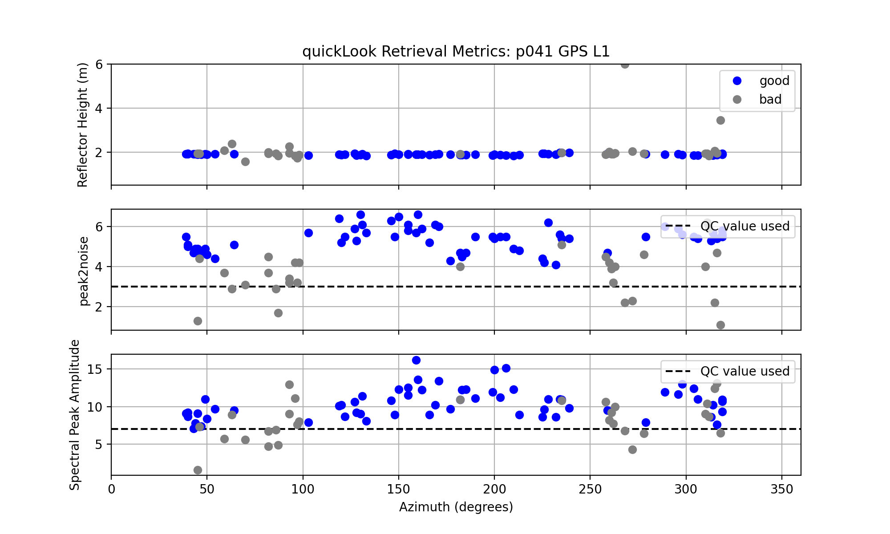

### Quick Description of the quickLook Code 

<code>quickLook</code> is meant to give you a visual assessment of the reflection characteristics 
of your GNSS site. It is **not** meant for routine analysis of your data - instead it is 
meant to give you a better understanding of how to choose settings for that routine analysis, which 
is done in <code>gnssir</code>.

<code>quickLook</code> takes all the SNR data at a site and splits it into four geographic 
quadrants (northwest, northeast, southwest, southeast). Within those quadrants, it identifies rising
and setting arcs for one GNSS transmitter frequency and uses a periodogram to estimate the dominant Reflector Height (RH) 
in meters.

Two plots are returned. One is a summary periodogram plot. This allows you to see for yourself the periodograms
that will be used to retrieve RH.  Each  color here represents a different satellite. Defaults were used, so the periodograms
were limited to the region 0.5 to 6 meters. The GPS L1 frequency is the default. (This site has good L1 SNR data at this time - in previous 
years it was a diffreent receiver with poor quality).

The y-axis is the spectral amplitude in converted SNR units (volts/volts).  If you see a strong peak in the periodogram,
that means you will have a good estimate of the RH for that satellite arc. The data represented in gray are "failed" periodograms. 

The second plot returned is a summary for various quality control metrics. 

* the top plot is the color coded RH retrieval color: blue for good and gray for bad.

* the middle plot is the "peak to noise ratio" which is defined as peak spectral amplitude divided by the average 
spectral value over a defined noise region.  In <code>quickLook</code> this will be the same region you used for your RH estimate.
So here the noise region would be 0.5 to 6 meters.

* the bottom plot is the spectral amplitude for the RH peak. 

[Additional discussion of the GNSS-IR method, with example periodogram links.](https://gnss-reflections.org/overview)
