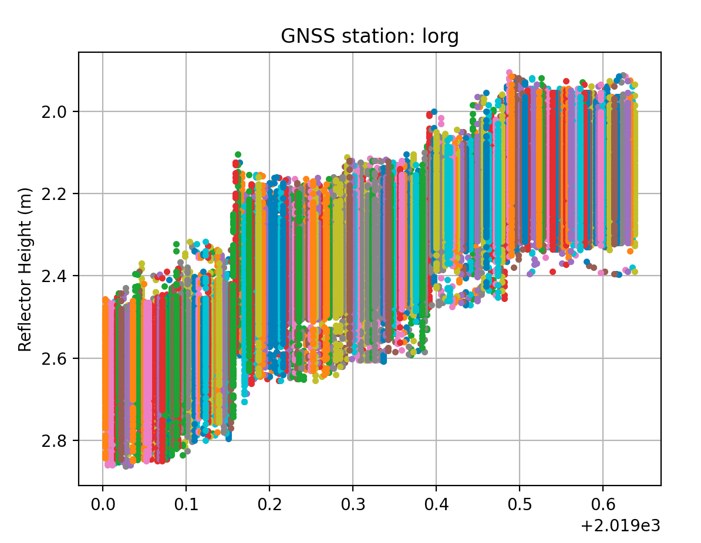
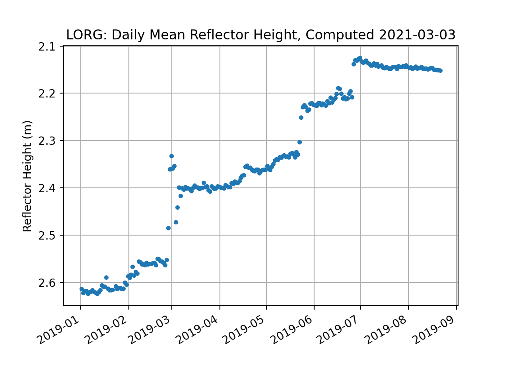

# Ross Ice Shelf, Antarctica

[Warning](warning.md)

This GNSS site has been removed by the project investigators.

## metadata

**Station Name:**  lorg

**Location:**  Lorne, Antarctica

**Archive:**  [UNAVCO](http://www.unavco.org)

**DOI:**  [https://doi.org/10.7283/ACF6-YT23](https://doi.org/10.7283/ACF6-YT23)

**Ellipsoidal Coordinates:**

- Latitude:  -78.18365
- Longitude: 170.03361
- Height:  	-7.778 m

[Station Page at UNAVCO](https://www.unavco.org/instrumentation/networks/status/nota/overview/lorg)

[Station Page at Nevada Geodetic Laboratory](http://geodesy.unr.edu/NGLStationPages/stations/LORG.sta)

### Data Summary

Station lorg is on the Ross Ice Shelf, Antarctica. The site is a largely featureless ice plain with no obstructions (see photo above). 
The site was installed on November 27, 2018 and decommissioned on November 15, 2019. It recorded only GPS frequencies during its operation. 

LORG is an example station on the [GNSS-IR web app.](https://gnss-reflections.org/api?example=lorg) 

Because there are no significant topographic features near the station, so it is recommended to use default values for the elevation mask. An azimuth mask is not required.

If you are curious about the position time series for the antenna, you can use <code>download_unr lorg</code>. 

### Take a Look at the Data

First make a SNR file.

<code>rinex2snr lorg 2019 205</code>

Use <code>quickLook</code> to produce a periodogram similar to the one in the web app [(For details on quickLook output)](../pages/quickLook.md). quickLook is set to use the L1 frequency by default:

<code>quickLook lorg 2019 205</code>

 
Compare the periodograms for other frequencies: L2C and L5. They should be similar to the L1 periodogram, except that there 
will be fewer satellite traces because only GPS satellites launched after 2005 
broadcast L2C and only satellites after 2010 broadcast L5.
The northwest qudarant is the noisiest and one could certainly try to improve the results by restricting some azimuths there.
This is for L2C:

<code>quickLook lorg 2019 205 -fr 20</code>

This is for L5:

<code>quickLook lorg 2019 205 -fr 5</code>

### Analyze the Data

Now prepare to analyze the data using <code>gnssir</code>.  First you need to create a set of analysis instructions. 

<code>gnssir_input lorg</code>

The json output will be stored in $REFL_CODE/input/lorg.json. [Here is a sample json file.](lorg.json)

Next make some snr files for a time span of about eight months. Restrict the search to the UNAVCO archive to make the 
code run faster (otherwise it will check three other archives as well). The resulting SNR files will be stored in $REFL_CODE/2019/snr/lorg. 

<code>rinex2snr lorg 2019 1 -doy_end 233 -archive unavco</code>

Run <code>gnssir</code> for all the SNR files:

<code>gnssir lorg 2019 1 -doy_end 233  </code>

The results for a single day are stored in a folder for that 
year, i.e.  $REFL_CODE/2019/results/lorg. [Here is a sample for day of year 102.](102.txt)

The **daily_avg** command will calculate the daily average reflector height from the daily 
output files.  To minimize outliers in these daily averages, a median filter is set to allow 
values within a given value of the median. The user is also asked to 
set a required minimum number of daily satellite tracks. Here we use 0.25 meters and 50 tracks. 

<code>daily_avg lorg 0.25 50</code>

[All reflector heights (gzipped)](lorgAll.txt.gz)

[Daily average reflector height file.](lorg-dailyavg.txt)

