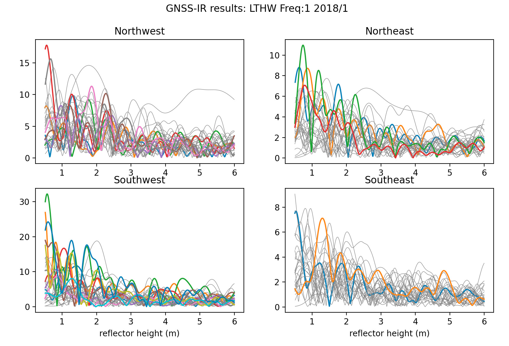
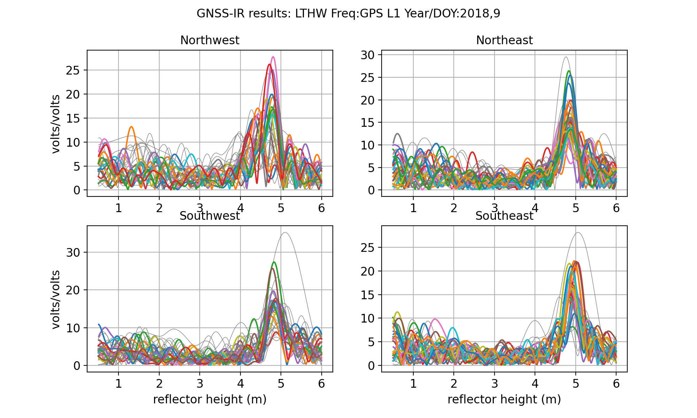
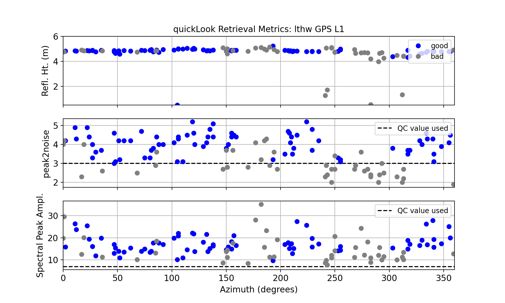
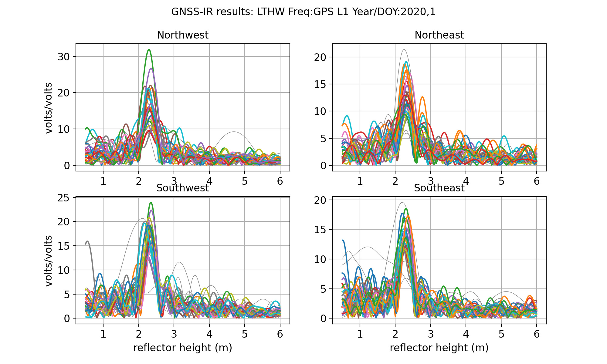
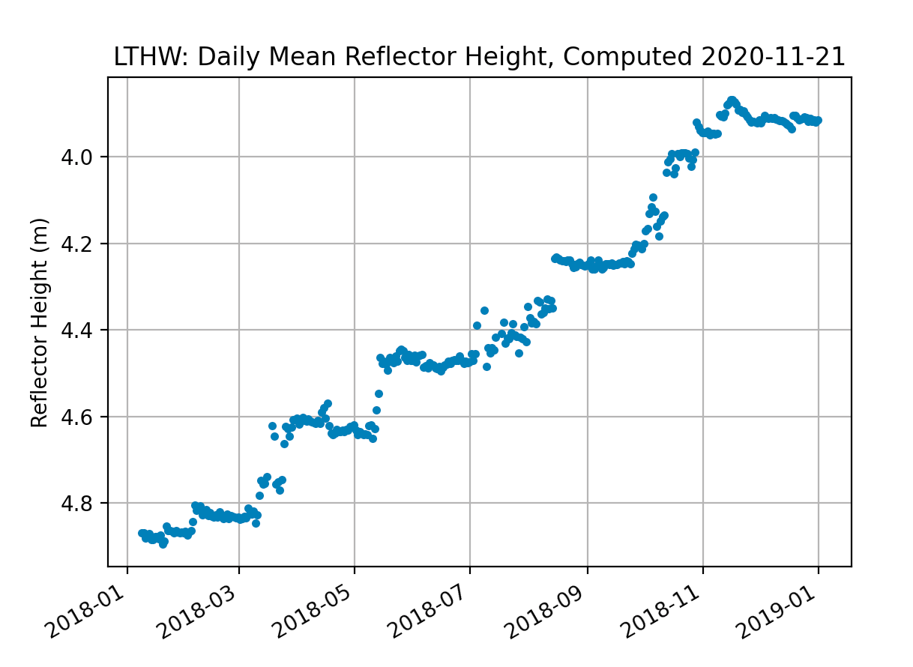

# Lower Thwaites Glacier

Try using <code>-par 10</code> when you run **rinex2snr** and **gnssir**. Your code should run must faster.

## metadata

 

**Station Name:** lthw

**Location:** Thwaites Glacier, Antarctica

**Archive:** [UNAVCO](http://www.unavco.org)

**Ellipsoidal Coordinates:**

- Latitude: -76.458

- Longitude: -107.782

- Height: 1011.459 m

[Station Page at UNAVCO](https://www.unavco.org/instrumentation/networks/status/nota/overview/LTHW)

[Station Page at Nevada Geodetic Laboratory](http://geodesy.unr.edu/NGLStationPages/stations/LTHW.sta)

## Data Summary

The receiver only tracks legacy GPS signals, so only L1 should be used for reflectometry. The pole
is set in the snow/ice and routinely (every few years) reset. Please 
use the [Nevada Reno site](http://geodesy.unr.edu/NGLStationPages/stations/LTHW.sta) to get a 
feel for when the pole has been reset and where data gaps exist.

Because there are no permanent structures surrounding the site, elevation and azimuth angle default settings can mostly be used.
The only restriction that should be imposed is a minimum elevation angle of 7; this is because the field
crew set this at the receiver when it was originally installed.

## Take a quick look at the SNR data

Translate the GPS data for January 1 in 2018. First you need to make the SNR file:

<code>rinex2snr lthw 2018 1</code>

Use our utility **quickLook** to look at these data. 

<code>quickLook lthw 2018 1 -e1 7</code>

This is a bit of a mess really. If there are significant peaks, they are really 
close to the cutoff for the method (at 0.5 meters). Let's compare with about a week later.
First make a SNR file:

<code>rinex2snr lthw 2018 9</code>

Now run <code>quickLook<code>:

<code>quickLook lthw 2018 9 -e1 7</code>

This is *much* better and clearly shows that a field crew reset the antenna to a little 
less than 5 meters sometime between day 1 and day 9 in the year 2018. You can also look 
at the second plot to get an idea of how well the method performs for various azimuths 
and QC parameters:

Except for a region ~270-300 degrees in azimuth, and directly south, retrievals are consistently good.
A peak to noise ratio of 3 appears to be appropriate. The rejected southern retrievals are unlikely to be 
of local origin, but rather related to the inclination of the satellite orbits at this latitude.

If you like you can compare this to the first day of 2020, first make the SNR file:

<code>rinex2snr lthw 2020 1</code>

Again use quickLook:

Now the peaks in the reflector height (RH) periodograms are ~2.2 meters - 
so that means that there was ~2.5 meters of surface change from 2018 to 2020.

### Measure Snow Accumulation for 2018

Translate the GPS data for the year of 2018:

<code>rinex2snr lthw 2018 1 -doy_end 365</code>

Then you need to make the list of analysis inputs (stored in json format):

<code>gnssir_input lthw -e1 7 -e2 25 -peak2noise 3.2 -l1 T</code>

Now analyze the data for 2018 from day 1 to day 365 using **gnssir**:

<code>gnssir lthw 2018 1 -doy_end 365 </code>

This produces reflector heights for every rising and setting satellite track that meets your 
quality control selections.  In order to estimate snow accumulation, you will want to calculate
the daily average. Using our **daily_avg** utility - and specifying 50 satellite tracks and median filter of 0.25 meters:

<code>daily_avg lthw 0.25 50</code>

You can loosen the required track number if you want, but in this case it does not change the 
overall character of the results:

<code>daily_avg lthw 0.25 40</code>

[Sample daily average RH file for 2018](lthw_dailyRH.txt)

If you are feeling ambitious, try looking at the 
data for [Upper Thwaites Glacier](https://www.unavco.org/instrumentation/networks/status/nota/overview/UTHW) :-)

