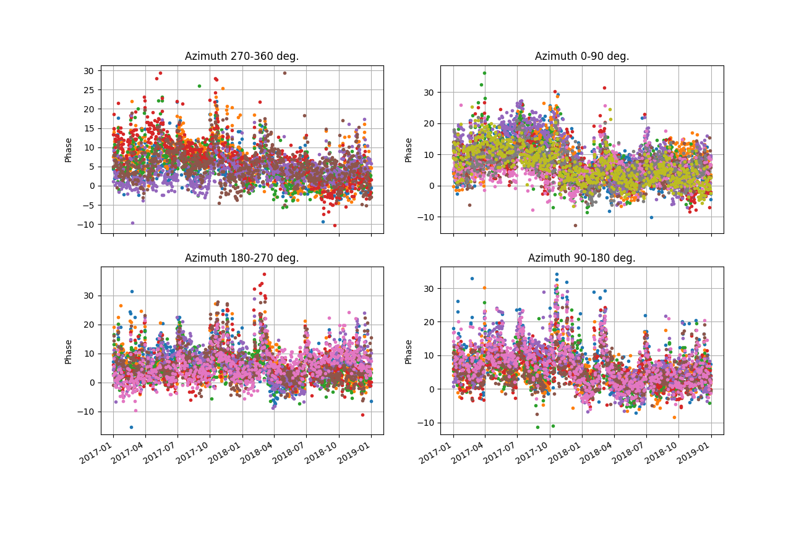
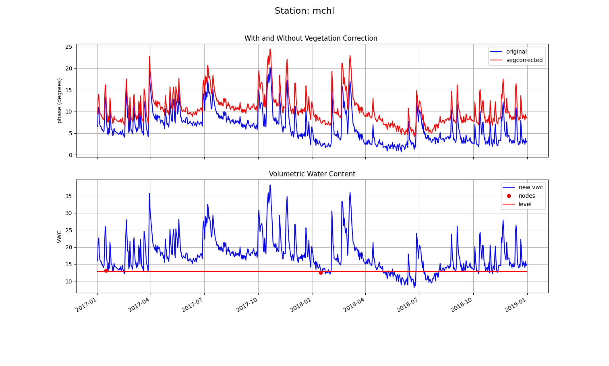
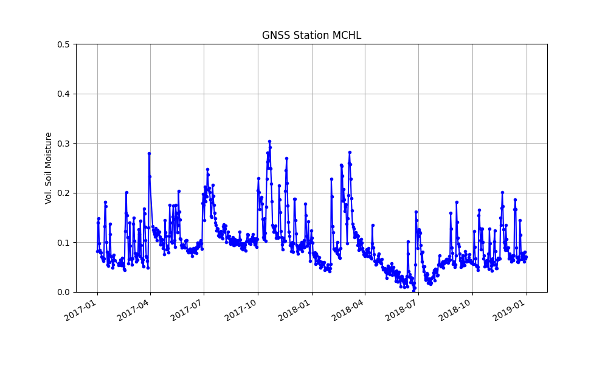

# Mitchell

## metadata
**Station Name:** 	mchl (mchl00aus)

**Location:** Walhallow, Queensland, Austalia

**Ellipsoidal Coordinates:**

- Latitude: -26.359 degrees

- Longitude: 148.145 degrees

- Height: 534.591 meters

[Station Page at Nevada Geodetic Laboratory](http://geodesy.unr.edu/NGLStationPages/stations/MCHL.sta)

[Google Maps Link](https://www.google.com/maps/place/26%C2%B021'32.4%22S+148%C2%B008'42.0%22E/@-26.359,148.145,11z/data=!4m5!3m4!1s0x0:0x9200f9ebb23ec5b1!8m2!3d-26.359!4d148.145?hl=en) 

**Archives:** CDDIS, BKG-IGS, GA
 
Read the instructions for the [soil moisture code!](../pages/README_vwc.md)!

## Step 1: GNSS-IR
Begin by generating the SNR files. To be sure we can get the L2C data, we will use the RINEX 3 files.
These require the longer station name (mchl00aus) and are available at either cddis or ga.
Choose the one that is less slow for you. 
In some cases we hae found the data are at cddis but not ga or vice versa. Apparently the data are also 
available from BKG. We are not sure why this is. If you have a way to access 
these files, just download them and put them in the local
processing area and use the -nolook option). We are going to start with two years of data and 
using the default GPS orbit option and the cddis archive:

<code>rinex2snr mchl00aus 2017 1 -doy_end 365 -year_end 2018 -archive cddis </code>

If you have any difficult downloading these RINEX 3 files, UNAVCO has kindly downloaded and converted 
2017 RINEX 2.11 files that include L2C data. For that year - and only that year - the command would be:

<code>rinex2snr mchl 2017 1 -doy_end 365 -archive special</code>

Use the <code>quickLook</code> with the l2c frequency to give a look to the data quality.
Then set up your analysis parameters:

<code>gnssir_input mchl -l2c true</code>

The location of the json file is printed to the screen. 
The default behavior is to accept all azimuths.
Modify the azimuths in the json if you feel that is needed.
How can you tell if you have bad azimuths? Look back 
at the <code>quickLook</code> results.
Do not worry excessively about this at this stage. Once you have a VWC 
solution you can go back and easily/quickly iterate to remove bad 
azimuths and satellite tracks.

Run the <code>gnssir</code> each day in 2017 and 2018:

<code>gnssir mchl 2017 1 -doy_end 365 -year_end 2018 </code>

## Step 2: Soil Moisture

Pick the satellite tracks you are going to use:

<code>vwc_input mchl 2018</code>

This creates a file that will go in $REFL_CODE/input/mchl_phaseRH.txt

This file can be hand edited if you find out later that a 
particular satellite track is not working. To comment lines out you use %. 

Run the <code>phase</code> code:

<code>phase mchl 2017 1 -doy_end 365 -year_end 2018</code>

The location of the output files for this stage are printed to the screen.

Finally, the <code>vwc</code> module compiles all the 
data in the requested years and generates a volumetric water content file.

<code>vwc mchl 2017 -year_end 2018</code>

It also produces plots which can help you assess your results:

1. Raw phases in geographic quadrants
  

  
2. Daily phase averages
  

  
3. Modeling Results
  

  
 4. Final VWC:
  

Final VWC results are saved to:

$REFL_CODE/Files/mchl/mchl_vwc.txt

A big thank you to Lucas Holden for test driving this use case.

[GA map of sites](https://gnss.ga.gov.au/network)
