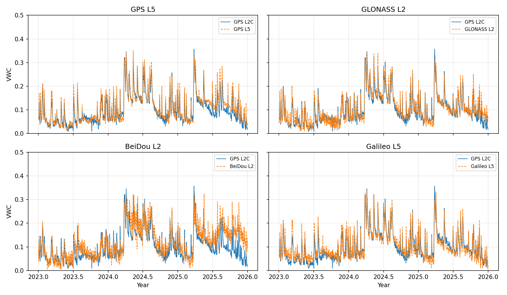

# Mitchell (Multi-GNSS)

## metadata

**Station Name:** mchl (mchl00aus)

**Location:** Walhallow, Queensland, Australia

**Ellipsoidal Coordinates:**

- Latitude: -26.359 degrees
- Longitude: 148.145 degrees
- Height: 534.591 meters

[Station Page at Nevada Geodetic Laboratory](http://geodesy.unr.edu/NGLStationPages/stations/MCHL.sta)

**Archives:** CDDIS, BKG-IGS, GA

## Step 1: GNSS-IR

Generate SNR files for all four constellations over the three-year window. I use `-orb gnss-gfz`, which includes BeiDou, and `-par 10` to use 10 parallel threads. 

<code>rinex2snr mchl00aus 2023 1 -doy_end 365 -year_end 2025 -archive ga -orb gnss-gfz -par 10</code>

Set up analysis parameters with all GNSS signals enabled:

<code>gnssir_input mchl -fr 1 20 5 101 102 201 205 206 207 208 301 302 305 306 307 308</code>

Run `gnssir` across the window:

<code>gnssir mchl 2023 1 -doy_end 365 -year_end 2025 -par 10</code>

## Step 2: Soil Moisture

Build `tracks.json` and `vwc_tracks.json` from the run's results:

<code>vwc_input mchl 2023 -year_end 2025</code>

Estimate phase:

<code>phase mchl 2023 1 -doy_end 365 -year_end 2025 -par 10</code>

Run `vwc`. The code loops over every frequency in `vwc_tracks.json` and produces a VWC series per constellation. Plots are suppressed when run with multiple frequencies:

<code>vwc mchl 2023 -year_end 2025</code>

Run for a single frequency to show plots: 

<code>vwc mchl 2023 -year_end 2025 -fr 101</code>

## Results

Final VWC, one example frequency per constellation (clockwise from top-left: GPS L5, GLONASS L2, Galileo L5, BeiDou L2). GPS L2C (blue) is overlaid on every panel as a reference:

Per-frequency output files land in `$REFL_CODE/Files/mchl/vwc_outputs/<SIGNAL>/mchl_vwc_<SIGNAL>_24hr+0.txt`.
