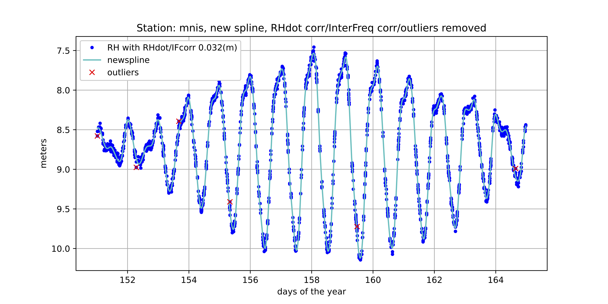
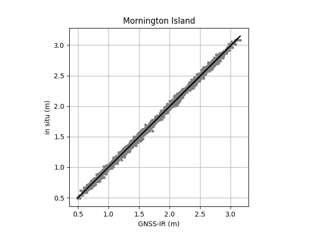
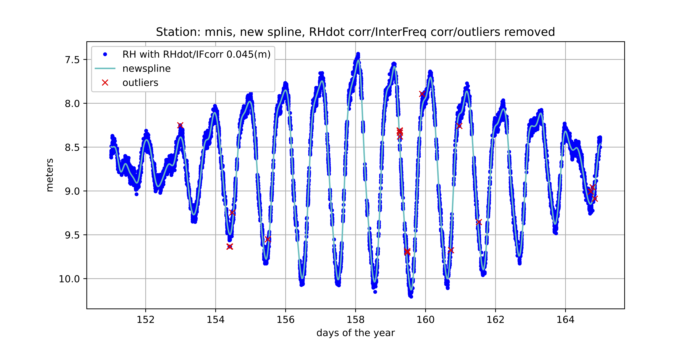

# Mornington Island, Australia

## MNIS00AUS

**Archive:** Geoscience Australia

Although this site has a pretty small region of acceptable azimuths, it 
produces beautiful reflector heights.

**Standard processing (one RH per arc):**

**But is it accurate? Yes, it is.**

**Using the ellist option for overlapping arcs:**

**Acknowledgement:** State of Queensland, Department of Environment and Science

