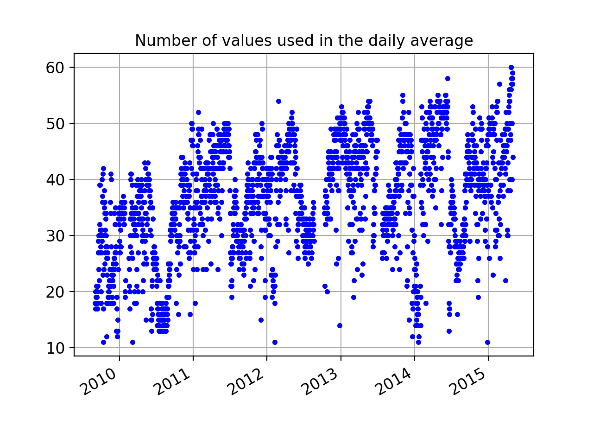
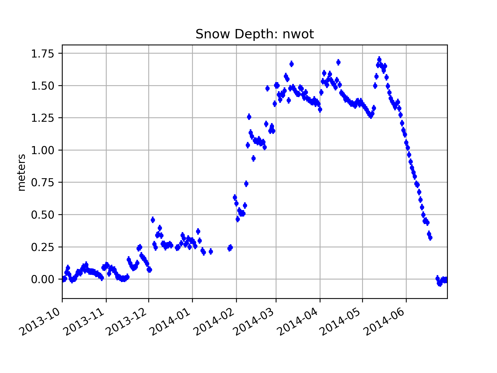

# Niwot Ridge, Colorado, USA

## nwot

[Warning](warning.md)

**Status:** The equipment has been installed and removed multiple times. As of spring 2020,
it is no longer available.

**Station name:** nwot

**Location:** [Niwot Ridge LTER](https://nwt.lternet.edu)

**Archive:** [UNAVCO](https://www.unavco.org)

**Ellipsoidal Coordinates:**

- Latitude: 40.05539 

- Longitude: -105.59053

- Height(m): 3522.729 

[UNAVCO station page](https://www.unavco.org/instrumentation/networks/status/nota/overview/NWOT)

### Data Summary

Station nwot was originally installed/designed by Jim Normandeau (UNAVCO) to support GPS reflections research 
by Kristine Larson, Eric Small, Ethan Gutmann, Felipe Nievinski, and Mark Williams at the University of Colorado. 

nwot was deliberately made to be taller than the typical geodetic antenna so that it would never be 
buried by snow. It is approximately 3 meters above the bare soil surface. Because it was 
installed to support testing GPS reflections, nwot has always tracked L2C.
nwot was also part of [PBO H2O](http://cires1.colorado.edu/portal/?station=nwot).

The site has not generally been used by geodesists and there is very little useful information 
about when data are available at either UNAVCO or Nevada Reno (i.e. no time series).
After the original receiver failed in spring 2015, a new receiver was installed sometime in 2017 by 
Mark Raleigh (now at the University of Oregon). The receiver failed in 2020 and was removed two years later.
We will focus here on the data between 2009-2015.

### Make a SNR File and run quickLook

We will start by making a single SNR file. Here there are two options. The main 
archive for this dataset only provides the high-quality
L2C data in the highrate (1-sec) area. We do not need this sample rate for a GPS site that is 
three meters tall. To speed things up, we strongly encourage you to use the "special" archive option.  Here
the 1-sec data have been decimated to 15 seconds:

<code>rinex2snr nwot 2014 270 -archive special</code>

If for any reason this command does not work, please use the direct command:

<code>rinex2snr nwot 2014 270 -archive unavco -rate high -dec 15</code>

Both L1 and L2C signals can be used at this site, though the L2C data are **far superior** in quality
to the L1 data. Use this **quickLook** command to get a sense of the quality of the 
reflector height (RH) retrievals. First L1:

<code>quickLook nwot 2014 270 </code>

These periodograms are a bit ratty in the low RH area. There are 
nice strong peaks in the southern quadrants. Now try L2:

<code>quickLook nwot 2014 270 -fr 2</code>

This plot will have both L2C and non-L2C. But it is easy to see why I don't use non-L2C. They are
the failed tracks in the gray that I have circled.

### Make multiple years of SNR files 

We are going to look at the data from installation (Fall 2009) through Spring 2015 :

<code>rinex2snr nwot 2009 240 -year_end 2015 -doy_end 120 -archive special</code>

### Run gnssir for multiple years

Save your <code>gnssir</code> analysis strategy:

<code>gnssir_input nwot -e1 7 -e2 25 -peak2noise 3.2 -azlist2 90 270 -frlist 1 20 </code>

I have opted to only use the southern quadrants (azimuths 90 through 270). Note that since
L5 was not tracked at this site, only 1 and 20 are set in the frequency list. I am using a minimum elevation
angle of 7 degrees because this particular receiver had a limit on the number of satellites it 
could track. In some cases this meant the low elevation data are not available and that triggers 
QC restrictions. 

Once you have a strategy set up, run <code>gnssir</code> for the years 2009-2015:

<code>gnssir nwot 2009 1 -doy_end 366 -year_end 2015 </code>

### Compute daily average RH values

Use the <code>daily_avg</code> utility to compute RH for each day. A median filter of 0.25 meter is used
to eliminate large outliers and a minimum number of tracks is set to 10. This is relatively
low because of the small number of L2C transmitting satellites in the early years of 
the dataset. The year inputs here are optional.

<code>daily_avg nwot 0.25 10 -year1 2009 -year2 2015</code>

produces this plot:

and [this file](nwot_dailyRH.txt). The files will be stored in the $REFL_CODE/Files directory.

You are also shown how many successful retrievals there are each day so that you can change that
input if you prefer:

### Validation

We installed the GPS site at Niwot Ridge because there was a long-standing experiment 
for measuring snow depth (and snow water equivalent). We therefore have a way to assess
accuracy. We download the *in situ* data from 

the [Niwot Ridge facility.](https://portal.edirepository.org/nis/mapbrowse?packageid=knb-lter-nwt.31.18)
We will compare to pole 16, which is shown in the photograph above. 
The relevant Niwot Ridge csv file is provided here: 

[in situ data from the Niwot Ridge LTER](saddsnow.dw.data.csv.gz)

If the daily average RH file created above is stored in the same directory 
as the Niwot Ridge *in situ* datafile, you can use 
[this python script](nwot_usecase.py) to visually compare them:

<code>python nwot_usecase.py</code>

We have used the data from the fall to set the bare soil value 
for reflector height (RH_baresoil). Snow depth is then defined as:

<code>snow depth = RH_baresoil - RH</code>

Please keep in mind that the pole measurements are not representative of the same
footprint as the GPS measurements. The latter cover an average over a much larger region.

## snowdepth utility

After this use case was first written the <code>snowdepth</code> module was developed.
It requires an input of station name and (North American) water year. It requires that you 
run <code>daily_avg</code> prior to running <code>snowdepth</code> OR you input that module's 
required parameters on the command line. Assuming I have run <code>daily_avg</code>:

<code>snowdepth nwot 2014</code>

produces:

and a plain text list of daily snow accumulation values. 
The bare soil dates are configurable - here I used the defaults (which are to use September 1-30).

## Publications about nwot
Please see the following for a lengthier discussion of this site:

[Gutmann, E., K. M. Larson, M. Williams, F.G. Nievinski, and V. Zavorotny, 
Snow measurement by GPS interferometric reflectometry: an evaluation at Niwot Ridge, Colorado, Hydrologic Processes, Vol. 26, 2951-2961, 2012](https://www.kristinelarson.net/wp-content/uploads/2015/10/GutmannEtAl_2012.pdf)

[Nievinski, F.G. and K.M. Larson, Inverse Modeling of GPS Multipath for Snow Depth Estimation, Part II: Application and Validation, IEEE TGRS, Vol. 52(10), 6564-6573, doi:10.1109/TGRS.2013.2297688, 2014](https://www.kristinelarson.net/wp-content/uploads/2015/10/felipe_inv2_revised.pdf)

[Nievinski, F.G., Ph.D. Dissertation, University of Colorado, 2013](https://www.researchgate.net/publication/258848060_Forward_and_Inverse_Modeling_of_GPS_Multipath_for_Snow_Monitoring)
