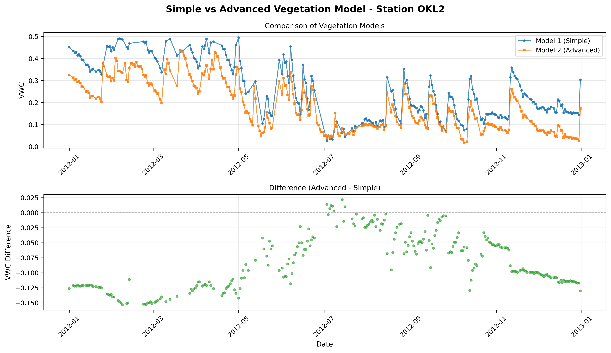

# Stillwater, Oklahoma

## metadata

**Station Name:** okl2

**Location:** Oklahoma, USA

**Archive:** UNAVCO

**Ellipsoidal Coordinates:**

- Latitude: 36.063492 degrees
- Longitude: -97.216964 degrees
- Height: 328 meters

This use case demonstrates the **advanced vegetation model (model 2)** for soil moisture
estimation at a well-studied site in Oklahoma with significant vegetation effects.

## Background

Station okl2 was analyzed as part of the original PBO H2O network and has been used
extensively for validating GNSS-IR soil moisture algorithms. The site experiences
significant seasonal vegetation that requires correction to obtain accurate soil moisture
estimates.

## Step 1: GNSS-IR

Begin by generating the SNR files using the special archive for L2C data:

<code>rinex2snr okl2 2012 1 -doy_end 366 -rate high -dec 15 -par 10</code>

We must use <code>-rate high</code> to locate the correct file, and I optionally add <code>-dec 15</code> for smaller file sizes and <code>-par 10</code> for parallel downloads.

Now set up the analysis strategy:

<code>gnssir_input okl2 -fr 20</code>

Run <code>gnssir</code> to estimate reflector heights:

<code>gnssir okl2 2012 1 -doy_end 366 -par 10</code>

## Step 2: Soil Moisture with Simple Model (Model 1)

First, let's run the standard simple vegetation model for comparison.

Pick the satellite tracks:

<code>vwc_input okl2 2012</code>

Estimate phase for each satellite track:

<code>phase okl2 2012 1 -doy_end 366 -par 10</code>

Convert phase to volumetric water content using the simple model (default):

<code>vwc okl2 2012</code>

This produces the standard VWC output using model 1 (simple vegetation correction). Copy the file so it is not overwritten by the next step: <code>$REFL_CODE/Files/okl2/okl2_vwc_L2_24hr+0.txt </code>

## Step 3: Soil Moisture with Advanced Model (Model 2)

Now run the advanced vegetation model:

<code>vwc okl2 2012 -vegetation_model 2</code>

The advanced model applies Clara Chew's track-level KNN correction algorithm as described
in [DOI 10.1007/s10291-015-0462-4](https://doi.org/10.1007/s10291-015-0462-4).

We can plot the results of each method to compare them:

### Key Ideas

**Model 1 (Simple):**
- First aggregate measurements into daily (or subdaily) bins
- Then take the average phase of every measurement in the bin
- Finally, convert that averaged phase value to VWC by a fixed scalar (1.48)

**Model 2 (Advanced):**
- This model determines track-by-track corrections at the phase level, prior to VWC conversion.
- The phase -> VWC conversion scaler is also variable (this is the "slope correction")
- Both the phase and slope corrections are found from a lookup table (created by Clara Chew)
- The corrections are determined based on a smoothed value of (1) amplitude of interference pattern, (2) amplitude of LSP peaks, and (3) effective RH. 
  - Each of these inputs will change throughout the year as vegetation structure and density changes

### Saving Individual Track Data

To save detailed track-level data for further analysis:

<code>vwc okl2 2012 -vegetation_model 2 -save_tracks T</code>

Individual track files are saved to:

<code>$REFL_CODE/Files/okl2/individual_tracks/</code>
