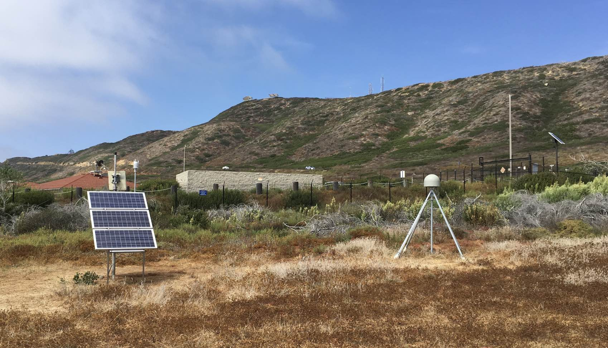
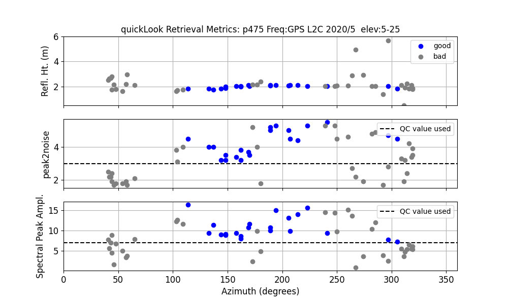
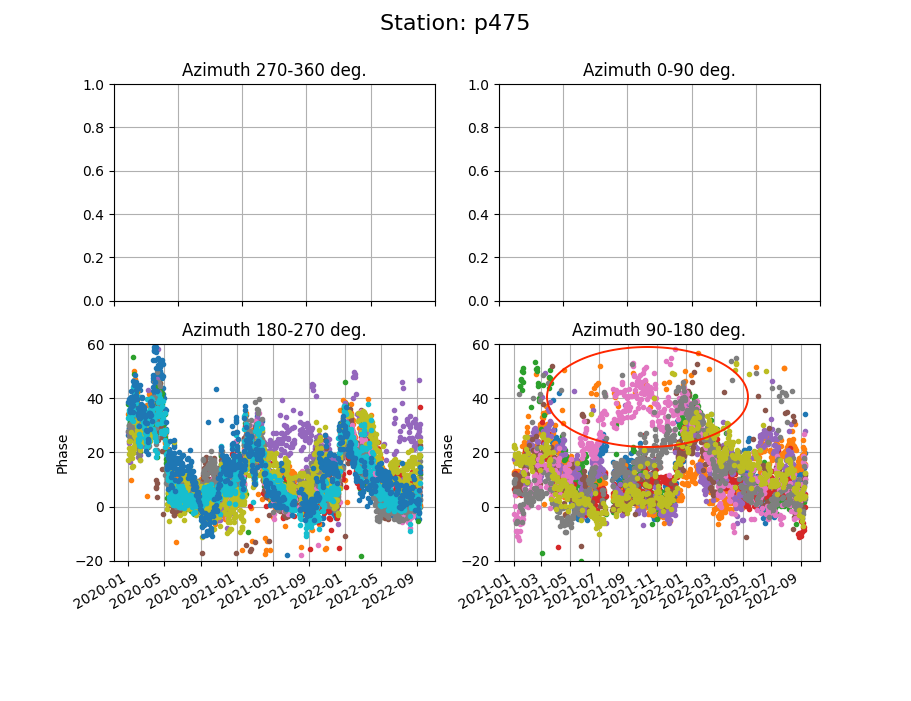
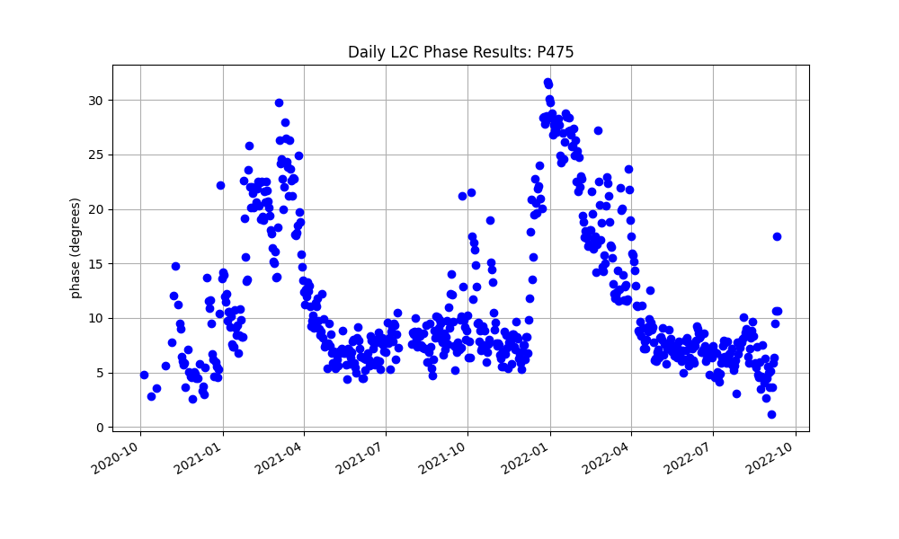
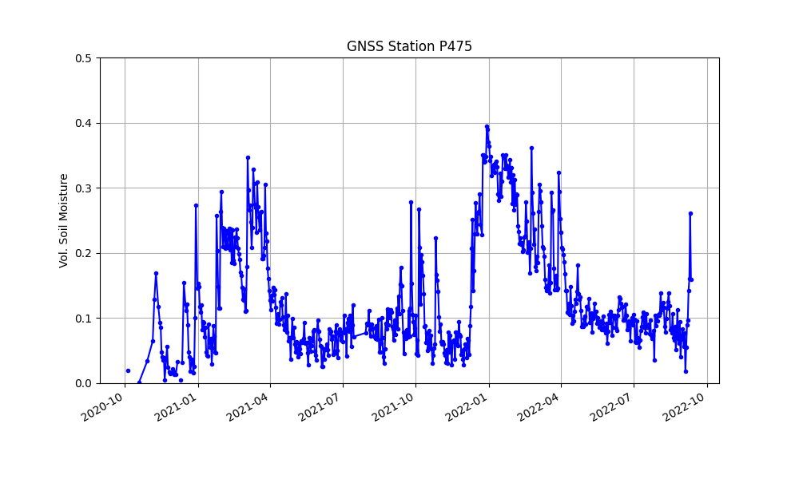

# San Diego California

2023 October 5

This use case is difficult - and I am no longer recommending that people use it.

[Warning](warning.md)

## metadata

**Station Name:** p475

**Location:** Point Loma, CA, USA

**Archive:** [UNAVCO](http://www.unavco.org)

[Station Page at UNAVCO](https://www.unavco.org/instrumentation/networks/status/nota/overview/P475)

 
P475 was a PBO site. Soil moisture can be extracted, but it is a challenging case. To access 
L2C from the original PBO datasets, 1-Hz data must be downloaded and decimated to 15 seconds. To avoid 
having to do this, we will only use data from the Septentrio receiver (years 2020 thru 2022 ) where the UNAVCO archive 
provides direct access to high-quality SNR data in 15 second files. 

## Step 0: Run quickLook

Make one SNR file:

<code>rinex2snr p475 2020 5 -archive unavco</code>

Run quickLook:

<code>quickLook p475 2020 5 -fr 20</code>

There is only a limited region with good reflections.  This means we will also need to 
easy up on the number of good arcs the code will expect to see.

## Step 1: GNSS-IR

<code>rinex2snr p475 2020 1 -year_end 2022 -doy_end 254 -archive unavco </code>

The analysis parameters are set up with <code>gnssir_input</code>. 
We only need the L2C data, so have set the parameter accordingly.
The azlist2 input emphasizes the good reflection area. 

<code>gnssir_input p475 -l2c T -azlist2 140 270</code>

Now we run <code>gnssir</code>. This will be needed for estimate *a priori* reflector heights for the soil moisture code.

<code>gnssir p475 2020 1 -year_end 2022 -doy_end 254 </code>

## Step 2: Soil Moisture

[Please read the soil moisture user manual.](../pages/README_vwc.md) It is very short and 
has a lot of tips that will save you time.

We need a list of satellite tracks to use:

<code>vwc_input p475 2021</code>

Now we estimate the phase for each satellite track on each day in 2020 and 2021:

<code>phase p475 2020 1 -year_end 2022 -doy_end 254 </code>

Finally, convert the phase to volumetric water content:

<code>vwc p475 2020 -year_end 2022</code>

A warning comes to the screen that you very likely will not have enough tracks per day -
or at least you should lower the requirement. Try again ...

<code>vwc p475 2020 -year_end 2022 -minvalperday 8</code>

Phase results plotted in geographic coordinates:

I have circled a pretty bad track (the satellite in pink) - so I would
tell you to consider to removing it. The lilac satellite in the southwest quadrant 
doesn't look so good either!  The names of the satellites can be determined
from the statistics that are sent to the screen.

Daily phase average:

Finally : 

Kristine M. Larson November 23, 2022
