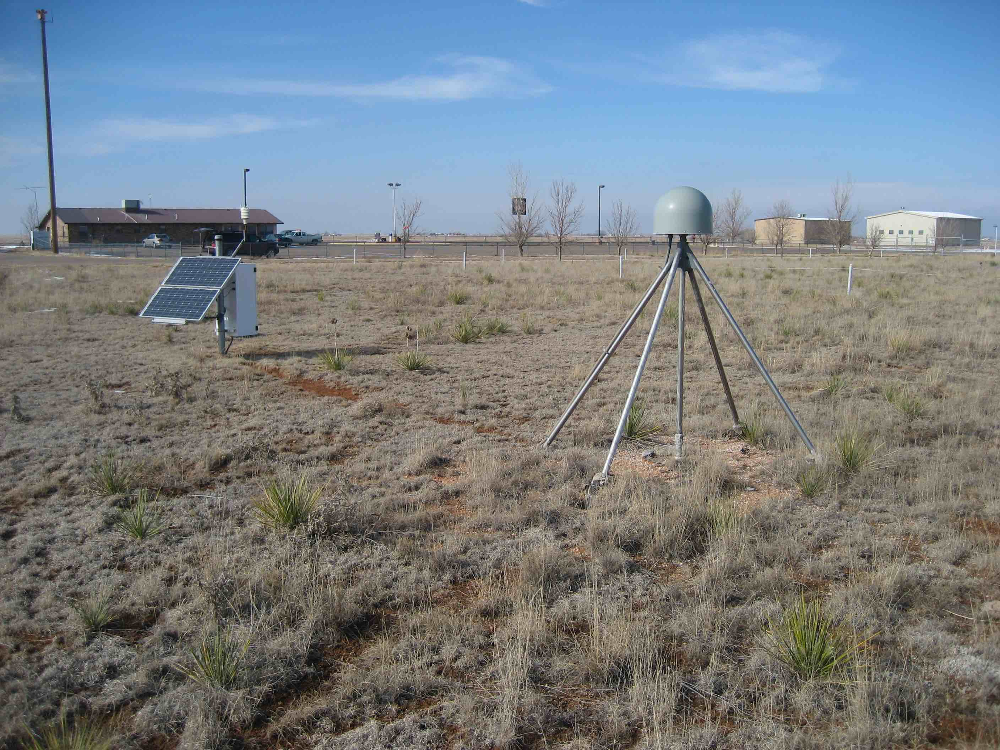
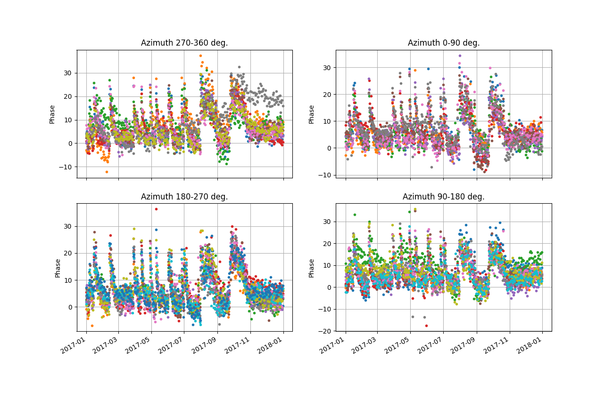
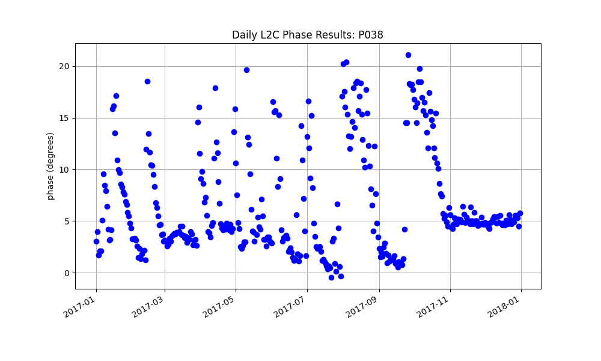

# Portales New Mexico

Warning: This codes does not currently check for equipment changes.
This makes a big difference at P038 - you should not compute VWC 
across equipment changes. This site's equipment was upgraded in March 2021.

[Warning about Earthscope/UNAVCO](warning.md)

## metadata

**Station Name:** 	p038

**Location:** Portales, NM, USA

**Archive:** [UNAVCO](http://www.unavco.org)

**Ellipsoidal Coordinates:**

- Latitude: 34.14726 degrees

- Longitude: -103.40734 degrees

- Height: 1212.982 meters

[Station Page at UNAVCO](https://www.unavco.org/instrumentation/networks/status/nota/overview/P038)

[Google Maps Link](https://www.google.com/maps/place/34%C2%B008'50.1%22N+103%C2%B024'26.4%22W/@34.14725,-103.4073333,17z/data=!3m1!4b1!4m5!3m4!1s0x0:0x64e449f205085274!8m2!3d34.14725!4d-103.4073333) 

P038 was a PBO site and a [PBO H2O site](https://gnss-reflections.org/pboh2o?station=p038). The data 
from 2017 will be analyzed here as a test case. We will start by analyzing the data 
using the normal reflector height (GNSS-IR) processing. Then we will use those results to run the soil moisture code.

## Step 1: GNSS-IR
Begin by generating the SNR files. Although typically PBO sites do not have L2C 
data in their low-rate RINEX files, UNAVCO is providing these data in the "special" archive section
so that people can test out this code.

<code>rinex2snr p038 2017 1 -doy_end 365 -archive special</code>

If you want to remind yourself why the L2C data are superior to the L1 data recorded for this receiver, use <code>quickLook</code>.

We only need the L2C data, so have set the parameter accordingly.

<code>gnssir_input p038  -l2c true</code>

The json file is saved at $REFL_CODE/input/p038.json

Now we run <code>gnssir</code>. This will be needed for estimate a priori reflector heights for the soil moisture code.

<code>gnssir p038 2017 1 -doy_end 365 </code>

## Step 2: Soil Moisture

[Please read the soil moisture user manual.](../pages/README_vwc.md) It is very short and has a lot of tips that will save you time.

We need a list of satellite tracks to use:

<code>vwc_input p038 2017</code>

This creates a file that is stored in $REFL_CODE/input/p038_phaseRH.txt

Now we estimate the phase for each satellite track on each day:

<code>phase p038 2017 1 -doy_end 365</code>

Finally, convert the phase to volumetric water content:

<code>vwc p038 2017</code>

Phase results plotted in geographic coordinates:

Daily average phase:

Model inputs:

Final results:

By default the final VWC results go to:

$REFL_CODE/Files/p038/p038_vwc.txt

Thank you to Naoya Kadota for test driving this use case.

Kristine M. Larson September 14, 2022
