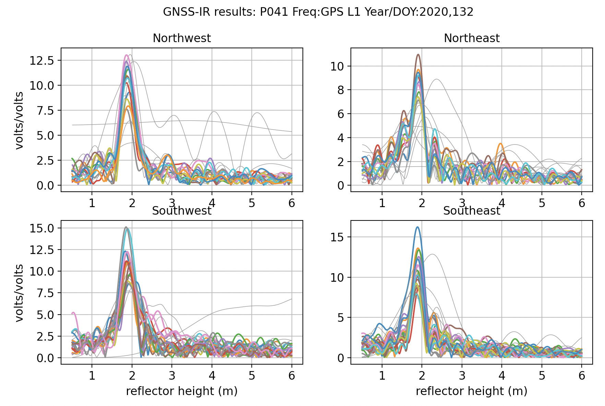
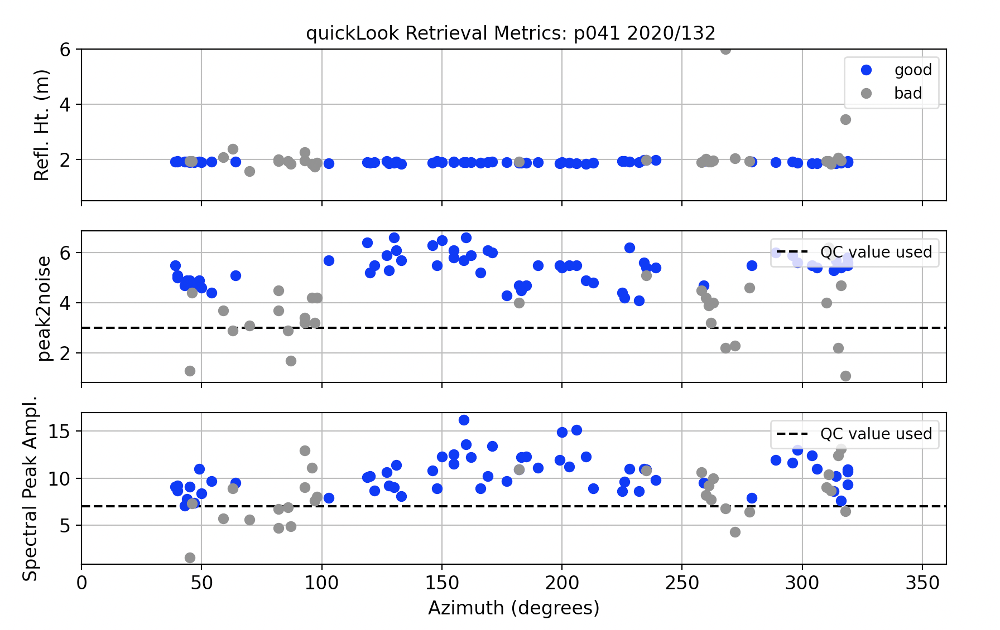

# Marshall, Colorado, USA

This use case needs to be updated to include the use of the 
[snowdepth](https://gnssrefl.readthedocs.io/en/latest/api/gnssrefl.snowdepth_cl.html) module.
Please improve this use case by making a pull request with the relevant software calls.

## metadata

[Warning](warning.md)

**Station Name:** p041 

**Location:** Boulder, CO, USA

**DOI:**  	[https://doi.org/10.7283/T5R49NQQ](https://doi.org/10.7283/T5R49NQQ)

[Station Page at UNAVCO](https://www.unavco.org/instrumentation/networks/status/nota/overview/P041)

[Station Page at Nevada Geodetic Laboratory](http://geodesy.unr.edu/NGLStationPages/stations/P041.sta)

[Google Map Link](https://goo.gl/maps/GwGV8PS4CQVQzYHC7) 

## Data Summary

The p041 antenna is ~2 meters above the soil surface. It is located at Marshall Mesa, Colorado.
The site is relatively planar and free of obstructions. Since October 2018 the site has 
recorded multi-GNSS signals. Marshall Mesa has been featured in multiple publications on GNSS-IR:

* [Use of GPS Receivers as a Soil Moisture Network for Water Cycle Studies (2008)](https://www.kristinelarson.net/wp-content/uploads/2015/10/larson_soil_grl2008.pdf)

* [Can We Measure Snow Depth with GPS Receivers (2009)](https://www.kristinelarson.net/wp-content/uploads/2015/10/larsonetal_snow_2009.pdf) 

* [Sensing Vegetation Growth with Reflected GPS Signals (2010)](https://www.kristinelarson.net/wp-content/uploads/2015/10/small_etal_2010.pdf) 

To get a sense of whether an azimuth or elevation mask is appropriate, 
check the [Reflection Zone Mapping in the web app](https://gnss-reflections.org/rzones?station=p041&lat=39.9495&lon=-105.1943&height=1728.842&msl=on&RH=2&eang=2&azim1=0&azim2=360).  
In the linked page, the reflection zones from 5 to 25 degree elevation angles are plotted as 
colored ellipses surrounding the station.  

## Take a Quick Look at the Data

Translate a RINEX file:

<code>rinex2snr p041 2020 132</code>

Then use **quickLook** to analyze the reflection characteristics of 
the site [(For details on quickLook output)](../pages/quickLook.md).

The default return is for the L1 frequency:

<code>quickLook p041 2020 132</code>

The code also summarizes these RH retrievals in terms of 
azimuth (x-axis) and QC metrics:

Now try looking at the periodogram for L2C by specifying frequency 20:

<code>quickLook p041 2020 132 -fr 20</code>

Note that there are more colors in the L1 plots than in the L2C plots. That is 
the result of there being more L1 transmitting satellite than L2C transmitting satellites.

The **quickLook** code has multiple options. For example, it is possible change the reflector height range:

<code>quickLook p041 2020 132 -h1 0.5 -h2 10</code>

To look at Glonass and Galileo signals, the SNR files must be created using the -orb gnss flag.
If you have already made a file using only the GPS data, you will need the overwrite flag.

<code>rinex2snr p041 2020 132 -orb gnss -overwrite True</code>

Beidou signals are tracked at this site, but unfortunately the data 
are not available in the RINEX 2.11 file. They are very likely available in the 
RINEX 3 file, so you are encouraged to look there. Contact Earthscope if you have 
any trouble accessing data for this site.

**quickLook** is meant to be a visual assessment of the 
spectral characteristics at a given site on a given day. For routine analysis, one must use **gnssir**.

## Analyze the Data

We will start by setting up the analysis parameters. These are stored 
in a json file. In this case, the p041 RINEX data are multi-gnss, so you could 
set the options to allow all frequencies from all constellations.
Here we are going to concentrate on GPS-only, which is the default. We have set stricter QC values by 
setting the amplitude minimum to 8 and the peak 2 noise ratio to 3.2:

<code>gnssir_input p041 -allfreq True -peak2noise 3.2 -ampl 8 </code>

We are going to look at a subset of p041 data from 2019/2020 to look at changes due to 
snow accumulation. The series will begin doy 245 (2019) and end on doy 70 (2020).  

<code>rinex2snr p041 2019 245 -doy_end 365 -archive unavco</code>

<code>rinex2snr p041 2020 1 -doy_end 70 -archive unavco</code>

Now run **gnssir** for 2019/2020:

<code>gnssir p041 2019 1 -doy_end 366 -year_end 2020 </code>

The RH results from **gnssir** are stored in $REFL_CODE/2019/results/p041 and $REFL_CODE/2020/results/p041. 

Typically a daily average is sufficient for climatology studies.
To ensure the average is meaningful and not impacted by large outliers, 
a median filter (meters) is used and a minimum number of tracks is required. Here a median filter of 0.15 meter is used and 80 tracks are required. Either of these parameters can be changed depending on your site.
In this particular example, I only used three GPS frequencies, L1, L2C, and L5.

<code>daily_avg p041 .15 80</code>

Three plots are created. All RH retrievals:

A summary of how many values are being used in the daily average:

And the daily RH average:

The location of the output files are printed to the screen.
