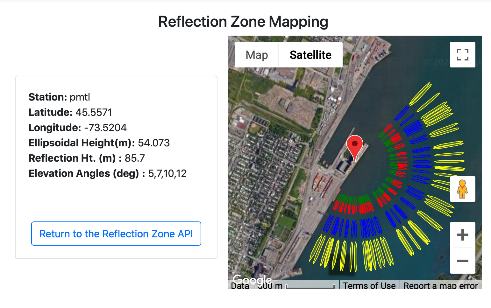

# St Lawrence River

To the best of our knowledge, access to the current high-rate data streams
needed to do reflectometry at this site is no longer allowed. Please contact NRCAN for further information.

The data used in the test case described below *are* still available. Originally we used *teqc*
to merge the hourly files required, but this code is no longer supported by UNAVCO. We have 
replaced it with *gfzrnx* which is supported by GFZ.

## metadata

**Station Name:**  pmtl

**Location:** Port de Montreal, Montreal, Canada

**Archive:**  [NRCAN](https://www.nrcan.gc.ca/home)

**Ellipsoidal Coordinates:**

- Latitude: 45.557

- Longitude: -73.520

- Height: 54.073 m

[Station Page at Natural Resources Canada](https://webapp.geod.nrcan.gc.ca/geod/data-donnees/station/report-rapport.php?id=M0722900)

[Station Page at Nevada Geodetic Laboratory](http://geodesy.unr.edu/NGLStationPages/stations/PMTL.sta)

[Google Map Link](https://goo.gl/maps/FoJ68HDT2KZ6KnZc7)

### Data Summary

Station PMTL is located on the Viterra Montreal Terminal building on the St Lawrence River in 
Montreal, Canada. It is operated by the Montreal Port Authority.

GPS L1 and Glonass L1 and L2 can be used for this site. Since the site is more than 60 meters above the water, you need to 
use high-rate GNSS data. 

Note the [ellipsoidal height and geoid corrected height](https://gnss-reflections.org/geoid?station=pmtl). To pick an 
azimuth and elevation mask, try the [reflection zone webapp](https://gnss-reflections.org/rzones) with station name pmtl, varying elevation angles, and different azimuth limits. Here is one effort:

### quickLook

Make a SNR file for multi-GNSS and high-rate:

<code>rinex2snr pmtl 2020 330 -archive nrcan -rate high -orb gnss</code>

<code>quickLook pmtl 2020 330 -h1 40 -h2 90 -e1 5 -e2 12</code>

I have annotated this <code>quickLook</code> periodogram to point out that there is an outlier in the SW region. 
You can also see that the NW region is useless, which is what we should expect. 
Windowing down the reflector region and using day of year 270:

The QC plot gives the azimuth windows - and help on setting the required amplitude and peak to noise ratio.
Retrievals are not returned near 90 degrees because of the satellite inclination and the way the 
azimuth regions are defined in <code>quickLook</code>. It does not mean there are obstructions in that direction.

### Analyze the Data

Set up analysis instructions, using only GPS L1, and Glonass.  

<code>gnssir_input pmtl -h1 75 -h2 85 -e1 5 -e2 12 -peak2noise 3 -ampl 7 -frlist 1 101 102 -azlist2 45 205</code>

Make the SNR files (this takes a long long time):

<code>rinex2snr pmtl 2020 270 -doy_end 300 -archive nrcan -rate high -orb gnss</code>

This is also slow - though not as slow as translating RINEX files and computing orbits:

<code>gnssir pmtl 2020 270 -doy_end 300 </code>

One way to make the gnssir code run faster would be to loosen up the RH precision.  Since you 
are using daily averages, it is not necessary to use the default of 5 mm.  10 mm would suffice.
This needs to be hand-edited in the json file.

Now compute daily averages:

<code>daily_avg pmtl 0.25 50 -txtfile pmtl-rh.txt </code>

All tracks:

The daily average:

[Daily average RH file](pmtl-rh.txt)

### Accuracy

The Canadian Hydrographic Service within Fisheries and Ocean Canada operates tide gauges along the St Lawrence 
River, the closest of which is Montreal Jetee #1 (station 15520), about 1 km south of the GNSS site. 
Tide data can be [downloaded](https://www.isdm-gdsi.gc.ca/isdm-gdsi/twl-mne/inventory-inventaire/interval-intervalle-eng.asp?user=isdm-gdsi&region=PAC&tst=1&no=15520). Use the daily mean water level and UTC when submitting a request and download the resulting csv file. 

For this use case, the tidal data have already been [downloaded](pmtl.csv). 
Given that there is quite drastic water level changes within a day, it is entirely
plausible that the correlation will improve if using the subdaily RH and hourly tide gauge data.

[Code for comparison](pmtl_usecase.py)

