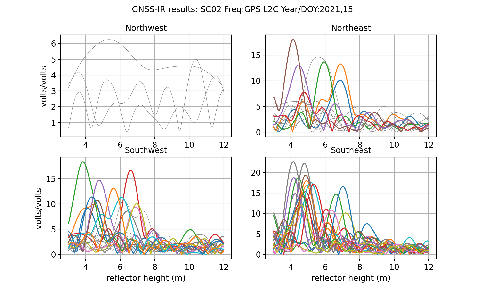

# Friday Harbor

## sc02

[Warning](warning.md)

**Use Case Updated June 4, 2023 to use gnssir_input. Your outputs will be slightly 
different than those shown here.**

**Station Name:** sc02

**Location:** Friday Harbor, Washington, USA 

**Archive:** UNAVCO

**Ellipsoidal Coordinates:**

- Latitude: 48.546

- Longitude: -123.008  

- Height: -15.049 m

[Station Page at UNAVCO](https://www.unavco.org/instrumentation/networks/status/nota/overview/SC02)

[Station Page at Nevada Geodetic Laboratory](http://geodesy.unr.edu/NGLStationPages/stations/SC02.sta)

[Colocated NOAA tide gauge](https://tidesandcurrents.noaa.gov/stationhome.html?id=9449880)

[Google Maps](https://www.google.com/maps/place/48°32'45.6%22N+123°00'28.8%22W/@48.546,-123.010194,17z/data=!3m1!4b1!4m5!3m4!1s0x0:0x0!8m2!3d48.546!4d-123.008)

### Data Summary

There have been *a lot* of papers written about sc02. That being said, it is not an ideal GNSS reflections site. It is set 
back a bit too far from the shore - and it would have been far superior for reflections if the antenna were
a bit taller. Furthermore, there are obstructions (docks). For further details, you are encouraged to read 
[this early paper](https://www.kristinelarson.net/wp-content/uploads/2015/12/LarsonRayWilliams-2017-FridayHarbor.pdf) 
summarizing a comparison of 10 years of GNSS-IR results with the colocated tide gauge operated by NOAA. That paper only
used the GPS L1 SNR data.  Since that time a multi-GNSS receiver has been installed and there is an order of 
magnitude increase in the number of useable signals. Here we will only use the low-rate (15 sec) data from this new receiver. 
If you are interested, UNAVCO does have a 1-sec dataset available for use.

Take some time to look at the [reflection zones webapp.](https://gnss-reflections.org/rzones?station=sc02) 
The goal is to play with the different elevation angle settings and azimuths. This screen 
shot shows clearly that not all azimuths are going to work. But it does not tell you which 
elevation angles will be over water and which will not. The default will use mean sea level -
but keep in mind that the reflector heights will not always be at mean sea level. so you might
try using different reflector heights to see how those reflection zones change. We have 
data from the site, so you can check later to see which ones are the limiting reflector 
heights.

### Take a quick look at the SNR data

Translate the GPS data for January 15 2021. First you need to make the SNR file:

<code>rinex2snr sc02 2021 15</code>

Use our utility <code>quickLook</code> with defaults [(For more details on quickLook output)](../pages/quickLook.md):

<code>quickLook sc02 2021 15 </code>

These results for reflector height in the top panel are pretty bad (gray means the retrieval does not pass QC). Why? 
The reflector height defaults are restricted to 0.5-6 meters, which includes part of 
the tidal range, but not all of it. Furthermore, the default elevation angles of 5 to 25 degrees are 
not acceptable here, as these elevation angles include rocks and soil in addition to the water.

Now let's make better choices. Following the suggestions of *Larson, Ray, and Williams* (2017), use 
elevation angle restrictions of 5 to 13 degrees and reflector height restrictions of 3 to 12 meters. And let's 
use a modern GPS signal, L2C.

<code>quickLook sc02 2021 15 -e1 5 -e2 13 -h1 3 -h2 12 -fr 20</code>

Now instead of vast numbers of unsuccessful reflector height retrivals, you can begin to 
see where the acceptable azimuths will be, ~50 to 230 degrees. A peak to noise ratio 
of 3 works pretty well.  The Lomb Scargle periodograms show the 
retrievals in periodogram space. You can see here that the northwest
is a dead zone for water reflections, and that was expected.

We can also check the retrievals stats for L1 to make sure these look good too.

### Measure Tides with GNSS-IR

We will not attempt to analyze a long time series, but instead focus here on 
the process. We will be using three+ weeks of GNSS data from 2021 as our sample dataset.
The orbit option is used to make sure that multi-GNSS signals can be used.  

<code>rinex2snr sc02 2021 15 -doy_end 40 -orb gnss</code>

Then you need to make the list of analysis inputs. 

<code>gnssir_input sc02   -e1 5 -e2 13 -h1 3 -h2 12 -peak2noise 3 -frlist 1 20 5 101 102 201 205 207 208 -azlist2 60  220</code>

Once you have the json file set up, you can go ahead and analyze all the data with a single command:

<code>gnssir sc02 2021 15 -doy_end 40 </code>

This produces reflector heights for every rising and setting satellite track that meets the 
quality control metrics that you have set. We have some preliminary code that will help you evaluate 
these RH retrievals. It is a work in progress, so it does not do everything yet. It starts  
by concatenating the daily results and applying a sigma outlier criterion . The default is set to 
2.5 sigma, but you can enter on the command line a more or less stringent value:

<code>subdaily sc02 2021</code>

The output is stored in a plain text or csv file. This code will also apply the RH dot correction. 

Below are shown the initial solutions with a spline fit and outliers identified.
Note: These figures were generated from an earlier version of the code, and should be 
updated.

Residuals to the spline fit with and without a RHdot correction:

**PLEASE NOTE: the RHdot corrected values are not written to column 3. Look into the file.**

A summary of the number of satellite arcs that are available:

Some statistics come to the screen that give you some perspective 
on the performance of the different frequencies and constellations.
Note that there *should* be biases because we have not yet applied 
*phase center corrections*. This also shows that the RHdot correction
should be applied at this site, as it does reduce the scatter. Once
the phase center corrections are made, the precision will be further 
improved.

<PRE>
RMS no RHdot correction (m)  0.139
RMS w/ RHdot correction (m)  0.106
Freq  Bias  Sigma   NumObs
       (m)   (m)
  1   0.08   0.11   1025
 20  -0.02   0.09    803
  5  -0.04   0.09    615
101   0.06   0.09    613
102  -0.03   0.10    667
201   0.07   0.09    603
205  -0.04   0.08    616
207  -0.03   0.08    617
208  -0.05   0.08    616
</PRE>

This is a standard Lomb Scargle analysis of reflection data at sc02.
Multiple authors have recommended using different analysis strategies, and 
you are most definitely encouraged to look at using these techniques. In most cases
smoothness strategies are used to improve the retrievals.  

I have recently posted Simon Williams tidal estimation code to python. I will do my best to add it to this 
package.

How well does this simple analyis compare 
to the [official NOAA tide gauge data stream?](https://tidesandcurrents.noaa.gov/stationhome.html?id=9449880)

You can download the NOAA data yourselves or use our utility:

<code>download_tides 9449880 noaa -date1 20210115 -date2 20210209</code>

We then compared the two series. 

**PLEASE NOTE:**

Since I originally wrote this use case, I have added an option to <code>subdaily</code> to 
remove inter-frequency biases. The results of this analysis are written to a 
new file and the corrected RH values are in a new column! Please look at the file.

Here is a list of some of the publications using data from sc02. If you would like me to add more, submit a pull request.

* [Larson, L&ouml;fgren, Haas, Coastal Sea Level Measurements Using A Single Geodetic GPS Receiver, 2011](https://www.kristinelarson.net/wp-content/uploads/2015/10/Larson_TideGauge.pdf)

* [Larson, Ray, and  Williams, A ten year comparison of water levels measured with a geodetic GPS receiver versus a conventional tide gauge, 2017](https://www.kristinelarson.net/wp-content/uploads/2015/12/LarsonRayWilliams-2017-FridayHarbor.pdf)

* [Purnell, Gomez, Chan, Strandberg, Hobiger, Quantifying the Uncertainty in Ground-Based GNSS-Reflectometry Sea Level Measurements, 2021](https://www.researchgate.net/publication/343091181_Quantifying_the_Uncertainty_in_Ground-Based_GNSS-Reflectometry_Sea_Level_Measurements)

* L&ouml;fgren, Haas, and Scherneck, 2014 Sea level time series and ocean tide analysis from 
multipath signals at five GPS sites in different parts of the world.

* Wang, Zhang and Zhang, 2018 Sea level estimation from SNR data of geodetic receivers using wavelet analysis

