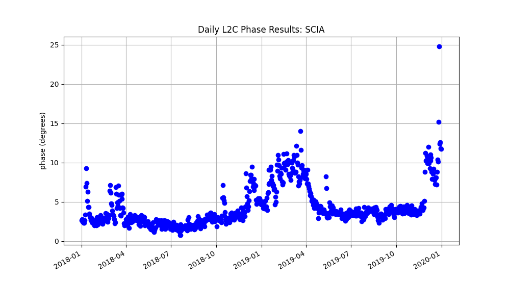
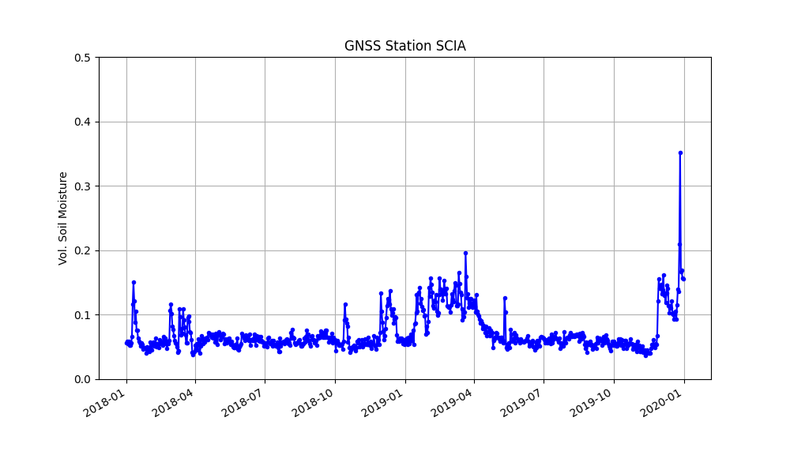

# Airport near Victorville, CA

[Warning](warning.md)

## scia

**Location:** Victorville, California, USA 

**Archive:** [UNAVCO](http://www.unavco.org)

[Station Page at UNAVCO](https://www.unavco.org/instrumentation/networks/status/nota/overview/SCIA)

[Station Page at Nevada Geodetic Laboratory](http://geodesy.unr.edu/NGLStationPages/stations/SCIA.sta)

L2C data are available at UNAVCO in the standard RINEX files for this site starting in 2018.

## Translate the SNR data/Estimate RH

<code>rinex2snr scia 2018 1 -archive unavco -doy_end 366 -year_end 2019</code>

Take a quick look at the L2C data:

<code>quickLook scia 2018 1 -fr 20</code>

**These are Lovely reflections!**

Set up (default) analysis stratgegy:

<code>gnssir_input scia -l2c T</code>

**Estimate reflector heights:**

<code>gnssir scia 2018 1 -doy_end 365 -year_end 2019 </code>

## Estimate Soil Moisture
[Please read the soil moisture user manual.](../pages/README_vwc.md) 
It is very short and has a lot of tips that will save you time.

We need a list of satellite tracks to use:

<code>vwc_input scia 2019</code>

Estimate the phase for each satellite track on each day:

<code>phase scia 2018 1 -doy_end 365 -year_end 2019</code>

Finally, convert the phase to volumetric water content:

<code>vwc scia 2019</code>

Phase results plotted in geographic coordinates:

Daily average phase:

What is going on at the end of 2019? A little googling:

If it is just rain, that's ok. If it is snow, that last very high point in 2019 is contaminated.
[This site says it was snow!](https://weatherspark.com/h/s/1975/2019/3/Historical-Weather-Winter-2019-in-Victorville-California-United-States#Figures-ObservedWeather)

Model inputs:

Final results:

Final VWC results are written to:

$REFL_CODE/Files/scia/scia_vwc.txt
