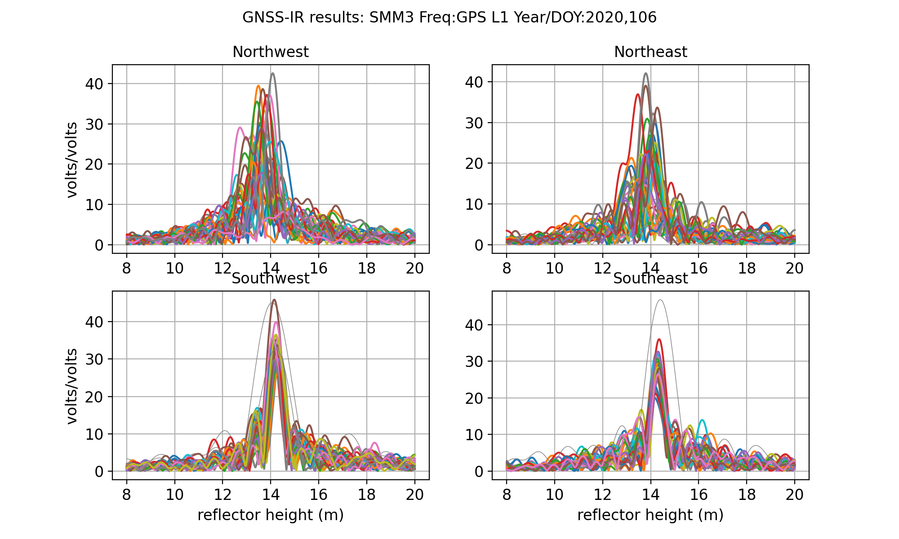
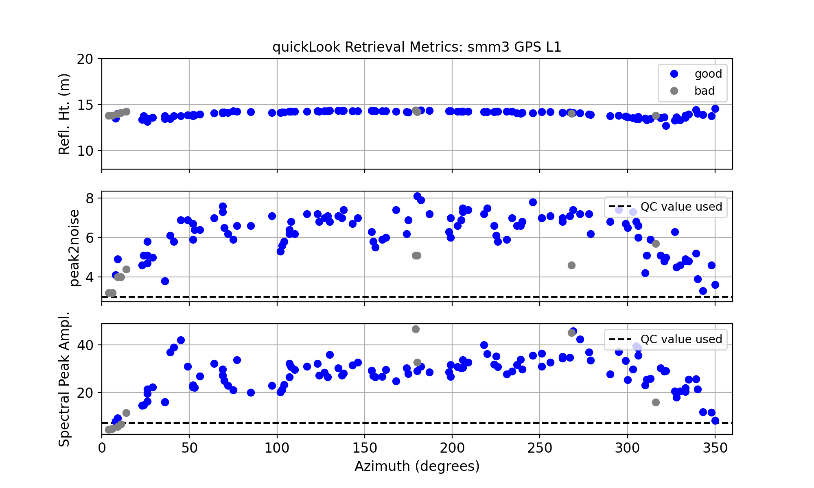
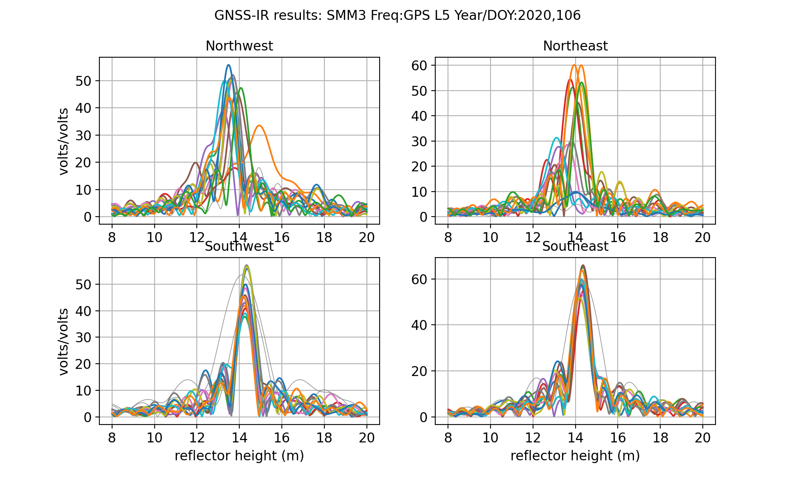

# Summit Camp, Greenland

[Warning](warning.md)

**Updated June 4 2023 to use gnssir_input**

Fixed azimuth region and frequency selection.
Noted issues with Galileo data.

Please note: this use case was originally written in late 2020. The dataset has been updated since that time.
Sometimes Galileo is tracked; sometimes it is not tracked. There has also been an equipment
change - so you should make sure that you do not interpret small vertical biases at that time.
Please contact [UNAVCO](https://unavco.org) if you need more information about the site.

[University of Nevada Reno](http://geodesy.unr.edu/NGLStationPages/stations/SMM3.sta) continues to do a great job 
of providing geodetic coordinates for this site.
Please note that there is an error in antenna height (16 meters) for the first few weeks of the site. This is because
the offset was set wrong in the Rinex file.  Simply discard those data or put the antenna height back in the
results. Ignore all attempts by Nevada Reno to fit a model to these data. That model is meant for tectonic
sites; and it cannot properly deal with a 16 meter antenna height error. The results themselves are good.
Please also keep in mind that the Nevada Reno analysis group is working 24/7, and does not necessarily go back and pick up data
that are only telemetered 6 months after the fact, as they might be at an ice sheet site.

Before attempting to update/analyze these data, I encourage you to read the refereed paper on the larger
Greenland dataset.  It will save you time down the line.

[Brief Communication: Update on the GPS reflection technique for measuring snow accumulation in Greenland](https://tc.copernicus.org/articles/14/1985/2020/tc-14-1985-2020.pdf)

Sincerely,

Kristine M. Larson

July 13, 2022

## metadata

**Station Name:** smm3

**Location:** central Greenland

**Archive:** UNAVCO 

**Ellipsoidal Coordinates:**

- Latitude: 72.573 degrees

- Longitude: -38.470 degrees

- Height: 3252.453 meters

[Station Page at UNAVCO](https://www.unavco.org/instrumentation/networks/status/nota/overview/SMM3)

[Station Page at Nevada Geodetic Laboratory](http://geodesy.unr.edu/NGLStationPages/stations/SMM3.sta)

## Data Summary

This site has been optimally set up to accommodate both positions and reflectometry. This means there is no elevation 
mask applied at the receiver and that it tracks modern GPS signals (L2C and L5) as 
well as Glonass. You can see from the photo at the top that it is NOT the typical 2-meter monument.

Position time series for smm3 can easily be retrieved from [Nevada Reno](http://geodesy.unr.edu/gps_timeseries/tenv3/IGS14/SMM3.tenv3).
Note that there is an antenna height blunder in the very early data for the site. It is straightforward to find and remove.

You can use my webapp to get a sense of what the results for this site looks like. Please note that the app 
will be analyzing data in real-time, so please wait for the answers to "pop" up in the 
left hand side of the page. [It takes about 10 seconds](https://gnss-reflections.org/api?example=smm3).
It also has a google map and photograph.

Sadly, as of this writing (April 2021), smm3 is dead. It could be that the receiver is working but the telemetry is down.
Please contact unavco.org for information about the site. 

## A Quick Look at the Data

First make a multi-GNSS SNR file:

<code>rinex2snr smm3 2020 106 -orb gnss </code>

Then run <code>quickLook</code>:

<code>quickLook smm3 2020 106</code>

Why does this not look like the periodogram results from my web app? Look closely.
On the web app smm3 is ~14 meters above the ice sheet - and this far exceeds the 
defaults of 6 meters used in quickLook. You need to reset the allowed reflector heights. 
Modify your call to **quickLook**, using RH mask of 8-20 meters. Also change the elevation angle mask to 5-15.

<code>quickLook smm3 2020 106 -h1 8 -h2 20 -e1 5 -e2 15</code>

Notice that instead of strong peaks center at a single RH value, 
there is quite a bit of spread in the northwest and northeast quadrants. That is because the reflection 
area is more complex (and maybe also reflecting off things that are not snow). 

The QC metrics indicate that almost all azimuths produce "good" retrievals, but certainly the northern quadrants 
have much smaller amplitudes and peak to noise ratios (middle and bottom panel). At this particular site, we 
will use an azimuth mask recommended by the science team working at Summit Camp.

Now let's try L2C:

There is definitely some interesting stuff going on with double peaks, but it has nothing
to do with the snow surface. It is related to the L2C GPS signal structure and the receiver tracking algorithm.
The good news is that the primary peak is at the right place (!). I would bet that 
the location of the second peak is exactly 1.55/1.20 times the location of the first peak.

Now L5 data:

### Steps for Longer Analysis: 

Use **gnssir_input** to set your analysis inputs. Instead of the defaults, set the special height and 
elevation angles, peak to noise ratio to 3.5, and minimum amplitude to 15. 

Setting the azimuth region is a little more complicated. I have been told that the "quiet" region for scientific 
measurements spans 70 to 270 degrees.  

I used to encourage people to use the allfreq selection when they have a multi-GNSS receiver. This can be complicated. 

- for sites taller than 6 meters, DO NOT USE frequency 208
- if you don't have Beidou data, there is no reason to set allfreq to true

<code>gnssir_input smm3 -peak2noise 3.5 -frlist 1 20 5 101 102  -ampl 15 -e1 5 -e2 15 -h1 8 -h2 20 -azlist2 70 270</code>

To keep the reflection zones quite large - I only opted to only use data from 5-15 degree 
elevation angles. This will make the amplitudes of the peaks in the periodogram larger. I removed the Galileo 
signals from the json since they are not in the RINEX files I am using. 

Then make SNR files for ~6 months:

<code>rinex2snr smm3 2018 180 -orb gnss -doy_end 365</code>

Estimate reflector height:

<code>gnssir smm3 2018 180 -doy_end 365 </code>

Compute daily average of these results:

<code>daily_avg smm3 0.25 50 </code>

Notice that the [daily average RH file](smm3_RH.txt) shows well over 150 measurements per day are being 
used in the average. So you could rerun the code to use a bigger value than 50. Here the observations are so
robust it won't make a difference.

How should you interpret these results?  
Please read [this paper](https://tc.copernicus.org/articles/14/1985/2020/tc-14-1985-2020.pdf). 
smm3 was one of the sites highlighted in this paper. 

If you decided to update/analyze this dataset and use our code, please cite the DOI given 
at the top of the [README](https://github.com/kristinemlarson/gnssrefl) 
and the NASA grant (80NSSC20K1731) that was used to support it. Thanks!

