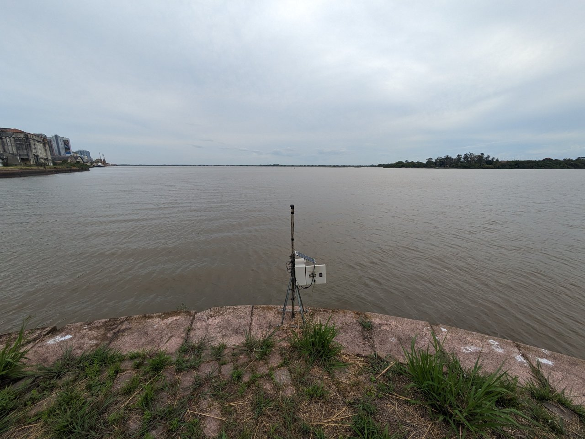
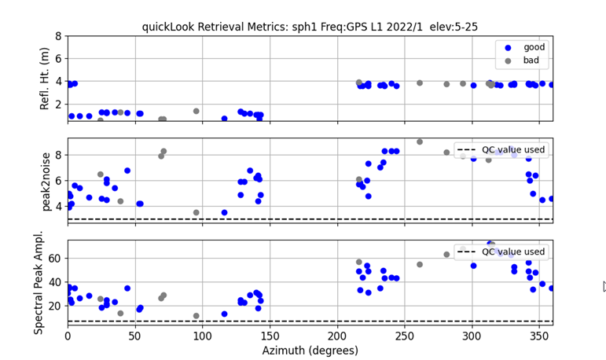
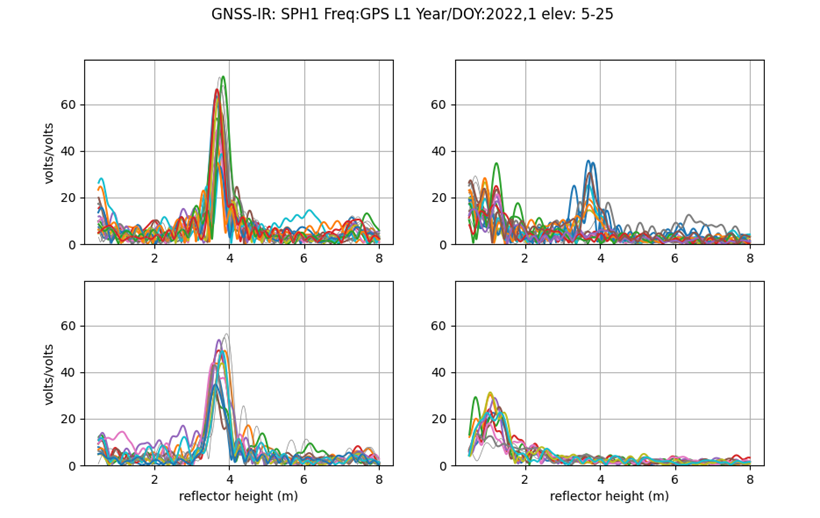
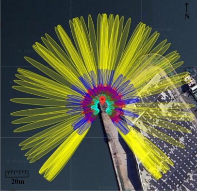
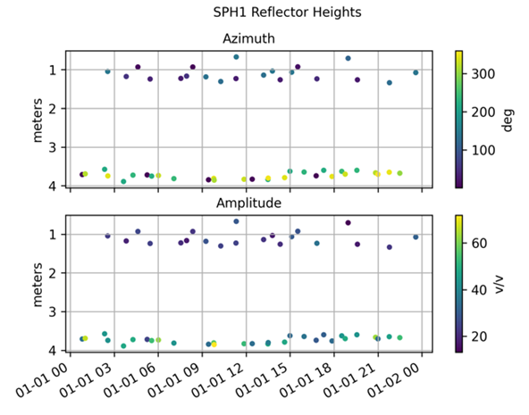
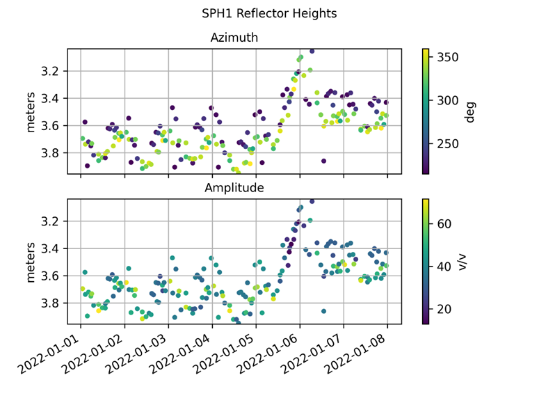
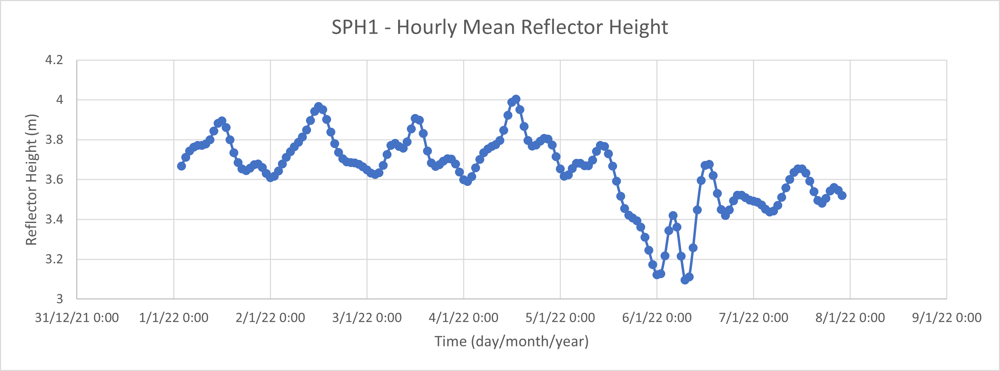

# Using gnssrefl for processing data from a low-cost GNSS-IR sensor at Guaíba Lake, Brazil

Manuella Fagundes and Felipe Geremia-Nievinski

<p align=center>

</p>

## 1\. Introduction

Station SPH1 is operated by Federal University of Rio Grande do Sul (UFRGS) for GNSS-R research. It is located at the Mauá Wharf overlooking the Guaíba Lake, in a favorable location for measuring water level. This station only tracks the GPS L1 signal at 1 Hz sampling rate. The equipment is based on the "MPHW" sensor design (see References section). We'll demonstrate how to process the dataset first for one day only, then for multiple days. We assume the gnssrefl is being used in a Docker container on a Windows PC host. Commands are to be entered in a Docker terminal.

### 1.1 Metadata

* Station code: SPH1
* Latitude: -30.021278°
* Longitude: -51.221390°
* Ellipsoidal height: 1.8m
* Mean height above water: 3.5m

[Google Maps link](https://maps.app.goo.gl/gCgSuNEgMSDs7mYV9)

### 1.2 File naming

The MPHW sensor outputs daily files with the following name format: YYMMDD.LOG

The gnssrefl software expects daily files with the following name format: ssssDDD0.YY.A

Where:
- YY is the last two digits of year,
- MM is month,
- DD is day of month,
- ssss is station code (lowercase),
- DDD is day of year,
- "0" (zero) is a character literal
- “A” is a character literal

## 2\. One-day demonstration

### 2.1 Prepare NMEA file

Download the NMEA data file and unzip it:

<https://drive.google.com/file/d/18ixfQl5HPS9PQM__QiHBEkqtQdAJ-c63/view?usp=sharing>

Manually rename file 220101.LOG to sph10010.22.A.

Copy the file to the Docker work folder, replacing “login” for your Windows username:

C:\\Users\\login\\Documents\\Docker\\refl_code\\nmea\\sph1\\2022

### 2.2 Make SNR file

Convert the file using the following command:

`nmea2snr sph1 2022 1 -lat -30.021278 -lon -51.221390 -height 1.8`

You can verify the generated file at:

C:\\Users\\login\\Documents\\Docker\\refl_code\\2022\\snr\\sph1\\sph10010.22.snr66

### 2.3 Create a configuration file

Create a configuration file (in JSON format):

`gnssir_input sph1 -lat -30.021278 -lon -51.221390 -height 1.8`

You can verify the generated file at:

C:\\Users\\login\\Documents\\Docker\\refl_code\\2022\\snr\\sph1\\sph10010.22.snr66

### 2.4 Check preliminary water level retrievals

Examine the spectral characteristics of the SNR data for the default settings.

`quickLook sph1 2022 001`

You can see the generated images at:

C:\\Users\\login\\Documents\\Docker\\refl_code\\Files\\sph1

<p align=center>


</p>

#### 2.4.1 Discussion

The quicklook results, QC metric and Lomb-Scargle Periodogram (LSP) can be explained based on Fresnel zones for the location. To the south, between approximately 150 and 210 degrees of azimuth, there is a gap due to the orbits of the GPS satellite constellation, resulting in no height retrievals in that interval. To the north, northwest, and a major part of the southwest, reflections result from the water. In the northeast and southeast, reflections come from the ground. At low elevation angles, reflections may even bounce off nearby structures to the southeast.

<p align=center>

</p>

### 2.5 Check precise water level retrievals

To obtain one day precise water level retrievals, run:

`gnssir sph1 2022 1`

Generated results at:

c:\\Users\\login\\Documents\\Docker\\refl_code\\2022\\results\\sph1\\

To plot water level results, run:

`rh_plot sph1 2022`

You can see the generated images at:

C:\\Users\\login\\Documents\\Docker\\refl_code\\Files\\sph1\\

<p align=center>

</p>

#### 2.5.1 Discussion

The results show that no points were discarded in QC for water height retrieval. As the azimuth was not filtered, the two lines represent the heights of the reflectors, water and ground. With a height close to 1m being the height of the receiver antenna relative to the ground, and 3.5m being the height of the antenna relative to the water.

## 3\. Analyzing multiple days of data

Downlod and unzip the files:

<https://drive.google.com/file/d/18gyAh1nAkSCYxBHXc3jW8C7hzz_mzJ4i/view?usp=sharing>

Rename all seven files:
```
mv 220101.LOG sph10010.22.A
mv 220102.LOG sph10020.22.A
mv 220103.LOG sph10030.22.A
mv 220104.LOG sph10040.22.A
mv 220105.LOG sph10050.22.A
mv 220106.LOG sph10060.22.A
mv 220107.LOG sph10070.22.A
```

To convert NMEA data, do:

`nmea2snr sph1 2022 1 -doy_end 7 -lat -30.021278 -lon -51.221390 -height 1.8`

Creating a configuration file

`gnssir_input sph1 -lat -30.021278 -lon -51.221390 -height 1.8 -azlist2 210 360`

We choose an appropriate azimuth interval based on one-day results.

To obtain multiple days of precise water level retrievals, with decimation value in seconds, run:

`gnssir sph1 2022 1 -doy_end 7 -dec 10`

To list all generate results, do:

`ls -la /etc/gnssrefl/refl_code/2022/results/sph1/`

To plot water level results to each satellite

`rh_plot sph1 2022`

<p align=center>

</p>

Calculate the hourly moving average

`subdaily sph1 2022 -delta_out 3600 `

For hourly-smooth output, use delta_out parameter (in seconds). 

Plot of regularly spaced water level, hourly moving average data:

<p align=center>

</p>

## References

M. A. R. Fagundes, I. Mendonça-Tinti, A. L. Iescheck, D. M. Akos, F. Geremia-Nievinski (2021), "An open-source low-cost sensor for SNR-based GNSS relectometry: design and long-term validation towards sea-level altimetry" GPS Solutions, <https://doi.org/10.1007/s10291-021-01087-1>

M. A. R. Fagundes , F. Geremia-Nievinski (2021), Input data for manuscript "An open-source low-cost sensor for SNR-based GNSS reflectometry: Design and long-term validation towards sea level altimetry", _Zenodo_, <https://doi.org/10.5281/zenodo.3735527>

F. Geremia-Nievinski, I. Mendonça-Tinti, M. A. R. Fagundes (2020), "MPHW – Multipath Hardware" _GitHub_, <https://github.com/fgnievinski/mphw>
