# Rhine River, Wesel, Germany

The data collected here is from a [Raspberry Pi Reflector](https://agupubs.onlinelibrary.wiley.com/doi/full/10.1029/2021WR031713). Detailed instructions for RPR setup are provided [here.](https://github.com/MakanAKaregar/RPR)

This RPR is operating next to the Rhine in Wesel, Germany. We collected NMEA data from 23 March 2020 to 20 August 2021 using upright-pointing antenna and since then with sideways-looking antenna facing the river (tilting the antenna 90° from the vertical direction toward the river). In this example we also show impact of antenna set-up orientation.

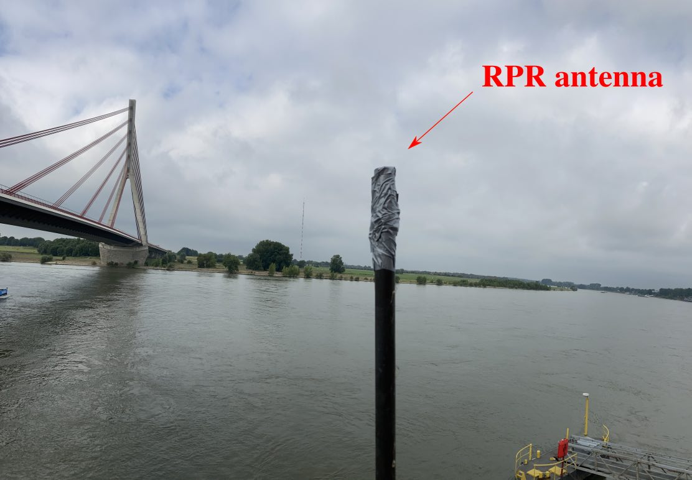
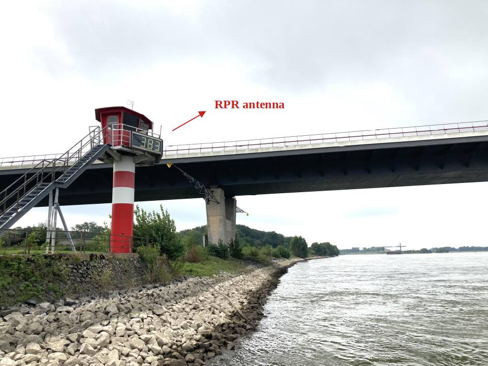

## metadata

**Station Name:**  WESL

**Location:** Wesel, Nordrhein-Westfalen, Germany

**Archive:**  [zenodo](https://doi.org/10.5281/zenodo.6828597)

**Ellipsoidal Coordinates:**

- Latitude: 51.646144

- Longitude: 6.606817

- Height: 73.057 m

[Google Map Link](https://goo.gl/maps/cN4zthXsSBDKneST8)

### Data Summary

Station WESL is located on [WSV](https://www.pegelonline.wsv.de/gast/stammdaten?pegelnr=2770040) river gauge's building next to the Rhine river in Wesel, Germany. It is operated by the University of Bonn, Institute of Geodesy and Geoinformation, [APMG](https://www.apmg.uni-bonn.de/).

The RPR antenna is mounted about 13 m abover the water surface. SNR data on the L1 frequency every 1 second are collected for all GPS satellites.

### 1. Pick up RPR data
RPR data for period 2020-2022 are publically available from a [zenodo archive](https://doi.org/10.5281/zenodo.6828597). The data record is extended until June 2023 under a [new data veraion](https://zenodo.org/record/8077379).

Download all data (~ 1.7 GB, or 3.3 GB for the extended record):

<code>wget https://zenodo.org/record/6828597/files/MakanAKaregar/RPRatWesel-NMEA.zip?download=1 </code>

or download only a few days data from here:

https://github.com/MakanAKaregar/RPRatWesel

Create nmea and station directory:

<code>mkdir -p $REFL_CODE/nmea/WESL</code>

and then store RPR NMEA files in <code>$REFL_CODE/nmea/WESL/yyyy/</code> where <code>yyyy</code> is the year number.

[$REFL_CODE](https://github.com/kristinemlarson/gnssrefl/blob/master/docs/pages/README_install.md) is an environmental variable to be used by gnssrefl.

### 2. Pick up an azimuth and elevation angle mask

Use either gnssrefl's [<code>refl_zone</code>](https://gnssrefl.readthedocs.io/en/latest/api/gnssrefl.refl_zones_cl.html) command:

<code>refl_zones WESL -lat 51.646144 -lon 6.606817 -el_height 73.057 -RH 13 -azim1 250 -azim2 330 -el_list 5 10 15 20 </code>

or try the [reflection zone webapp](https://gnss-reflections.org/rzones) with input parameters as:

- Lat. 51.646144
- Lon. 6.606817
- EllipseHt. 73.057
- Set Reflector Ht. Value 13
- Elevation Angles 5,10,15,20,25
- Azimuth Angles Start 250 End 330

Here is a KML map generated from [<code>refl_zone</code>](https://gnssrefl.readthedocs.io/en/latest/api/gnssrefl.refl_zones_cl.html) command:

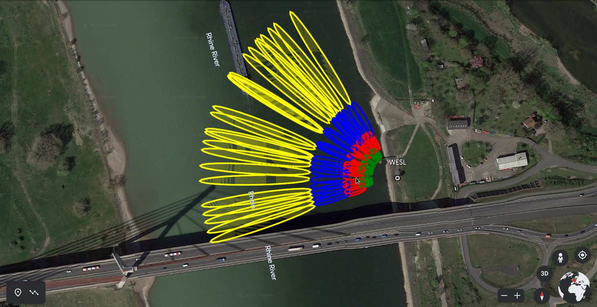

### 3. Translate NMEA format to SNR-ready format

Now we should translate NMEA data to gnssrefl internal format ([SNR-ready files](https://gnssrefl.readthedocs.io/en/latest/pages/file_structure.html#the-snr-data-format)) using gnssrefl's [<code>nmea2snr</code>](https://gnssrefl.readthedocs.io/en/latest/api/gnssrefl.nmea2snr_cl.html) command. Here is an example for a single-day translation (doy 231 of 2021 or Aug. 19, 2021).

<code>nmea2snr WESL 2021 231 -lat 51.646144 -lon 6.606817 -height 73.057 </code>

to translate all data (from doy 114 of 2020 to doy 4 of 2022):

<code>nmea2snr WESL 2020 114 -doy_end 4 -year_end 2022 -lat 51.646144 -lon 6.606817 -height 73.057 -risky True </code>

The SNR files are stored in <code>$REFL_CODE/yyyy/snr/WESL/</code>

### 3. Test quality control parameters

With gnssrefl's[<code>quickLook</code>](https://gnssrefl.readthedocs.io/en/latest/api/gnssrefl.quickLook_cl.html) you can visually examin various azimuth mask settings and quality control parameters. 

<code>quickLook WESL 2021 233 -h1 6 -h2 16 </code>

[quickLook](https://gnssrefl.readthedocs.io/en/latest/api/gnssrefl.quickLook_cl.html) makes two plots:

1- Periodogram against reflector height for each 90 degree quadrant:

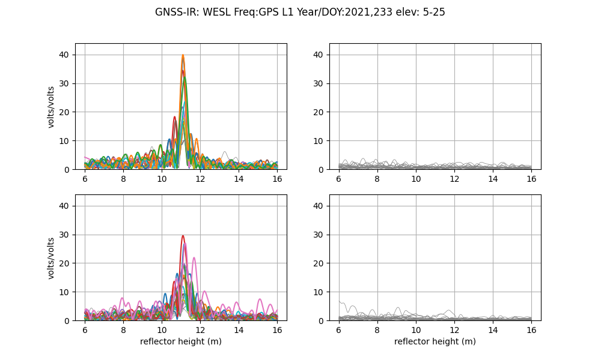

Since the RPR antenna is installed sideways facing the river (pointing toward west), it doesn't record any reflection from the northeast and southeast directions (right upper and lower panels). There is a bridge to the south of the antenna which interferes with the reflected signals so reflection data recorded from the southwest (left lower panel) direction are noisy and not reliable. Left upper panel shows coherent peaks in periodogram of SNR data recorded from the northwest direction. The peaks correspond to a reflector height of around 11 meters. That means the water is ~ 11 meters below the RPR antenna. However, there are several satellite tracks with double peaks that might be related to the reflections from objects very close to the antenna. These double peaks can be removed after imposing a better elevation or azimuth mask.

2- Reflector height, peak2noise value and peak amplitude against azimuth:

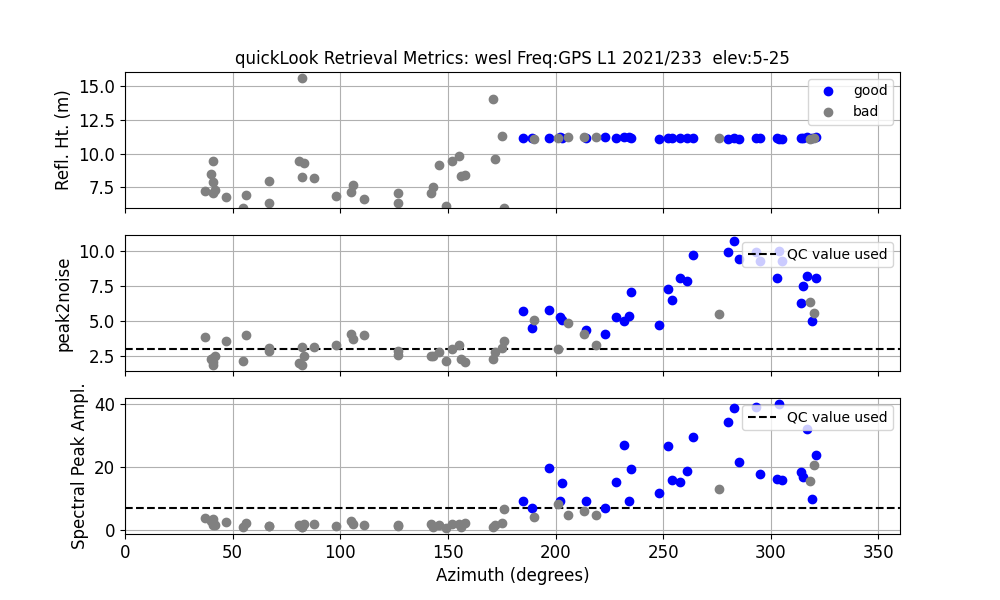

These plots provide more details for quality control. Acceptable reflector heights are plotted in the top plot in blue. Gray points are the reflector heights do not pass quality control. Their corresponding peak to noise ratio plotted in the middle plot is smaller than a default value of 2.7. Reflector height retrievals for satellite tracks sweeping from the azimuth ~250 to ~330 degrees are acceptable. We often don't set value smaller than 2.7 for the peak to noise ratio.

### 4. Define analysis inputs

Based on your finding from [<code>quickLook</code>](https://gnssrefl.readthedocs.io/en/latest/api/gnssrefl.quickLook_cl.html) and the quality control parameters you can now set most of input parameters using [gnssir_input](https://gnssrefl.readthedocs.io/en/latest/api/gnssrefl.gnssir_input.html) command.

Key parameters to set:

The reflector height lower limit <code>-h1</code> and the upper limit <code>-h2</code>. 

Elevation <code>-e1</code> and <code>-e2</code> and azimuth <code>-azlist</code> mask. In our case we set <code>5&le; elevation angle &le;20</code> and <code>250&le; azimuth &le;330</code>

List of GNSS constellations and frequencies <code>-frlist</code>. We set to 1 as we have only GPS L1 data.

<code>gnssir_input WESL -lat 51.646144 -lon 6.606817 -height 73.057 -h1 6 -h2 16 -e1 5 -e2 20 -frlist 1 -azlist 250 330</code>

### 5. Analyze data

Once an appropriate input parameters were set, reflector heights can be estimated using the [gnssir](https://gnssrefl.readthedocs.io/en/latest/api/gnssrefl.gnssir_cl.html#module-gnssrefl.gnssir_cl) command:

Here, we process a single day, doy 233 of 2021, setting plt option:  

<code>gnssir WESL 2021 233 -plt T</code>

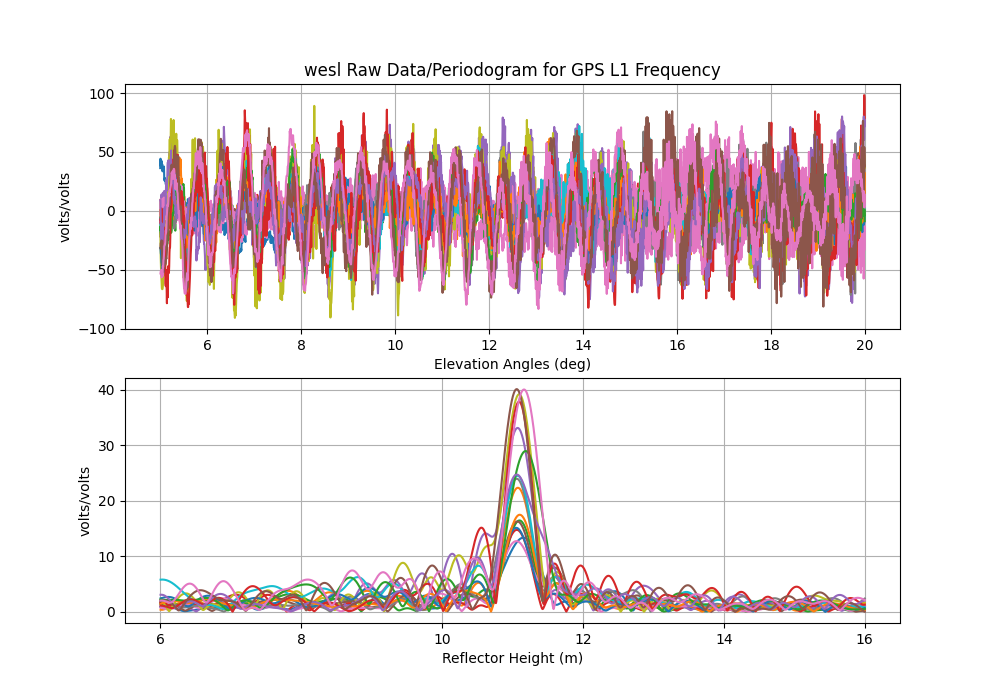

The daily analysis output files are stored in <code>$REFL_CODE/yyyy/results/wesl</code>
  
### 6. Processing and post-processing time series of reflector heights

We now process 3 months of data from doy 93 to doy 171 of 2023.

I maintain the daily archive of this RPR data at [the University of Bonn’s cloud](https://uni-bonn.sciebo.de/s/7CH1ctSPfQeLQbK):

Download 2023 data and then store the NMEA files in <code>$REFL_CODE/nmea/WESL/yyyy/</code>

Translate NMEA format to SNR format:

<code>nmea2snr WESL 2023 93 -doy_end 117 -lat 51.646144 -lon 6.606817 -height 73.057</code> 

and process the data:

<code>gnssir WESL 2023 93 -doy_end 171 </code>

with [daily_avg](https://gnssrefl.readthedocs.io/en/latest/pages/README_dailyavg.html) command, we can derive daily 
average of reflector height with plots, remove outliers and print daily average reflector height to 
a text file in <code>$REFL_CODE/Files/wesl/wesl_dailyRH.txt</code>. Note that this command 
should be used with caution when applying to fast-changing tidal river and sea level. At this site tides are absent.

Positional parameters to set in [daily_avg](https://gnssrefl.readthedocs.io/en/latest/pages/README_dailyavg.html):

<code>medfilter</code> is a tolerance (in meter) in which all residuals larger than this tolerance are removed.

<code>ReqTracks</code> is the minimum required number of satellite tracks for averaging.

These post-processing parameters are site specific. For example, historical river gauge data (2010–2021) for 
the Rhine near Wesel indicates the 95th percentile of day-to-day water-level variation amounts 
to 30 cm, thus we identify a reflector height as outlier when it differs from the median value of all 
reflector height (for each day) by more than 30 cm. The value for <code>ReqTracks</code> depends on azimuth mask.

<code>daily_avg wesl 0.3 10</code>

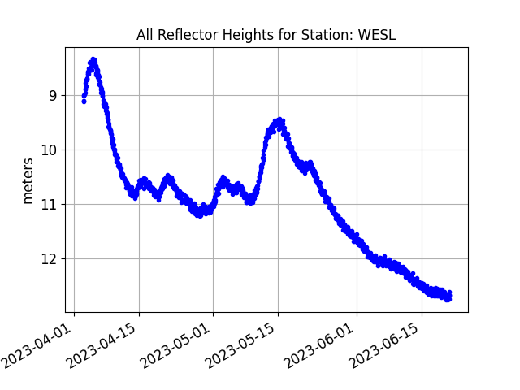

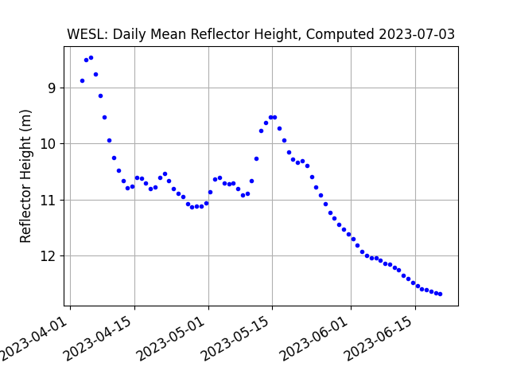

All and daily mean of reflector heights are printed to <code>wesl_allRH.txt</code> and 
<code>wesl_dailyRH.txt</code> text files in <code>$REFL_CODE/Files/wesl/</code>, respectively.

### 7. Comparison with river gauge and accuracy assessment

There is a river gauge collocated with the RPR at this site. Unfortunately, only the last 30 days of data can be downloaded from [WSV database](https://www.pegelonline.wsv.de/webservices/files/Wasserstand+Rohdaten/RHEIN/f33c3cc9-dc4b-4b77-baa9-5a5f10704398). If you need historical data please email me at: karegar@uni-bonn.de

I processed all available [data from 2020 to 2022](https://zenodo.org/record/6828597) adopting the analyzing strategy we went through together. I interpolate the river gauge 15-min measurements to the times of the RPR water level estimates. The differences between two sub-daily water level and daily water level are shown in plots (a) and (b), respectively.

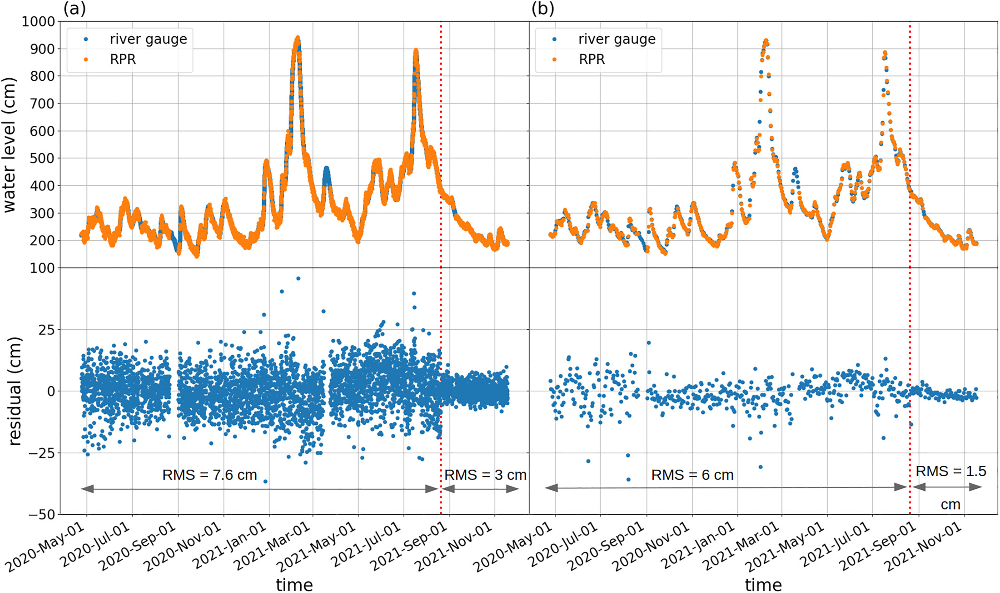

The quality of RPR sub-daily water level data is significantly improved by forming daily mean as daily averaging filters out random sources of error. The RMS of differences between two water level data reduces from 7.6 cm (sub-daily) to 6 cm (daily).

The Rhine experienced winter flooding period in mid-February followed by heavy rainfall and then exceptional flood event in summer 2021 (9–16 July). The heavy rainfall in July 2021 led to severe flooding in Western Europe including the Rhine river. 

Water level fluctuations during annual flooding can be substantial and reach levels of 8 m, which causes overbank flooding. This is a site photo I took in March 2020 during an annual flood. 

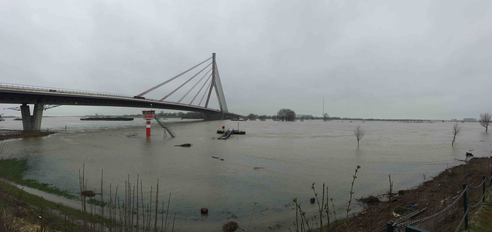

The vertical red dash line in plots (a) and (b) is Aug. 20, 2023 (doy 232) of RPR antenna orientation change from upright to sideways.

### 8. Impact of antenna set-up orientation

Geodetic antennas are always set in zenith direction but the flexibility of low-cost sensor is 
the ability to customize the antenna orientation so you can rotated the antenna towards the 
water body to get strong reflection. I tested the impact of antenna orientation by 
tilting the antenna 90° from the vertical direction toward the river. The plot below shows that 
the interference patterns in SNR from the sideways antenna are more distinct, with less noise and 
larger oscillation amplitudes than data from the zenith-pointing antenna. The increased amplitude is related to 
the gain pattern that is now applied by the antenna toward the surface of river and the reduced 
noise is from the mitigation of cross channel interference when fewer satellites are tracked.

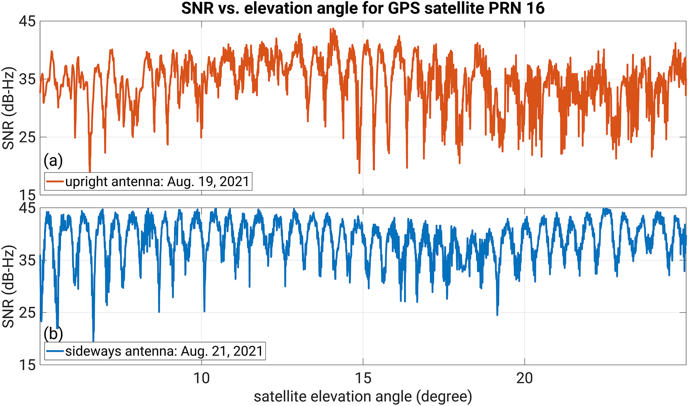

The RMS of sub-daily residuals reduces from 7.6 to 3 cm for the time spans before and after the antenna orientation change, respectively. For daily residuals, the RMS decreases from 6 to 1.5 cm

### So when set your RPR antenna, tilt it always toward the river.

Prepared by [Makan Karegar](https://github.com/MakanAKaregar). Last updated June 30, 2023.
