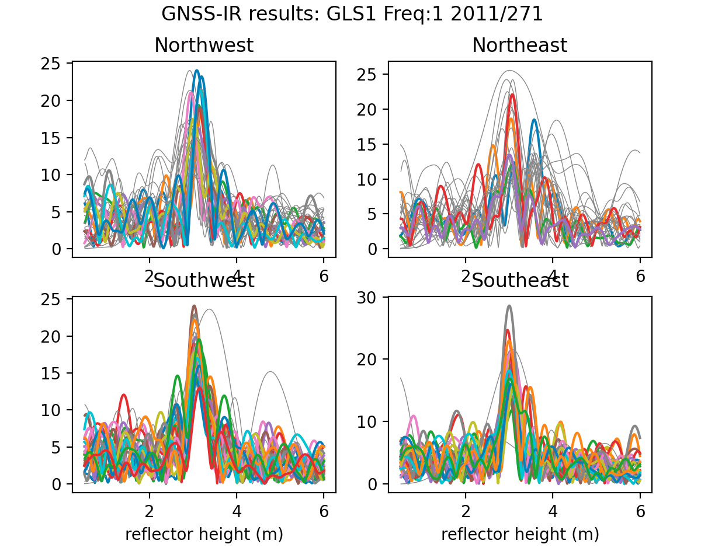
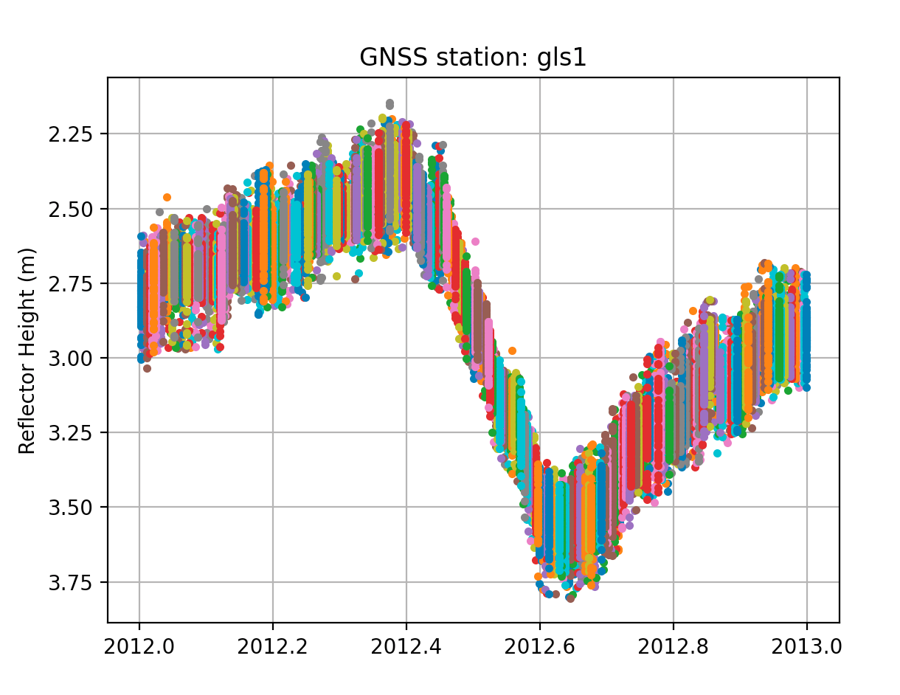

# First drivethru 

This is a test case for GNSS interferometric reflectometry. 
It does not explain everything about the technique, the code, or 
the site we will be using, but it will provide some tests you can use 
to make sure you have properly installed the code. For details about the technique, 
you should start with reading [Roesler and Larson, 2018](https://link.springer.com/article/10.1007/s10291-018-0744-8), 
which was published open option.  

# Install the gnssrefl code 

Make sure **wget** exists on your machine.  If you type *which wget* and something comes back, you should be good.

Read the [gnssrefl documentation](https://github.com/kristinemlarson/gnssrefl). 
Note that there are some utilities described at the end of the code that you might
find to be useful.

Install either the github or the pypi version of gnssrefl

Make the requested environment variables. 

Put CRX2RNX in the EXE are area. Make sure it is executable

If you know how to compile Fortran code, I strongly urge you to download/compile the requested
codes and install those executables in the correct place.

FWIW, I have had times when archives have apprently blocked me (?). When I turn on my VPN,
all is well. I have not investigated this in any detail - except that the one archive
I contacted denied that they block anyone. So take that for what you will. 

# Test the code for p041

I will use a site in Boulder, Colorado (p041) using the bare bones code (mostly with defaults)

Start with [a photo of P041](https://gnss-reflections.org/static/images/P041.jpg)

This antenna is ~2 meters tall. 

[Get an idea of the reflection zones for a site that is 2 meters tall.](https://gnss-reflections.org/rzones)

Make a SNR file using the defaults (if you have Fortran installed): 

*rinex2snr p041 2020 132*

If you don't have Fortran installed:

*rinex2snr p041 2020 132 -fortran false*

Lets look at the spectral characteristics of the SNR data for the default L1 settings:

*quickLook p041 2020 132* 

The four subplots show you different regions around the antenna. The x-axis tells you 
reflector height (RH) and the y-axis gives you the spectral amplitude of the SNR data.
The multiple colors are used to depict different satellites that rise or set over that
section (quadrant) of the field at P041. Which colors go to which satelliets is not super important.
The goal of this exercise is to notice that the peaks of those periodograms are lining up
around an x value of 2 meters. You also see some skinnier gray data - and those are **failed periodograms.**
This means that the code doesn't believe the results are relevant.  I did not originally plot failed
periodograms, but people asked for them, and I do think it is useful to see that there is some
quality control being used in this code.

I will also point out that these are the data from an excellent receiver, a Septentrio.
Not all receivers produce L1 data that are as nice as these.

Now try L2C:

*quickLook p041 2020 132 -fr 20* 

One thing you can notice here is that there are more colors in the L1 plots than in the L2C 
plots. That is simply the result of the fact that there are more L1 satellites than L2C satellites.

Now try L5. These are FABULOUS satellites, but unfortunately there are not a lot of them:

*quickLook p041 2020 132 -fr 5* 

You can try different things to test the code. For example, change the height restrictions:

*quickLook p041 2020 132 -h1 0.5 -h2 10* 

**quickLook** is meant to be a visual assessment of the spectral characteristics. However, 
it does print out the answers to a file called rh.txt. If you want to assess changes in the reflection
environment around a GPS/GNSS sites, i.e. look at multiple days, please read on.

# Test the code on a longer dataset  - cryosphere

Now we will look at a station called lorg. This site is on the Ross Ice Shelf, Antarctica. 
The data are archived at UNAVCO.  

Get some coordinates for the site, either lat,long,ht or XYZ. 
Use the [UNAVCO DAI](https://www.unavco.org/data/gps-gnss/data-access-methods/dai2/app/dai2.html#4Char=LORG;scope=Station;sampleRate=both;4CharMod=contains) if you like.
Or you can try the [Nevada Reno site](http://geodesy.unr.edu/NGLStationPages/stations/LORG.sta).
The coordinates do not have to be super precise (within 100 meters is fine).

**Exercise for the reader:** It is always nice to have a photograph of site. Try to
get a photograph of lorg from the UNAVCO website. If you cannot find it at there,
email dmencin@unavco.org and ask him to post it.

You need to make some snr files. This time we will do eight months or so. 
And we will restrict the search to the unavco archive. Here I say fortran is False, but 
of course if you have installed it, you can use it and the exercise will run faster.

*rinex2snr lorg 2019 1 -doy_end 233 -fortran False -archive unavco*

If you want to look at a SNR file, they are stored in REFL_CODE/2019/snr/lorg

I recommend that you use **quickLook** for one file. This gives you an idea of the quality of the site.

Compare the periodograms for frequencies 1, 20 and 5. 

Now let's get ready to run **gnssir**. This is the code that saves the output.
First you need to make a set of file instructions. If you use defaults, you only
need the station name, lat, lon, and ht. Make this file using **make_json_input**.
The json output will be stored in REFL_CODE/input/lorg.json.
[Here is a sample.](lorg.json)

Run **gnssir** for all the SNR files you made in the previous section.

*gnssir lorg 2019 1 -doy_end 233*

The code will tell you which satellites it is looking at and give you an overview for 
the estimated reflector heights. You can turn off these statistics in the json (screenstats).
Or from the command line:

*gnssir lorg 2019 1 -doy_end 233 -screenstats False*

The default does not send any plots to the screen - and you definitely 
do not want it to if you are analyzing 233 days of data. But if you want 
to look at the plots for a single day, that is an option in the json 
and at the command line:

*gnssir lorg 2019 1 -screenstats False -plt True* 

Unlike **quickLook**, here you get the periodograms for each frequency all together.
To see the next frequency, you need to eliminate the current plot, etc.

We can certainly clean these results up by eliminating various azimuths and requiring stronger peaks in 
the periodograms.

The reflector height results are stored in REFL_CODE/2019/results/lorg. You can concatenate 
the daily files and create your own daily average values (which is 
what is appropriate for this site), or you can 
use **daily_avg**. To avoid using outliers in these daily averages, a median filter is set.  I recommend 
0.25 m and ReqTrack of 50 at this site.

*daily_avg lorg 0.25 50*

The first plot is [all the data](lorg_1.png) (and very colorful). Once you delete it,
the second plot - the daily average - is shown: 

There are also optional inputs for saving a text file of the daily averages. 
The plot is stored at REFL_CODE/Files/lorg_RH.png 
This is not yet perfect - as there are some outliers which I have circled in red for you. 

In this exercise you used L1, L2C, and L5 signals (i.e. only GPS data). Your reflector heights are telling you 
about snow accumulation changes at lorg.  

# Test the code on a longer dataset  - Dye 2, Greenland

The site is called gls1.  Here we will only analyze the data from 2012.  The data are archived at UNAVCO.
The dataset is discussed extensively in this [open option paper](https://tc.copernicus.org/articles/14/1985/2020/tc-14-1985-2020.pdf).

**Exercise for the reader:** find a photograph of the site at UNAVCO

Coordinates: 

Use the [UNAVCO DAI](https://www.unavco.org/data/gps-gnss/data-access-methods/dai2/app/dai2.html#4Char=GLS1;scope=Station;sampleRate=both;4CharMod=contains) if you like.
Or you can try the [Nevada Reno site](http://geodesy.unr.edu/NGLStationPages/stations/GLS1.sta).

This site was originally installed with an elevation mask. Later it was changed. To keep things the 
same, I strongly prefer that hte same mask is used throughout.  Meaning:

*make_json_input gls1 66.479 -46.310 2148.578 -h1 0.5 -h2 8 -e1 7 -e2 25*

The make_json_input defaults are to use all GPS frequencies. However, the standard L2 data are really not useful. It is better 
to simply use L1 (L5 has never been tracked). Handedit the json to remove L2 and L5. It should look [like this.](gls1.json)
Now make some SNR files for the year 2012:

*rinex2snr gls1 2012 1 -doy_end 365*

Look at the first one - make sure that the RH defaults are big enough to include the answer:

*quickLook gls1 2012 1 -e1 7 -e2 25*

Analyze all the 2012 data:

*gnssir gls1 2012 1 -doy_end 365

Make a daily average (since you only have L1 at this site, I am requiring 30 tracks instead of 50)

*daily_avg gls1 0.25 30*

The plots:

That is what I call a lot of melt! If you want the reflector height answers, set the requested txt 
output filename in **daily_avg**.

# Under Construction: Test the code on a lake
