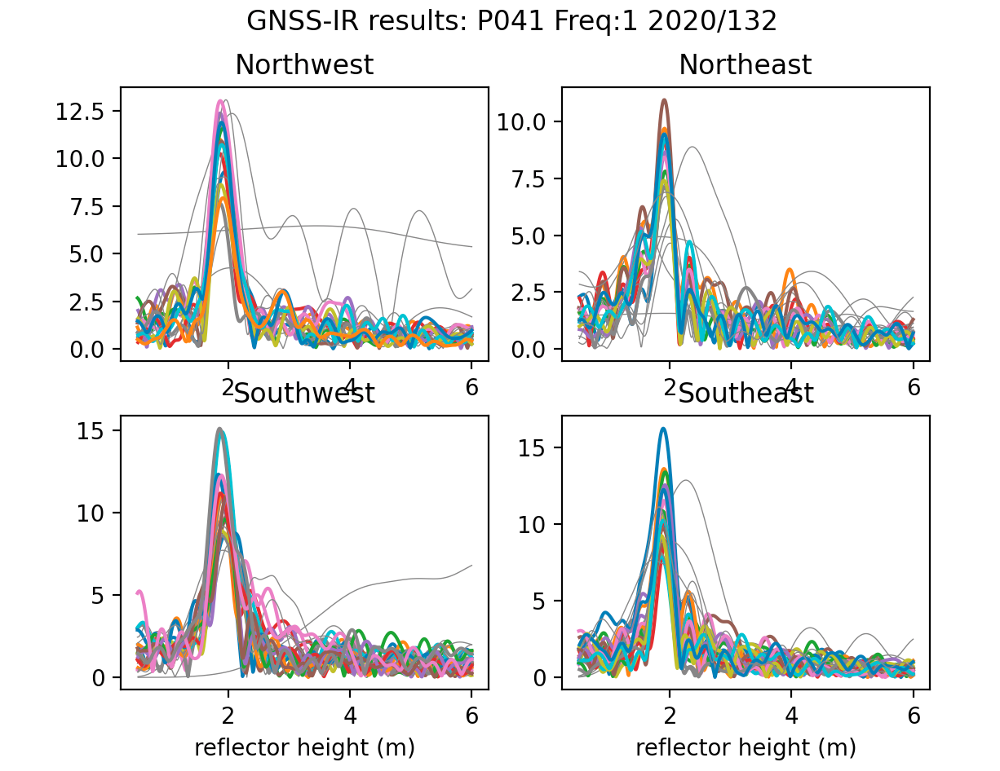

### Some Use Cases to Help You Test Out gnssrefl

This document provides some use cases for GNSS interferometric reflectometry. 
The goal is to provide you with tests to make sure you have properly installed the code. For details about the technique, 
you should start with reading [Roesler and Larson, 2018](https://link.springer.com/article/10.1007/s10291-018-0744-8), 
which was published open option.  

### Install the gnssrefl code 

Make sure **wget** exists on your machine.  If you type *which wget* and something comes back, you should be good.

Read the [gnssrefl documentation](https://github.com/kristinemlarson/gnssrefl). 
Note that there are some utilities described at the end of the code that you might
find to be useful.

Install either the github or the pypi version of gnssrefl

Make the requested environment variables. 

Put CRX2RNX in the EXE area. Make sure it is executable

If you know how to compile Fortran code, I strongly urge you to download/compile the requested
codes and install those executables in the correct place.

For what it is worth, I have had times when I have been blocked from 
downloading files (? after 20 file downloads - so maybe it is 
my internet provider ?). When I turn on my VPN, all is well. I have not investigated this 
in any detail. So take that for what you will. 

### Test the code for p041

I will use a site in Boulder, Colorado (p041) to show you some of the features of the code and the data.
The p041 antenna is ~2 meters tall. The site is relatively planar and free of obstructions.
Since October 2018 the site has operated a Septentrio receiver. It has multi-GNSS signals in the 
default RINEX file and is archived at UNAVCO.

I have made a web tool to give you an idea of the [reflection zones for a site that is 2 meters tall.](https://gnss-reflections.org/rzones)
You should only need to enter the station name and the reflector height (2 meters).

First you need to make a SNR file. I will use the defaults, which only translates the GPS signals. If you have Fortran installed: 

*rinex2snr p041 2020 132*

If you don't have Fortran installed:

*rinex2snr p041 2020 132 -fortran False*

Lets look at the spectral characteristics of the SNR data for the default L1 settings:

*quickLook p041 2020 132* 

The four subplots show you different regions around the antenna. The x-axis tells you 
reflector height (RH) and the y-axis gives you the spectral amplitude of the SNR data.
The multiple colors are used to depict different satellites that rise or set over that
section (quadrant) of the field at P041. Which colors go to which satelliets is not super important.
The goal of this exercise is to notice that the peaks of those periodograms are lining up
around an x value of 2 meters. You also see some skinnier gray data - and those are **failed periodograms.**
This means that the code doesn't believe the results are relevant.  I did not originally plot failed
periodograms, but people asked for them, and I do think it is useful to see that there is some
quality control being used in this code.

I will also point out that these are the data from an excellent receiver, a Septentrio.
Not all receivers produce L1 data that are as nice as these. Now try L2C:

*quickLook p041 2020 132 -fr 20* 

One thing you can notice here is that there are more colors in the L1 plots than in the L2C 
plots. That is simply the result of the fact that there are more L1 satellites than L2C satellites.

Now try L5. These are FABULOUS satellites, but unfortunately there are not a lot of them:

*quickLook p041 2020 132 -fr 5* 

You can try different things to test the code. For example, you can change the height restrictions:

*quickLook p041 2020 132 -h1 0.5 -h2 10* 

If you want to look at Glonass and Galileo signals, you need to create SNR files using the -orb gnss flag.

*rinex2snr p041 2020 132 -orb gnss*

I believe Beidou signals are tracked at this site, but the data are not available in the RINEX 2 file.

**quickLook** is meant to be a visual assessment of the spectral characteristics. However, 
it does print out the answers to a file called *rh.txt*. If you want to assess changes in the reflection
environment around a GPS/GNSS sites, i.e. look at multiple days, please look at these use cases I have compiled.

### Use Cases (These are under development)

<table>
<TR>
<TH>Cryosphere</TH>
<TD>

* [Lorne, Ross Ice Shelf, Antarctica](lorg_use.md)

* [Dye2, Greenland Ice Sheet](gls1_use.md)

* [Thwaites Glacier, Antarctica](lthw_use.md)

* [Summit Camp, Greenland](smm3_use.md)
</TD>
<TH>Lakes and Rivers</TH>
<td>

* [Lake Taupo, New Zealand](tgho_use.md)

* [Michipicoten, Lake Superior, Canada](mchn_use.md)

* [St Lawrence River, Montreal, Canada](pmtl_use.md)

* Steenbras Reservoir, Republic of South Africa
</TD>
<TH>Tides and Storm Surges</TH>
<TD>
*Hurricane Laura*

*St Michael, Alaska*

*Palmer Station, Antarctica*

</TD>
</TR>

<TR>
<TH>Seasonal Snow</TH>
<TD>
*Half Island Park, Idaho*

*Niwot Ridge, Colorado*
</TD>
<TH>Soil Moisture</TH>
TBD

</TR>
</Table>

