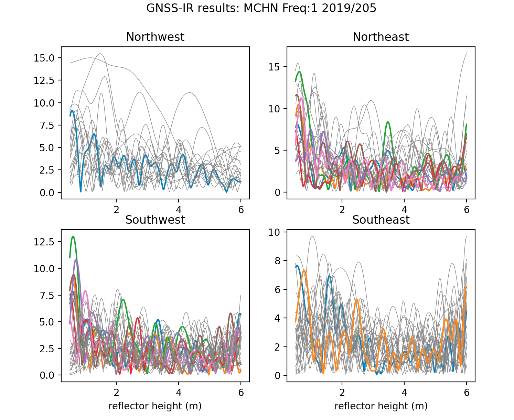

### Lake Superior

**Background:** Station mchn is operated by NRCAN. The data are archived at SOPAC and NRCAN. 

Unfortunately only L1 data should be used at this site. Encourage the station operators to 
track L2C, L5 (and Galileo, Glonass, and Beidou !)

[You should use my web app to get a sense of what the site looks like. Please note that the app 
will be analyzing data in real-time, so please wait for the answers to "pop" up in the 
left hand side of the page. It takes about 5 seconds](https://gnss-reflections.org/fancy6?example=mchn)
The webapp provides you with a photograph, coordinates (make a note of them), 
a google Earth map. Save the periodogram so you can look at it more closely.

**Coordinates:** You can try the [Nevada Reno site](http://geodesy.unr.edu/NGLStationPages/stations/MCHN.sta).
Or use the ones on my web app. They are the same.

**Picking a mask:**
From the periodogram and google Earth map you should be able to come up with a pretty good 
azimuth mask.  Elevation angle might be a bit trickier, but in this case, go ahead and 
use what I did, which is in the title of the periodogram plot. For azimuth, I suggest that you 
[use my web app.](https://gnss-reflections.org/rzones)

**Reproduce the web app results:**

*rinex2snr mchn 2019 205 -archive scripps*

*quickLook mchn 2019 205*

Why does this not look like the results from my web app?? Look closely. Make some changes
at the commandline for quickLook.

Once you figure out what you need to do, go ahead and analyze the data from 2013.

*rinex2snr mchn 2013 1 -archive sopac -doy_end 365*

You need to use **make_json_input** to set up the analysis instructions.
[You will need to hand-edit it to only use L1 and to set the azimuth region.](mchn.json)
You will notice that I have a pretty restricted azimuth region.  Although you can get
good reflections beyond 180 degrees, there is clearly something funny in the water there
(from google Earth), and if you look at the photograph, it is pretty obvious that there is something 
sticking out of the water. Of course feel free to try something 
different. But if you choose a mask that reflects off water and something 
else, you aren't really measuring the height of the water.

*gnssir mchn 2013 1 -doy_end 365*

**Computing daily average**

There are still outliers in your solutions - and in principle I encourage you to figure out better 
restrictions, i.e. increase the amplitude requirement or peak to noise restriction. If you don't take this into 
account, you can see what I mean:

*daily_avg mchn 2 10*

This command says the median filter allows any value within 2 meters of the median. The input of 10 means the 
number of tracks needed to compute an average.  

You get something much more reasonable with a 0.25 meter median filter.

*daily_avg mchn 0.25 10*

and for the average

The number of tracks you will require is going to depend on the site. Here the azimuth is restricted because
we are on a coastline of a lake. On an ice sheet we can often use every azimuth, which means more tracks. And
some of those sites also tracked multiple frequencies. Here we can only reliably use L1.
Please note that these reflections are from ice in the winter and water during the summer. We 
will be implementing surface bias corrections (ice,snow) to our software. Until then, please take this 
into account when interpreting the results.

Note: there is a tide gauge at this site. Please contact NRCAN for more information.
