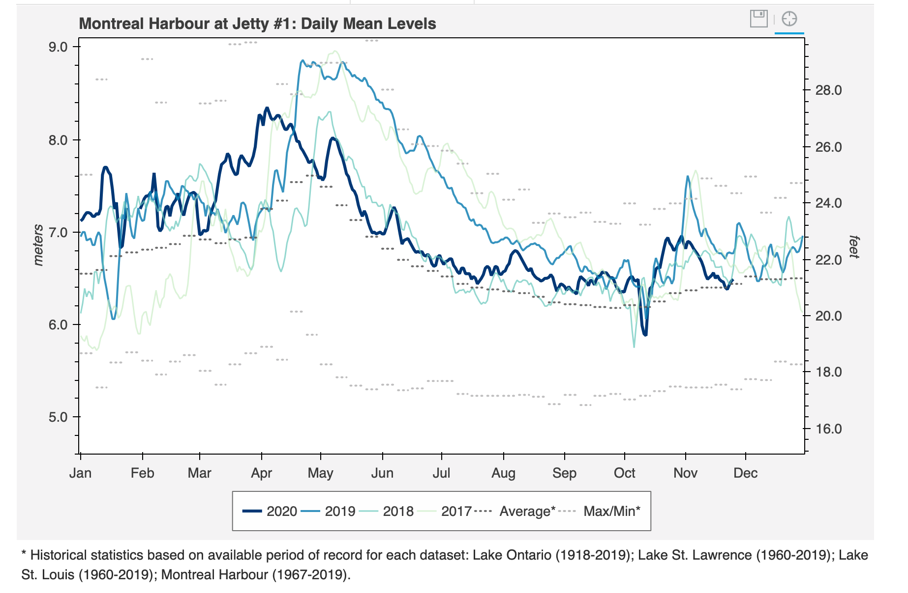

### St Lawrence River

Station pmtl is operated by the Montreal Port Authority. The data are archived at NRCAN. 

GPS L1, Glonass L1 and L2 can be used at this site. It would be great to get L2C, L5, Galileo, and Beidou data
in the future.

Look at the [NRCAN Site Description for pmtl](https://webapp.geod.nrcan.gc.ca/geod/data-donnees/station/report-rapport.php?id=M0722900)

The GNSS antenna is on the roof of grain terminal. Also 
note the ellipsoidal height (and geoid corrected height),
[also provided at my geoid site](https://gnss-reflections.org/geoid)

**Picking a mask:** 

For reflections, you want to know the height above the water.
This is easy for an ocean site - but a little trickier here. To start out, concentrate on the 
geographic mask, and use the geoid corrected ellipsoidal height from [my webapp](https://gnss-reflections.org/rzones).

- make a SNR file using the -orb gnss option, -archive nrcan, and -rate high option

- rinex2snr pmtl 2020 300 -archive nrcan -rate high -orb gps+glo

- run **quickLook** - but given the height of pmtl, you are going to need to change the RH values. If you aren't
sure how that should go, try a broad RH region:

I have annotated this to point out that there is an outlier in the SW region. Clearly we do not 
need to lok at the lower RH values, so I will further restrict the analysis zone.
The restricted elevation angles can be set at the command line, as can the heights. 

- *make_json_input test 45.5571 -73.5204 54.073 -h1 70 -h2 90 -e1 5 -e2 12 -allfreq True*

[You will need to hand-edit the json to remove GPS L2C, GPS L5, and Galileo, and 
to set the azimuth region and amplitudes. Here is my version that you can compare to](pmtl.json).
Note: I do not consider this to be the "final" mask. For a busy region 
like a harbor, you would want to examine multiple days and weeks of data before making final decisions.

There is a tide gauge near this site. Please see NRCAN for more information.

