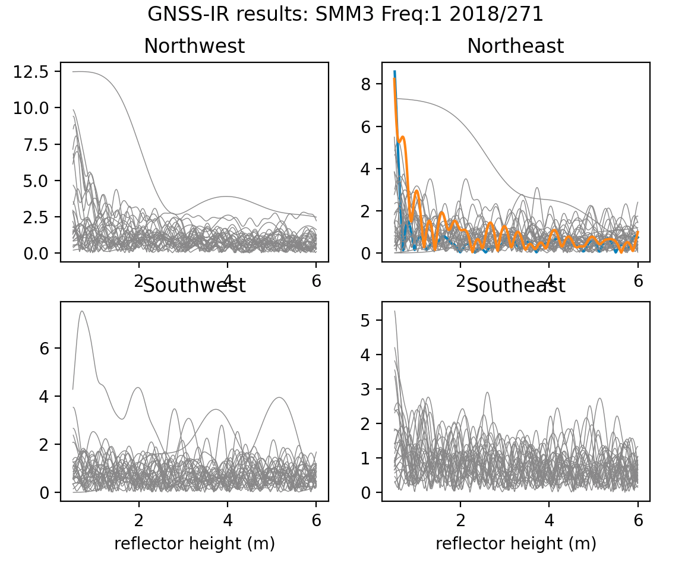

### Summit Camp, Greenland

Station smm3 is operated by UNAVCO. The data are archived at UNAVCO. 

[You can use my webapp to get a sense of what the results for this site looks like. Please note that the app 
will be analyzing data in real-time, so please wait for the answers to "pop" up in the 
left hand side of the page. It takes 5-10 seconds](https://gnss-reflections.org/fancy6?example=smm3)

**Coordinates:**
You can try the [Nevada Reno site](http://geodesy.unr.edu/NGLStationPages/stations/SMM3.sta).
Or use the ones on my web app. They are the same.

**This site has been optimally set up for positions and reflectometry.** This means it tracks modern
GPS signals (L2C and L5) as well as Glonass and Galileo. Unlike some of the earlier reflectometry demonstrations, 
the L1 data from this receiver are great. How can you tell what signals are tracked at this receiver?
Unfortunately I do not know how to find this information at the 
archive of record. 

Start out by trying to reproduce the web app results. The year and day of year are in the 
title of the periodogram plot. As are the elevation angle limits.

- First make the SNR file using **rinex2snr**

- Use **quickLook** on the same day

Why does this not look like the periodogram results from my web app?? Look closely.
Now modify your call to **quickLook**,

[This is not identical to the webapp, but it is more sensible](smm3-sensible.png)
You notice that in general there is quite a bit of spread in the northwest.  That is because the reflection 
area is more complex (and maybe also reflecting off things that are not snow.

### Steps: 

Use **make_json_input** but set -allfreq True and -peak2noise 3.5

I had to do some hand-editing to the json file. For example, I set the allowed azimuths:

- 70-180
- 180-270

These are the "quiet" areas for making scientific measurements Summit Camp. To keep the reflection 
zones quite large - I only use data from 5-15 degree elevation angles. This will make the amplitudes of the peaks 
in the periodogram larger, so I also set the required amplitude to 15, though in all honestly it 
could be set even higher. [Sample json](smm3.json)

Make daily SNR files:

- rinex2snr smm3 2018 180 -orb gnss -doy_end 365

Analyze daily SNR files:

- gnssir smm3 2018 180 -doy_end 365

Compute daily average of these results:

