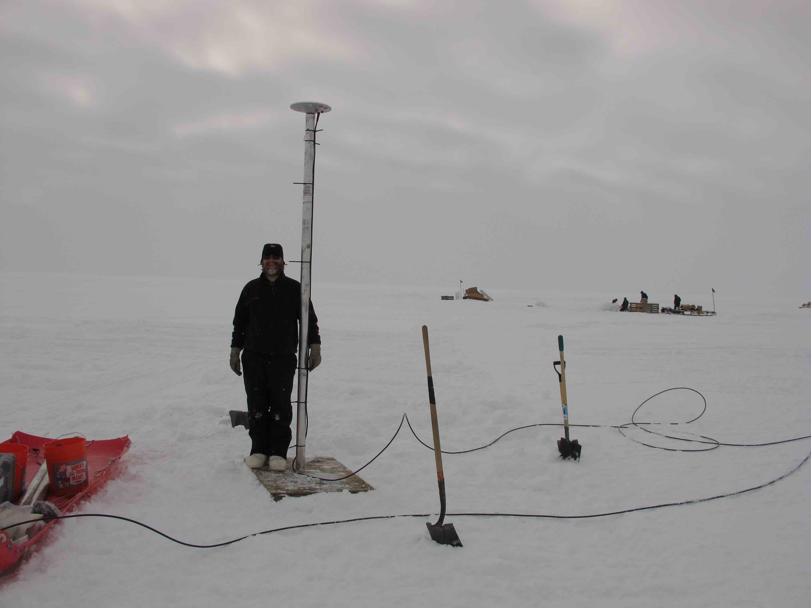

### Dye2, Greenland 

**Station Name:**		gls1

**Location:**  Greenland Ice Sheet in Qeqqata Province, Greenland

**Archive:**  [UNAVCO](http://www.unavco.org), [SOPAC](http://sopac-csrc.ucsd.edu/index.php/sopac/)

**DOI:**  [https://doi.org/10.7283/T5WS8RDB](https://doi.org/10.7283/T5WS8RDB)

**Ellipsoidal Coordinates:**

- Latitude: 66.47940

- Longitude:  -46.31015

- Height:    2150 m

[Station Page at UNAVCO](https://www.unavco.org/instrumentation/networks/status/nota/overview/gls1)

[Station Page at Nevada Geodetic Laboratory](http://geodesy.unr.edu/NGLStationPages/stations/GLS1.sta)

[Google Maps Link](https://goo.gl/maps/391a7h2HpacAa59u8) 

## Data Summary

Station gls1 was installed on the Greenland Ice Sheet in 2011. 
The antenna is mounted on a long pole; approximately 3.5-meter of the pole was above the ice at the time of installation. 
The receiver at the site only consistently tracks legacy GPS signals. A detailed discussion of the monument and 
data from the station can be found in [Larson, MacFerrin, and Nylen (2020)](https://tc.copernicus.org/articles/14/1985/2020/tc-14-1985-2020.pdf). 
Position time series for gls1 can be retrieved from the [Nevada Geodetic Laboratory](http://geodesy.unr.edu/gps_timeseries/tenv3/IGS14/GLS1.tenv3).

The [GNSS-IR Web App](https://gnss-reflections.org/fancy6?example=gls1) uses gls1 as an example. It takes 5-10 seconds to run.

gls1 is on an ice sheet, relatively smooth in all directions, so a special azimuth mask is not required.
gls1 was originally installed with an elevation mask of 7 degrees, so 7-25 should be used for the elevation mask.

## Reproduce the Web App

**Make SNR File**

First, make an SNR file by downloading the RINEX file and extracting the GPS SNR data:

*rinex2snr gls1 2019 200*

**Take a Look at the SNR Data**

Use **quickLook** to produce a periodogram similar to the one from the web app. [(For details on quickLook output)](../../docs/quickLook_desc.md)

quickLook uses the L1 frequency by default:

*quickLook gls1 2019 200*

The SNR values for the L2 and L5 frequencies do not meet the quality standards for GNSS reflectometry.

## Measure Snow Accumulation in 2012

Set up the analysis file. The min and max reflector height values are set to 0.5 and 8 meters. 
Use a minimum elevation angle of 7 degrees: 

*make_json_input gls1 66.479 -46.310 2148.578 -h1 0.5 -h2 8 -e1 7 -e2 25*

The **make_json_input** defaults are to use all GPS frequencies (1,20,5). 
Manually edit the json file to remove L2 and L5 from the list 
labeled "freqs". Then change the list "reqAmp" so that it has the same number 
of elements as the list "freqs" (by default, all elements in "reqAmp" will have a value of 6). 
[Example json file.](gls1.json)

To test the code, we will use the year 2012. First, make SNR files.

*rinex2snr gls1 2012 1 -doy_end 365*

Then estimate reflector heights:

*gnssir gls1 2012 1 -doy_end 365*

We will use the **daily_avg** tool to compute a daily average. Here the median filter is set to 0.25 meters 
and 30 individual tracks are required:

*daily_avg gls1 0.25 30*

All tracks:

Daily averages:

[An sample daily average RH file.](gls1-dailyavg.txt)

Validation snow accumulation data for this site are provided in Larson et al (2020) (the link is given above).
