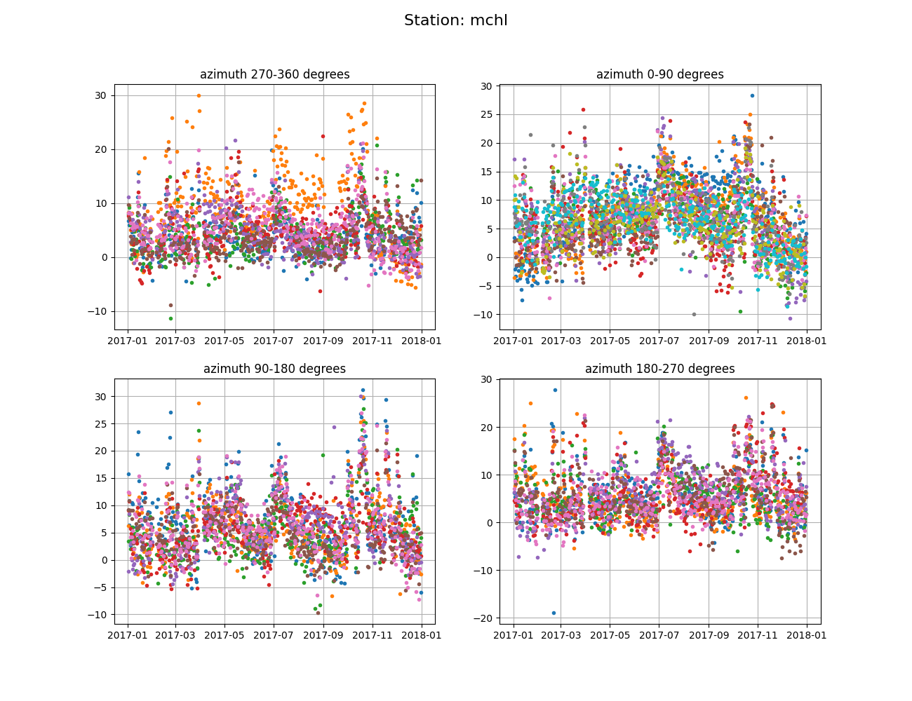

### MCHL

**Station Name:** 	mchl (mchl00aus)

**Location:** Walhallow, Queensland, Austalia

**Ellipsoidal Coordinates:**

- Latitude: -26.359 degrees

- Longitude: 148.145 degrees

- Height: 534.591 meters

[Station Page at Nevada Geodetic Laboratory](http://geodesy.unr.edu/NGLStationPages/stations/MCHL.sta)

[Google Maps Link](https://www.google.com/maps/place/26%C2%B021'32.4%22S+148%C2%B008'42.0%22E/@-26.359,148.145,11z/data=!4m5!3m4!1s0x0:0x9200f9ebb23ec5b1!8m2!3d-26.359!4d148.145?hl=en) 

 
### Analyze the Data
The data from 2017 will be analyzed here as a test case.  
We fist start by analyzing the data using the GNSS-IR process. 
Then we will use the results gathered to run the soil moisture code.

#### Step 1: GNSS-IR
Begin by generating the SNR files:
Use the rinex3 option (by using the 9-char station name 'mchl00aus'), and GNSS orbits. The soil moisture code only
works on GPS, but since MCHL is multi-GNSS, you might as well save the other data so someone can look at them later.

<code>rinex2snr mchl00aus 2017 1 -doy-end 365 </code>

The resulting SNR files are stored in $REFL_CODE/2017/snr/mchl.

Analysis parameters are set up with <code>make_json_input</code>

<code>make_json_input mchl -26.359 148.145 534.591 -l2c true</code>

The json file is saved at $REFL_CODE/input/mchl.json

Now run <code>gnssir</code> to save the reflector height (RH) output for each day in 2017 and set the frequency to l2c.

<code>gnssir mchl 2017 1 -doy_end 365 -fr 20</code>

The daily output files are stored in $REFL_CODE/2017/results/mchl

#### Step 2: Soil Moisture

For this python version we can come up with a good reflector height (RH) value for each satellite in each quadrant by using the RH values you will have estimated.
And we will define "good arcs" by successful RH estimates.
Run **apriori** for the year of 2017:

<code>apriori mchl 2017</code>

This creates a file that will go in $REFL_CODE/input/mchl_phaseRH.
For each GPS satellite (column 3), a RH (meters) is given in column 2. The azimuth is column 4, 
number of retrievals in column 5, and then the azimuths in the last two columns.
This file can be hand edited if you find out later one arc is not working.  
To comment lines out you use %. [This is what the file should look like.](mchl_phaseRH.txt)

The phase analysis code - **quickphase** - will use that file to restrict the number of satellite arcs that are used.
Run quickphase for the entire year of 2017:

<code>quickphase mchl 2017 1 -doy_end 365</code>

The results of quickphase will be one file per day requested, saved as doy.txt (ex: 365.txt).
In this case, one file for every day of the year 2017. These results will be saved in the directory $REFL_CODE/2017/phase/mchl.

Finally, we can run soil moisture code which is called **plotphase**.

<code>plotphase mchl 2017</code>

plotphase will produce some QC type plots, daily phase, phase w/ vegetation correction, vwc, and soil moisture plots. 
all plots are saved in the directory $REFL_CODE/Files as mchl_az_phase.png, mchl_daily_phase.png,
mchl_phase_vwc_result.png, and mchl_vol_soil_moisture.png

The daily phase results go to $REFL_CODE/Files/mchl_phase.txt. [Example](mchl_phase.txt)
Then it converts those to VWC using the Clara Chew derived algorithms.
The output goes in the same place as phase: $REFL_CODE/Files/mchl_vwc.txt. [Example](mchl_vwc.txt)
  

  

  

  

