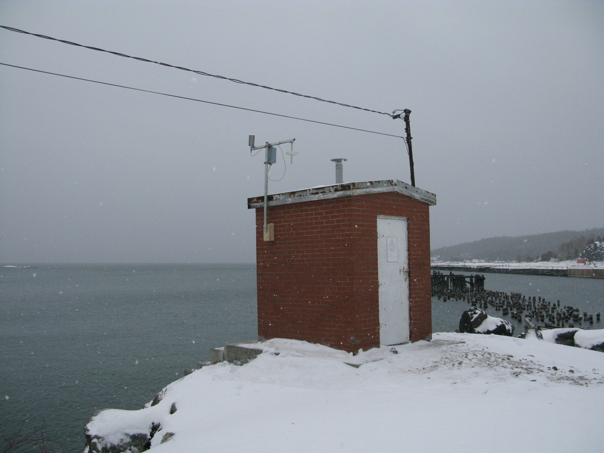
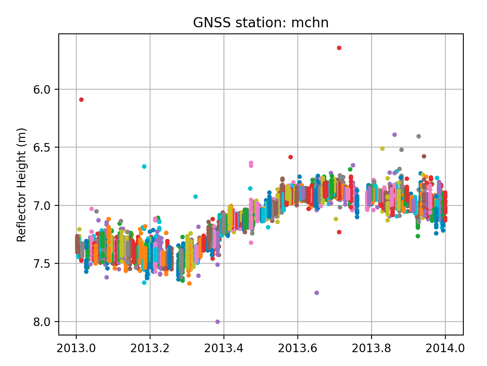
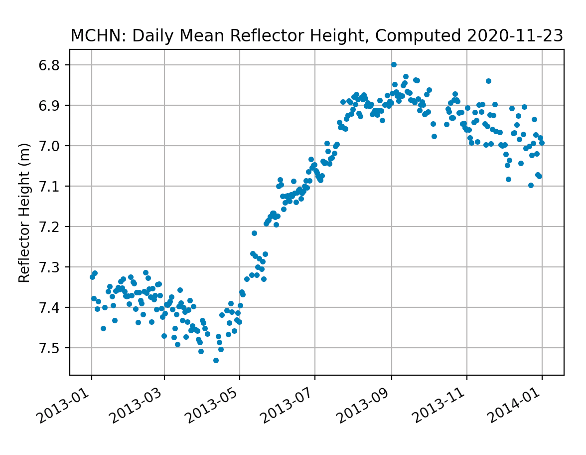

### Michipicoten Harbor, Ontario, Canada

**Station Name:** 	mchn

**Location:** Michipicoten Harbour, Ontario, Canada

**Archive:**  [SOPAC](http://sopac-csrc.ucsd.edu/index.php/sopac/) 

**Ellipsoidal Coordinates:**

- Latitude: 47.961

- Longitude: -84.901

- Height: 152.019 m

[Station Page at Natural Resources Canada](https://webapp.geod.nrcan.gc.ca/geod/data-donnees/station/report-rapport.php?id=M093001)

[Station Page at Nevada Geodetic Laboratory](http://geodesy.unr.edu/NGLStationPages/stations/MCHN.sta)

[Google Maps Link](https://goo.gl/maps/mU5GbsvMsLfe5buQ7) 

## Data Summary

Station mchn is operated by [NRCAN](https://www.nrcan.gc.ca/home).
The station overlooks Lake Superior in a favorable location for measuring seasonal water levels.
This site only tracks legacy GPS signals. 

More information on mchn can be obtained 
from the [GNSS-IR Web App](https://gnss-reflections.org/fancy6?example=mchn).
where mchn is one of the test cases. 

For GNSS reflectometry, you need to set an azimuth and elevation angle mask.
The azimuths are chosen to ensure that the reflected signals reflect off the surface of interest.
[Here is a good start on an elevation and azimuth angle mask](https://gnss-reflections.org/rzones?station=mchn&msl=on&RH=7&eang=2&azim1=80&azim2=180). 

## Reproduce the Web App

**Make SNR File** 

The default settings will only translate the GPS signals from the RINEX file.

*rinex2snr mchn 2019 205 -archive sopac*

**Take a Quick Look at the Data**

Use **quickLook** to examine the spectral characteristics of the SNR data for the default L1 settings
[(For details on quickLook output.)](../../docs/quickLook_desc.md):

*quickLook mchn 2019 205*

The four subplots show different regions around the antenna (NW, NE, SW, SE). The x-axis 
gives the reflector height (RH) and the y-axis gives the spectral amplitude of the SNR data. The multiple colors are used 
to depict different satellites that rise or set over that section (quadrant) of the field at mchn. 
There are also some thin gray lines - and those are failed periodograms. This means that the SNR data for 
a satellite do not meet the quality standards in the code.

Why does this not look like the results from the web app? Look closely at the station photo and the x-axis 
of the periodograme, then change the range of reflector heights at the command line for **quickLook**:

*quickLook mchn 2019 205 -h1 2 -h2 8*

## Analyze the Data

The data from 2013 will be analyzed here as a test case.  Begin by generating the SNR files:

*rinex2snr mchn 2013 1 -archive sopac -doy_end 365*

The resulting SNR files are stored in $REFL_CODE/2013/snr/mchn.  

Analysis parameters are set up with **make_json_input**.

*make_json_input -e1 5 -e2 25 mchn 47.961 -84.901 152.019*

[The json file will then need to be manually edited to use only L1 and to set the azimuth region.](mchn.json) 
The frequency used is set by modifying the list "freqs" to contain only the L1 code (1), and the list "reqAmp" 
to have the same number of elements as "freqs". Note that the azimuth region is restricted to the range of 80-180 degrees. 
Although it is possible to get good reflections beyond 180 degrees, the reflecting surface is clearly not uniform.

Now that the analysis parameters are set, run **gnssir** to save the reflector height (RH) output for each day in 2013.

*gnssir mchn 2013 1 -doy_end 365*

The daily output files are stored in $REFL_CODE/2013/results/mchn. [Here is an example output for a single day.](195.txt) 
Plots can be seen with the -plt option.

*gnssir mchn 2013 195  -plt True*

For a lake, it is appropriate to use the daily average. Our utility for computing a daily average requires a value
for the median filter and a minimum number of tracks.  If the median value is set to the be large (2 meters), you can see 
large outliers: 

*daily_avg mchn 2 10*

A more reasonable result is obtained with a 0.25-meter median filter and the 12-track requirement. If you want to save 
the daily averages to a specific file, use the -txtfile option. Otherwise it will use a default location (which is printed to the screen)

*daily_avg mchn 0.25 12 -txtfile mchn-dailyavg.txt*

[Sample daily average RH file.](mchn-dailyavg.txt)

The number of tracks required will depend on the site. Here the azimuth is restricted because  of the location of the antenna.
Please note that these reflections are from ice in the winter and water during the summer. Surface 
bias corrections (ice, snow) will be implemented in the software in the future. Until then, please take 
this into account when interpreting the results.

There is a [tide gauge](https://tides.gc.ca/eng/Station/Month?sid=10750) at this site. The data can be 
downloaded from [this link](http://www.isdm-gdsi.gc.ca/isdm-gdsi/twl-mne/inventory-inventaire/interval-intervalle-eng.asp?user=isdm-gdsi&region=CA&tst=1&no=10750). 
Please select the daily mean water level, as there are restrictions on hourly data (more information is available on the download page). 
We have downloaded [the 2013 data](10750-01-JAN-2013_slev.csv).

The water levels measured by the traditional tide gauge and GNSS-IR are shown here:

The linear regression between the two series gives a slope m=-1.03. The rms of the 
residuals is very good, 0.025 m.  

The [python script](plotmchn.py) used to generate these plots is provided.

## Reference

DFO (2021). Institute of Ocean Sciences Data Archive. Ocean Sciences Division. Department of Fisheries and Oceans 
Canada. http://www.pac.dfo-mpo.gc.ca/science/oceans/data-donnees/index-eng.html. Data obtained on 2021-01-28.

