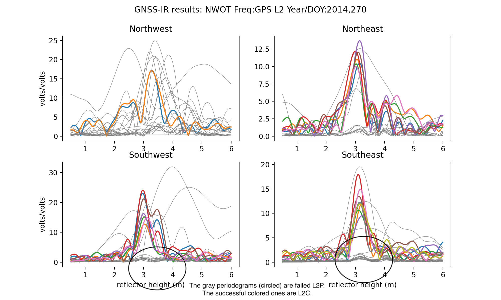
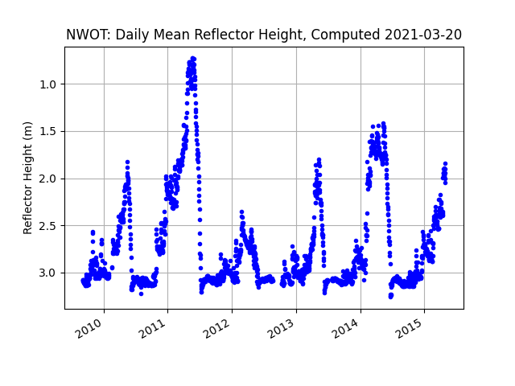

### Niwot Ridge, Colorado, USA

**Station name:** nwot

**Location:** Niwot Ridge LTER

**Archive:** [UNAVCO](https://www.unavco.org)

**Ellipsoidal Coordinates:**

- Latitude: 40.05539 

- Longitude: -105.59053

- Height(m): 3522.729 

[UNAVCO station page](https://www.unavco.org/instrumentation/networks/status/nota/overview/NWOT)

### Data Summary

Station nwot was originally installed/designed by Jim Normandeau (UNAVCO) to support GPS reflections research 
by Kristine Larson, Eric Small, Ethan Gutmann, Felipe Nievinski, and Mark Williams at the University of Colorado. 
The site was hosted by the Niwot Ridge LTER. 

nwot was deliberately made to be taller than the typical geodetic antenna so that it would never be 
buried by snow. It is approximately 3 meters above 
the bare soil surface.  Because it was installed to support testing GPS reflections, nwot has always tracked L2C.
nwot was also part of [PBO H2O](http://cires1.colorado.edu/portal/?station=nwot).

The site has generally not been used by geodesists and there is very little useful information 
at UNAVCO (i.e. no time series) or at the Nevada Reno group.
After the original receiver failed in spring 2015, a new receiver was installed in late 2016 with help from 
Mark Raleigh (then at CIRES, now at the University Oregon). Though the nwot receiver 
may be tracking now, it has not been downloaded in some time and there is no working telemetry.
We will focus on the data between 2009-2015.

### Make a SNR File and run quickLook

Start slow. Make a SNR file for one day, specifying unavco archive (no point looking
elsewhere since it is only at UNAVCO). The best data are currently unavailable unless you download
the 1-sec data.  However, you do not need this sample rate for GPS reflectometry, so we are going to 
decimate it to 15 seconds.

*rinex2snr nwot 2014 270 -archive unavco -rate high -dec 15*

Both L1 and L2C signals can be used at this site. Unfortunately there were not very many L2C satellites
at the time it was first installed.  Nevertheless, there is more than enough to measure snow accumulation. 
Use this **quickLook** command:

*quickLook nwot 2014 270* 

to look at the L1 data:

A bit ratty in the low RH area - which is just noise from this particular receiver.
Nice strong peaks in the south. Now try L2:

*quickLook nwot 2014 270 -fr 2*

This plot will have both L2C and non-L2C. But it is easy to see why I don't use non-L2C. They are
the failed tracks in the gray that I have circled.

### Make multiple years of SNR files 

We are going to look at the data from installation (Fall 2009) through Spring 2015.

*rinex2snr nwot 2009 240 -doy_end 365 -archive unavco -rate high -dec 15*

*rinex2snr nwot 2010 1 -doy_end 366 -archive unavco -rate high -dec 15 -year_end 2014*

*rinex2snr nwot 2015 1 -doy_end 120 -archive unavco -rate high -dec 15*

### Run gnssir  for multiple years

Make a json file for your **gnssir** analysis:

*make_json_input nwot 40.05539 -105.59053  3522.729 -e1 7 -e2 25 -peak2noise 3.2*

I have opted to only use the southern quadrants (azimuths 90 through 270). Note: L5 has 
not been tracked at this site, so it is not listed in the json file. [A sample json file for this site.](nwot.json)

Run **gnssir** for the years 2009-2015:

*gnssir nwot 2009 1 -doy_end 366 -year_end 2015*

### Compute daily averages:

Using the **daily_avg** utility to compute RH each day. A median filter of 0.25 meter is used
to eliminate large outliers and a minimum number of tracks is set to 10. The year inputs are optional.

*daily_avg nwot 0.25 10 -year1 2009 -year2 2015*

produces this plot:

and [this file](nwot_dailyRH.txt). The files will be stored in the $REFL_CODE/Files directory.

We installed the GPS site at Niwot Ridge because there was a long-standing experiment 
for measuring snow depth (and snow water equivalent). We therefore have a way to assess
accuracy. We download the *in situ* data from 
the [Niwot Ridge facility.](https://portal.edirepository.org/nis/mapbrowse?scope=knb-lter-nwt&identifier=34)
We will compare to pole 16, which is shown in the photograph above. The relevant Niwot Ridge csv file is provided here: 

[in situ data from the Niwot Ridge LTER](saddsnow.dw.data.csv)

If the daily average RH file created above is stored in the same directory as the Niwot Ridge in situ datafile, you can use 
[this python script](nwot_usecase.py) to visual compare them:

*python nwot_usecase.py*

We hae used the data from the fall to set the bare soil value for reflector height (RH_baresoil). Snow depth is then defined as:

*snow depth = RH_baresoil - RH*

We do not pursue a quantitative comparison at this site as there are at least two 
publications in refereed journals and a PhD Dissertation:

[Gutmann, E., K. M. Larson, M. Williams, F.G. Nievinski, and V. Zavorotny, 
Snow measurement by GPS interferometric reflectometry: an evaluation at Niwot Ridge, Colorado, Hydrologic Processes, Vol. 26, 2951-2961, 2012](https://www.kristinelarson.net/wp-content/uploads/2015/10/GutmannEtAl_2012.pdf)

[Nievinski, F.G. and K.M. Larson, Inverse Modeling of GPS Multipath for Snow Depth Estimation, Part II: Application and Validation, IEEE TGRS, Vol. 52(10), 6564-6573, doi:10.1109/TGRS.2013.2297688, 2014](https://www.kristinelarson.net/wp-content/uploads/2015/10/felipe_inv2_revised.pdf)

[Nievinski, F.G., Ph.D. Dissertation, University of Colorado, 2013](https://www.researchgate.net/publication/258848060_Forward_and_Inverse_Modeling_of_GPS_Multipath_for_Snow_Monitoring)
